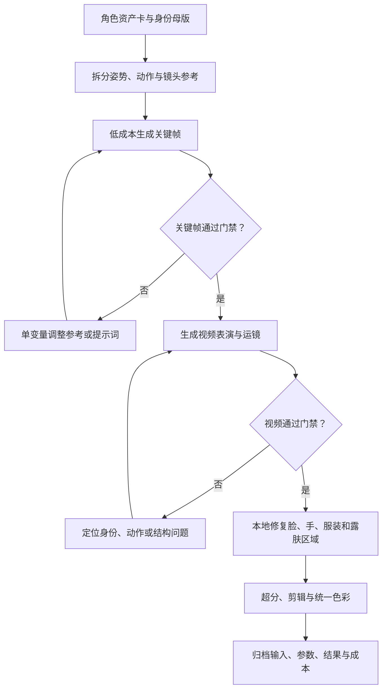

# 古风角色图像与视频生成：项目总览与执行框架

> [!abstract] 核心结论
> 这不是单纯的提示词项目，而是一条“角色资产锁定 → 参考条件拆分 → 关键帧生成 → 视频表演 → 局部修复 → 统一输出”的生产链。商业模型适合完成表演和运镜，本地工作流适合资产锁定、精确控制与失败修复。

> [!warning] 资料可信度
> 本笔记依据项目主页的 7 个主题、已成功读取的“本地模型部署方案”正文及其他主题的页面摘要整理。模型能力、开放状态和成本数字尚未逐项按官方来源核验，仅作为项目内部参考基线；敏感词、换脸参数和融图结论未完整读取，因此不补写具体规则。

## 一、项目目标

面向真人古风、仙侠与玄幻角色的图片和视频生产，重点解决：

- 人脸、发型、发辫、饰品和服装跨镜头保持一致；
- 姿势、动作节奏和镜头运动接近参考素材；
- 服装结构、衣摆位置和指定露肤范围不被模型擅自改写；
- 手部、肢体接触、人体结构和局部细节可验收、可修复；
- 在正式生成前用低成本测试排除无效参考图和提示词。

## 二、原始资料索引

| 主题 | 当前可用信息 | 证据状态 |
|---|---|---|
| [本地模型部署方案](https://chatgpt.com/g/g-p-6a6c668a35b88191b921e28a9feda617-ai-wen-sheng-tu-han-dian-tu/shared/c/6a6d4aa3-1d24-83ee-ba70-8a3aa6ae7d80) | 本地与商业模型分工、Seedance、成本选择 | 已读取主要正文 |
| [GPT 敏感提示词说明](https://chatgpt.com/g/g-p-6a6c668a35b88191b921e28a9feda617-ai-wen-sheng-tu-han-dian-tu/shared/c/6a6d411b-7394-83ee-a57f-1a3e9830f7de) | 高风险表达及安全替换方向 | 仅摘要，待补全 |
| [脸部特写换脸](https://chatgpt.com/g/g-p-6a6c668a35b88191b921e28a9feda617-ai-wen-sheng-tu-han-dian-tu/shared/c/6a6d00c8-e55c-83e8-b18d-b7ae0699764e) | 脸部身份迁移与长会话处理 | 仅摘要，待补全 |
| [生图垫图融图研究](https://chatgpt.com/g/g-p-6a6c668a35b88191b921e28a9feda617-ai-wen-sheng-tu-han-dian-tu/shared/c/6a6d1c2c-dda4-83ee-921b-5abd9e9a627f) | 多参考图融合与重复测试 | 仅摘要，待补全 |
| [角色设定规范](https://chatgpt.com/g/g-p-6a6c668a35b88191b921e28a9feda617-ai-wen-sheng-tu-han-dian-tu/shared/c/6a6c7438-00ec-83ee-a05d-29d5434dc6c6) | 真人角色设定页与黑衣仙侠少年母版 | 仅摘要，待补全 |
| [古风玄幻风格](https://chatgpt.com/g/g-p-6a6c668a35b88191b921e28a9feda617-ai-wen-sheng-tu-han-dian-tu/shared/c/6a6c6698-9da4-83ee-8549-7fdcdb8b39f2) | 古风玄幻动态写真方向 | 仅摘要，待补全 |
| [古风美男插画设计](https://chatgpt.com/g/g-p-6a6c668a35b88191b921e28a9feda617-ai-wen-sheng-tu-han-dian-tu/shared/c/6a6c6e82-3490-83ee-9b3b-32f063584daf) | 中景脸部特写与清冷贵公子风格 | 仅摘要，待补全 |

## 三、执行前准备

### 3.1 建立角色资产卡

> [!danger] 授权与身份门禁
> 虚构 AI 角色必须记录生成来源，并注明不映射或冒充真实人物。涉及真人身份、换脸或身份迁移时，只能使用本人素材或已取得书面授权的成年人素材，同时记录许可用途、保存期限和撤回方式；未通过授权检查时立即停止，不得进入生成流程。

开始生成前，先确定不可变特征：

- 身份：脸型、五官比例、年龄感、肤色和辨识特征；
- 发型：长度、分缝、碎发、束发方式和发饰；
- 服装：领口、袖型、衣摆、腰带、材质、颜色与层级；
- 饰品：位置、数量、材质与佩戴方式；
- 身体：身高感、头身比、肩宽和体型；
- 禁止变化项：不能增加、删除或重新设计的元素。

身份母版和三视图的制作、验收与失败修复可复用 [[AI人物身份参考资产库-MOC]]。

### 3.2 准备最小参考集

第一轮只使用：

```text
1 张角色身份母版
+ 1 张完整姿势图，或 1 段动作参考视频
+ 1 段分区明确的提示词
```

不要在首轮同时加入多张身份图、多套服装和复杂运镜，否则失败后无法判断是哪一个条件造成漂移。

### 3.3 拆分控制职责

| 输入 | 只负责控制 | 不应承担 |
|---|---|---|
| 身份母版 | 脸、发型、服装资产 | 动作节奏与运镜 |
| 姿势图 | 骨架方向、肢体位置 | 人物身份与服装设计 |
| 动作视频 | 动作节奏、表演、运镜 | 精确的人脸和局部材质 |
| 文本提示词 | 任务说明、约束、风格 | 替代清晰的视觉参考 |
| 蒙版／ControlNet | 局部区域、姿势、深度 | 完成全部创意决策 |

## 四、标准生产流程



### 阶段 1：身份和服装锁定

1. 选定唯一身份母版；
2. 制作或补齐正面、侧面、背面与必要表情；
3. 写清服装层级及不可变元素；
4. 通过身份、发型、服装和人体结构门禁后再进入下游。

### 阶段 2：关键帧测试

1. 选择单一姿势或动作目标；
2. 先生成静态关键帧，验证身份、构图与服装；
3. 每个条件生成 2～3 次，记录稳定性而非只挑最好的一张；
4. 一次只修改一个变量，避免把偶然结果误判为有效方法。

### 阶段 3：视频生成

1. 先测约 5 秒、单人物、固定镜头或轻微推进；
2. 首轮避免旋转、跳跃、快速打斗和多人交互；
3. 身份与服装由图片参考负责，动作和镜头由视频参考负责；
4. 只有关键帧通过门禁后，才投入更高成本的正式模型。

### 阶段 4：局部修复与输出

1. 按失败类型分别修复脸、手、服装、发辫和露肤区域；
2. 不用整图重绘解决局部问题，避免已通过的区域再次漂移；
3. 完成超分、剪辑、补帧和色彩统一；
4. 归档输入素材、模型版本、参数、生成次数、失败类型和最终文件。

## 五、模型分工参考

> [!caution] 待官方核验
> 下表记录项目形成时的选型判断，不代表 2026-08-01 的实时能力排名或可用状态。

| 需求 | 项目内建议 | 使用边界 |
|---|---|---|
| 参考动作、表演与运镜 | Seedance | 黑箱控制，难以分别精调各控制条件 |
| 多镜头剧情和人物表演 | Seedance／Kling | 正式投入前先用短片测试角色漂移 |
| 复杂物理和电影级场面 | Veo | 成本、地区和开放状态待核验 |
| 在线制作与编辑生态 | Runway | 适合云端协作，精确资产控制有限 |
| 骨架、深度、蒙版和局部控制 | ComfyUI／本地模型 | 搭建成本高，但便于可重复修复 |
| 角色 LoRA 和长期资产管理 | 本地模型 | 需要足够训练素材与版本治理 |
| 素材不可上传云端 | 完全本地工作流 | 优先满足隐私和授权要求 |

分工原则：商业模型负责“表演与导演”，本地流程负责“资产锁定与精确修复”。

## 六、可复用提示词骨架

```text
【身份与服装】
使用图片 1 作为人物身份和服装参考，保持脸型、五官、发型、发辫、服装颜色和服装结构一致。

【动作与镜头】
使用视频 1 作为身体动作、姿势节奏和镜头运动参考。还原肩部、手臂、骨盆和腿部的位置关系，不改变动作方向。

【局部约束】
保持上衣下摆、腰带、衣领和饰品稳定，不增加或删除服装部件。指定区域的结构和范围保持稳定。

【画面风格】
真人电影摄影质感，真实人体结构，自然皮肤纹理，衣摆和发丝运动符合动作与环境。

【负面约束】
不要改变角色身份，不要重新设计服装，不要增加其他人物；双手完整，手指自然，身体接触关系合理。
```

使用时把“身份、动作、服装、局部、风格、负面约束”分段书写。某项失败时，只改对应分段和参考素材。

## 七、验收门禁

### 评分锚点

| 分数 | 判定 |
|---|---|
| 5 | 与母版一致，无需修复 |
| 4 | 有轻微差异，但不影响身份识别或下游使用 |
| 3 | 差异清晰可见，可通过一次局部修复继续使用 |
| 2 | 明显漂移，需要回退到上游重新生成 |
| 1 | 失效，不能进入下游 |

静态关键帧中，身份、发型、服装和人体比例必须达到 4 分，姿势、手部和构图必须达到 3 分；视频增加运动与运镜两项，均不得低于 3 分。出现换脸、服装重设计、发辫消失、明显头小身长、异常高腰、腰线至脚底超过全身 60%、严重肢体畸形、额外人物或主体出框时直接判定失败。相同问题连续 3 轮没有改善时停止生成，回退并更换参考素材或控制方案。

| 维度 | 通过标准 | 常见失败 |
|---|---|---|
| 身份 | 脸型、五官和年龄感无明显漂移 | 换脸感、年龄突变、五官重绘 |
| 发型 | 长度、碎发、发辫与饰品连续 | 发辫消失、长度变化、发饰增生 |
| 服装 | 颜色、领口、衣摆、腰带和层级稳定 | 自动换装、结构融合、部件增删 |
| 人体比例 | 头身约 1:7.8，肩胸、腰线、上下身和四肢关系自然 | 头小身长、短躯干、异常高腰、下半身过长 |
| 姿势 | 方向、关节与重心接近参考 | 左右颠倒、关节错位、重心失真 |
| 手部 | 手掌完整、手指数合理、接触自然 | 多指、粘连、穿模、抓握错误 |
| 运动 | 动作连贯，衣摆和发丝响应自然 | 闪烁、漂移、突然变形 |
| 运镜 | 镜头方向和节奏符合目标 | 无故切镜、主体出框、景别跳变 |

任何核心维度未通过，都应回到最近的上游阶段修复，不把缺陷带入超分和剪辑。

## 八、低成本测试与记录

推荐顺序：

```text
免费或低成本模型验证动作与构图
→ 筛选有效参考素材和提示词
→ 正式模型生成重点镜头
→ 本地修复与统一输出
```

每轮至少记录：

| 字段 | 内容 |
|---|---|
| 目标 | 本轮只验证的一个问题 |
| 模型 | 平台、模型名和版本 |
| 输入 | 身份图、姿势图、动作视频和提示词版本 |
| 参数 | 时长、尺寸、种子及控制强度等 |
| 结果 | 生成次数、可用次数与选中结果 |
| 评分 | 脸、发型、服装、人体比例、姿势、手部、运镜 |
| 成本 | 单次与本轮总成本 |
| 结论 | 保留、修改或淘汰哪个变量 |

### 项目内部成本基线

原项目曾以 Seedance 标准版约 `¥1／视频秒`、15 秒重点镜头约 `¥60～¥120`、60 秒成片约 `¥250～¥500` 作为粗略预算。该数字包含多次抽卡假设，==尚未按官方计费核验，不得直接用于采购或报价==。

## 九、风险与待验证项

- [ ] 按官方页面核验 Seedance、Kling、Veo、Runway 的当前能力、地区限制和计费方式。
- [ ] 完整导出“GPT 敏感提示词说明”，只沉淀平台规则与安全替换策略。
- [ ] 完整导出“脸部特写换脸”，补充已实测工具、参数和失败边界。
- [ ] 完整导出“生图垫图融图研究”，区分已实测结论与个人观察。

## 十、下一步执行顺序

- [x] 建立 [[古风角色图像与视频生成-墨衣少年角色资产卡]]，冻结身份、发型与服装特征。
- [x] 完成六轮静态关键帧测试，撤销比例失衡的 V2，并在 [[古风角色图像与视频生成-基准测试记录]] 中冻结 V6 为通过结果。
- [ ] 补充一段已获授权的简单动作参考视频，并确认可用的视频生成平台。
- [ ] 使用通过的关键帧生成 5 秒单人物视频，按同一评分表验收。
- [ ] 根据失败分布决定是否投入本地工作站、LoRA 训练或商业模型批量生产。
- [ ] 原始主题补全后，再从本总览拆分安全词表、换脸、融图和成本专题。

## 相关笔记

- [[AI人物身份参考资产库-MOC]]
- [[古风角色图像与视频生成-墨衣少年角色资产卡]]
- [[古风角色图像与视频生成-基准测试记录]]
- [[古风玄幻写实AI绘画提示词文档]]
- [[角色设定规范页生成-MOC]]
- [[Core_Ability-MOC]]
