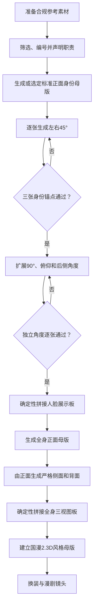

> [!warning] 本笔记已归档
> 当前权威正文：[[AI人物身份参考资产-执行手册]]；验收细则见[[附录B-验收与失败修复]]。原文仅用于历史追溯，不再作为现行规范。


# AI 漫剧人物身份锁定与多角度参考图工作流

> [!abstract] 一句话原则
> **生成时分开，验收后合成；独立角度图是母资产，合成参考板是展示资产。**

## 快速导航

| 笔记 | 用途 |
|---|---|
| [[AI人物身份参考资产-执行手册\|主指南]] | 决定做什么、按什么顺序做、失败回退到哪里 |
| [[附录A-提示词库]] | GPT、即梦、负面词和失败修复的直贴模板 |
| [[附录B-验收与失败修复]] | 评分、门禁、命名、排版和交付检查 |
| [[附录D-正式案例]] | 单图、多图、全身三视图的实测结果与图片 |

## 项目总目标

> [!goal] 持续目标
> 建设并持续完善一套可复用的AI动漫人物资产库：以已授权或纯AI人物参考为身份真值，完成身份与身体锁定、中日及中国特色/抖音漫剧风格调研、代表作品视觉索引、原创非模仿式提示词映射、同一人物风格效果对比、失败修复与量化验收，并将最终入选风格扩展为八角度人脸图谱、标准全身三视图、表情表、换装模板和GPT/即梦生产SOP。

### 完成定义

只有下列条件全部满足，项目才可从`改进`升级为`稳定`：

- [ ] 建立角色身份卡，明确脸型、眼距与眼型、鼻梁鼻尖、唇形、年龄、肤色、发际线、发缝、发色、发长和妆容；
- [ ] 写实身份母版与左右45°身份锚点通过门禁；
- [ ] 完成8～12张独立人脸角度母资产与1张确定性合成展示板；
- [ ] 完成全身正面0°、严格侧面90°、背面180°及三视图板；
- [ ] 完成现代国漫、传统中国美术、日漫、游戏/半写实、欧美动画与抖音AI漫剧路线调研；
- [ ] 每种路线均有代表作品视觉、原创风格拆解、同一人物测试图、提示词、负面词、评分与失败记录；
- [ ] 选定1个主风格、1个稳定备用风格和1个高视觉钩子派生风格；
- [ ] 主风格完成正面、左右45°、八角度、全身三视图、表情表和换装A/B；
- [ ] GPT与即梦模板均经过至少一次可复现实测；
- [ ] 所有附件、wikilink、frontmatter、表格和图片嵌入通过Obsidian阅读视图检查。

### 角色实例原则

补充材料中的“男性、短宽鹅蛋脸”等描述只是一份候选角色卡，不能覆盖当前图片的真实身份特征。每个角色单独建立身份卡：

```text
角色编号：[角色-001]
素材授权：[本人/模特授权/纯AI]
性别与年龄感：[按参考图填写]
脸型与下巴：[按参考图填写]
眼距与眼型：[按参考图填写]
鼻梁、鼻尖与鼻翼：[按参考图填写]
嘴唇厚度与嘴角：[按参考图填写]
肤色：[按参考图填写]
发际线、发缝、发色与发长：[按参考图填写]
妆容或面部装饰：[按参考图填写]
身体比例：[按全身母版填写]
禁止漂移项：[逐项列出]
```

“保持100%一致”“绝对锁脸”属于目标语言，不是可验证参数。实际以[[附录B-验收与失败修复]]的评分、硬性否决项和阶段门禁判断。

### 长期实施路线图

| 阶段 | 核心产物 | 门禁与回退 |
|---|---|---|
| P0 素材与身份定义 | 授权记录、角色身份卡、输入质量表 | 身份描述与素材冲突时，以已验收参考图为准 |
| P1 写实身份锁定 | 正面母版、左右45° | 任一身份锚点失败，不扩展角度 |
| P2 人脸与身体资产 | 8～12角度、全身三视图 | 角度或人体失败，只重做当前独立图 |
| P3 风格研究库 | 中日中式传统、游戏、欧美、抖音路线 | 代表作品只用于分析，不直接复制角色与专属视觉 |
| P4 风格A/B测试 | 同人同构图正面对比板、评分表 | 先身份，后风格；滤镜化结果退回重做 |
| P5 风格入选 | 主风格、稳定备用、高钩子派生 | 不以单张“好看”替代跨角度稳定性 |
| P6 完整动漫资产 | 八角度、三视图、表情、换装 | 每一层只继承声明职责，禁止服装模特污染身份 |
| P7 视频验证 | 3～5秒微运动、9:16首帧、连续镜头 | 逐帧检查脸、发型、年龄和体型漂移 |
| P8 SOP固化 | GPT/即梦模板、错误库、版本与复现记录 | 未实测内容保持“计划/待修”，不得写成完成 |

## 一、目标与适用范围

本流程用于建立可复用的虚构人物视觉资产：

- 写实摄影角色；
- 中国国漫 2.3D 漫剧角色；
- 8～12张独立人脸角度母图；
- 全身正面、严格侧面和背面；
- 多角度人脸展示板与全身三视图板；
- 后续换装、漫剧分镜和视频参考。

> [!warning] 素材边界
> 使用本人或模特明确授权素材、允许生成式加工的商业图库素材，或纯AI合成人脸。多人物融合、降低单图权重或改变国籍不能替代肖像授权。

## 二、最终交付结构

```text
角色-001/
├─ 01-输入参考/
├─ 02-身份候选/
├─ 03-写实身份母版/
│  ├─ 正面0°
│  ├─ 左前45°
│  └─ 右前45°
├─ 04-独立人脸角度母图/
├─ 05-人脸多角度展示板/
├─ 06-写实全身三视图/
│  ├─ 正面0°
│  ├─ 严格侧面90°
│  ├─ 背面180°
│  └─ 全身三视图板
├─ 07-动漫风格候选/
│  ├─ A-现代动漫生产风格/
│  └─ B-中国本土特色动画风格/
├─ 08-入选动漫身份资产/
│  ├─ 动漫身份母版
│  ├─ 八角度人脸图谱
│  ├─ 全身三视图
│  └─ 表情表
├─ 09-服装素材与换装结果/
└─ 10-提示词、评分与实验记录/
```

### 独立角度图

独立图是后续生成、换装和视频制作的母资产：

- 每个角度可单独淘汰、修复和替换；
- 可以只上传与目标角度最相关的3～5张；
- 不会让模型误读标签、边框和相邻人物；
- 保留每张图片的原始分辨率。

### 合成参考板

合成板只用于展示和集中验收：

- 快速判断是否为同一个人物；
- 检查角度覆盖是否完整；
- 作为角色设定稿交付；
- 在Obsidian、导演和美术协作中集中引用。

> [!danger] 禁止做法
> 不要让生成模型一次性画完整多角度板。模型可能在每个格子重新设计一张脸。正确做法是逐张生成、逐张验收，最后用确定性排版工具拼接，不重绘人物。

## 三、角度坐标标准

仅写“左侧”“俯视”容易产生歧义。每张图都记录三个旋转轴：

| 轴 | 含义 | 示例 |
|---|---|---|
| `yaw` | 水平左右转头 | 人物向左45° |
| `pitch` | 抬头或低头 | 低头15° |
| `roll` | 左右歪头 | 向右歪5° |

提示词同时描述：

1. 人物自身方向；
2. 画面坐标，如“鼻尖朝画面左侧”；
3. `yaw / pitch / roll`数值。

### 推荐人脸角度包

| 编号 | yaw | pitch | roll | 说明 |
|---|---:|---:|---:|---|
| F00 | 0° | 0° | 0° | 正面身份母版 |
| FL45 | 向左45° | 0° | 0° | 左前三分之二侧脸 |
| FR45 | 向右45° | 0° | 0° | 右前三分之二侧脸 |
| FL90 | 向左90° | 0° | 0° | 严格左侧面 |
| FR90 | 向右90° | 0° | 0° | 严格右侧面 |
| FD15 | 0° | 低头15° | 0° | 轻俯视 |
| FU15 | 0° | 抬头15° | 0° | 轻仰视 |
| B180 | 180° | 0° | 0° | 正后方 |

扩展包可增加左右30°、斜俯视30°、斜仰视30°和左右后侧135°。

## 四、输入决策

### 只有一张正面图

适合先验证流程：

1. 扩图生成标准正面身份母版；
2. 生成左右45°；
3. 三张同时通过后再扩展90°和俯仰角；
4. 侧面骨骼中不可见的信息属于模型推断，必须严格验收。

### 已有多张角度图

推荐单轮使用3～5张高价值图片：

1. 标准正面：唯一身份主参考；
2. 左右45°：补充双侧三维结构；
3. 至少一个严格90°：补充鼻唇下颌剪影；
4. 生成俯仰角时，可加入最接近目标pitch的已验收图。

所有图片必须独立裁出，并明确职责。正面决定身份，其他角度只补充几何，不平均融合成新人物。

### 应降权或排除的图片

- 模糊、低分辨率或严重压缩；
- 过度美颜、五官液化；
- 强表情、张嘴、露齿；
- 头发遮挡眼睛、鼻子或下颌；
- 广角近拍造成鼻大脸窄；
- 标签角度与实际姿态不一致；
- 疑似不是同一个人物。

## 五、标准生产流程

### 全身三视图精简路径

当目标只是获得同一角色的正面、严格侧面和背面时，使用以下最短闭环：

```text
筛选并裁切授权参考
→ 生成并验收全身正面锚点
→ 由正面锚点生成严格90°侧面
→ 由正面＋已验收侧面生成180°背面
→ 三张分别通过门禁
→ 用确定性工具拼成三视图板
```

每次只解决一个主要变量，约束优先级固定为：

1. **身份**：脸型、五官比例、年龄、肤色、发际线和发型；
2. **角度**：头部与身体的`yaw / pitch / roll`及遮挡关系；
3. **身体**：身高、头身比、肩宽、腰线、四肢和站姿；
4. **服装**：版型、材质、纹样、裙长、鞋型和背面结构；
5. **摄影风格**：背景、光线、焦段、色彩和杂志感。

> [!important] 提示词能力边界
> “唯一身份参考”“Face Lock”等文字只能提高模型遵循身份约束的概率，不能真正冻结像素或保证同一性。是否可进入下一阶段，必须由独立图片验收决定。



### 阶段1：参考筛选

为每张图记录：

- 文件编号和分辨率；
- `yaw / pitch / roll`；
- 眼睛、耳朵、下颌和发际线遮挡；
- 是否存在美颜、强表情或广角畸变；
- 身份、角度、姿势、服装或风格职责。

允许对参考图做不改变五官结构的裁切、轻度去噪、轻度锐化和统一曝光。不要用生成式补脸、美颜、液化或五官重塑“修复”身份参考，否则参考图不再是可靠的身份真值。

### 阶段2：身份母版

- 一次只生成标准正面；
- 生成多个候选后只选一个；
- 选定后停止重新融合身份；
- 后续使用“编辑同一人物”，不再使用“重新设计人物”。

### 阶段3：三张身份锚点

先完成：

- 正面0°；
- 左前45°；
- 右前45°。

三张未同时通过，不扩展其他角度。

### 阶段4：人脸图谱

- 每次只生成一个角度；
- 使用正面母版＋与目标最接近的已验收角度；
- 严格90°侧面必须检查远侧眼睛是否被正确遮挡；
- 俯仰角必须转动整个头骨，不能只改变眼神；
- 对缺失角度使用“留一角验证”检查补全能力。

### 阶段5：全身三视图

1. 先生成全身正面并锁定身材；
2. 用身份母版＋全身正面生成严格侧面；
3. 用身份母版＋正面＋侧面生成背面；
4. 保持身高、头身比、腰线、四肢、裙长、鞋型和脚底基线；
5. 三张通过后确定性拼板。

标准建模姿势：

- 身体直立，脊柱和骨盆中立；
- 双肩等高；
- 双臂向外约10°～15°；
- 双手自然，手指清楚；
- 双腿伸直、双脚平行；
- 不叉腰、不扭胯、不迈步。

写实成年女性默认约7.5头身；中国国漫2.3D默认7.8头身，静态立绘最高约8.2头身。

### 阶段6：动漫化强度与风格筛选

- 先用L1高一致性、L2平衡、L3强风格比较允许调整幅度；
- 默认以L2生成现代生产风格板和中国本土特色风格板；
- 现代风格板用于选择长期生产母版，中国特色板用于选择片头、梦境、回忆或特殊段落的派生视觉；
- 每种风格先生成独立正面图，确定性拼接成展示板，不让模型一次生成多格；
- 入选风格再补左右45°，通过门禁后才生成八角度；
- 写实与国漫资产分开保存，不反复互转；

中国本土特色组至少覆盖：水墨写意、工笔重彩、敦煌壁画、剪纸、皮影、年画/木版套色、京剧装饰、白描线描、青绿山水幻想和当代国潮3D。完整调研与适用边界见[[附录C-风格与作品研究#八、中国本土动画视觉体系调研]]。

### 阶段7：表情与换装

- 表情表以入选动漫身份母版为唯一造型锚点，先做小幅度基础表情；
- 换装时身份图负责脸，全身母版负责身材和姿势，服装素材只负责服装；
- 让服装适配人物，不让人物身材适配服装。

完整提示词见[[附录A-提示词库]]。

## 六、阶段门禁与回退

| 阶段 | 必须通过 | 失败回退 |
|---|---|---|
| 身份母版 | 身份、正面结构、发型 | 重选正面候选 |
| 45°锚点 | 身份、左右方向、真实透视 | 只重跑失败角度 |
| 人脸图谱 | 身份、目标角度、无镜像 | 回退到最近已验收角度 |
| 全身正面 | 身份、身材、姿势、头脚完整 | 重跑全身正面 |
| 侧面与背面 | 身材、服装、尺度连续 | 回退到全身正面母版 |
| 风格转换 | 身份不变、风格明确 | 降低风格化强度 |
| 换装 | 身份和身材不变、服装准确 | 减少服装参考图 |
| 排版 | 不重绘、对齐和标签正确 | 用确定性工具重排 |

详细评分和否决项见[[附录B-验收与失败修复]]。

## 七、工具分工

### GPT/ChatGPT图像生成

适合：

- 建立和修复身份母版；
- 对话式单角度编辑；
- 明确保持与修改项；
- 局部问题的针对性修复。

### 即梦/Seedream

适合：

- 多参考图编辑；
- 批量角度和系列图；
- 国漫风格化；
- 换装与视觉生产。

推荐组合：

```text
GPT锁定身份与正面母版
→ 即梦扩展角度、三视图和换装
→ 人工逐张验收
→ 确定性工具排版
```

## 八、命名规范

```text
角色编号-资产类型-角度-版本.扩展名
```

示例：

```text
角色001-人脸-F00-v1.png
角色001-人脸-FL45-v2.png
角色001-人脸-FR90-v1.png
角色001-全身-正面-v1.png
角色001-全身-右侧90-v1.png
角色001-全身-背面-v1.png
角色001-人脸多角度板-v1.png
角色001-全身三视图板-v1.png
```

不覆盖旧版本；失败结果标记为`淘汰`或`待修`，不要混入正式母资产目录。

## 九、最终交付清单

- [ ] 8～12张通过验收的独立人脸角度图
- [ ] 1张人脸多角度展示板
- [x] 3张独立全身正面、侧面、背面实验图
- [x] 1张全身三视图实验板
- [x] L1/L2/L3动漫化强度效果对比
- [ ] 现代动漫生产风格独立正面图与横向对比板
- [ ] 中国本土特色动画风格独立正面图与横向对比板
- [ ] 入选风格正面＋左右45°身份锚点
- [ ] 入选风格八角度人脸图谱
- [ ] 入选风格7.8～8.2头身全身三视图
- [ ] 入选风格表情表
- [ ] 首次换装A/B实验
- [x] 提示词与负面提示词库
- [x] 评分与A/B模板
- [x] 实验001与实验002记录

## 十、当前状态

已完成：

- 单张正面输入的身份母版实验；
- 左右角度尝试；
- 写实全身正面、严格侧面和背面；
- 全身三视图板；
- 多角度裁图、留一角验证；
- 补全相反侧90°。

待完成：

- 严格左右45°门禁；
- 最小八角度人脸包；
- 现代动漫生产风格对比板；
- 中国本土特色动画风格对比板；
- 入选动漫身份母版、八角度与全身三视图；
- 表情表；
- 换装A/B实验；
- 最终正式人脸多角度展示板。

实测图片与评分见[[附录D-正式案例]]。

## 参考资料

- [OpenAI：Creating images with ChatGPT](https://openai.com/academy/image-generation/)
- [OpenAI：Images in ChatGPT](https://help.openai.com/en/articles/11084440-chatgpt-image-library)
- [ByteDance：Seedream 4.5](https://seed.bytedance.com/en/seedream4_5)
- [ByteDance：Seedream 4.0 官方发布](https://seed.bytedance.com/en/blog/seedream-4-0-officially-released-beyond-drawing-into-imagination)

## 相关笔记

- [[附录A-提示词库]]
- [[附录B-验收与失败修复]]
- [[附录D-正式案例]]
- [[内容创作-MOC]]
- [[AI漫剧制作全流程]]
- [[02 视觉资产设计全流程|第二课：AI短剧视觉资产设计全流程]]
