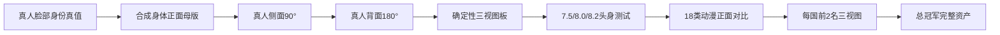

> [!warning] 本笔记已归档
> 当前权威正文：[[AI人物身份参考资产-执行手册]]；验收细则见[[验收与失败修复规范]]。原文仅用于历史追溯，不再作为现行规范。

# 真人到动漫三视图 SOP

## 核心原则

1. 独立角度图是母资产，合成板仅用于展示。
2. 先冻结身份，再冻结身体，最后改变风格、服装与动作。
3. 正面、侧面、背面分别生成，禁止让模型一次生成三格。
4. 每张保留输入、提示词、首轮输出、量测、失败原因、单项修复、修复结果和评分。
5. 本项目实测工具记为“Codex 内置 imagegen”，不宣称具体 API 模型；即梦模板标记“未实测”。
6. 全身图中的脸像素过少时，必须先生成并验收同风格高分辨率头肩母版，再由“脸母版＋冻结身体”两级锚定全身；禁止直接在低像素小脸上反复修眼睛。

## 阶段流程

## 真人标准

- 成人女性；自然合成比例，不宣称为输入人物真实身体。
- 标准 A-Pose：双脚与肩同宽，手臂离躯干约 25°，掌心朝大腿。
- 深灰色不透明长袖紧身上衣、及踝紧身裤、赤脚。
- 平静闭嘴；浅灰影棚背景；长焦、低透视畸变；头顶与脚底完整。
- 三视图统一身高、镜头高度、裁切、脚底基线、发型和服装。

## 门禁

| 检查 | 门槛 |
|---|---|
| 身份相似度 | ≥24/30 |
| 跨角度一致性 | ≥21/25 |
| 角度准确 | ≥13/15 |
| 正面新增双眼高低差 | ≤脸高 2% |
| 两眼新增可见宽高差 | ≤身份参考 10% |
| 动漫目标头身比 | ±0.1 头 |
| 严格侧面 | 远侧眼不得完整可见 |

## 生成后强制检查闭环

每次图像生成完成后，必须先检查并记录，未检查不得进入下一资产：

1. 身份：脸型、眼距眼型、鼻唇、年龄、肤色、发缝和发长；
2. 眼睛：眼裂高低、可见宽高、单一瞳孔、注视点、眼白和眼睑连续性；
3. 身体比例：头部相对身体大小、颈长、肩宽、胸廓、腰骨盆、裆位、膝位和腿长；
4. 姿势与角度：A-Pose、重心、头躯干方向和目标 yaw/pitch/roll；
5. 肢体：手指数量与粘连、脚趾与脚底、关节方向、额外肢体；
6. 服装、背景、镜头、裁切和风格变量是否冻结。

处理规则：

- 硬性问题：保留首轮到 `99-失败与标注/`，只修一个主要失败变量；
- 修复后再次执行完整检查，不得因目标问题改善就忽略新引入的身份或肢体问题；
- 一次修复仍不合格，标记 `待修`，停止该资产下游；
- 不合格图不得进入身份锚点、三视图、对比板、风格母版、动画首帧或换装参考链；展示板只能引用已通过的独立母资产；
- 通过后才复制到正式阶段目录，并在 `experiments.json` 写入评分与证据路径。

固定执行顺序：`生成 → 完整检查 → 判定 → 单项修复 → 完整复检 → 通过/待修`。任何修复版都视为新资产重新验收，不沿用上一版本的通过结论。

> [!failure] 硬性否决
> 换脸、露齿、双重五官、明显镜像、发缝反转、年龄漂移、头脚裁切、额外手指、脚部融合、身体重心异常或目标角度错误。

## 失败处理

1. 原图移入相应阶段目录并在记录中标为失败，绝不覆盖。
2. 只写一个可观察失败变量，例如“左眼瞳孔高 6 px”。
3. 修复提示词冻结身份、角度、服装、镜头和其他结构。
4. 最多修复一次；仍不合格则标为“待修”，停止该资产的下游扩展。

### 小脸眼睛崩坏专项流程

1. 将失败全身图原样保存并裁出同倍率面部检查图；
2. 对照真人身份母版检查眼裂、上下眼睑、眼白、虹膜、单一瞳孔与注视点；
3. 单独生成同风格高分辨率正面头肩母版并先验收；
4. 使用“头肩母版决定脸＋全身母版决定身体”的职责映射重建全身 v2；
5. 再裁切 v2 面部复核；眼部通过与头身比通过分别记分。

## 风格筛选

18 类均使用同一正面 0°、8.0 头身、建模服、背景、表情、裁切。总分 100：真人身份 30、动漫延展 20、风格辨识 20、跨角度潜力 15、视频适配 10、排版 5。同分依次比较身份、跨角度潜力、生产适配、风格辨识。

### 精确比例与自然度分离验收

- 数字门禁：冻结头部像素，以头顶—下巴为 1 头，确定性定位脚底，误差必须 ≤0.1 头；
- 自然度门禁：数字通过不代表人体通过，仍需检查颈长、胸廓、腰骨盆、膝位、四肢粗细和重心；
- 生成模型无法遵守精确比例时，可先生成自然人体，再制作确定性比例控制基准；两者必须分别命名和记录。

> [!important] 生产基准修订
> 8.0/8.2 确定性拉伸图只用于观察极限比例，不再作为 18 类风格输入。角色-001 的生产身体基准改为自然视觉 7.3～7.5 头身：正常颈长、正常躯干、手腕约至胯部、裆位接近全身中点略上、膝位自然。

## 最终交付

- 8～12 张独立人脸角度母资产及 1 张展示板；
- 动漫正、侧、背独立三视图及展示板；
- 喜、怒、哀、惊、冷静表情表；
- 换装 A/B；
- 9:16 首帧和 3～5 秒微运动稳定测试；
- GPT/Codex 实测提示词、即梦未实测模板、负面词、修复词；
- 完整评分、来源和 A/B 记录。
