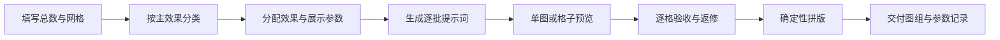
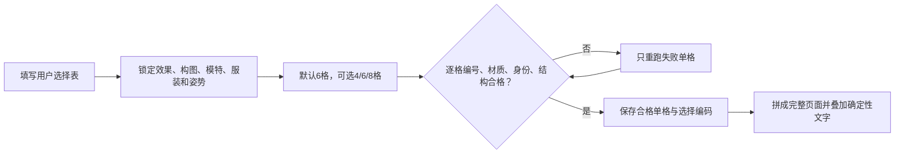

## 00 快速开始

### 文档导读

本文按流程组织：00 快速开始 → 01 交付页面 → 03 提示词组装与生产流程；参数定义（参数1-5、参考效果库 001–200、EXT 扩展页）已分离到 [[生成参数库]]，按编号查效果明细请进参数库。

| 参数 | 内容 | 章节 |
|---|---|---|
| 参数1 | 丝袜效果（页面分类＋参考效果库） | [[生成参数库]] |
| 参数2 | 构图与场景（构图＋背景道具兼容池） | [[生成参数库]] |
| 参数3 | 服装风格 | [[生成参数库]] |
| 参数4 | 姿势库及匹配 | [[生成参数库]] |
| 参数5 | 模特身份 | [[生成参数库]] |
| 生产 | 提示词组装、标准流程、通用骨架 | 第 3 章 |
| 明细 | 参数1-5 定义与参考效果库 001–200 | [[生成参数库]] |


### 适用范围

批量展示多种丝袜颜色、透明度、纹理、图案、光泽、结构或功能概念，并按 `R×C` 网格形成一页或多页分类图鉴。

> [!tip] 一键测试入口
> 在**图像版 ChatGPT** 中，直接粘贴 [[交付物生成契约#四、分类批量SOP图]] 的"自包含模板"，即可产出 **SOP图 ＋ 1 组成品图**（每主分类一张 12 格，标题＝主分类名称），无需读取 zip。总控契约见 [[交付物生成契约]]。

### 最小输入

```text
生成总数：N
每页网格：R×C，或每页格数 K
分类范围：自动 / 指定分类 / 指定 E 编号区间
执行模式：单图后拼版（默认）/ 直接格子预览
主效果：每格1项
辅助效果：无 / 每格最多1项
展示参数：联动随机（默认）/ 固定 / 指定范围
模特数量：默认每页2–4位固定成年女性
背景数量：默认每页3–6种兼容背景
道具密度：无 / 低（默认）/ 中；每格最多1组主道具
输出比例、平台与用途：
随机种子：可空；需要复现时必填
```

### 自动分类与分页

1. `每页格数 K = R × C`；`页数 = ceil(N ÷ K)`。
2. 先按参考效果库（见 [[生成参数库#参考效果库 001–200]]）的十个主分类分组，再按编号排序；不同主分类默认不混入同一页。
3. 每格恰好 1 个主效果，可选 1 个辅助效果；发生冲突时保留主效果。
4. 模特、服装、姿势、鞋履、背景、道具、构图和光线属于展示变量，只能按依赖顺序从兼容组合中联动抽取，不能用来补足效果数量。
5. 相邻格至少在“主效果、服装、姿势、背景”中有三项不同；同页只统一目录版式、色彩管理和摄影品质，不统一具体服装、背景或道具。

### 两种执行模式

| 模式     | 使用条件             | 生成方式              | 验收方式                |
| ------ | ---------------- | ----------------- | ------------------- |
| 单图后拼版  | 正式生产、复杂纹理或超过12格  | 每批4–6个编号，每个编号单独生成 | 逐格验收，失败格单独重跑，再确定性拼版 |
| 直接格子预览 | 4–12格、快速选型、效果较简单 | 一次生成整张格子预览        | 只作选型；入选格按需拆出精修      |

### 标准执行路径



### 输出清单

- 页面与分类规划。
- 每格的效果、构图、模特、服装、姿势、鞋履、背景、道具和光线参数表。
- 逐批可复制生成提示词。
- 无文字素材、通过验收的格子图和失败返修记录。
- 随机种子或完整参数快照。

> [!success] 当前生产规则
> 默认每批 6 张，可选 4/6/8 张；12 张及以上必须拆成多个 4–6 张批次。只使用成年女性，禁止男性；最终图片只显示腹部及以下至鞋尖。展示变量采用联动随机：先匹配服装，再匹配姿势、背景、道具和光线；同批不得退化为同服装、同背景、同站姿；同页姿势必须覆盖站/坐/躺/创意四大类（每类至少1格），站坐合计≥2/3、躺创意合计≤1/3。

> [!important] 完整成品规则
> 图片模型输出的无文字图片只是中间素材。正式成品必须在验收后确定性加入主标题、副标题、页面说明、连续编号、单格名称、单格说明和页脚信息，并同时保留无文字原图。

> [!success] 实测结论
> 已使用 Codex 内置 `imagegen` 跑通第 1 页（001–020）。20 个编号连续、中文短标签可读、颜色差异明显，腿部和鞋子结构稳定。对于 5×4 的密集图鉴，==图片内只保留“编号＋短名称”比同时生成长说明更可靠==；完整说明应放在图片外的笔记或后期排版中。

## 01 交付页面与分类总览

> [!important] 最终交付定义
> 本节定义需要生产的十张最终效果页。丝袜效果参数来自参考效果库（见 [[生成参数库#参考效果库 001–200]]）；构图、模特、服装分别从构图风格库（见 [[生成参数库#参数2：构图与场景]]）、固定模特身份库（见 [[生成参数库#参数5：模特身份]]）、服装风格库（见 [[生成参数库#参数3：服装风格]]）抽取；姿势及组合约束来自 姿势库与匹配规则（见 [[生成参数库#参数4：姿势库及匹配]]）。单图生成必须执行 标准生产流程（见第 3 章）。

### 现有预览基线

以下旧版图只用于确认十页交付形态和比较改版结果，不是效果参数的权威来源。

![[旧版-E001-E020-经典颜色.png]]
![[旧版-E021-E040-透明度等级.png]]
![[旧版-E041-E060-花纹针织.png]]
![[旧版-E061-E080-光泽质感.png]]
![[旧版-E081-E100-设计套装.png]]
![[旧版-E101-E120-工艺细节.png]]
![[旧版-E121-E140-功能款式.png]]
![[旧版-E141-E160-特殊视觉.png]]
![[旧版-E161-E180-生活场景.png]]
![[旧版-E181-E200-高级典藏.png]]


### 最终交付图组

| 页 | 效果编号 | 最终主题 | 正式文件名 | 生产状态 |
|---|---|---|---|---|
| 1 | 001–020 | 基础色系与肤感 | `E001-E020-基础色系与肤感.png` | 已有，待按新流程复验 |
| 2 | 021–040 | 透明度与厚度 | `E021-E040-透明度与厚度.png` | 待生产 |
| 3 | 041–060 | 纹理与编织结构 | `E041-E060-纹理与编织结构.png` | 待生产 |
| 4 | 061–080 | 图案与艺术设计 | `E061-E080-图案与艺术设计.png` | 待生产 |
| 5 | 081–100 | 材质、功能与场景 | `E081-E100-材质功能与场景.png` | 待生产 |
| 6 | 101–120 | 袜口、脚尖与拼接结构 | `E101-E120-袜口脚尖与拼接结构.png` | 待生产 |
| 7 | 121–140 | 染色、渐变与色彩工艺 | `E121-E140-染色渐变与色彩工艺.png` | 待生产 |
| 8 | 141–160 | 视觉错觉与空间图形 | `E141-E160-视觉错觉与空间图形.png` | 待生产 |
| 9 | 161–180 | 文化纹样与装饰艺术 | `E161-E180-文化纹样与装饰艺术.png` | 待生产 |
| 10 | 181–200 | 专业功能与应用场景 | `E181-E200-专业功能与应用场景.png` | 待生产 |

## 03 提示词组装与生产流程

### 参数化提示词组装

```text
用途：{输出用途}。平台：{平台}。本轮生成{4/6/8}格小批量，默认6格；12格及以上自动拆批。

页面与商品：
页面分类：{PAGE代码与名称}
每格严格选择1个核心效果：{E编号＋必须出现的视觉特征}
辅助效果：{A-NONE或一个A代码}
不得增加第二个辅助效果，不得用换背景或换模特冒充商品差异。

固定人物：
使用{M编号列表，共2–4位}循环；上传对应身份卡作为人物参考。
锁定成年年龄、面部、肤色、发型、体型和腿型。

展示选择：
构图：{构图编号＋完整提示词}
服装：{O编号＋服装结构}
姿势：{姿势编号＋控制词；按[[生成参数库#格间姿势抽取规则（多效果同页）]]强制覆盖站/坐/躺/创意四大类，站坐合计≥2/3，躺创意合计≤1/3}
背景：{BG编号＋空间/材质/色调}
道具：{PR编号＋与姿势的交互；允许PR00}
光线：{与背景和丝袜材质匹配的方向、软硬度、色温}
鞋款：{与服装、姿势和场景匹配，并完整可见}

联动随机：不得把服装、姿势、背景、道具分别从全库独立乱抽。必须按“丝袜效果 → 服装 → 姿势/构图 → 背景 → 道具 → 光线”逐层筛选后抽取。相邻格不得重复完整组合；同批至少覆盖2种背景、2种服装和3种姿势；同页姿势强制覆盖站/坐/躺/创意四大类（每类至少1格），站坐合计≥2/3，躺创意合计≤1/3，相邻格不重复同一姿势大类。

默认生成6格，可选4/6/8格，不直接生成20格；12格及以上拆成多个4–6格批次。图片内只保留效果编号和短名称；
长说明后期叠加。明确成年、完全着装、非挑逗性的商业时装表达。
禁止真人复刻、品牌校徽、多肢、融合腿、鞋脚分离、纹理漂浮、
编号错误、文字乱码、水印和无关人物。
```

### 案例 A｜技术目录

```text
PAGE-01 + E-001/E-003/E-007/E-009/E-017/E-020
+ A-NONE（E-017使用A-珠光）
+ T01/T02 + M01/M02 + O01 + S01/S02
+ 正面柔光 + 商品目录 + Gemini + 6格
```

![[选择器实测-技术目录-6格.png|800]]

### 案例 B｜生活方式

```text
PAGE-04/05 + E-061/E-066/E-072/E-081/E-082/E-099
+ A-雾面/A-半透/A-NONE
+ L01/L02 + M02/M07 + O03/O05 + C01/C04
+ 暖窗光 + 完整Look + Gemini + 6格
```

![[选择器实测-生活方式-6格.png|800]]

### 标准生产流程



1. 先填写选择表，锁定页面和效果，建立模特、服装、姿势、背景、道具与光线的兼容候选池。
2. 默认每次生成 6 格，可选 4/6/8 格；12 格及以上拆成多个 4–6 格批次。复杂坐姿、躺姿和道具互动可先单图预验收以降低失败率，再进入批量母图。
3. 每款只使用一个核心效果和最多一个辅助效果；逐格执行联动随机并保存完整参数快照。
4. 单格验收编号、商品差异、人物身份、人体结构、鞋履连接，以及服装—背景—道具—光线是否冲突；只重跑失败项。
5. 批次验收背景、服装和姿势的覆盖率：同页必须四大类（站/坐/躺/创意）每类至少 1 格、站坐合计≥2/3、躺创意合计≤1/3，防止随机结果退化成同一造型或只出站坐。
6. 合格单格拼成完整页面，编号、名称和卖点由排版工具确定性叠加。

### 通用提示词骨架

```text
用途：高级时尚产品目录图鉴。

任务：
生成《丝袜上腿效果图鉴｜系列化效果库》第{页码}页：
“{分类名称}（{起始编号}–{结束编号}）”。

画布与版式：
竖版4:5，统一米白目录纸张和卡片版式；每格内部使用与丝袜和服装匹配的不同背景；顶部显示总标题与当前页副标题；
当前阶段默认生成6个等大卡片，可选4/6/8；12个及以上拆成多个4–6格批次，验收后再拼成正式页面。
每格上方约80%为商品摄影，下方约20%为标签。
标签仅包含三位编号和简短中文名称。

人物约束：
每格只展示一位成年女性，最大裁切范围为腹部以下至鞋尖，可进一步裁到裙摆或腿部近景；禁止男性；
两条腿、两个膝盖、两个小腿、两个脚踝、两只脚、两只鞋；
姿势选择：
{从“模特姿势选择案例”复制一种姿势提示词}
同页强制覆盖站/坐/躺/创意四大类，每类至少1格；站坐合计≥总格数2/3，躺创意合计≤总格数1/3；相邻格不重复同一姿势大类；
躺姿和创意道具姿势直接进批量，但必须带安全限制词（成年、完全着装、非挑逗、艺术表达）；
人体解剖自然，丝袜贴合皮肤；
不展示上半身，不暴露私密部位。

统一性：
统一目录版式、卡片比例、字体系统、色彩管理和商业摄影品质；不统一每格的具体服装、背景、道具和姿势。

联动差异：
每格按“丝袜效果 → 服装 → 姿势/构图 → 背景 → 道具 → 光线”抽取兼容组合；
背景从 BG01–BG08 中筛选后随机，道具从对应 PR 候选中筛选后随机，也可为 PR00；
同页至少出现3种背景、3种服装，且姿势四大类（站/坐/躺/创意）每类至少1格、站坐合计≥2/3、躺创意合计≤1/3，道具不得遮挡丝袜主效果或与场景用途冲突。

差异性：
相邻编号至少在主颜色、透明度、厚度、反光、纹理、
图案、覆盖范围或功能结构中的两项明显不同。

本页20项：
{逐项列出“编号 名称：可见特征”}

文字：
现代黑体；编号大且醒目，名称较小；
编号连续、无重复、无跳号，不添加其他文字。

避免：
畸形腿、多余腿、缺少腿、融合腿、双重膝盖、腿部扭曲、
脚踝断裂、鞋子畸形、丝袜像塑料、纹理漂浮、重复款式、
仅轻微换色、编号错误、中文乱码、文字重叠、模糊、水印、
品牌标志、抢夺商品主体的复杂背景、无关人物、悬浮道具、场景与服装风格冲突。
```

### 测试提示词组装规则

1. 从参考效果库（见 [[生成参数库#参考效果库 001–200]]）读取当前效果编号、名称和必须出现的视觉特征。
2. 依据丝袜效果标签建立服装候选池，从兼容的 O01–O16 中抽取服装；不是从全部服装中无条件随机。
3. 依据“丝袜效果＋服装”建立构图、姿势和鞋履候选池，再从 姿势库与匹配规则（见参数4） 抽取兼容姿势。
4. 依据“丝袜效果＋服装＋姿势”筛选背景，再依据“背景＋姿势＋无遮挡要求”抽取零或一组道具；光线必须与背景时间、方向和商品材质一致。
5. 相邻格不得重复完整组合；同页至少出现 3 种背景、3 种服装，且姿势四大类每类至少 1 格、站坐合计≥2/3、躺创意合计≤1/3。躺姿和创意道具姿势直接进批量，但必须带安全限制词；首用可先单图预验收以降低失败率。
6. 先把每格的完整参数快照写入表格，再形成测试提示词并生成单图；通过人体、鞋履、丝袜表现、服装、背景和道具冲突门禁后，才进入最终 5×4 图组。

## 04 关联资料

### 关联入口

- [[锁商品丝袜格子图-SOP]]：执行具体产品的提示词、候选图、拼版与文案
- [[丝袜商品效果图-MOC]]：项目结构、资产和实测导航
- [[参考效果库-批次提示词]]：将本文十个编号区间转为图片组的提示词示例

### 关联资料

- [[丝袜商品效果图-MOC]]
- [[锁商品丝袜格子图-SOP]]
- [[参考效果库-批次提示词]]


### 参数定义位置

参数大纲、参数1-5（构图/服装/姿势/模特）、参考效果库 001–200 与 EXT 扩展页的完整定义已分离到 **[[生成参数库]]**。本 SOP 不再持有参数定义，只保留流程；执行时从生成参数库读取参数。

- 生成参数大纲与参数1-5：[[生成参数库#生成参数大纲]]
- 参考效果库 001–200：[[生成参数库#参考效果库 001–200]]
- EXT 扩展页（绒面/袜长/露踝/概念通道）：[[生成参数库#参考效果库 001–200]]

