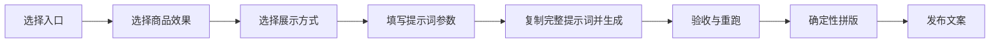

、
# 锁商品丝袜格子图-SOP

![[Pasted image 20260803003650.png]]
![[Pasted image 20260803004401.png]]

> [!info] 导航入口
> 文件结构、资产位置与多效果流程见 [[丝袜商品效果图-MOC]]。

> [!abstract] 流程目标
> 为一款具体丝袜锁定颜色、透明度、厚度、材质、纹理、袜口和脚尖，再改变模特、服装、姿势、构图与光线。默认只产出 **1 张主图**；明确要求时才产出格子图和发布文案。

> [!success] 阅读方式
> 本文就是单产品生产 SOP。如果目标是同页展示多个不同丝袜效果，或查询完整 001–200 效果定义，请改用 [[分类批量丝袜格子图-SOP]]。

## 页内导航

- [[#一、五分钟快速开始]]
- [[#二、统一约束]]
- [[#三、提示词参数结构]]
- [[#四、商品效果]]
- [[#五、展示变量]]
- [[#六、直接提示词与生产流程]]
- [[#七、质量门禁与失败回退]]
- [[#八、预设案例状态]]
- [[#九、完整实测案例｜C05]]
- [[#十、交付与验收清单]]

> [!tip] 一键测试入口
> 在**图像版 ChatGPT** 中，直接粘贴 [[交付物生成契约#三、锁商品SOP图]] 的"自包含模板"，即可产出 **SOP图 ＋ 1 张主图**（标题＝产品名称），无需读取 zip；需要格子图时在触发词后追加"格子图"。总控契约见 [[交付物生成契约]]。

## 一、五分钟快速开始



### 1. 选择入口

| 入口 | 适用情况 | 规则 |
|---|---|---|
| 预设案例 | 希望直接复用成熟组合 | 预设只读，修改时复制为新配置 |
| 效果参考 | 已有喜欢的参考图片 | 只继承明确勾选的维度 |
| 自定义配置 | 希望从零组合 | 逐项选择效果与展示方式 |

参考图可继承：`丝袜效果 / 构图 / 姿势 / 服装 / 模特体型 / 场景 / 光线 / 色调`。

### 2. 选择商品效果

每款只允许 `1 个核心效果＋最多 1 个辅助效果`。先在 [[#四、商品效果]] 选页面分类（PAGE-01～PAGE-10），再到 [[生成参数库#参考效果库 001–200]] 选具体 E-编号和视觉特征。

### 3. 选择展示方式

进入 [[#五、展示变量]] 选择构图、服装和姿势。展示变量不改变丝袜本体。

### 4. 确认并生成

填写 [[#三、提示词参数结构]]，随后进入 [[#六、直接提示词与生产流程]] 复制完整提示词。默认只生成 **1 张主图**；明确要求格子图时才选择批次（小/中/大批次），并按对应验收方式执行。

## 二、统一约束

- 只使用明确成年的女性模特，禁止男性或男女混合。
- 最大裁切范围为腹部以下至鞋尖，可进一步裁到裙摆或腿部细节。
- 性感、甜美、包臀裙和成人学院风均可，但必须保持服装商品展示逻辑。
- 每页循环 2–4 位固定模特；无脸输出用肤色、腿型、身体比例和参考卡共同锁定。
- 同批姿势必须有变化，不能重复同一动作。
- 每格恰好两条腿；膝盖、脚踝、脚和鞋履连接正确。
- 禁止多肢、融合腿、重复膝盖、断裂脚踝、悬空鞋和漂浮纹理。
- 固定身份使用原创 AI 成人女性参考图，不复刻真人、名人或品牌模特。
- 正式销售前按所用生成平台的最新条款复核商用范围。

冲突优先级：

`成人身份与商业发布安全约束 → 固定模特身份 → 核心丝袜效果 → 勾选参考维度 → 自定义展示方式 → 平台优化`

## 三、提示词参数结构

> [!important] 定义
> 本节就是完整提示词的变量区。填完以下字段后，直接代入 [[#完整图片提示词]]，不再生成其他中间文档。

```text
入口：预设案例 / 效果参考 / 自定义配置
产品名称或代码：___
页面：PAGE-__
核心效果：E-___（必选且只能1项）
辅助效果：A-___（可空，最多1项）
产品不可变化项：颜色 / 透明度 / 厚度 / 材质 / 纹理 / 图案位置 / 袜口 / 脚尖
允许变化项：构图 / 姿势 / 镜头 / 场景 / 光线 / 服装 / 模特
禁止出现：___
参考图：___
继承维度：丝袜效果 / 构图 / 姿势 / 服装 / 模特体型 / 场景 / 光线 / 色调
模特：M__（同页循环2–4位固定成年女性）
服装：O__
姿势：S__
构图：T01–T04 / L01–L04 / E01–E04 / S01–S04
场景与光线：___
输出用途：商品目录 / 小红书 / 电商详情 / 视频封面 / 时装编辑
比例：3:4 / 4:5 / 9:16 / 1:1
平台：Gemini / 豆包 / 即梦 / ChatGPT-ImageGen
批次等级：单张主图（默认）／小批次 4–6 格／中批次 8–12 格／大批次 16–24 格
母图格数：单张主图无格数；格子图 4 / 6 / 8 / 9 / 12；默认 6 格，超过 12 格只作缩略预选
候选图总数：单张主图＝1；格子图按批次
最终入选格数与网格：单张主图不适用；格子图 ___ / ___×___
```

生成前检查：核心效果是否唯一、参考继承范围是否明确、服装是否遮挡重点、姿势与构图是否兼容、裁切是否符合用途。

## 四、商品效果

商品效果统一使用多用体系的编号：**页面分类** `PAGE-01～PAGE-10`（效果风格上层归类）、**具体效果** `E-001～E-200`（每格恰好 1 个核心效果，最多 1 个辅助效果）。完整定义只维护在 [[生成参数库#生成参数大纲]] 与 [[生成参数库#参考效果库 001–200]]；本 SOP 不重复维护效果清单，也不持有独立的效果编号。

> [!tip] 想找效果却不知道编号？
> 用日常口语词反查：打开 [[丝袜效果提示词库#口语词检索表]]，搜"星空""丝绒""婚礼""过膝袜"等词，即可映射到对应 E 编号或 EXT 扩展页，不必背编号。

> [!example]- 展开 商品效果预览｜颜色、肤感、透明度与厚度
> ![[P01-基础色系与肤感.png|380]] ![[P02-透明度与厚度.png|380]]
>
> - 基础色系：纯色、肤色、冷暖色和基础日常款。
> - 透明度与厚度：超薄、薄透、半透、中厚、不透明和冬季厚款。

> [!example]- 展开 商品效果预览｜编织、纹理与图案
> ![[P03-纹理与编织结构.png|380]] ![[P04-图案与艺术设计.png|380]]
>
> - 编织纹理：微网、细网、菱形网、罗纹、横纹和蕾丝。
> - 图案艺术：波点、竖条、植物、几何、星点和重复纹样。

> [!example]- 展开 商品效果预览｜表面光泽与结构细节
> ![[P05-材质表面与光泽.png|380]] ![[P06-袜口脚尖与拼接结构.png|380]]
>
> - 表面光泽：哑光、缎光、珠光、细闪、金属线和高亮表面。
> - 结构细节：后缝、加固脚尖、后跟、侧拼接、袜口和非对称面板。

> [!example]- 展开 商品效果预览｜色彩工艺与装饰艺术
> ![[P07-染色渐变与色彩工艺.png|380]] ![[P08-文化纹样与装饰艺术.png|380]]
>
> - 色彩工艺：渐变、双色、烟雾染、扎染和偏光色移。
> - 装饰艺术：原创云曲线、窗格几何、佩斯利、藤蔓、马赛克和笔触节奏。

> [!example]- 展开 商品效果预览｜视觉错觉与功能场景
> ![[P09-视觉错觉与空间图形-v3-扩展精修版.png|380]] ![[P10-专业功能与应用场景.png|380]]
>
> - 视觉错觉：以莫尔波纹、透视网格、浮雕错视、负空间切割、像素故障、渐变光栅作为基准方向，并允许 AI 在真实丝袜工艺与腿部曲面贴合的前提下继续自主延展，不固定为单一黑灰几何风格。
> - 功能场景：通勤、清凉、保暖、支撑、舞台和户外应用。

> [!note] 图片与编号的关系
> 上面 `P01–P10` 是 `03-生产资产/商品效果/` 的分类参考资产文件名，只用于快速读图预览，**不是效果编号**。生成提示词一律写 `PAGE-XX` 页面分类＋`E-编号` 具体效果。

## 五、展示变量

展示变量（构图、服装、姿势）统一使用多用体系的编号，定义见 [[生成参数库#参数2：构图与场景]]、[[生成参数库#参数3：服装风格]]、[[生成参数库#参数4：姿势库及匹配]]；本 SOP 不持有独立的展示编号。展示变量只负责呈现，不改变丝袜本体。

- **构图**：技术目录 `T01–T04` / 生活方式 `L01–L04` / 时装编辑 `E01–E04` / 电商社媒 `S01–S04`。
- **服装**：`O01–O16`，不遮挡膝部、脚踝或鞋履。
- **姿势**：站立行走 `S01–S08` / 椅凳坐姿 `C01–C08` / 沙发地面 `L01–L08` / 道具互动 `P01–P08`。
- **模特**：`M01–M08`，同页循环 2–4 位固定成年女性。
- **背景／道具／光线**：背景 `BG01–BG08`、道具 `PR00–PR08`、光线按联动随机匹配，见 [[生成参数库#参数2：构图与场景]]。
- **鞋履／露踝穿搭**：鞋履 `EXT-SHOES`（高跟/乐福/靴/凉鞋/运动鞋）；露踝组合＝裤长到踝上＋袜口露出＋短靴/乐福鞋，见 [[生成参数库#参数1：丝袜效果风格]] 的 EXT-SHOES。
- **风格化虚拟模特（概念通道）**：动漫/二次元形象走 `概念 EXT-动漫-*`，只作内容灵感，不进正式商品交付；正式商品图用 `M01–M08` 真实系，见 [[生成参数库#参数5：模特身份]]。

新版参考资产统一采用奶油白、暖灰、胡桃木和深咖的高级极简视觉体系。以下图片来自 `03-生产资产/展示方式/`，只用于快速读图预览，**不是生成参数**。

> [!example]- 展开 构图预览｜技术目录
> ![[D01-技术目录构图-v2.png|800]]
>
> 对应构图 `T01–T04`。用于材质核验、电商规格对照和课程演示。可选正面、三分之四、结构近景和前后对比。

> [!example]- 展开 构图预览｜生活方式
> ![[D02-生活方式构图-v2.png|800]]
>
> 对应构图 `L01–L04`。用于小红书和日常穿搭。可选沙发、窗边单椅、卧室坐凳和都市休息区。

> [!example]- 展开 构图预览｜时装编辑
> ![[D03-时装编辑构图-v2.png|800]]
>
> 对应构图 `E01–E04`。用于高级感内容和创意纹样。可选雕塑白棚、深色空间、金属背景和电影感暖光。

> [!example]- 展开 构图预览｜电商与社媒
> ![[D04-电商社媒构图-v2.png|800]]
>
> 对应构图 `S01–S04`。用于白底详情、暖色社媒、竖版封面和 Look＋腿部细节组合。

> [!example]- 展开 服装预览
> ![[D05-服装风格-v2.png|800]]
>
> 对应服装 `O01–O16`。首选通勤包臀裙、成人学院风、柔和甜美和成熟晚宴风。服装不能遮挡膝部、脚踝或鞋履。

> [!example]- 展开 姿势预览
> ![[D06-姿势与动作-v2.png|800]]
>
> 对应姿势 `S/C/L/P` 四组。默认动作：正面站姿、三分之四站姿、自然迈步、单椅端坐、沙发腿部延伸、侧向坐姿。

## 六、直接提示词与生产流程

### 效果提示词来源

页面级与编号级提示词片段统一维护在 [[生成参数库#参考效果库 001–200]]：每页有「页面提示词片段」，每个子类有「子类提示词片段」。本 SOP 不再重复维护，也不持有平行片段。

> [!tip] 最短使用方式
> 从完整索引选一个 `E-编号` 和所属页面分类，复制对应「子类提示词片段」（编号级可再追加该编号视觉特征），替换提示词中的 `{核心效果描述}`。辅助效果只追加一句，不能改变核心效果。默认用 [[#单张主图提示词（默认）]]；明确要求格子图时改用 [[#格子图提示词（可选，仅在明确要求时使用）]]。

### 单张主图提示词（默认）

> 默认产出 **1 张主图**：商品变量锁定，展示变量取一个完整组合，不加网格与格数描述。

> [!example]- 展开可复制提示词（默认）
> ```text
> 生成一张高级、写实、可用于商业目录的成年女性丝袜商品图，{比例}，用于{输出用途}。
>
> 核心丝袜效果：{E-编号＋名称}。{从参数库「页面/子类提示词片段」填入完整视觉描述}
> 辅助效果：{A-NONE或一个辅助效果；若为空则不增加}。
> 固定模特：{M编号与身份描述，成年女性}。
> 参考图只继承：{用户勾选的维度}。
> 服装：{O编号＋服装结构}，不得遮挡丝袜重点区域。
> 姿势：{姿势编号＋动作描述}。
> 构图与场景：{T/L/E/S构图编号＋背景＋光线＋镜头}。
> 输出：无文字视觉素材；统一镜头高度、裁切、鞋款和色温。
>
> 只出现成年女性；最大裁切范围为腹部以下至鞋尖；恰好两条腿；
> 双膝、脚踝、脚和鞋履连接正确；丝袜纹理沿腿部曲面连续；
> 无品牌、文字和水印。
> ```

### 格子图提示词（可选，仅在明确要求时使用）

> 明确要求格子图时才使用本节模板；默认不生成格子图。

> [!example]- 展开可复制提示词（格子图）
> ```text
> 生成一组成年女性丝袜商品视觉图，共{4/6/8}个独立效果格，{比例}，用于{输出用途}。
>
> 核心丝袜效果：{E-编号＋名称}。{从参数库「页面/子类提示词片段」填入完整视觉描述}
> 辅助效果：{A-NONE或一个辅助效果；若为空则不增加}。
> 固定模特：{M编号与身份描述，同页循环2–4位成年女性}。
> 参考图只继承：{用户勾选的维度}。
> 服装：{O编号＋服装结构}，不得遮挡丝袜重点区域。
> 姿势：{姿势编号＋每格不同的动作列表；按[[生成参数库#格间姿势抽取规则（多效果同页）]]覆盖站/坐/躺/创意四大类，站坐合计≥2/3}。
> 构图与场景：{T/L/E/S构图编号＋背景＋光线＋镜头}。
> 输出：无文字视觉素材；{留白位置}；统一镜头高度、裁切、鞋款和色温。
>
> 只出现成年女性；最大裁切范围为腹部以下至鞋尖；每格恰好两条腿；
> 双膝、脚踝、脚和鞋履连接正确；丝袜纹理沿腿部曲面连续；
> 相邻格姿势不同，但核心丝袜效果保持一致；无品牌、文字和水印。
> ```

### 平台转换

- Gemini：先给参考图和提示词；默认单张主图，明确要求格子图时精细批次优先 4–6 张，稳定模板可提高单图格数；中文说明放到图片外。
- 豆包：把核心效果、姿势和裁切放在开头，使用短句。
- 即梦：拆成主体、服装、动作、镜头、光线和约束六段。
- ChatGPT/ImageGen：使用结构化描述，明确每张姿势差异与不可变项。

### 生产单位

先在提示词参数结构中选择批次等级。默认是 **1 张主图**（无网格）；只有明确要求格子图时，才按批次选择格数。这里的“张数”是最终独立效果格数量；可以逐张生成，也可以让一张母图容纳多格，再切分验收。

| 批次   |   效果格数量 |   建议单张母图容纳 | 适用场景            | 质量策略               |
| ---- | ------: | ---------: | --------------- | ------------------ |
| 单张主图（默认） |  1 格 |      1 格 | 单商品主视觉、商品目录头图、电商首图 | 生成后逐项验收，失败单张重跑      |
| 小批次  |   4–6 格 |      4–6 格 | 新效果试错、身份锁定、复杂姿势 | 逐格检查，失败项单独重跑  |
| 中批次  |  8–12 格 |      6–8 格 | 已验证商品效果、同场景姿势扩展 | 可拆成 2 张母图，避免每格过小   |
| 大批次  | 16–24 格 |     8–12 格 | 稳定模板铺量、效果索引预览   | 先出低成本联系表，再把入选格精细重跑 |
| 超大任务 |  25 格以上 | 每张不超过 12 格 | 页面库或季度素材库       | 按主题分组生产，不要求一次生成完成  |

> [!tip] 一张图容纳多少格
> 3:4 竖版母图推荐 6 格（3×2）或 8 格（4×2）；方形母图推荐 9 格（3×3）；需要 12 格时使用 3×4 或 4×3。超过 12 格后，腿部纹理、鞋履连接和姿势差异会明显难验收，因此只用于缩略预选，不直接作为最终商品图。

批次变大不等于取消单格验收。中、大批次采用“两阶段生成”：第一阶段用多格母图选择构图；第二阶段将入选格按 1–4 格精细重跑，最后再统一编号和拼版。

### 图片与文字分工

1. 图片模型只生成无文字视觉素材。
2. 逐张验收，失败项单独重跑。
3. 验收通过后确定性拼版。
4. 后期加入主标题、副标题、页面说明、连续编号、单格名称、单格说明和页脚。
5. 同时保留无文字原图和完整目录页。

## 七、质量门禁与失败回退

质量检查同时用于生成前预检和生成后验收，不依赖模型自行声明“已检查”。每格至少核对以下五类问题：

| 门禁 | 通过条件 | 失败处理 |
|---|---|---|
| 人体结构 | 恰好两条腿，膝盖、脚踝、脚部和承重关系自然 | 降低姿势复杂度并单格重跑 |
| 丝袜表现 | 左右腿透明度一致，纹理随腿部曲面连续，弯曲处没有断裂或堆积 | 固定姿势，只重跑商品效果 |
| 鞋履连接 | 脚完整进入鞋内，鞋跟、鞋头方向和左右款式一致 | 改用安全站姿或简化鞋型 |
| 构图裁切 | 商品区域完整，膝盖、脚踝和鞋尖不被画面边缘截断 | 调整景别，不用扩图掩盖结构错误 |
| 场景搭配 | 光影方向一致，道具不悬浮，服装和场景不遮挡商品卖点 | 移除冲突道具或回退默认场景 |

质量分三级。概念验证只检查结构、两腿数量和纹理连续；商品页增加姿势、场景、鞋履和裁切检查；品牌级交付再检查光影、色彩、构图与跨图一致性。等级提高只增加验收项目，不放宽前一级门禁。

同一错误连续出现时按固定顺序回退：冻结已经通过的变量，降低姿势和场景复杂度，再单格重跑。连续三次仍未通过时，标记为需要人工判断并跳过该格，不在错误底图上继续堆叠提示词。

## 八、预设案例状态

预设只读，修改时复制为新配置。

| 编号 | 类型 | 核心效果 | 推荐展示 | 状态 |
|---|---|---|---|---|
| C01 | 技术目录 | 黑色透明度阶梯 | T01＋站姿对照 | 待验证 |
| C02 | 技术目录 | 裸色肤感阶梯 | T02＋正侧面 | 待验证 |
| C03 | 技术目录 | 网眼编织 | T03＋纹理近景 | 待验证 |
| C04 | 技术目录 | 后缝与脚尖结构 | T04＋前后对比 | 待验证 |
| C05 | 小红书 | 黑色半透细闪 | L01＋站坐混合 | 已完成首轮实测 |
| C06 | 小红书 | 成人学院风细纹 | S02＋学院风短裙 | 待验证 |
| C07 | 小红书 | 裸色珠光 | L01＋暖色生活场景 | 待验证 |
| C08 | 电商详情 | 通勤半透 | S01＋白底详情 | 待验证 |
| C09 | 电商详情 | 秋冬中厚哑光 | T01＋功能细节 | 待验证 |
| C10 | 时装编辑 | 几何错觉 | E01＋雕塑棚 | 待验证 |
| C11 | 时装编辑 | 金属线编织 | E03＋金属空间 | 待验证 |
| C12 | 视频封面 | 渐变细闪 | S03＋9:16 动态步态 | 待验证 |

## 九、完整实测案例｜C05

### 完整目录页

![[首轮演示-黑色半透细闪-完整目录页.png|800]]

> [!example]- 展开 C05 提示词参数、实际提示词与验收
> **提示词参数**
>
> | 字段 | 选择 |
> |---|---|
> | 页面分类 | PAGE-02 透明度与厚度 |
> | 核心效果 | E-033 高密度黑（黑色半透丝袜） |
> | 辅助效果 | A-细闪（克制银色细闪） |
> | 构图 | T02 三分之四棚拍＋L01 暖色沙发 |
> | 模特 | M01＋M02，成年东亚女性 |
> | 服装 | O05 成年学院灵感（黑色或炭灰短裙） |
> | 姿势 | 正面、轻交叉、侧姿、端坐、腿部延伸、自然迈步 |
> | 场景 | 浅灰技术棚＋暖色极简客厅 |
> | 输出 | 3:4、无文字素材＋完整目录页、腹部以下至鞋尖 |
> | 批量 | 6 格（本案例明确要格子图；默认应只出 1 张主图） |
>
> **实际提示词**
>
> ```text
> 创建一张3:4竖版2×3小批量服装目录板，只出现成年东亚女性模特。
> 每格最大裁切范围为腹部/腰部至尖头鞋。
> 服装为成熟学院风黑色或炭灰短裙；商品为黑色半透丝袜，并带克制、细密、均匀的银色微闪。
> 六格姿势依次为正面站姿、轻交叉站姿、三分之四侧姿、沙发端坐、坐姿单腿延伸、自然迈步。
> 场景在浅灰技术棚与暖色极简客厅之间交替，但丝袜颜色、透明度和细闪保持一致。
> 每格恰好两条腿，鞋履完整，人体比例自然；无文字、品牌或水印。
> ```
>
> **验收结果**
>
> - 成年女性、腹部以下裁切、六种姿势、核心效果、腿部和鞋履：通过。
> - 主标题、001–006编号、名称和说明：通过。
> - 固定身份：部分通过；无脸输出仍需用肤色、腿型和比例共同锁定。
> - 分批重跑：待验证；首轮直接生成2×3板，正式流程应拆成两批各3张。
>
> **失败修复**
>
> 1. 过多排除词曾触发图片审核误判，改为正向成年女性服装目录描述。
> 2. 文化纹样测试曾误生成男性，整图废弃后重跑女性版本。
> 3. 图片模型不负责中文排版，标题、编号和说明使用确定性后期排版。

### 小红书文案

> [!example]- 展开发布文案
> **标题：** 黑色半透细闪怎么拍？6种腿部姿势对比
>
> 这组只测试一种丝袜效果：黑色半透＋克制细闪。通过正面、侧面、交叉、端坐、腿部延伸和迈步，观察膝部透感、脚踝贴合与不同光线下的细闪变化。
>
> 商品目录优先选正面和侧面；小红书内容可以增加坐姿和轻动态。本案例为格子图演示，明确要求 6 格；默认流程应只出 1 张主图，仅当明确要求格子图时才进入批次生成。
>
> #丝袜穿搭 #AI穿搭 #腿部穿搭 #穿搭灵感 #黑色丝袜

## 十、交付与验收清单

- [ ] 原始参考图和继承维度
- [ ] 已确认的提示词参数与完整提示词
- [ ] 图片模型提示词
- [ ] 已记录批次等级、效果格总数和每张母图格数
- [ ] 分批原图或多格母图
- [ ] 单图验收与失败重跑记录
- [ ] 无文字拼版
- [ ] 带主标题、编号和说明的完整目录页
- [ ] 小红书或短视频发布文案
- [ ] 平台、生成日期和原始文件路径

> [!success] 一句话原则
> ==在一篇文档内完成选择和生产：先确认提示词参数，默认只生成 1 张主图；明确要求格子图时再选择批次等级并复制格子图提示词生成可切分的效果格；无论小、中、大批次，都先验收单格，再把合格图精细重跑或拼版，最后补齐标题、编号、说明和发布文案。==
