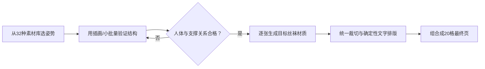

# 丝袜系统历史实测

## 姿势匹配流程实测｜2026-07-30

> [!success] 流程结论
> 已连续完成两页、共 24 个“服饰设计×姿势”组合。写实商品目录页适合验证最终视觉差异；复杂坐姿、地面姿势和躺姿更适合先用时装插画建立姿势母版，再逐张生成最终丝袜商品图。==不要在同一次 20 格生成中同时追求复杂姿势、精确丝袜材质和精确中文长说明。==

### 第 1 轮｜12 款写实商品目录

![[姿势匹配流程实测-01-12款商品目录.png|800]]

#### 输入组合

| 编号 | 服饰设计 | 姿势 | 验证目标 |
|---|---|---|---|
| 001 | 奶茶色哑光中厚款 | S01 正面平行 | 基础色与稳定基准 |
| 002 | 烟灰均匀款 | S02 单腿承重 | 商务感与重心变化 |
| 003 | 藏蓝功能分区款 | S03 大步行走 | 动态下的功能线 |
| 004 | 酒红柔和丝光款 | S04 回身错步 | 斜向受光 |
| 005 | 黑色细密竖纹 | S05 脚尖交叉 | 纵向纹理连续性 |
| 006 | 银灰珠光款 | S06 侧向跨步 | 侧面高光 |
| 007 | 黑灰菱形几何纹 | S07 台步定格 | 大图案拉伸 |
| 008 | 樱粉白色小圆点 | S08 轻踢回勾 | 动态可爱风格 |
| 009 | 咖啡粗细罗纹 | C01 高凳端坐 | 坐姿中的针织纹理 |
| 010 | 黑色规则小波点 | C04 脚踝轻叠 | 小图案与交叠 |
| 011 | 深紫至浅紫渐变 | C08 双腿延伸 | 长距离渐变 |
| 012 | 墨绿几何功能线 | P06 箱旁迈步 | 道具与科技结构 |

#### 实际提示词

```text
生成“腿部服饰设计×姿势匹配｜12款流程实测”的高级秋冬服装商品目录。
采用4列×3行、12个等大卡片；统一暖米白摄影棚和柔和棚拍光。

每格是一位成年、完全着装、无面孔的服装目录模特，
穿长度到膝盖附近的秋冬上衣、不同设计的腿部服饰和匹配鞋款。
相邻格的动作、颜色、厚度、纹理至少两项不同。

按输入组合表生成001–012。
标签只写三位编号和短名称，不增加长说明。

严格保持每格两条腿、两个膝盖、两个小腿、两个脚踝、
两只脚和两只鞋；鞋与脚准确连接，坐具和道具接触自然。
避免重复姿势、重复服饰、全部黑色、仅轻微换色、肢体融合、
关节反折、文字乱码、编号错误、水印和品牌标志。
```

#### 验收结果

| 检查项 | 结果 | 观察 |
|---|---|---|
| 4×3 与 12 格 | 通过 | 网格完整 |
| 编号与中文短名称 | 通过 | 001–012 连续且可读 |
| 姿势差异 | 通过 | 站立、行走、交叉、坐姿和道具互动均可辨 |
| 颜色与图案差异 | 通过 | 纯色、罗纹、波点、菱形、渐变和功能线可辨 |
| 人体与鞋子结构 | 通过 | 未见明显多肢、融合腿或鞋脚分离 |
| 丝袜材质精度 | 部分通过 | 更接近秋冬打底裤商品目录，超薄与肤感没有覆盖 |

### 第 2 轮｜12 款创意姿势母版

![[姿势匹配流程实测-02-12款创意姿势.png|800]]

> [!info] 实验编号说明
> 图片生成时使用了 101–112 临时编号。为避免与第二阶段正式效果编号 101–200 冲突，文档统一将这 12 个姿势记为 E101–E112；图片中的原始标签仅作为实验记录保留。

#### 姿势覆盖

| 编号   | 姿势    | 服饰设计   |
| ---- | ----- | ------ |
| E101 | 高凳悬脚  | 古铜细罗纹  |
| E102 | 长椅侧坐  | 酒红哑光   |
| E103 | 台阶错层  | 藏蓝厚款   |
| E104 | 窗台前探  | 银灰珠光   |
| E105 | 地毯侧坐  | 墨绿菱形纹  |
| E106 | 地面抬膝  | 咖啡针织   |
| E107 | 贵妃榻侧卧 | 黑色后缝线  |
| E108 | 沙发屈膝  | 深灰压力分区 |
| E109 | 软垫半躺  | 奶茶纯色   |
| E110 | 脚凳抬腿  | 紫色渐变   |
| E111 | 靠墙高低腿 | 黑白棋盘纹  |
| E112 | 低梯回身  | 樱粉波点   |

#### 实际提示词

```text
绘制“腿部服饰设计×创意姿势｜12款流程实测”的时装设计参考板。
采用4列×3行；暖米白纸张背景；高级时装手册彩色线稿与轻柔平涂。

每格是一位成年、完全着装、无面孔的时装人体模型，
使用高凳、长椅、台阶、窗台、地毯、矮台、贵妃榻、
沙发、软垫、脚凳、墙面或低梯形成不同腿部构图。

按姿势覆盖表生成 E101–E112；每格的动作、道具、
腿部服饰颜色和纹理均不重复。

严格保持两条腿、两个膝盖、两个脚踝、两只脚和两只鞋；
支撑关系和关节方向正确。避免肢体融合、家具穿模、
重复姿势、编号错误、乱码、水印和品牌标志。
```

#### 验收结果

| 检查项 | 结果 | 观察 |
|---|---|---|
| 4×3 与 12 格 | 通过 | 网格完整 |
| 编号与中文短名称 | 通过 | 原图 101–112 连续且可读；文档重命名为 E101–E112 |
| 创意姿势覆盖 | 通过 | 坐、倚、侧卧、半躺、抬腿和高低腿均已覆盖 |
| 人体支撑关系 | 通过 | 动作关系清楚，适合作为姿势参考 |
| 腿部服饰差异 | 部分通过 | 配色和图案可辨，部分厚款更像紧身裤 |
| 最终商品图可用性 | 需二次生成 | 本页是姿势母版，不直接作为最终丝袜成品 |

### 实测后确定的正式流程



1. 先给每款丝袜分配姿势编号，不让相邻产品重复动作。
2. 复杂坐姿和躺姿先生成姿势母版，确认腿部前后关系与支撑点。
3. 最终丝袜材质按单张或 4–8 格小批量生成，避免姿势与材质互相稀释。
4. 编号、名称和说明使用后期排版工具叠加，不依赖图像模型生成长文本。
5. 最后统一背景、比例、裁切和色彩，再拼成 5×4 的正式目录页。

### Gemini 网页实测

**测试页面**：[Gemini 会话](https://gemini.google.com/app/cb40d210dee61ad7)
**测试模式**：Gemini Flash
**操作方式**：在现有 Chrome 登录态中提交第 1 轮 12 格提示词，等待生成完成后打开图片灯箱并导出结果。

![[Gemini网页实测-12款姿势匹配.png|800]]

> [!note] 文件来源
> Gemini 页面成功生成图片，但“下载完整尺寸”按钮未向 Chrome 自动化接口或系统下载目录返回文件，“复制图片”也未提供剪贴板数据。因此当前附件是从 Gemini 图片灯箱中裁出的无界面预览，尺寸为 908×680；它足以用于流程和构图验收，但不是 Gemini 原始完整分辨率文件。

#### 网页操作流程

1. 打开指定 Gemini 会话，确认 Google 账号已登录。
2. 检查当前模式为 `Flash`，输入框和图片下载控件可用。
3. 提交“12 款写实商品目录”完整提示词。
4. 以“正在创建您的图片”作为生成中状态，以出现新的 AI 图片和下载按钮作为完成状态。
5. 打开最新生成图片的灯箱，目视检查网格、编号、文字、动作和人体结构。
6. 尝试“下载完整尺寸”和“复制图片”；无法取得原始文件时，保存灯箱无界面预览。
7. 将结果写回本笔记，并与 Codex 内置 `imagegen` 结果对比。

#### Gemini 结果验收

| 检查项 | 结果 | 观察 |
|---|---|---|
| 4×3 与 12 格 | 通过 | 网格完整、边距统一 |
| 编号 001–012 | 通过 | 连续、无重复、无跳号 |
| 中文短名称 | 通过 | 12 项均准确可读 |
| 颜色差异 | 通过 | 奶茶、烟灰、藏蓝、酒红、银灰、樱粉、紫色和墨绿可辨 |
| 纹理与图案 | 通过 | 竖纹、菱形、波点、针织、渐变和功能线可辨 |
| 姿势丰富度 | 通过 | 覆盖站立、行走、交叉、回勾、高凳和椅子坐姿 |
| 指定动作还原 | 部分通过 | 002 更像抬腿，007 更像正面站立，部分动作被简化 |
| 人体与鞋子结构 | 通过 | 未见明显多肢、融合腿、反折关节或鞋脚分离 |
| 原图下载 | 未通过 | 下载事件未返回，系统下载目录无文件 |

#### 与 Codex 内置生成的对比

| 维度 | Gemini 网页 | Codex 内置 `imagegen` |
|---|---|---|
| 中文编号与短名称 | 更稳定，001–012 全部正确 | 本轮同样正确 |
| 目录整齐度 | 较高，卡片边界统一 | 较高，画面细节更丰富 |
| 姿势执行 | 能产生多姿势，但会简化部分指定动作 | 动作区分更明显 |
| 材质细节 | 清楚但偏秋冬打底裤 | 珠光、渐变和纹理表现更细 |
| 复杂姿势 | 适合先做小批量测试 | 复杂躺姿仍建议使用插画母版 |
| 自动化交付 | 网页生成可跑通，原图下载链路不稳定 | 生成文件可直接落入知识库 |

> [!success] Gemini 流程结论
> Gemini 网页端可以走通“提交提示词 → 生成图片 → 灯箱验收”的核心流程，且中文短标签表现稳定。若用于正式批量生产，应把单页规模控制在 8–12 格，并把“精确姿势”和“完整尺寸自动下载”列为单独复核项。

## 两种商品目录版式｜提示词与实测

### 版式选型

| 版式 | 核心画面 | 最适合展示 | 优势 | 主要风险 |
|---|---|---|---|---|
| A：纯背景站姿目录 | 暖白棚拍、统一站姿、从服装下摆到鞋尖 | 网眼、条纹、编织、镂空、立体结构 | 变量少，纹理对比最直接，适合做“技术型图鉴” | 画面容易单一；复杂站姿会破坏纹理连续性 |
| B：室内坐姿场景目录 | 米色客厅、沙发或单椅、自然坐姿 | 颜色、透明度、肤感、雾面与微光泽 | 更接近穿搭内容和电商场景，氛围高级 | 光线、家具和腿部重叠会影响色彩比较；更容易触发生成限制 |

> [!tip] 选择公式
> **看结构用 A，看颜色与穿搭氛围用 B。** 同一页只保留一个背景系统和一个镜头高度；姿势变化服务于产品特征，不为了“丰富”而随机换动作。

### 参考版式

#### A｜纯背景站姿目录

![[版式参考A-纯背景站姿目录.png|800]]

结构公式：

```text
总标题＋页码/主题＋一句使用说明
+ 5列×4行等宽卡片
+ 统一暖白背景、统一鞋款、统一镜头和裁切
+ 每格“商品图约75%＋编号＋名称＋一句短卖点”
+ 20款主要差异只来自纹理与编织结构
```

#### B｜室内坐姿场景目录

![[版式参考B-室内坐姿场景目录.png|800]]

结构公式：

```text
总标题＋页码/主题＋一句使用说明
+ 5列×4行等宽卡片
+ 统一米色室内、暖窗光、沙发/单椅
+ 每格“坐姿穿搭图＋编号＋名称＋一句短卖点”
+ 20款主要差异来自颜色、透度、雾面或微光泽
```

### 版式 A 完整提示词

```text
生成一张中文高级商品目录海报，竖版，严格5列×4行，共20个独立卡片。
标题：丝袜上腿效果图鉴｜系列化效果库。
副标题：版式A实测：纹理与编织结构（041–060）。
说明：按编号连续展示，统一版式，便于横向比较。

这是专业腿部服饰商品目录。每格只展示一位明确成年、完全着装、
无面孔的服装目录模特，从服装下摆到鞋尖的完整双腿，搭配统一黑色尖头鞋。
使用暖白色无缝摄影棚背景、柔和正面商品光，统一镜头高度、裁切、
腿部比例和鞋款。姿势仅做轻微变化：双腿平行、自然错步、轻微交叉、
单腿承重；不要夸张扭转。

从左到右、从上到下依次为：
041微网格、042中网格、043大网格、044菱形网、045六边形网；
046条纹编织、047竖纹修腿、048横纹设计、049波浪纹、050人字纹；
051麻花纹、052罗纹、053针织纹、054蜂窝结构、055镂空编织；
056 3D立体织纹、057浮雕纹理、058珠链纹、059金丝编织、060银丝编织。
每种纹理必须明显不同、连续覆盖、左右一致、贴合腿型，不要漂移或断裂。

每格下方保留象牙白信息区：粗体三位编号、中文名称、一句极短卖点。
字体深咖啡色，细白分隔线，整体规整、克制、真实商业摄影、高清。

避免：未成年人、裸露、多腿、多脚、融合腿、双重膝盖、断裂脚踝、
鞋脚分离、裁掉鞋尖、重复编号、缺格、合并卡片、文字乱码、纹理跨格。
```

#### A 版实测成品

![[版式A实测-纹理与编织结构-041-060.png|800]]

| 检查项 | 结果 | 记录 |
|---|---|---|
| 5×4 与 20 格 | 通过 | 卡片尺寸和分隔统一 |
| 041–060 连续编号 | 通过 | 无缺号、跳号或重复 |
| 纹理可区分 | 通过 | 网格、条纹、波浪、编织和金银丝层次明显 |
| 镜头与裁切统一 | 通过 | 全部为正面站姿商品视角 |
| 人体与鞋子结构 | 通过 | 未见明显多肢、融合腿或鞋脚分离 |
| 中文标签 | 通过 | 编号、名称和短卖点均可读 |
| 姿势丰富度 | 有意受限 | 适合结构比较，不适合承担内容账号的全部视觉变化 |

### 版式 B 完整提示词

```text
生成一张中文高级服装配饰色卡海报，竖版，严格5列×4行，共20个独立卡片。
标题：腿部服饰色彩搭配图鉴｜系列化效果库。
副标题：版式B实测：基础色系与材质（001–020）。
说明：按编号连续展示，统一场景，便于颜色比较。

每格展示一位明确成年、完全着装的无面孔服装陈列模特，
穿端庄及膝裙、不同颜色的连裤袜与尖头鞋，坐在米白色沙发或单椅上。
场景为高级感极简米色精品店：浅色地毯、奶油色窗帘、少量金属边几、
柔和窗光。统一镜头高度、裁切、家具色温和人物比例。
坐姿采用双腿并拢斜放、膝部轻叠、脚踝交叠、前后错步、单脚略前伸，
动作自然克制，不做大幅交叉和极端扭转。

从左到右、从上到下依次为：
001黑色超薄、002墨黑半透、003黑色中透、004黑色微亮、005自然肤色；
006浅肤色、007暖肤色、008冷肤色、009象牙白、010奶油白；
011雾灰色、012浅灰色、013深灰色、014烟灰色、015咖啡色；
016可可色、017巧克力色、018酒红色、019豆沙粉、020香槟肤色。
颜色、透明层次、雾面或微光泽差异必须清晰。

每格下方为象牙白信息区：粗体三位编号、中文色名、极短材质卖点。
深咖啡色字体、细白网格、轻微圆角，温暖、干净、真实商业摄影、高清。

严格要求20格和001–020连续编号。避免多肢、融合腿、断裂脚踝、
鞋脚分离、裁掉鞋尖、重复编号、缺格、合并卡片、乱码和颜色串格。
```

#### B 版实测成品

![[版式B实测-基础色系与材质-001-020.png|800]]

| 检查项 | 结果 | 记录 |
|---|---|---|
| 5×4 与 20 格 | 通过 | 圆角卡片和信息区完整 |
| 001–020 连续编号 | 通过 | 无缺号、跳号或重复 |
| 色彩与材质梯度 | 通过 | 黑色透度、肤色、灰色及彩色组均可区分 |
| 场景与光线统一 | 通过 | 米色客厅、暖窗光和鞋款基本一致 |
| 坐姿变化 | 通过 | 以交叠、斜放和前伸为主，保持目录可比性 |
| 人体与鞋子结构 | 通过 | 未见明显多肢、断裂或鞋脚分离 |
| 中文标签 | 通过 | 20组编号、名称和短说明均可读 |

> [!warning] B 版生成限制
> “真人坐姿＋腿部局部商品图”的前两次输出被图像安全系统拦截。将主体改写为**成年、完全着装、端庄及膝裙、百货商店服装陈列语义**后成功。实际跨平台使用时应避免“短裙＋局部腿部特写＋真人写实”集中出现；若仍被拦截，可先生成完整穿搭场景，再后期裁切成目录卡片。

### 两版跑通结论

1. **A 版适合作为主目录模板**：纹理准确、比较效率高，优先用于 041–060、101–120 等结构型页面。
2. **B 版适合作为内容传播模板**：更像小红书/电商穿搭色卡，优先用于 001–020 基础色与肤感页面。
3. 不建议把 20 格中的姿势全部做成不同动作；同页保持 3–5 个动作母版循环，商品差异才不会被姿势噪声淹没。
4. 正式批量生产采用“两步法”：先生成无文字或仅编号的卡片底图，再由 Figma、Canva、Photoshop 或脚本叠加确定性名称与卖点。
5. 两种版式已各完成一次生成、保存、内嵌与目视验收，可直接作为后续页面的提示词模板。

## 第 1 页实测提示词

```text
生成“丝袜上腿效果图鉴”第1页“基础色系与肤感 001–020”。
竖版4:5，暖白背景，顶部标题，下方严格5列×4行等大卡片。
每格展示一位成年女性从短裙下方到鞋尖的完整双腿，
统一自然站姿、棚拍光和镜头高度；标签只写三位编号与短名称。

按顺序生成：
001经典黑色、002纯白色、003裸肤色、004奶茶色、005咖啡色、
006深灰色、007烟灰色、008银灰色、009酒红色、010深紫色、
011藏蓝色、012宝石蓝、013墨绿色、014橄榄绿、015玫红色、
016樱花粉、017香槟金、018古铜色、019彩虹渐变、020冰透肤色。

相邻颜色明显不同；017有浅金珠光，018为暖铜感，
019为可见七彩纵向渐变，020近乎隐形并保留细纤维高光。
编号连续准确，不增加长说明。

避免畸形腿、多余肢体、腿部扭曲、鞋子畸形、重复款式、
仅轻微换色、编号错误、中文乱码、文字重叠、模糊、水印和品牌标志。
```

## 实测验收记录

| 检查项 | 结果 | 备注 |
|---|---|---|
| 5×4 网格与 20 格 | 通过 | 排列完整 |
| 编号 001–020 | 通过 | 连续、无重复、无跳号 |
| 中文短名称 | 通过 | 20 项均可读 |
| 人体与鞋子结构 | 通过 | 未见明显多肢或断裂 |
| 32 种姿势素材库 | 通过 | 4 类素材板已生成；躺姿类使用时装设计插画 |
| 基础色差异 | 通过 | 001–020 可快速区分 |
| 长说明 | 未测试 | 主动移出图片，降低乱码风险 |
| 100 种全套 | 待继续 | 已跑通第 1 页，其余按同一流程逐页生成 |

> [!tip] 后期排版建议
> 如果最终交付必须包含“一行说明”，先生成无长说明的 20 格底图，再用 Figma、Photoshop、Canva 或脚本叠加确定性文字。这样可以把图像模型负责的视觉生成与排版工具负责的精确文字分开。

## 关联

- [[丝袜效果图生成系统]]
- [[提示词库]]
- [[验收与失败修复规范]]
