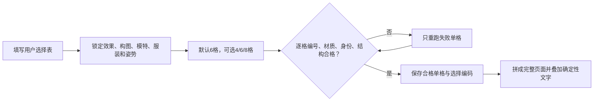
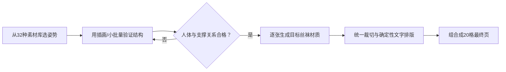

# 丝袜效果图生成系统｜完整效果索引与历史记录

> [!important] 当前统一入口
> 本笔记只保留 001–200 效果索引、姿势素材和历史实测；后续生产先进入 [[丝袜效果图生成系统]]，不要直接从长提示词开始。

## 系统导航

- [[丝袜效果图生成系统]]：快速开始、两类图库、生成简报、提示词、案例与验收
- [[丝袜效果图生成系统-MOC#核心术语|核心术语与文件结构]]

> [!success] 当前生产规则
> 默认每批 6 张，可选 4/6/8 张；12 张及以上必须拆成多个 4–6 张批次。只使用成年女性，禁止男性；最终图片只显示腹部及以下至鞋尖；同批姿势必须有变化。

> [!important] 完整成品规则
> 图片模型输出的无文字图片只是中间素材。正式成品必须在验收后确定性加入主标题、副标题、页面说明、连续编号、单格名称、单格说明和页脚信息，并同时保留无文字原图。

> [!success] 实测结论
> 已使用 Codex 内置 `imagegen` 跑通第 1 页（001–020）。20 个编号连续、中文短标签可读、颜色差异明显，腿部和鞋子结构稳定。对于 5×4 的密集图鉴，==图片内只保留“编号＋短名称”比同时生成长说明更可靠==；完整说明应放在图片外的笔记或后期排版中。

## 成品样张

![[丝袜上腿效果图鉴-第1页-001-020.png|800]]

## 项目拆分

| 页码 | 编号 | 主题 | 主要验收点 |
|---|---|---|---|
| 第 1 页 | 001–020 | 基础色系与肤感 | 相邻色差、肤感、渐变 |
| 第 2 页 | 021–040 | 透明度与厚度 | 5D–120D 阶梯、透明/不透明边界 |
| 第 3 页 | 041–060 | 纹理与编织结构 | 网孔、条纹、针织、浮雕可辨 |
| 第 4 页 | 061–080 | 图案与艺术设计 | 图案题材与覆盖方式不重复 |
| 第 5 页 | 081–100 | 材质、功能与场景 | 反光方式、压力区、功能结构 |

## 用户可选择生成系统

> [!success] 系统原则
> 使用者依次选择：**页面分类 → 核心效果 → 辅助效果 → 构图 → 模特 → 服装 → 姿势 → 光线/场景 → 输出用途**。每款只能使用 1 个核心效果和最多 1 个辅助效果；默认先生成 6 格，可选 4/6/8 格，逐格验收后再拼成正式页面。12 格及以上必须拆成多个 4–6 格批次。

### 商品变量与展示变量

| 层级 | 包含内容 | 是否改变商品设计 |
|---|---|---|
| 商品变量 | 颜色、厚度、透明度、纹理、图案、光泽、结构、功能 | 是 |
| 展示变量 | 模特、服装、姿势、鞋履、场景、镜头、构图、输出比例 | 否 |

禁止用换模特、换背景或换裙子冒充新的丝袜效果。

### 可复制选择表

```text
页面：{PAGE-01～PAGE-10，或扩展页代码}
核心效果：{E-001～E-200，只选1项}
辅助效果：{A-NONE或一个辅助效果}
构图：{T01～T04 / L01～L04 / E01～E04 / S01～S04}
模特：{M01～M08，同页循环2～4位}
服装：{O01～O16}
姿势：{S01～S08 / C01～C08 / L01～L08 / P01～P08}
光线：{正面柔光 / 侧窗光 / 轮廓光 / 金属冷光 / 胶片暖光}
输出：{商品目录 / 完整Look / 小红书拼贴 / 竖屏封面 / 课程案例}
平台：{Gemini / ChatGPT / 即梦 / 豆包}
批次：{4～8格}
```

编码示例：

```text
PAGE-01 + E-017 + A-珠光 + T02 + M02 + O03 + S02
+ 侧向柔光 + 商品目录 + Gemini + 6格
```

### 页面分类

| 页面 | 分类 | 核心内容 |
|---|---|---|
| PAGE-01 | 基础色系与肤感 | 颜色、肤感、基础渐变 |
| PAGE-02 | 透明度与厚度 | 5D–120D、透明与遮盖 |
| PAGE-03 | 纹理与编织 | 网格、条纹、针织、浮雕 |
| PAGE-04 | 图案与艺术 | 印花、蕾丝、艺术主题 |
| PAGE-05 | 材质与场景 | 光泽、功能、场景表现 |
| PAGE-06 | 边缘与拼接结构 | 袜口、脚尖、后跟、拼接 |
| PAGE-07 | 染色与色彩工艺 | 渐变、扎染、偏光、分区 |
| PAGE-08 | 视觉错觉 | 修饰结构、空间图形、数字视觉 |
| PAGE-09 | 文化与装饰艺术 | 文化纹样与艺术流派 |
| PAGE-10 | 专业功能 | 医疗概念、运动、户外、智能 |
| EXT-SEASON | 季节气候 | 春夏轻薄、秋冬保暖、雨雪与温差 |
| EXT-SHOES | 鞋履适配 | 高跟、乐福、靴、凉鞋、运动鞋 |
| EXT-OCCASION | 穿搭场合 | 通勤、约会、宴会、旅行、舞台 |
| EXT-FESTIVAL | 节日营销 | 新年、情人节、婚礼季、派对 |
| EXT-FIBER | 纤维工艺 | 真丝、再生纤维、功能纱线、编织工艺 |
| EXT-FIT | 肤色腿型适配 | 不同肤色、身高、腿型和视觉修饰 |

### 辅助效果

推荐代码：`A-NONE`、`A-雾面`、`A-微亮`、`A-珠光`、`A-半透`、`A-高透`、`A-轻压缩`、`A-细闪`。辅助效果只负责修饰，不能覆盖核心效果；同一商品禁止叠加两个以上辅助效果。

## 16 种构图风格库

### 技术目录｜T01–T04

![[D01-技术目录构图-v2.png|800]]

| 编号 | 构图 | 推荐效果 | 镜头、风险与提示词 |
|---|---|---|---|
| T01 | 正面白棚 | 色彩、厚度、对称纹理 | 暖白无缝棚拍，正面平行站姿，镜头水平，居中对称；容易机械 |
| T02 | 三分之四棚拍 | 光泽、渐变、立体结构 | 浅灰渐变背景，三分之四视角，自然错步；后腿不能被遮挡 |
| T03 | 纹理近景分屏 | 编织、纤维、细图案 | 左侧完整商品主体，右侧两个面料微距窗；不适合纯色页 |
| T04 | 前后对比卡 | 后缝、拼接、脚跟 | 同一模特正面与背面并排，统一比例和光线；防止身份漂移 |

### 生活方式｜L01–L04

![[D02-生活方式构图-v2.png|800]]

| 编号  | 构图    | 推荐效果     | 镜头、风险与提示词              |
| --- | ----- | -------- | ---------------------- |
| L01 | 暖色沙发  | 肤色、花纹、珠光 | 奶油沙发与暖窗光，双腿并拢斜放；注意腿部重叠 |
| L02 | 窗边单椅  | 透度、真丝光泽  | 米色单椅、柔和侧窗光、脚踝轻叠；避免高光过曝 |
| L03 | 极简卧室  | 肤感、柔软针织  | 床尾凳中景、双脚前后错开、大面积柔和留白   |
| L04 | 通勤休息区 | 商务、压力、通勤 | 现代长凳端坐、建筑纵线克制；背景不能切过腿部 |

### 时装编辑｜E01–E04

![[D03-时装编辑构图-v2.png|800]]

| 编号 | 构图 | 推荐效果 | 镜头、风险与提示词 |
|---|---|---|---|
| E01 | 极简雕塑棚 | 高级纯色、浮雕 | 暖白雕塑空间和弧形几何台；道具不能遮腿 |
| E02 | 单色高级时装 | 黑灰、商务、金属 | 深灰背景、三分之四站姿、侧轮廓光；暗部不能吞纹理 |
| E03 | 未来金属空间 | 镭射、智能、发光 | 银灰几何空间、冷色边缘光；避免反射污染商品颜色 |
| E04 | 复古胶片视觉 | 酒红、复古纹样 | 暖棕走廊、轻胶片颗粒；不用于精确基础色对比 |

### 电商社媒｜S01–S04

![[D04-电商社媒构图-v2.png|800]]

| 编号 | 构图 | 推荐用途 | 镜头、留白与提示词 |
|---|---|---|---|
| S01 | 电商白底详情页 | 商品详情 | 白底完整Look，右侧两个材质细节窗；文字后期叠加 |
| S02 | 小红书拼贴 | 图文笔记 | 完整Look、腿部细节和鞋履近景，顶部预留标题 |
| S03 | 竖屏视频封面 | 抖音/视频号 | 9:16中心人物，上方标题留白、下方字幕安全区 |
| S04 | Look＋腿部细节 | 素材包/课程 | 左侧完整Look，右侧腿部与织物微距，统一色调 |

## 固定模特身份库

> [!warning] 商用边界
> 以下均为本流程生成的虚构 AI 人物，不指向真人或名人。它们是“可商用候选资产”，不能替代对生成平台条款和销售平台规则的复核。

![[模特总览-M01-M08-东亚欧美.png|800]]

> [!info] 身份范围
> 固定模特库只使用两类虚构成年女性身份：**东亚与欧美**。选择时重点比较身高比例、整体体型、大腿曲线、小腿轮廓和脚踝特点。

| 编号 | 身份与定位 | 身体特点 | 腿型特点 | 兼容风格 |
|---|---|---|---|---|
| M01 | 东亚｜冷调极简｜28岁 | 高挑偏纤细、冷白肤色 | 腿长比例高、线条笔直、小腿纤细 | 极简、编辑、修身 |
| M02 | 东亚｜暖调通勤｜30岁 | 中等偏高、健康匀称、暖肤色 | 大小腿比例均衡、膝线自然 | 通勤、生活、修身 |
| M03 | 东亚｜清雅知性｜32岁 | 中等身高、自然匀称、中性浅暖肤色 | 自然直腿、小腿轮廓柔和、脚踝适中 | 法式、学院灵感、轻熟、生活 |
| M04 | 欧美｜高挑编辑｜31岁 | 高挑纤细、浅肤色 | 长腿型、膝位较高、小腿修长 | 编辑、晚宴、复古 |
| M05 | 欧美｜曲线优雅｜34岁 | 中等偏高、自然曲线、暖调浅肤色 | 大腿较饱满、小腿流畅收窄 | 优雅、修身、晚宴 |
| M06 | 欧美｜都市匀称｜29岁 | 中等偏高、健康匀称、中性浅肤色 | 大小腿均衡、小腿紧致、脚踝纤细 | 商务、都市、学院灵感 |
| M07 | 东亚｜轻盈甜美｜27岁 | 小个子、柔和曲线、浅暖肤色 | 腿长适中、膝线柔和、小腿略圆润 | 可爱、学院灵感、芭蕾 |
| M08 | 东亚｜成熟商务｜42岁 | 中等身高、成熟匀称、中性肤色 | 自然腿型、比例稳健、小腿线条克制 | 商务、通勤、高级修身 |

![[模特身份卡-M01-冷调极简.png|400]] ![[模特身份卡-M02-暖调通勤.png|400]]
![[模特身份卡-M03-清雅知性.png|400]] ![[模特身份卡-M04-高挑编辑.png|400]]
![[模特身份卡-M05-欧美曲线优雅.png|400]] ![[模特身份卡-M06-欧美都市匀称.png|400]]
![[模特身份卡-M07-轻盈甜美.png|400]] ![[模特身份卡-M08-成熟商务.png|400]]

统一约束：

- 视觉年龄 25–45 岁，提示词必须写“成年”和具体年龄。
- 使用虚构 AI 身份；身份类型只选东亚或欧美；禁止名人、网红、真人复刻、品牌和校徽。
- 同一批次上传对应身份卡，锁定面部、肤色、发型、年龄和体型。
- 商品目录默认无脸裁切或完整全身；社媒图可以露脸，但身份必须固定。
- 同页循环 2–4 位模特，不能每格随机换人。
- 肤色、身高与腿型保持健康、自然、美观，不作病理化描述。

## 16 种服装风格库

服装属于展示变量，不改变丝袜效果编号。同一对比页只使用 1–2 种服装轮廓。

![[D05-服装风格-v2.png|800]]

| 编号 | 风格 | 核心服装 | 推荐用途 |
|---|---|---|---|
| O01 | 极简 | 直线及膝连衣裙 | 技术目录、基础色 |
| O02 | 商务 | 西装＋及膝铅笔裙 | 通勤、商务、功能款 |
| O03 | 修身包臀 | 合体及膝包臀裙或包臀连衣裙 | 光泽、晚宴、成熟穿搭 |
| O04 | 日常轻熟 | 针织上衣＋A字中裙 | 生活方式、肤感 |

![[D05-服装风格-v2.png|800]]

| 编号 | 风格 | 核心服装 | 推荐用途 |
|---|---|---|---|
| O05 | 成年学院灵感 | 短西装、衬衫、领结、端庄百褶裙 | JK灵感、格纹、乐福鞋 |
| O06 | 甜美可爱 | 奶油针织、蝴蝶结A字裙、玛丽珍鞋 | 粉色、小图案、可爱风 |
| O07 | 法式优雅 | 针织开衫、及膝伞裙 | 珠光、复古、生活方式 |
| O08 | 韩系通勤 | 短外套、直筒裙、简洁高跟鞋 | 小红书、通勤色卡 |

![[服装速查-个性时装-O09-O12.png|800]]

| 编号 | 风格 | 核心服装 | 推荐用途 |
|---|---|---|---|
| O09 | 复古 | 格纹及膝裙、细腰带 | 胶片、文化纹样 |
| O10 | 时装编辑 | 不对称设计裙、雕塑剪裁 | 高级材质、艺术效果 |
| O11 | 朋克 | 短夹克、格纹裙、金属细节 | 网格、金属、涂鸦 |
| O12 | 成年哥特甜酷 | 高领蕾丝裙、克制荷叶边 | 黑色蕾丝、月亮、巴洛克 |

![[服装速查-场景主题-O13-O16.png|800]]

| 编号 | 风格 | 核心服装 | 推荐用途 |
|---|---|---|---|
| O13 | 运动机能 | 功能运动裙、运动鞋 | 压缩、户外、智能 |
| O14 | 芭蕾灵感 | 交叠针织、及膝薄纱裙 | 浅色、婚礼、珠光 |
| O15 | 晚宴鸡尾酒 | 优雅及膝修身裙、尖头鞋 | 酒红、真丝、亮面 |
| O16 | 未来科技 | 结构感银灰裙、科技鞋 | 镭射、发光、电路 |

> [!important] 性感与学院风边界
> 可以使用修身包臀、晚宴、甜美和学院灵感穿搭，但必须明确成年、完全着装、商业时装表达。O05 不使用真实学校名称、校徽、学生身份或未成年描述；O03 不搭配过度暴露服装、挑逗姿势或局部私密构图。

## 自动组装提示词

```text
用途：{输出用途}。平台：{平台}。本轮生成{4/6/8}格小批量，默认6格；12格及以上自动拆批。

页面与商品：
页面分类：{PAGE代码与名称}
每格严格选择1个核心效果：{E编号＋必须出现的视觉特征}
辅助效果：{A-NONE或一个A代码}
不得增加第二个辅助效果，不得用换背景或换模特冒充商品差异。

固定人物：
使用{M编号列表，共2–4位}循环；上传对应身份卡作为人物参考。
锁定成年年龄、面部、肤色、发型、体型和腿型。

展示选择：
构图：{构图编号＋完整提示词}
服装：{O编号＋服装结构}
姿势：{姿势编号＋控制词}
光线：{光线}；场景：{场景}；鞋款：同批次统一并完整可见。

默认生成6格，可选4/6/8格，不直接生成20格；12格及以上拆成多个4–6格批次。图片内只保留效果编号和短名称；
长说明后期叠加。明确成年、完全着装、非挑逗性的商业时装表达。
禁止真人复刻、品牌校徽、多肢、融合腿、鞋脚分离、纹理漂浮、
编号错误、文字乱码、水印和无关人物。
```

### 案例 A｜技术目录

```text
PAGE-01 + E-001/E-003/E-007/E-009/E-017/E-020
+ A-NONE（E-017使用A-珠光）
+ T01/T02 + M01/M02 + O01 + S01/S02
+ 正面柔光 + 商品目录 + Gemini + 6格
```

![[选择器实测-技术目录-6格.png|800]]

### 案例 B｜生活方式

```text
PAGE-04/05 + E-061/E-066/E-072/E-081/E-082/E-099
+ A-雾面/A-半透/A-NONE
+ L01/L02 + M02/M07 + O03/O05 + C01/C04
+ 暖窗光 + 完整Look + Gemini + 6格
```

![[选择器实测-生活方式-6格.png|800]]


## 模特姿势选择案例

> [!tip] 选择原则
> 姿势素材库用于组合，而不是让整页重复一种站姿。每个丝袜设计先根据材质、图案和使用场景选择动作；同页可以使用 4–8 种姿势，但相邻格不重复动作，且复杂坐姿、躺姿应单独生成后再参与排版。

### 32 种姿势素材库

#### 01｜站立与行走

![[腿部服饰姿势素材库-01-站立与行走.png|800]]

| 编号 | 姿势 | 示例腿部服饰 | 推荐用途 |
|---|---|---|---|
| S01 | 正面平行 | 奶茶色纯色 | 透明度、厚度基准 |
| S02 | 单腿承重 | 烟灰半透 | 商务、基础色 |
| S03 | 大步行走 | 藏蓝厚款 | 运动、秋冬 |
| S04 | 回身错步 | 酒红纯色 | 光泽、渐变 |
| S05 | 脚尖交叉 | 黑色竖纹 | 后缝线、纵向纹理 |
| S06 | 侧向跨步 | 银灰珠光 | 金属、珠光 |
| S07 | 台步定格 | 黑色菱形纹 | 网格、几何图案 |
| S08 | 轻踢回勾 | 樱花粉纯色 | 可爱、舞台风格 |

#### 02｜椅凳与台阶坐姿

![[腿部服饰姿势素材库-02-椅凳与台阶坐姿.png|800]]

| 编号 | 姿势 | 示例腿部服饰 | 推荐用途 |
|---|---|---|---|
| C01 | 高凳端坐 | 咖啡色厚款 | 厚度、商务 |
| C02 | 椅边伸腿 | 深灰罗纹 | 竖纹、修腿 |
| C03 | 侧坐斜腿 | 酒红纯色 | 色彩、光泽 |
| C04 | 脚踝轻叠 | 黑色波点 | 小图案 |
| C05 | 台阶高低腿 | 藏蓝厚款 | 运动、压力袜 |
| C06 | 长凳转向坐 | 墨绿罗纹 | 编织、秋冬 |
| C07 | 单腿前探 | 银灰罗纹 | 金属、纹理 |
| C08 | 双腿延伸 | 紫色渐变 | 渐变、温变 |

#### 03｜沙发与地面构图

![[腿部服饰姿势素材库-03-沙发与地面构图.png|800]]

| 编号  | 姿势    | 示例腿部服饰 | 推荐用途    |
| --- | ----- | ------ | ------- |
| L01 | 贵妃榻侧卧 | 黑色细罗纹  | 纵向纹理、光泽 |
| L02 | 沙发屈膝  | 深灰厚款   | 厚度、弹性   |
| L03 | 半躺伸腿  | 奶茶色纯色  | 肤感、自然色  |
| L04 | 脚凳抬腿  | 藏蓝厚款   | 压力分区、运动 |
| L05 | 地毯侧坐  | 酒红罗纹   | 色彩、针织   |
| L06 | 倚靠屈腿  | 墨绿纯色   | 秋冬、功能款  |
| L07 | 横向休息  | 银灰几何纹  | 大图案、金属感 |
| L08 | 抬膝构图  | 紫色渐变   | 温变、渐变   |

> [!info] 生成形式
> 真人摄影版的躺姿连续触发图像安全拦截，因此本分类采用“服装设计师姿态插画板”。它适合作为动作参考；正式商品图应逐张生成，并保持成年、完全着装和非挑逗性表达。

#### 04｜广告与道具互动

![[腿部服饰姿势素材库-04-广告与道具互动.png|800]]

| 编号 | 姿势 | 示例腿部服饰 | 推荐用途 |
|---|---|---|---|
| P01 | 靠墙屈膝 | 黑色竖纹 | 城市、朋克 |
| P02 | 扶栏侧跨 | 古铜色纯色 | 户外、金属 |
| P03 | 台阶回望 | 深紫厚款 | 秋冬、街头 |
| P04 | 展台倚坐 | 银灰纯色 | 科技、运动 |
| P05 | 长伞支撑 | 墨绿菱形纹 | 雨季、图案 |
| P06 | 箱旁迈步 | 藏蓝纯色 | 通勤、旅行 |
| P07 | 镜框交叉 | 酒红渐变 | 艺术、复古 |
| P08 | 长凳回勾 | 粉灰纯色 | 日系、可爱 |

### 姿势与丝袜设计匹配规则

| 丝袜特征 | 优先动作 | 原因 |
|---|---|---|
| 超薄、肤色、透明度 | S01、S02、C01 | 双腿受光和面积稳定，便于比较遮盖度 |
| 后缝线、竖纹、渐变 | S05、C02、C08、L03 | 腿部延展充分，连续线条不易中断 |
| 网格、印花、几何纹 | S07、C04、L07、P05 | 提供正面与斜面，能观察图案拉伸 |
| 珠光、金属、镭射 | S04、S06、C07、P04 | 角度变化产生可见高光差异 |
| 厚袜、加绒、针织 | S03、C05、C06、L02 | 屈膝和运动状态能体现厚度与弹性 |
| 压力、运动、功能分区 | S03、L04、P02、P06 | 动作能展示肌肉区和支撑线 |
| 婚礼、舞台、艺术图案 | S08、C03、L01、P07 | 构图更有叙事与广告感 |

### 组合提示词模板

```text
姿势编号：{从 S01–S08、C01–C08、L01–L08、P01–P08 选择}
姿势描述：{复制对应动作名称并补充腿部前后关系}
丝袜设计：{颜色＋透明度/厚度＋纹理/图案＋光泽}
鞋款：{与场景匹配的统一鞋款}
场景或道具：{无道具/椅凳/沙发软垫/广告道具}

让丝袜设计与动作形成明确匹配：
需要比较透明度时使用稳定正面姿势；
需要展示纹理时让腿部充分伸展；
需要展示光泽时使用斜向受光姿势；
需要展示功能结构时使用行走、屈膝或抬腿动作。

严格保持成年、完全着装、非挑逗性的商业服装目录表达。
两条腿、两个膝盖、两个小腿、两个脚踝、两只脚、两只鞋；
腿部前后关系真实，关节弯曲方向正确，鞋与脚准确连接。
```

### 基础姿势控制词

#### 01 双腿平行

- **动作说明**：双脚并排，膝盖朝正前方，左右腿均匀承重。
- **适用页面**：全部页面；尤其适合透明度、厚度和纹理对比。
- **提示词**：

```text
双腿平行自然站立，双脚间距约一个拳宽，膝盖和脚尖朝正前方，
左右腿均匀承重，两条腿从大腿到鞋尖完整可见。
```

- **风险与避免**：容易显得机械；避免双脚完全粘连或两腿融合。

#### 02 自然错步

- **动作说明**：一只脚向前约半个脚长，双腿保持分离，不发生交叉。
- **适用页面**：基础色、材质光泽和商务场景。
- **提示词**：

```text
自然错步站立，一只脚向前约半个脚长，另一只脚稳定支撑，
双腿不交叉，两个膝盖、两个脚踝和两只鞋均清楚可见。
```

- **风险与避免**：前后腿可能长度失衡；避免步幅过大和后脚被完全遮挡。

#### 03 轻微交叉

- **动作说明**：一只小腿自然置于另一只前方，交叉幅度小。
- **适用页面**：基础色、花纹、婚礼和洛丽塔风格。
- **提示词**：

```text
轻微交叉站姿，一只小腿自然置于另一只小腿前方，
仅在小腿下段轻度交叉，膝盖位置自然，双脚和双鞋完整可见。
```

- **风险与避免**：容易生成腿穿过腿；禁止大幅交叉和膝盖重叠。

#### 04 前后丁字步

- **动作说明**：前脚朝前，后脚略向外，双脚前后错开形成克制的丁字关系。
- **适用页面**：图案、艺术设计和舞台场景。
- **提示词**：

```text
前后丁字步站立，前脚朝正前方，后脚略向外并后撤半步，
双脚前后错开但不交叉，腿部轮廓和两只鞋完整清晰。
```

- **风险与避免**：鞋尖方向容易异常；避免后脚旋转过度或脚掌离地。

#### 05 单腿承重

- **动作说明**：重心落在一条腿，另一条腿放松并略微屈膝，两脚均着地。
- **适用页面**：光泽、渐变和功能分区展示。
- **提示词**：

```text
自然单腿承重站姿，支撑腿保持笔直，另一条腿放松并轻微屈膝，
两只脚都接触地面，骨盆以下姿态克制，双腿结构完整。
```

- **风险与避免**：容易出现腿长差异；禁止抬腿、翘脚或膝盖向内过度折叠。

#### 06 脚尖微外展

- **动作说明**：脚跟间距较小，两只脚尖分别轻微向外。
- **适用页面**：厚袜、针织、加绒和运动压缩款。
- **提示词**：

```text
脚尖微外展站姿，双腿基本平行，脚跟保持小间距，
两只脚尖分别向外旋转约10度，膝盖方向自然且两只鞋完整可见。
```

- **风险与避免**：容易形成夸张外八字；限制外展角度，不让膝盖反向扭转。

#### 07 脚踝轻交叠

- **动作说明**：两腿只在脚踝处轻轻交叠，膝盖和小腿主体不大幅交叉。
- **适用页面**：超薄、裸感、商务和婚礼丝袜。
- **提示词**：

```text
脚踝轻交叠站姿，两条腿保持自然笔直，只在脚踝位置轻轻交叠，
膝盖不重叠，小腿前后关系真实，两只鞋保持完整分离。
```

- **风险与避免**：脚踝和鞋容易融合；明确两只鞋分离且鞋跟各自连接脚掌。

#### 08 轻动态迈步

- **动作说明**：一只脚向前迈出很小一步，形成克制的行走瞬间。
- **适用页面**：镭射、温变、运动压缩和未来科技款。
- **提示词**：

```text
轻动态迈步姿势，一只脚自然向前迈出很小一步，另一只脚稳定支撑，
步幅克制，两条腿、两个膝盖、两个脚踝和两只鞋均完整可见。
```

- **风险与避免**：动态最容易导致肢体变形；每页最多使用 1–2 格，禁止大步、腾空或脚部运动模糊。

> [!warning] 复杂姿势的生成边界
> 坐姿、躺姿和道具互动可以使用，但不建议直接塞进 20 格批量页。先按单张或小型分类板生成，逐格检查腿部遮挡、肢体融合、膝盖错位、道具穿模和鞋脚分离，再进入最终排版。仍然避免大幅扭转、跳跃、跪姿和双脚腾空。

## 推荐流程



1. 先填写选择表，锁定页面、效果、构图、2–4 位模特、1–2 种服装和姿势范围。
2. 默认每次生成 6 格，可选 4/6/8 格；12 格及以上拆成多个 4–6 格批次。复杂坐姿、躺姿和道具互动可进一步缩小为单张。
3. 每款只使用一个核心效果和最多一个辅助效果。
4. 单格验收编号、商品差异、人物身份、人体结构和鞋履连接；只重跑失败项。
5. 合格单格拼成完整页面，编号、名称和卖点由排版工具确定性叠加。

## 通用提示词骨架

```text
用途：高级时尚产品目录图鉴。

任务：
生成《丝袜上腿效果图鉴｜系列化效果库》第{页码}页：
“{分类名称}（{起始编号}–{结束编号}）”。

画布与版式：
竖版4:5，暖白摄影棚背景；顶部显示总标题与当前页副标题；
当前阶段默认生成6个等大卡片，可选4/6/8；12个及以上拆成多个4–6格批次，验收后再拼成正式页面。
每格上方约80%为商品摄影，下方约20%为标签。
标签仅包含三位编号和简短中文名称。

人物约束：
每格只展示一位成年女性，最大裁切范围为腹部以下至鞋尖，可进一步裁到裙摆或腿部近景；禁止男性；
两条腿、两个膝盖、两个小腿、两个脚踝、两只脚、两只鞋；
姿势选择：
{从“模特姿势选择案例”复制一种姿势提示词}
同页使用4–8种姿势，相邻格不重复动作；
坐姿、躺姿和道具互动先单独生成并验收，再参与最终排版；
人体解剖自然，丝袜贴合皮肤；
不展示上半身，不暴露私密部位。

统一性：
统一镜头高度、裁切范围、背景、棚拍光和目录版式。

差异性：
相邻编号至少在主颜色、透明度、厚度、反光、纹理、
图案、覆盖范围或功能结构中的两项明显不同。

本页20项：
{逐项列出“编号 名称：可见特征”}

文字：
现代黑体；编号大且醒目，名称较小；
编号连续、无重复、无跳号，不添加其他文字。

避免：
畸形腿、多余腿、缺少腿、融合腿、双重膝盖、腿部扭曲、
脚踝断裂、鞋子畸形、丝袜像塑料、纹理漂浮、重复款式、
仅轻微换色、编号错误、中文乱码、文字重叠、模糊、水印、
品牌标志、复杂背景、无关人物。
```

## 完整效果素材库｜001–200

> [!abstract] 使用方法
> 每个编号都是一个可独立调用的商品视觉变量。“名称”用于图片标签，“必须出现的视觉特征”直接复制到分页面提示词。001–100 为基础款，101–200 为结构、工艺、文化与功能扩展款。

### 第 1 页｜基础色系与肤感（001–020）

| 编号 | 名称 | 必须出现的视觉特征 |
|---|---|---|
| 001 | 经典黑色 | 中性纯黑、均匀覆盖、保留自然皮肤透感 |
| 002 | 纯白色 | 干净中性白、无偏黄、织物边缘清楚 |
| 003 | 裸肤色 | 与肤色自然融合、低色差、无假肢感 |
| 004 | 奶茶色 | 柔和米棕色、暖调低饱和、日常通勤感 |
| 005 | 咖啡色 | 中深暖棕色、微透、色彩浓郁均匀 |
| 006 | 深灰色 | 炭灰色调、比黑色更柔和、低反光 |
| 007 | 烟灰色 | 带雾感的中灰色、透明度柔和 |
| 008 | 银灰色 | 冷灰底带细微银色反光、不过度金属化 |
| 009 | 酒红色 | 深红带棕紫底色、优雅而非鲜红 |
| 010 | 深紫色 | 茄紫或葡萄紫、暗部仍能识别紫色 |
| 011 | 藏蓝色 | 接近黑色的深蓝、亮部显出蓝调 |
| 012 | 宝石蓝 | 清晰高纯度蓝色、通透但不荧光 |
| 013 | 墨绿色 | 深沉冷绿色、暗部保留绿色层次 |
| 014 | 橄榄绿 | 低饱和黄绿色、自然军装色调 |
| 015 | 玫红色 | 高辨识度冷调玫红、颜色均匀 |
| 016 | 樱花粉 | 浅淡冷粉色、柔和轻盈、无荧光感 |
| 017 | 香槟金 | 浅金米色底、细微珠光、暖而克制 |
| 018 | 古铜色 | 暖棕铜色、细密金属微光、深浅有层次 |
| 019 | 彩虹渐变 | 红橙黄绿蓝紫沿腿部连续自然过渡 |
| 020 | 冰透肤色 | 极高透明度、冷感纤维高光、近乎隐形 |

**版式与动作建议**：优先使用版式 B。黑灰色组使用 C01、C03；浅肤色组使用 C02、C08；彩色与渐变使用 C04、S05，确保两腿受光一致。

**验收重点**：相邻色必须肉眼可分；肤色款不能像塑料皮肤；香槟金、古铜色与彩虹渐变不能退化成普通黄色、棕色或随机彩斑。

### 第 2 页｜透明度与厚度（021–040）

| 编号 | 名称 | 必须出现的视觉特征 |
|---|---|---|
| 021 | 5D空气透明 | 极薄近乎无感，只保留细微纤维反光 |
| 022 | 8D裸感 | 高透明、肤色清晰、织物存在感略强于5D |
| 023 | 10D轻薄 | 轻薄均匀、肤色明显、适合夏季视觉 |
| 024 | 15D日常 | 轻度遮盖、肤色仍清楚、通勤质感 |
| 025 | 20D经典 | 半透明基础款、颜色和肤色平衡 |
| 026 | 30D半透明 | 中度遮盖、膝部和小腿仍有透肤变化 |
| 027 | 40D均匀 | 覆盖更稳定、色面均匀、轻微透肤 |
| 028 | 60D微厚 | 明显遮盖、仅亮部保留少量透感 |
| 029 | 80D秋冬 | 接近不透明、细密平整、秋冬厚实感 |
| 030 | 120D保暖 | 高密度不透明、厚实柔软、无明显肤色 |
| 031 | 超透明玻璃感 | 高透明配窄幅明亮高光，表面清澈 |
| 032 | 半透明烟雾 | 透明层中有均匀柔雾，不出现斑驳 |
| 033 | 高密度黑 | 深黑不透、表面细密、轮廓利落 |
| 034 | 雾化渐变 | 从清透到雾面沿腿部连续变化 |
| 035 | 双层透明 | 两层薄纱叠加形成可辨的层次与边缘 |
| 036 | 内外双色 | 内层与外层颜色不同，拉伸处显出底色 |
| 037 | 光影变化 | 迎光处更透、背光处更深，过渡自然 |
| 038 | 阴影增强 | 腿侧和关节暗部加深，中央保持透亮 |
| 039 | 仿肤第二层 | 细腻均匀贴肤、弱化瑕疵但保留真实肤理 |
| 040 | 裸感隐形 | 颜色、接缝和袜口尽量不可见，只见轻微光泽 |

**版式与动作建议**：版式 A、B 均可，推荐 S01、S02、C01。021–030 必须使用同一模特、背景和曝光；035–038 使用斜侧光辅助显示层次。

**验收重点**：厚度变化必须是连续梯度，不能只换黑色深浅；双层、双色、玻璃感和雾化效果必须分别有结构或高光证据。

### 第 3 页｜纹理与编织结构（041–060）

| 编号 | 名称 | 必须出现的视觉特征 |
|---|---|---|
| 041 | 微网格 | 极细密规则网孔，远看接近薄纱 |
| 042 | 中网格 | 中等方形或菱形网孔，边界整齐 |
| 043 | 大网格 | 大尺寸网孔、线条粗细均匀、结构醒目 |
| 044 | 菱形网 | 连续标准菱形单元，纵向排列稳定 |
| 045 | 六边形网 | 蜂巢式六边形孔洞，节点清晰 |
| 046 | 条纹编织 | 细密平行织线连续覆盖双腿 |
| 047 | 竖纹修腿 | 从大腿到脚踝的连续纵向细条纹 |
| 048 | 横纹设计 | 间距统一的水平纹环绕腿部曲面 |
| 049 | 波浪纹 | 多条柔和曲线纵向延伸、节奏连续 |
| 050 | 人字纹 | 重复V形斜纹连接成人字结构 |
| 051 | 麻花纹 | 类针织绳索交叉、立体扭绞清楚 |
| 052 | 罗纹 | 细密纵向凹凸筋条、弹性质感 |
| 053 | 针织纹 | 可见细小线圈组织、柔软贴合 |
| 054 | 蜂窝结构 | 密集六角针织单元、具有轻微立体感 |
| 055 | 镂空编织 | 实体织纹与规则开放孔洞交替 |
| 056 | 3D立体织纹 | 纹理明显凸起并产生真实微阴影 |
| 057 | 浮雕纹理 | 同色花纹从底层微微隆起、边缘精细 |
| 058 | 珠链纹 | 连续小珠状节点沿纵向链条排列 |
| 059 | 金线编织 | 黑色底中织入细金线、暖金反光 |
| 060 | 银线编织 | 深色底中织入细银线、冷银闪光 |

**版式与动作建议**：优先使用版式 A。041–060 以 S01、S02、S05 为主，同页只循环 3–4 个站姿；不使用大幅交叉或蜷腿动作。

**验收重点**：纹理必须贴合腿部曲面并左右连续；网孔尺寸、条纹方向、针织组织和立体层次不能只靠名称区分。

### 第 4 页｜图案与艺术设计（061–080）

| 编号 | 名称 | 必须出现的视觉特征 |
|---|---|---|
| 061 | 黑色玫瑰印花 | 可辨识的黑玫瑰花朵与叶片重复布局 |
| 062 | 白色花卉 | 白色花瓣和枝叶覆盖透明底层 |
| 063 | 蝴蝶图案 | 大小不同的完整蝴蝶沿腿部错落排列 |
| 064 | 星星图案 | 五角星或闪耀星点形成清晰节奏 |
| 065 | 月亮图案 | 新月、满月与小星点组合，不与星空款重复 |
| 066 | 波点 | 大小统一的圆点规则排列 |
| 067 | 心形 | 小型心形图案重复分布、方向统一 |
| 068 | 几何图案 | 三角、圆和方形组成模块化抽象构图 |
| 069 | 建筑线条 | 建筑立面、窗格或城市轮廓的线性图案 |
| 070 | 艺术涂鸦 | 手绘线条、符号和色块形成街头画面 |
| 071 | 水墨纹 | 黑灰墨色自然晕散并保留大面积留白 |
| 072 | 蕾丝花纹 | 连续花卉蕾丝边和细密网底 |
| 073 | 巴洛克复古 | 对称卷草、金色装饰和浓郁深色底 |
| 074 | 欧式宫廷 | 徽章、花环、缎带与精细边框组合 |
| 075 | 日系可爱 | 小花、蝴蝶结或甜点元素的轻柔配色 |
| 076 | 朋克风 | 铆钉、锁链、撕裂线与黑红配色 |
| 077 | 朋克网格 | 不规则破损网格配金属连接细节 |
| 078 | 黑白棋盘 | 高对比方格连续贴合腿部曲面 |
| 079 | 动物纹 | 豹纹、斑马纹或蛇纹中选一种明确表达 |
| 080 | 星空银河 | 深蓝紫底、星云、星点和微光层次 |

**版式与动作建议**：小图案使用 A 版 S01、S07；大型叙事图案使用 B 版 C03、C08；星空、朋克和巴洛克可使用 S06 或 P07 强化氛围。

**验收重点**：图案不能漂浮到背景；左右腿避免机械复制；061–080 每款必须保留可识别的主题符号，而不是统一生成普通蕾丝。

### 第 5 页｜材质、功能与场景（081–100）

| 编号 | 名称 | 必须出现的视觉特征 |
|---|---|---|
| 081 | 真丝光泽 | 柔和连续的丝绸高光、细腻垂顺 |
| 082 | 珠光 | 分散细小珍珠微光、亮度克制 |
| 083 | 镜面亮光 | 窄而清晰的镜面反射带、表面平整 |
| 084 | 湿润光泽 | 柔亮水润反光，不出现真实液体滴落 |
| 085 | 漆皮感 | 高对比硬质亮面、深黑底和锐利高光 |
| 086 | 金属银 | 冷银金属色、反光随腿部曲面变化 |
| 087 | 金属金 | 暖金金属色、明暗层次稳定 |
| 088 | 镭射彩光 | 银色底随角度出现青紫粉虹彩 |
| 089 | 荧光 | 高饱和荧光色，在暗环境中仍醒目 |
| 090 | 温变 | 同一双腿上形成由温度触发的双色分区 |
| 091 | 塑形压力 | 腰腹、大腿和小腿有清晰渐进加压分区 |
| 092 | 提臀连裤 | 臀腿连接处有弧形支撑织带和提拉结构 |
| 093 | 防勾丝 | 高密度均匀织物配局部拉伸耐磨展示 |
| 094 | 加绒保暖 | 内层细绒在边缘或翻折处清楚可见 |
| 095 | 运动压缩 | 肌肉走向功能线、关节弹性区和透气区 |
| 096 | 舞台表演 | 强光下高辨识闪片或亮线、动作延展感 |
| 097 | 婚礼白纱 | 白色薄纱、细蕾丝和柔和珍珠光泽 |
| 098 | 洛丽塔风 | 蝴蝶结、荷叶边、小花纹和甜美配色 |
| 099 | 高级商务 | 低调黑灰棕、细腻半透、无夸张装饰 |
| 100 | 未来科技智能 | 发光线路、微型节点和规则数据纹样 |

**版式与动作建议**：081–090 使用 S04、S06、C04 展示反光；091–095 使用 S03、P02 展示结构；096–100 使用 P07、C08 或对应场景动作。

**验收重点**：亮面材质必须通过不同高光形态区分；功能款必须看到真实织物分区；舞台、婚礼、商务和未来科技不能只靠更换背景表达。

## 第二阶段扩展｜101–200

> [!abstract] 扩展目标
> 第二阶段不再增加普通纯色或已有材质的轻微变体，而是补充袜口、脚尖、后跟、拼接、染色工艺、视觉错觉、文化纹样和细分功能场景。仍按每页 20 种拆成 5 页，形成完整的 200 种效果库。

### 第 6 页｜袜口、脚尖与拼接结构（101–120）

| 编号 | 名称 | 必须出现的视觉特征 |
|---|---|---|
| 101 | 宽蕾丝袜口 | 大腿处宽幅花卉蕾丝边 |
| 102 | 硅胶防滑袜口 | 袜口内侧可见透明防滑条 |
| 103 | 双层罗纹袜口 | 两道不同宽度的弹性罗纹 |
| 104 | 波浪花边袜口 | 连续柔和波浪形边缘 |
| 105 | 后侧蝴蝶结袜口 | 大腿后侧单个清晰蝴蝶结 |
| 106 | 吊袜带连接款 | 袜口与腰部之间有明确吊带结构 |
| 107 | 仿吊袜带连裤袜 | 吊带图案直接织入裤袜表面 |
| 108 | 腰腿镂空连接款 | 腰线与大腿间用几何带连接 |
| 109 | 经典后缝线 | 从后跟到大腿的单条直线 |
| 110 | 双侧缝线 | 双腿外侧各有一条连续线 |
| 111 | 加固脚尖 | 脚趾区域颜色更深、织物更密 |
| 112 | 露趾设计 | 脚趾完全露出，边缘整齐 |
| 113 | 凉鞋隐形脚尖 | 脚趾处超薄无明显加固 |
| 114 | 加固后跟 | 后跟区域形成明确深色补强块 |
| 115 | 古巴跟 | 后跟处宽方形深色结构 |
| 116 | 法式尖跟 | 后跟深色区域向上形成尖角 |
| 117 | 九分无脚款 | 在脚踝处整齐结束，不包脚 |
| 118 | 踩脚款 | 脚底有窄带固定，脚跟与脚背露出 |
| 119 | 分趾结构 | 大脚趾与其他脚趾分仓包覆 |
| 120 | 不对称拼接 | 左右腿使用不同透明区和结构线 |

**姿势建议**：101–110 优先使用 S01、S05、C03；111–119 使用 S03、C02、P03 并确保鞋和脚部完整；120 使用 S01 正面平行，便于比较左右差异。

**验收重点**：袜口不能消失，后缝线必须连续，脚尖和后跟结构不能被鞋完全遮挡，吊带不能与腿部融合。

### 第 7 页｜染色、渐变与色彩工艺（121–140）

| 编号 | 名称 | 必须出现的视觉特征 |
|---|---|---|
| 121 | 黑红纵向渐变 | 黑色从大腿过渡为脚踝酒红 |
| 122 | 日落渐变 | 橙、粉、紫沿腿部连续过渡 |
| 123 | 海洋渐变 | 深蓝、青色、浅蓝分层变化 |
| 124 | 森林渐变 | 墨绿、苔绿、黄绿自然过渡 |
| 125 | 糖果双色 | 粉色与蓝色清晰柔和拼色 |
| 126 | 左右撞色 | 左腿和右腿使用互补色 |
| 127 | 色块拼接 | 大面积几何色块边界清楚 |
| 128 | 浸染脚踝 | 颜色从脚尖向小腿逐渐消退 |
| 129 | 扎染云纹 | 不规则旋涡状染色边缘 |
| 130 | 水彩晕染 | 多色透明水彩自然扩散 |
| 131 | 大理石染色 | 灰白底配流动石纹脉络 |
| 132 | 油膜虹彩 | 青紫金色像油膜一样变化 |
| 133 | 双色偏光 | 不同角度呈现两种主色 |
| 134 | 霓虹描边 | 腿部外轮廓有高饱和亮色边线 |
| 135 | 紫外显色 | 普通光与紫外光区域形成对照 |
| 136 | 反光渐变 | 从低反光逐步变为高反光 |
| 137 | 热力图配色 | 蓝绿黄红形成温度分区 |
| 138 | 云雾染色 | 灰白半透明云团分布 |
| 139 | 沙漠层染 | 米色、赭石、棕色水平分层 |
| 140 | 单色明度阶梯 | 同一色相从浅到深分段变化 |

**姿势建议**：纵向渐变使用 S01、C08；左右撞色使用 S01；偏光和反光使用 S04、S06；浸染和脚踝色彩使用 C02、P03。

**验收重点**：相邻款不得变成普通双色丝袜；必须区分连续渐变、硬边色块、云雾扩散、扎染旋涡和角度偏光。

### 第 8 页｜视觉错觉与空间图形（141–160）

| 编号 | 名称 | 必须出现的视觉特征 |
|---|---|---|
| 141 | 中央提亮修腿 | 腿部中央亮、两侧暗 |
| 142 | 侧边深色收窄 | 双腿外侧有连续深色面板 |
| 143 | 肌肉轮廓阴影 | 小腿肌肉区由深浅线条强调 |
| 144 | 假长靴效果 | 膝下深色、膝上透明，像穿长靴 |
| 145 | 假过膝袜效果 | 大腿中段形成清晰过膝袜边界 |
| 146 | 纹身第二皮肤 | 图案像贴合皮肤的精细纹身 |
| 147 | 悬浮丝带 | 多条丝带状图形环绕腿部 |
| 148 | 透明切割窗 | 实色面中有规则透明几何窗口 |
| 149 | 左右非对称透明 | 两腿透明区域位置完全不同 |
| 150 | 双重曝光 | 腿部内叠加建筑或自然轮廓 |
| 151 | 莫尔条纹 | 密集曲线产生干涉波纹 |
| 152 | 欧普波浪 | 黑白波浪制造膨胀与收缩错觉 |
| 153 | 像素方块 | 清晰大中小像素块逐渐变化 |
| 154 | 数字故障 | 彩色错位条与断裂扫描块 |
| 155 | 复古扫描线 | 细密水平线覆盖腿部 |
| 156 | 全息网格 | 发光透视网格贴合腿部曲面 |
| 157 | 等高线地图 | 连续地形等高线环绕双腿 |
| 158 | 解剖线稿 | 抽象肌肉与骨骼线条图案 |
| 159 | 透视棋盘 | 方格随腿部曲面产生透视变化 |
| 160 | 镜像对称图形 | 左右腿图案严格镜像对应 |

**姿势建议**：141–145 使用 S01、S02；146–150 使用 C08、L03；151–160 使用 S01、S07，避免大幅交叉破坏图形连续性。

**验收重点**：视觉错觉必须贴合腿部曲面而非漂浮在画面上；左右对称、连续线和透明窗口边缘必须清楚。

### 第 9 页｜文化纹样与装饰艺术（161–180）

| 编号 | 名称 | 必须出现的视觉特征 |
|---|---|---|
| 161 | 中式云锦 | 金线云纹与复杂锦缎结构 |
| 162 | 青花瓷纹 | 白底配钴蓝花草纹样 |
| 163 | 敦煌飞天纹 | 飘带、祥云与敦煌配色 |
| 164 | 水墨山水 | 山峦、云雾与留白构图 |
| 165 | 雷纹回字 | 连续方折回纹边框 |
| 166 | 凤凰纹 | 完整凤凰羽翼与尾羽 |
| 167 | 仙鹤祥云 | 白鹤与云纹分区布局 |
| 168 | 荷花水波 | 荷花、荷叶与水纹 |
| 169 | 牡丹卷草 | 大型牡丹和连续藤蔓 |
| 170 | 竹叶书法 | 墨竹与小面积书法笔触 |
| 171 | 日式青海波 | 重复扇形海浪纹 |
| 172 | 浮世绘浪花 | 高对比蓝白巨浪图案 |
| 173 | Art Deco | 金黑放射线与阶梯几何 |
| 174 | Bauhaus | 红黄蓝基础几何色块 |
| 175 | 彩色玻璃 | 深色边框分隔高饱和彩色块 |
| 176 | 马赛克 | 细小彩色方片拼接图案 |
| 177 | 凯尔特结 | 连续无断点的编织结纹 |
| 178 | 阿拉伯几何 | 高密度星形与多边形拼花 |
| 179 | 维多利亚浮雕 | 椭圆徽章、卷草和蕾丝边框 |
| 180 | 赛博电路 | 发光线路、节点和数据纹样 |

**姿势建议**：大型叙事图案使用 S01、C03、C08；连续几何纹使用 S07；金线和玻璃效果使用 S04、S06、P07。

**验收重点**：文化纹样不得退化成普通花纹；青花、敦煌、Art Deco、Bauhaus 和彩色玻璃必须在配色与构图上明显不同。

### 第 10 页｜专业功能与应用场景（181–200）

| 编号 | 名称 | 必须出现的视觉特征 |
|---|---|---|
| 181 | 医疗梯度压力 | 从脚踝向上递减的压力分区 |
| 182 | 长途飞行压力 | 小腿环形支撑线与旅行场景 |
| 183 | 术后恢复款 | 柔和肤色、高密度均匀包覆 |
| 184 | 久站职业款 | 小腿和足弓重点支撑区 |
| 185 | 跑步压缩款 | 肌肉走向功能线和反光条 |
| 186 | 骑行分区款 | 膝部弹性区与小腿导流线 |
| 187 | 瑜伽伸展款 | 高弹无缝结构和关节伸展区 |
| 188 | 芭蕾转换袜 | 脚底可开合的转换结构 |
| 189 | 滑冰保暖款 | 加绒、脚踝加固和冰场配色 |
| 190 | 户外徒步款 | 耐磨脚尖、后跟和小腿支撑 |
| 191 | 防泼水雨季款 | 表面水珠滚落、织物保持干燥 |
| 192 | 防晒冰感款 | 浅色冷感纤维与紫外防护图示 |
| 193 | 驱蚊户外款 | 户外绿色系与微胶囊纤维示意 |
| 194 | 吸湿速干款 | 汗液扩散路径和透气分区 |
| 195 | 抗菌除味款 | 银离子纤维和足部重点区域 |
| 196 | 防静电工作款 | 导电纤维线与静电释放图示 |
| 197 | 夜跑反光款 | 黑色底配高亮反光条 |
| 198 | 节庆发光款 | 可控彩色光点和节日图形 |
| 199 | 舞台快拆款 | 可拆接缝、暗扣和分段结构 |
| 200 | 智能传感款 | 压力、温度与运动传感节点 |

**姿势建议**：医疗和职业款使用 S01、C01；运动款使用 S03、S08、P02；户外款使用 P03、P06；智能与发光款使用 S06、P07。

**验收重点**：功能必须通过结构分区、纤维或场景表达，不能只添加文字图标；医疗效果只作为产品视觉概念，不写治疗承诺。

### 101–200 生成顺序

| 优先级 | 页面 | 原因 |
|---|---|---|
| 1 | 第 6 页｜结构细节 | 最容易验证脚尖、后跟和袜口是否真正不同 |
| 2 | 第 7 页｜染色工艺 | 可测试模型区分连续渐变与硬边拼色的能力 |
| 3 | 第 8 页｜视觉错觉 | 需要更严格的曲面贴合和图形连续性 |
| 4 | 第 9 页｜文化纹样 | 细节密度高，建议拆成 4–8 格小批量 |
| 5 | 第 10 页｜专业功能 | 需要道具、场景和功能结构共同表达 |

### 扩展页通用约束

```text
本页20款不得与001–100中的基础色、普通网格、普通花纹或普通亮面重复。
每款至少具备一个独有结构特征和一个独有视觉特征。

先按4–8格小批量生成单品素材，再拼成5列×4行目录页。
相邻格不重复姿势；复杂坐姿和场景姿势先通过姿势母版验收。

袜口、脚尖、后跟、透明窗口、结构线和功能区必须真实贴合腿部，
不得漂浮、断裂、穿模或被鞋和服装完全遮挡。

文化纹样必须保留各自典型构图和配色，不能统一退化成普通蕾丝。
功能款必须通过织物结构和使用场景表达，不依赖图片内长文字说明。
```

## 姿势匹配流程实测｜2026-07-30

> [!success] 流程结论
> 已连续完成两页、共 24 个“服饰设计×姿势”组合。写实商品目录页适合验证最终视觉差异；复杂坐姿、地面姿势和躺姿更适合先用时装插画建立姿势母版，再逐张生成最终丝袜商品图。==不要在同一次 20 格生成中同时追求复杂姿势、精确丝袜材质和精确中文长说明。==

### 第 1 轮｜12 款写实商品目录

![[姿势匹配流程实测-01-12款商品目录.png|800]]

#### 输入组合

| 编号 | 服饰设计 | 姿势 | 验证目标 |
|---|---|---|---|
| 001 | 奶茶色哑光中厚款 | S01 正面平行 | 基础色与稳定基准 |
| 002 | 烟灰均匀款 | S02 单腿承重 | 商务感与重心变化 |
| 003 | 藏蓝功能分区款 | S03 大步行走 | 动态下的功能线 |
| 004 | 酒红柔和丝光款 | S04 回身错步 | 斜向受光 |
| 005 | 黑色细密竖纹 | S05 脚尖交叉 | 纵向纹理连续性 |
| 006 | 银灰珠光款 | S06 侧向跨步 | 侧面高光 |
| 007 | 黑灰菱形几何纹 | S07 台步定格 | 大图案拉伸 |
| 008 | 樱粉白色小圆点 | S08 轻踢回勾 | 动态可爱风格 |
| 009 | 咖啡粗细罗纹 | C01 高凳端坐 | 坐姿中的针织纹理 |
| 010 | 黑色规则小波点 | C04 脚踝轻叠 | 小图案与交叠 |
| 011 | 深紫至浅紫渐变 | C08 双腿延伸 | 长距离渐变 |
| 012 | 墨绿几何功能线 | P06 箱旁迈步 | 道具与科技结构 |

#### 实际提示词

```text
生成“腿部服饰设计×姿势匹配｜12款流程实测”的高级秋冬服装商品目录。
采用4列×3行、12个等大卡片；统一暖米白摄影棚和柔和棚拍光。

每格是一位成年、完全着装、无面孔的服装目录模特，
穿长度到膝盖附近的秋冬上衣、不同设计的腿部服饰和匹配鞋款。
相邻格的动作、颜色、厚度、纹理至少两项不同。

按输入组合表生成001–012。
标签只写三位编号和短名称，不增加长说明。

严格保持每格两条腿、两个膝盖、两个小腿、两个脚踝、
两只脚和两只鞋；鞋与脚准确连接，坐具和道具接触自然。
避免重复姿势、重复服饰、全部黑色、仅轻微换色、肢体融合、
关节反折、文字乱码、编号错误、水印和品牌标志。
```

#### 验收结果

| 检查项 | 结果 | 观察 |
|---|---|---|
| 4×3 与 12 格 | 通过 | 网格完整 |
| 编号与中文短名称 | 通过 | 001–012 连续且可读 |
| 姿势差异 | 通过 | 站立、行走、交叉、坐姿和道具互动均可辨 |
| 颜色与图案差异 | 通过 | 纯色、罗纹、波点、菱形、渐变和功能线可辨 |
| 人体与鞋子结构 | 通过 | 未见明显多肢、融合腿或鞋脚分离 |
| 丝袜材质精度 | 部分通过 | 更接近秋冬打底裤商品目录，超薄与肤感没有覆盖 |

### 第 2 轮｜12 款创意姿势母版

![[姿势匹配流程实测-02-12款创意姿势.png|800]]

> [!info] 实验编号说明
> 图片生成时使用了 101–112 临时编号。为避免与第二阶段正式效果编号 101–200 冲突，文档统一将这 12 个姿势记为 E101–E112；图片中的原始标签仅作为实验记录保留。

#### 姿势覆盖

| 编号   | 姿势    | 服饰设计   |
| ---- | ----- | ------ |
| E101 | 高凳悬脚  | 古铜细罗纹  |
| E102 | 长椅侧坐  | 酒红哑光   |
| E103 | 台阶错层  | 藏蓝厚款   |
| E104 | 窗台前探  | 银灰珠光   |
| E105 | 地毯侧坐  | 墨绿菱形纹  |
| E106 | 地面抬膝  | 咖啡针织   |
| E107 | 贵妃榻侧卧 | 黑色后缝线  |
| E108 | 沙发屈膝  | 深灰压力分区 |
| E109 | 软垫半躺  | 奶茶纯色   |
| E110 | 脚凳抬腿  | 紫色渐变   |
| E111 | 靠墙高低腿 | 黑白棋盘纹  |
| E112 | 低梯回身  | 樱粉波点   |

#### 实际提示词

```text
绘制“腿部服饰设计×创意姿势｜12款流程实测”的时装设计参考板。
采用4列×3行；暖米白纸张背景；高级时装手册彩色线稿与轻柔平涂。

每格是一位成年、完全着装、无面孔的时装人体模型，
使用高凳、长椅、台阶、窗台、地毯、矮台、贵妃榻、
沙发、软垫、脚凳、墙面或低梯形成不同腿部构图。

按姿势覆盖表生成 E101–E112；每格的动作、道具、
腿部服饰颜色和纹理均不重复。

严格保持两条腿、两个膝盖、两个脚踝、两只脚和两只鞋；
支撑关系和关节方向正确。避免肢体融合、家具穿模、
重复姿势、编号错误、乱码、水印和品牌标志。
```

#### 验收结果

| 检查项 | 结果 | 观察 |
|---|---|---|
| 4×3 与 12 格 | 通过 | 网格完整 |
| 编号与中文短名称 | 通过 | 原图 101–112 连续且可读；文档重命名为 E101–E112 |
| 创意姿势覆盖 | 通过 | 坐、倚、侧卧、半躺、抬腿和高低腿均已覆盖 |
| 人体支撑关系 | 通过 | 动作关系清楚，适合作为姿势参考 |
| 腿部服饰差异 | 部分通过 | 配色和图案可辨，部分厚款更像紧身裤 |
| 最终商品图可用性 | 需二次生成 | 本页是姿势母版，不直接作为最终丝袜成品 |

### 实测后确定的正式流程



1. 先给每款丝袜分配姿势编号，不让相邻产品重复动作。
2. 复杂坐姿和躺姿先生成姿势母版，确认腿部前后关系与支撑点。
3. 最终丝袜材质按单张或 4–8 格小批量生成，避免姿势与材质互相稀释。
4. 编号、名称和说明使用后期排版工具叠加，不依赖图像模型生成长文本。
5. 最后统一背景、比例、裁切和色彩，再拼成 5×4 的正式目录页。

### Gemini 网页实测

**测试页面**：[Gemini 会话](https://gemini.google.com/app/cb40d210dee61ad7)  
**测试模式**：Gemini Flash  
**操作方式**：在现有 Chrome 登录态中提交第 1 轮 12 格提示词，等待生成完成后打开图片灯箱并导出结果。

![[Gemini网页实测-12款姿势匹配.png|800]]

> [!note] 文件来源
> Gemini 页面成功生成图片，但“下载完整尺寸”按钮未向 Chrome 自动化接口或系统下载目录返回文件，“复制图片”也未提供剪贴板数据。因此当前附件是从 Gemini 图片灯箱中裁出的无界面预览，尺寸为 908×680；它足以用于流程和构图验收，但不是 Gemini 原始完整分辨率文件。

#### 网页操作流程

1. 打开指定 Gemini 会话，确认 Google 账号已登录。
2. 检查当前模式为 `Flash`，输入框和图片下载控件可用。
3. 提交“12 款写实商品目录”完整提示词。
4. 以“正在创建您的图片”作为生成中状态，以出现新的 AI 图片和下载按钮作为完成状态。
5. 打开最新生成图片的灯箱，目视检查网格、编号、文字、动作和人体结构。
6. 尝试“下载完整尺寸”和“复制图片”；无法取得原始文件时，保存灯箱无界面预览。
7. 将结果写回本笔记，并与 Codex 内置 `imagegen` 结果对比。

#### Gemini 结果验收

| 检查项 | 结果 | 观察 |
|---|---|---|
| 4×3 与 12 格 | 通过 | 网格完整、边距统一 |
| 编号 001–012 | 通过 | 连续、无重复、无跳号 |
| 中文短名称 | 通过 | 12 项均准确可读 |
| 颜色差异 | 通过 | 奶茶、烟灰、藏蓝、酒红、银灰、樱粉、紫色和墨绿可辨 |
| 纹理与图案 | 通过 | 竖纹、菱形、波点、针织、渐变和功能线可辨 |
| 姿势丰富度 | 通过 | 覆盖站立、行走、交叉、回勾、高凳和椅子坐姿 |
| 指定动作还原 | 部分通过 | 002 更像抬腿，007 更像正面站立，部分动作被简化 |
| 人体与鞋子结构 | 通过 | 未见明显多肢、融合腿、反折关节或鞋脚分离 |
| 原图下载 | 未通过 | 下载事件未返回，系统下载目录无文件 |

#### 与 Codex 内置生成的对比

| 维度 | Gemini 网页 | Codex 内置 `imagegen` |
|---|---|---|
| 中文编号与短名称 | 更稳定，001–012 全部正确 | 本轮同样正确 |
| 目录整齐度 | 较高，卡片边界统一 | 较高，画面细节更丰富 |
| 姿势执行 | 能产生多姿势，但会简化部分指定动作 | 动作区分更明显 |
| 材质细节 | 清楚但偏秋冬打底裤 | 珠光、渐变和纹理表现更细 |
| 复杂姿势 | 适合先做小批量测试 | 复杂躺姿仍建议使用插画母版 |
| 自动化交付 | 网页生成可跑通，原图下载链路不稳定 | 生成文件可直接落入知识库 |

> [!success] Gemini 流程结论
> Gemini 网页端可以走通“提交提示词 → 生成图片 → 灯箱验收”的核心流程，且中文短标签表现稳定。若用于正式批量生产，应把单页规模控制在 8–12 格，并把“精确姿势”和“完整尺寸自动下载”列为单独复核项。

## 两种商品目录版式｜提示词与实测

### 版式选型

| 版式 | 核心画面 | 最适合展示 | 优势 | 主要风险 |
|---|---|---|---|---|
| A：纯背景站姿目录 | 暖白棚拍、统一站姿、从服装下摆到鞋尖 | 网眼、条纹、编织、镂空、立体结构 | 变量少，纹理对比最直接，适合做“技术型图鉴” | 画面容易单一；复杂站姿会破坏纹理连续性 |
| B：室内坐姿场景目录 | 米色客厅、沙发或单椅、自然坐姿 | 颜色、透明度、肤感、雾面与微光泽 | 更接近穿搭内容和电商场景，氛围高级 | 光线、家具和腿部重叠会影响色彩比较；更容易触发生成限制 |

> [!tip] 选择公式
> **看结构用 A，看颜色与穿搭氛围用 B。** 同一页只保留一个背景系统和一个镜头高度；姿势变化服务于产品特征，不为了“丰富”而随机换动作。

### 参考版式

#### A｜纯背景站姿目录

![[版式参考A-纯背景站姿目录.png|800]]

结构公式：

```text
总标题＋页码/主题＋一句使用说明
+ 5列×4行等宽卡片
+ 统一暖白背景、统一鞋款、统一镜头和裁切
+ 每格“商品图约75%＋编号＋名称＋一句短卖点”
+ 20款主要差异只来自纹理与编织结构
```

#### B｜室内坐姿场景目录

![[版式参考B-室内坐姿场景目录.png|800]]

结构公式：

```text
总标题＋页码/主题＋一句使用说明
+ 5列×4行等宽卡片
+ 统一米色室内、暖窗光、沙发/单椅
+ 每格“坐姿穿搭图＋编号＋名称＋一句短卖点”
+ 20款主要差异来自颜色、透度、雾面或微光泽
```

### 版式 A 完整提示词

```text
生成一张中文高级商品目录海报，竖版，严格5列×4行，共20个独立卡片。
标题：丝袜上腿效果图鉴｜系列化效果库。
副标题：版式A实测：纹理与编织结构（041–060）。
说明：按编号连续展示，统一版式，便于横向比较。

这是专业腿部服饰商品目录。每格只展示一位明确成年、完全着装、
无面孔的服装目录模特，从服装下摆到鞋尖的完整双腿，搭配统一黑色尖头鞋。
使用暖白色无缝摄影棚背景、柔和正面商品光，统一镜头高度、裁切、
腿部比例和鞋款。姿势仅做轻微变化：双腿平行、自然错步、轻微交叉、
单腿承重；不要夸张扭转。

从左到右、从上到下依次为：
041微网格、042中网格、043大网格、044菱形网、045六边形网；
046条纹编织、047竖纹修腿、048横纹设计、049波浪纹、050人字纹；
051麻花纹、052罗纹、053针织纹、054蜂窝结构、055镂空编织；
056 3D立体织纹、057浮雕纹理、058珠链纹、059金丝编织、060银丝编织。
每种纹理必须明显不同、连续覆盖、左右一致、贴合腿型，不要漂移或断裂。

每格下方保留象牙白信息区：粗体三位编号、中文名称、一句极短卖点。
字体深咖啡色，细白分隔线，整体规整、克制、真实商业摄影、高清。

避免：未成年人、裸露、多腿、多脚、融合腿、双重膝盖、断裂脚踝、
鞋脚分离、裁掉鞋尖、重复编号、缺格、合并卡片、文字乱码、纹理跨格。
```

#### A 版实测成品

![[版式A实测-纹理与编织结构-041-060.png|800]]

| 检查项 | 结果 | 记录 |
|---|---|---|
| 5×4 与 20 格 | 通过 | 卡片尺寸和分隔统一 |
| 041–060 连续编号 | 通过 | 无缺号、跳号或重复 |
| 纹理可区分 | 通过 | 网格、条纹、波浪、编织和金银丝层次明显 |
| 镜头与裁切统一 | 通过 | 全部为正面站姿商品视角 |
| 人体与鞋子结构 | 通过 | 未见明显多肢、融合腿或鞋脚分离 |
| 中文标签 | 通过 | 编号、名称和短卖点均可读 |
| 姿势丰富度 | 有意受限 | 适合结构比较，不适合承担内容账号的全部视觉变化 |

### 版式 B 完整提示词

```text
生成一张中文高级服装配饰色卡海报，竖版，严格5列×4行，共20个独立卡片。
标题：腿部服饰色彩搭配图鉴｜系列化效果库。
副标题：版式B实测：基础色系与材质（001–020）。
说明：按编号连续展示，统一场景，便于颜色比较。

每格展示一位明确成年、完全着装的无面孔服装陈列模特，
穿端庄及膝裙、不同颜色的连裤袜与尖头鞋，坐在米白色沙发或单椅上。
场景为高级感极简米色精品店：浅色地毯、奶油色窗帘、少量金属边几、
柔和窗光。统一镜头高度、裁切、家具色温和人物比例。
坐姿采用双腿并拢斜放、膝部轻叠、脚踝交叠、前后错步、单脚略前伸，
动作自然克制，不做大幅交叉和极端扭转。

从左到右、从上到下依次为：
001黑色超薄、002墨黑半透、003黑色中透、004黑色微亮、005自然肤色；
006浅肤色、007暖肤色、008冷肤色、009象牙白、010奶油白；
011雾灰色、012浅灰色、013深灰色、014烟灰色、015咖啡色；
016可可色、017巧克力色、018酒红色、019豆沙粉、020香槟肤色。
颜色、透明层次、雾面或微光泽差异必须清晰。

每格下方为象牙白信息区：粗体三位编号、中文色名、极短材质卖点。
深咖啡色字体、细白网格、轻微圆角，温暖、干净、真实商业摄影、高清。

严格要求20格和001–020连续编号。避免多肢、融合腿、断裂脚踝、
鞋脚分离、裁掉鞋尖、重复编号、缺格、合并卡片、乱码和颜色串格。
```

#### B 版实测成品

![[版式B实测-基础色系与材质-001-020.png|800]]

| 检查项 | 结果 | 记录 |
|---|---|---|
| 5×4 与 20 格 | 通过 | 圆角卡片和信息区完整 |
| 001–020 连续编号 | 通过 | 无缺号、跳号或重复 |
| 色彩与材质梯度 | 通过 | 黑色透度、肤色、灰色及彩色组均可区分 |
| 场景与光线统一 | 通过 | 米色客厅、暖窗光和鞋款基本一致 |
| 坐姿变化 | 通过 | 以交叠、斜放和前伸为主，保持目录可比性 |
| 人体与鞋子结构 | 通过 | 未见明显多肢、断裂或鞋脚分离 |
| 中文标签 | 通过 | 20组编号、名称和短说明均可读 |

> [!warning] B 版生成限制
> “真人坐姿＋腿部局部商品图”的前两次输出被图像安全系统拦截。将主体改写为**成年、完全着装、端庄及膝裙、百货商店服装陈列语义**后成功。实际跨平台使用时应避免“短裙＋局部腿部特写＋真人写实”集中出现；若仍被拦截，可先生成完整穿搭场景，再后期裁切成目录卡片。

### 两版跑通结论

1. **A 版适合作为主目录模板**：纹理准确、比较效率高，优先用于 041–060、101–120 等结构型页面。
2. **B 版适合作为内容传播模板**：更像小红书/电商穿搭色卡，优先用于 001–020 基础色与肤感页面。
3. 不建议把 20 格中的姿势全部做成不同动作；同页保持 3–5 个动作母版循环，商品差异才不会被姿势噪声淹没。
4. 正式批量生产采用“两步法”：先生成无文字或仅编号的卡片底图，再由 Figma、Canva、Photoshop 或脚本叠加确定性名称与卖点。
5. 两种版式已各完成一次生成、保存、内嵌与目视验收，可直接作为后续页面的提示词模板。

## 第 1 页实测提示词

```text
生成“丝袜上腿效果图鉴”第1页“基础色系与肤感 001–020”。
竖版4:5，暖白背景，顶部标题，下方严格5列×4行等大卡片。
每格展示一位成年女性从短裙下方到鞋尖的完整双腿，
统一自然站姿、棚拍光和镜头高度；标签只写三位编号与短名称。

按顺序生成：
001经典黑色、002纯白色、003裸肤色、004奶茶色、005咖啡色、
006深灰色、007烟灰色、008银灰色、009酒红色、010深紫色、
011藏蓝色、012宝石蓝、013墨绿色、014橄榄绿、015玫红色、
016樱花粉、017香槟金、018古铜色、019彩虹渐变、020冰透肤色。

相邻颜色明显不同；017有浅金珠光，018为暖铜感，
019为可见七彩纵向渐变，020近乎隐形并保留细纤维高光。
编号连续准确，不增加长说明。

避免畸形腿、多余肢体、腿部扭曲、鞋子畸形、重复款式、
仅轻微换色、编号错误、中文乱码、文字重叠、模糊、水印和品牌标志。
```

## 实测验收记录

| 检查项 | 结果 | 备注 |
|---|---|---|
| 5×4 网格与 20 格 | 通过 | 排列完整 |
| 编号 001–020 | 通过 | 连续、无重复、无跳号 |
| 中文短名称 | 通过 | 20 项均可读 |
| 人体与鞋子结构 | 通过 | 未见明显多肢或断裂 |
| 32 种姿势素材库 | 通过 | 4 类素材板已生成；躺姿类使用时装设计插画 |
| 基础色差异 | 通过 | 001–020 可快速区分 |
| 长说明 | 未测试 | 主动移出图片，降低乱码风险 |
| 100 种全套 | 待继续 | 已跑通第 1 页，其余按同一流程逐页生成 |

> [!tip] 后期排版建议
> 如果最终交付必须包含“一行说明”，先生成无长说明的 20 格底图，再用 Figma、Photoshop、Canva 或脚本叠加确定性文字。这样可以把图像模型负责的视觉生成与排版工具负责的精确文字分开。

## 关联

- [[丝袜效果图生成系统]]
- [[附录A-提示词库]]
- [[验收与失败修复规范]]
