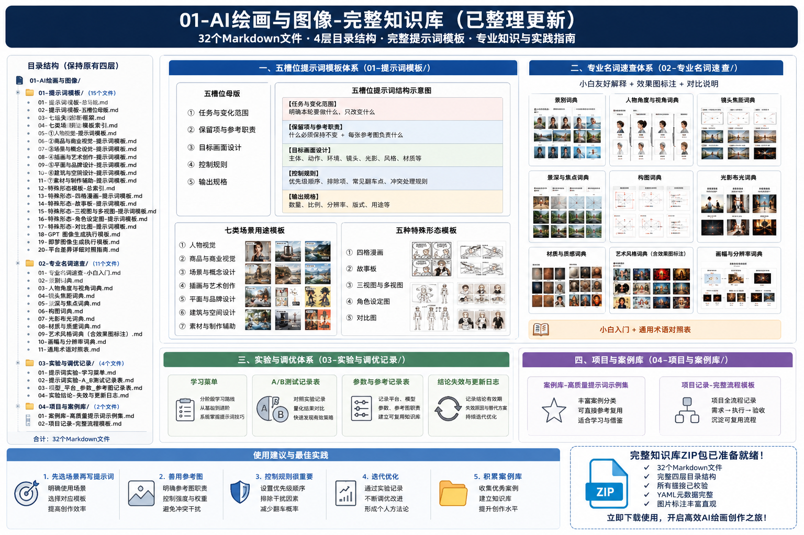
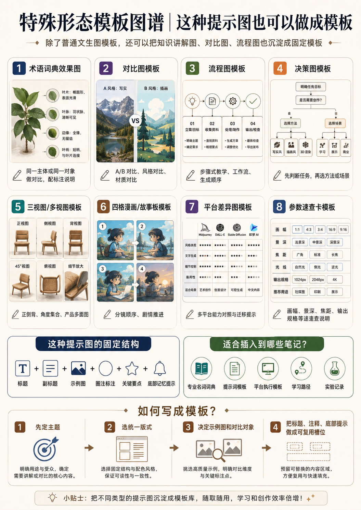

# AI绘画与图像-MOC

## 知识库总览图




> 本目录存放 AI 图像生成的提示词模板、术语速查、实验记录与维护文档。
> 
> **当前压缩包不包含 `03-资产与工作流层/`。** 文中提到的人物资产、商品效果图和素材图库属于外部项目依赖，不应被误认为已随本包提供。

## 图文导航

> [!tip] 特殊形态模板
> 除普通生图提示词外，知识讲解图、流程图、决策图、平台差异图和参数速查卡也可以沉淀为固定模板。



## 项目入口

- [[提示词模板]]：统一入口，包含七类场景、五槽位母版、七维诊断、平台差异、A-H 任务模板和负面词库。
- **平台执行模板**：[[GPT 图像生成执行模板]] / [[即梦图像生成执行模板]]。
- **七类用途模板**：[[人物创作提示词模板]] / [[商品视觉提示词模板]] / [[氛围创意提示词模板|场景与概念设计提示词模板]] / [[插画与艺术创作提示词模板]] / [[平面与品牌设计提示词模板]] / [[建筑与空间设计提示词模板]] / [[素材与制作辅助提示词模板]]。
- **特殊形态模板**：[[视图生成提示词模板]] / [[角色设定图提示词模板]] / [[四格漫画提示词模板]] / [[故事板提示词模板]] / [[对比图提示词模板]] / [[提示图与知识图解提示词模板]]。
- [[学习路径-练习菜单]]：实验与练习入口。

## 目录结构（保留原结构）

```text
01-AI绘画与图像/
├── AI绘画与图像-MOC.md
├── 01-提示词模板/
│   ├── 【平台执行模板】/
│   ├── 【用途模板】/
│   └── 【特殊形态模板】/
├── 02-专业名词速查/
├── 04-实验与迭代层/
└── 90-维护与数据/
```

> 原规划中的 `03-资产与工作流层/` 未包含在本压缩包中。需要接入外部资产时，应在实际知识库中单独建立并维护链接。

## 内容边界

- `01-提示词模板/`：统一提示词模板、平台适配、用途模板和特殊版式模板。
- `02-专业名词速查/`：视觉术语的白话解释、选择方法、对比示例与可复制写法。零基础先进入 [[专业名词速查-小白入门]]；焦距、光圈、4K 等词在生成模型中通常是视觉意图，不等同于真实相机或真实输出参数。
- `04-实验与迭代层/`：练习计划、A/B 测试、风格实验和历史记录。
- `90-维护与数据/`：需求、ADR 和目录规划。它们是设计记录，不应覆盖当前执行模板中的最新说明。
- 精确文字、品牌 Logo、人物身份和多视图结构都需要生成后验收；提示词无法提供绝对一致性保证。

## 维护入口

- [[AI绘画与图像-目录重构规划]]：历史目录规划与迁移设想。
- [[AI生图知识库重构需求文档]]：知识库需求记录。
- [[0001-AI生图知识库学习优先重构]]：结构决策记录。

```dataview
TABLE summary, status, updated
WHERE startswith(file.path, this.file.folder)
  AND file.name != this.file.name
SORT updated DESC
```

- [[教学图片规划索引]]：按文件和子标题追踪待生成教学图。
