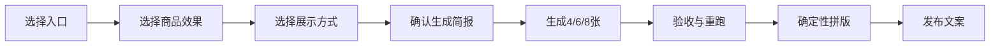

# 丝袜效果图生成系统

> [!info] 导航入口
> 文件结构、资产位置与维护规则见 [[丝袜效果图生成系统-MOC]]。

> [!abstract] 系统目标
> 把商品效果、模特、服装、姿势、构图、场景和平台要求组合成可确认、可复用的生成简报，再稳定产出无文字素材、完整目录页和发布文案。

> [!success] 阅读方式
> 日常操作只读本文。只有查询 001–200 具体编号或追溯旧实验时，才打开 [[丝袜效果图生成系统-完整效果索引与历史记录]]。

## 页内导航

- [[#一、五分钟快速开始]]
- [[#二、统一约束]]
- [[#三、生成简报]]
- [[#四、商品效果图库]]
- [[#五、展示方式图库]]
- [[#六、提示词与生产流程]]
- [[#七、预设案例状态]]
- [[#八、完整实测案例｜C05]]
- [[#九、交付与验收清单]]

## 一、五分钟快速开始



### 1. 选择入口

| 入口 | 适用情况 | 规则 |
|---|---|---|
| 预设案例 | 希望直接复用成熟组合 | 预设只读，修改时复制为新配置 |
| 效果参考 | 已有喜欢的参考图片 | 只继承明确勾选的维度 |
| 自定义配置 | 希望从零组合 | 逐项选择效果与展示方式 |

参考图可继承：`丝袜效果 / 构图 / 姿势 / 服装 / 模特体型 / 场景 / 光线 / 色调`。

### 2. 选择商品效果

每款只允许 `1 个核心效果＋最多 1 个辅助效果`。先在 [[#四、商品效果图库]] 选分类，再到 [[丝袜效果图生成系统-完整效果索引与历史记录#完整效果素材库｜001–200|完整效果索引]] 选具体编号。

### 3. 选择展示方式

进入 [[#五、展示方式图库]] 选择构图、服装和姿势。展示方式不改变丝袜本体。

### 4. 确认并生成

填写 [[#三、生成简报]]，确认无冲突后使用 [[#六、提示词与生产流程]]。默认使用 6 张精细批次；需要快速铺量时可选中批次或大批次，并按对应验收方式执行。

## 二、统一约束

- 只使用明确成年的女性模特，禁止男性或男女混合。
- 最大裁切范围为腹部以下至鞋尖，可进一步裁到裙摆或腿部细节。
- 性感、甜美、包臀裙和成人学院风均可，但必须保持服装商品展示逻辑。
- 每页循环 2–4 位固定模特；无脸输出用肤色、腿型、身体比例和参考卡共同锁定。
- 同批姿势必须有变化，不能重复同一动作。
- 每格恰好两条腿；膝盖、脚踝、脚和鞋履连接正确。
- 禁止多肢、融合腿、重复膝盖、断裂脚踝、悬空鞋和漂浮纹理。
- 固定身份使用原创 AI 成人女性参考图，不复刻真人、名人或品牌模特。
- 正式销售前按所用生成平台的最新条款复核商用范围。

冲突优先级：

`成人身份与商业发布安全约束 → 固定模特身份 → 核心丝袜效果 → 勾选参考维度 → 自定义展示方式 → 平台优化`

## 三、生成简报

```text
入口：预设案例 / 效果参考 / 自定义配置
页面：PAGE-__
核心效果：E-___（必选且只能1项）
辅助效果：A-___（可空，最多1项）
参考图：___
继承维度：丝袜效果 / 构图 / 姿势 / 服装 / 模特体型 / 场景 / 光线 / 色调
模特：M__（同页循环2–4位固定成年女性）
服装：O__
姿势：S__
构图：D01 / D02 / D03 / D04
场景与光线：___
输出用途：商品目录 / 小红书 / 电商详情 / 视频封面 / 时装编辑
比例：3:4 / 4:5 / 9:16 / 1:1
平台：Gemini / 豆包 / 即梦 / ChatGPT-ImageGen
批次等级：小批次 4–6 格 / 中批次 8–12 格 / 大批次 16–24 格
母图格数：4 / 6 / 8 / 9 / 12；默认 6 格，超过 12 格只作缩略预选
```

生成前检查：核心效果是否唯一、参考继承范围是否明确、服装是否遮挡重点、姿势与构图是否兼容、裁切是否符合用途。

## 四、商品效果图库

> [!example]- 展开 P01–P02｜颜色、肤感、透明度与厚度
> ![[P01-基础色系与肤感.png|380]] ![[P02-透明度与厚度.png|380]]
>
> - P01：纯色、肤色、冷暖色和基础日常款。
> - P02：超薄、薄透、半透、中厚、不透明和冬季厚款。

> [!example]- 展开 P03–P04｜编织、纹理与图案
> ![[P03-纹理与编织结构.png|380]] ![[P04-图案与艺术设计.png|380]]
>
> - P03：微网、细网、菱形网、罗纹、横纹和蕾丝。
> - P04：波点、竖条、植物、几何、星点和重复纹样。

> [!example]- 展开 P05–P06｜表面光泽与结构细节
> ![[P05-材质表面与光泽.png|380]] ![[P06-袜口脚尖与拼接结构.png|380]]
>
> - P05：哑光、缎光、珠光、细闪、金属线和高亮表面。
> - P06：后缝、加固脚尖、后跟、侧拼接、袜口和非对称面板。

> [!example]- 展开 P07–P08｜色彩工艺与装饰艺术
> ![[P07-染色渐变与色彩工艺.png|380]] ![[P08-文化纹样与装饰艺术.png|380]]
>
> - P07：渐变、双色、烟雾染、扎染和偏光色移。
> - P08：原创云曲线、窗格几何、佩斯利、藤蔓、马赛克和笔触节奏。

> [!example]- 展开 P09–P10｜视觉错觉与功能场景
> ![[P09-视觉错觉与空间图形.png|380]] ![[P10-专业功能与应用场景.png|380]]
>
> - P09：轮廓线、纵向延伸、切面、阴影面板、层叠和深度网格。
> - P10：通勤、清凉、保暖、支撑、舞台和户外应用。

## 五、展示方式图库

新版图库统一采用奶油白、暖灰、胡桃木和深咖的高级极简视觉体系。

> [!example]- 展开 D01｜技术目录构图
> ![[D01-技术目录构图-v2.png|800]]
>
> 用于材质核验、电商规格对照和课程演示。可选正面、三分之四、结构近景和前后对比。

> [!example]- 展开 D02｜生活方式构图
> ![[D02-生活方式构图-v2.png|800]]
>
> 用于小红书和日常穿搭。可选沙发、窗边单椅、卧室坐凳和都市休息区。

> [!example]- 展开 D03｜时装编辑构图
> ![[D03-时装编辑构图-v2.png|800]]
>
> 用于高级感内容和创意纹样。可选雕塑白棚、深色空间、金属背景和电影感暖光。

> [!example]- 展开 D04｜电商与社媒构图
> ![[D04-电商社媒构图-v2.png|800]]
>
> 用于白底详情、暖色社媒、竖版封面和 Look＋腿部细节组合。

> [!example]- 展开 D05｜服装风格
> ![[D05-服装风格-v2.png|800]]
>
> 首选通勤包臀裙、成人学院风、柔和甜美和成熟晚宴风。服装不能遮挡膝部、脚踝或鞋履。

> [!example]- 展开 D06｜姿势与动作
> ![[D06-姿势与动作-v2.png|800]]
>
> 默认动作：正面站姿、三分之四站姿、自然迈步、单椅端坐、沙发腿部延伸、侧向坐姿。

## 六、提示词与生产流程

### 图片提示词骨架

> [!example]- 展开可复制提示词
> ```text
> 生成一组成年女性服装商品视觉图。
>
> 核心丝袜效果：{核心效果，只能1项}。
> 辅助效果：{可空，最多1项}。
> 固定模特：{M编号，同页循环2–4位}。
> 参考图只继承：{用户勾选的维度}。
> 服装：{服装风格}。
> 姿势：{每张不同的姿势列表}。
> 构图与场景：{D编号、背景、光线}。
> 输出：{比例、用途、无文字、留白位置}。
>
> 只出现成年女性；最大裁切范围为腹部以下至鞋尖；每格恰好两条腿；
> 双膝、脚踝、脚和鞋履连接正确；丝袜纹理沿腿部曲面连续；无品牌与水印。
> ```

### 平台转换

- Gemini：先给参考图和生成简报；精细批次优先 4–6 张，稳定模板可提高单图格数；中文说明放到图片外。
- 豆包：把核心效果、姿势和裁切放在开头，使用短句。
- 即梦：拆成主体、服装、动作、镜头、光线和约束六段。
- ChatGPT/ImageGen：使用结构化描述，明确每张姿势差异与不可变项。

### 生产单位

先在生成简报中选择批次等级。这里的“张数”是最终独立效果格数量；可以逐张生成，也可以让一张母图容纳多格，再切分验收。

| 批次 | 效果格数量 | 建议单张母图容纳 | 适用场景 | 质量策略 |
|---|---:|---:|---|---|
| 小批次 | 4–6 格 | 4–6 格 | 新效果试错、身份锁定、复杂姿势 | 默认选择；逐格检查，失败项单独重跑 |
| 中批次 | 8–12 格 | 6–8 格 | 已验证商品效果、同场景姿势扩展 | 可拆成 2 张母图，避免每格过小 |
| 大批次 | 16–24 格 | 8–12 格 | 稳定模板铺量、效果索引预览 | 先出低成本联系表，再把入选格精细重跑 |
| 超大任务 | 25 格以上 | 每张不超过 12 格 | 页面库或季度素材库 | 按主题分组生产，不要求一次生成完成 |

> [!tip] 一张图容纳多少格
> 3:4 竖版母图推荐 6 格（3×2）或 8 格（4×2）；方形母图推荐 9 格（3×3）；需要 12 格时使用 3×4 或 4×3。超过 12 格后，腿部纹理、鞋履连接和姿势差异会明显难验收，因此只用于缩略预选，不直接作为最终商品图。

批次变大不等于取消单格验收。中、大批次采用“两阶段生成”：第一阶段用多格母图选择构图；第二阶段将入选格按 1–4 格精细重跑，最后再统一编号和拼版。

### 图片与文字分工

1. 图片模型只生成无文字视觉素材。
2. 逐张验收，失败项单独重跑。
3. 验收通过后确定性拼版。
4. 后期加入主标题、副标题、页面说明、连续编号、单格名称、单格说明和页脚。
5. 同时保留无文字原图和完整目录页。

## 七、预设案例状态

预设只读，修改时复制为新配置。

| 编号 | 类型 | 核心效果 | 推荐展示 | 状态 |
|---|---|---|---|---|
| C01 | 技术目录 | 黑色透明度阶梯 | D01＋站姿对照 | 待验证 |
| C02 | 技术目录 | 裸色肤感阶梯 | D01＋正侧面 | 待验证 |
| C03 | 技术目录 | 网眼编织 | D01＋纹理近景 | 待验证 |
| C04 | 技术目录 | 后缝与脚尖结构 | D01＋前后对比 | 待验证 |
| C05 | 小红书 | 黑色半透细闪 | D02＋站坐混合 | 已完成首轮实测 |
| C06 | 小红书 | 成人学院风细纹 | D04＋学院风短裙 | 待验证 |
| C07 | 小红书 | 裸色珠光 | D02＋暖色生活场景 | 待验证 |
| C08 | 电商详情 | 通勤半透 | D01＋白底详情 | 待验证 |
| C09 | 电商详情 | 秋冬中厚哑光 | D01＋功能细节 | 待验证 |
| C10 | 时装编辑 | 几何错觉 | D03＋雕塑棚 | 待验证 |
| C11 | 时装编辑 | 金属线编织 | D03＋金属空间 | 待验证 |
| C12 | 视频封面 | 渐变细闪 | D04＋9:16 动态步态 | 待验证 |

## 八、完整实测案例｜C05

### 完整目录页

![[首轮演示-黑色半透细闪-完整目录页.png|800]]

> [!example]- 展开 C05 生成简报、提示词与验收
> **生成简报**
>
> | 字段 | 选择 |
> |---|---|
> | 核心效果 | 黑色半透丝袜 |
> | 辅助效果 | 克制银色细闪 |
> | 模特 | M01＋M02，成年东亚女性 |
> | 服装 | 成熟学院风黑色或炭灰短裙 |
> | 姿势 | 正面、轻交叉、侧姿、端坐、腿部延伸、自然迈步 |
> | 场景 | 浅灰技术棚＋暖色极简客厅 |
> | 输出 | 3:4、无文字素材＋完整目录页、腹部以下至鞋尖 |
> | 批量 | 默认 6 张 |
>
> **实际提示词**
>
> ```text
> 创建一张3:4竖版2×3小批量服装目录板，只出现成年东亚女性模特。
> 每格最大裁切范围为腹部/腰部至尖头鞋。
> 服装为成熟学院风黑色或炭灰短裙；商品为黑色半透丝袜，并带克制、细密、均匀的银色微闪。
> 六格姿势依次为正面站姿、轻交叉站姿、三分之四侧姿、沙发端坐、坐姿单腿延伸、自然迈步。
> 场景在浅灰技术棚与暖色极简客厅之间交替，但丝袜颜色、透明度和细闪保持一致。
> 每格恰好两条腿，鞋履完整，人体比例自然；无文字、品牌或水印。
> ```
>
> **验收结果**
>
> - 成年女性、腹部以下裁切、六种姿势、核心效果、腿部和鞋履：通过。
> - 主标题、001–006编号、名称和说明：通过。
> - 固定身份：部分通过；无脸输出仍需用肤色、腿型和比例共同锁定。
> - 分批重跑：待验证；首轮直接生成2×3板，正式流程应拆成两批各3张。
>
> **失败修复**
>
> 1. 过多排除词曾触发图片审核误判，改为正向成年女性服装目录描述。
> 2. 文化纹样测试曾误生成男性，整图废弃后重跑女性版本。
> 3. 图片模型不负责中文排版，标题、编号和说明使用确定性后期排版。

### 小红书文案

> [!example]- 展开发布文案
> **标题：** 黑色半透细闪怎么拍？6种腿部姿势对比
>
> 这组只测试一种丝袜效果：黑色半透＋克制细闪。通过正面、侧面、交叉、端坐、腿部延伸和迈步，观察膝部透感、脚踝贴合与不同光线下的细闪变化。
>
> 商品目录优先选正面和侧面；小红书内容可以增加坐姿和轻动态。本案例使用 6 格精细批次；若扩展为中、大批次，先用多格母图筛选，再对入选格精细重跑。
>
> #丝袜穿搭 #AI穿搭 #腿部穿搭 #穿搭灵感 #黑色丝袜

## 九、交付与验收清单

- [ ] 原始参考图和继承维度
- [ ] 已确认的生成简报
- [ ] 图片模型提示词
- [ ] 已记录批次等级、效果格总数和每张母图格数
- [ ] 分批原图或多格母图
- [ ] 单图验收与失败重跑记录
- [ ] 无文字拼版
- [ ] 带主标题、编号和说明的完整目录页
- [ ] 小红书或短视频发布文案
- [ ] 平台、生成日期和原始文件路径

> [!success] 一句话原则
> ==在一篇文档内完成选择和生产：先确认生成简报与批次等级，再生成可切分的效果格；无论小、中、大批次，都先验收单格，再把合格图精细重跑或拼版，最后补齐标题、编号、说明和发布文案。==
