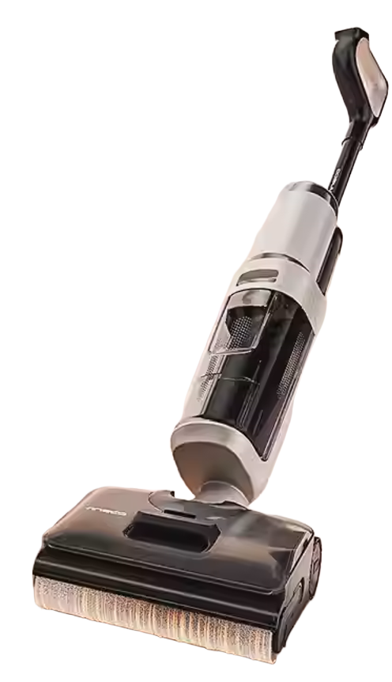

# 尚硅谷-一键生成商品宣传视频

## 1.概述

### 1.1.项目价值 

在电商平台浏览商品时，我们会发现大多数商品都配有宣传视频。

按照传统方式，商品宣传视频的制作需要文案、策划、摄影和剪辑多角色协同，耗时数天。

通过Coze搭建自动化应用，可以在几分钟内完成脚本创作、镜头规划和素材生成，大幅降低制作成本。

### 1.2.项目架构

当前项目分为三个功能模块：

#### ① 录入商品信息

和用户交互，负责引导用户提供商品信息，并录入系统。

> 相关工作流：set_product_info

#### ② 生成大纲、分镜脚本和旁白

根据商品信息生成宣传视频大纲、分镜脚本和旁白。

> 相关工作流：generate_outline

#### ③ 生成分镜图片

根据大纲、脚本和旁白生成分镜图片。

> 相关工作流：generate_pictures、gen_pic_1、gen_pic_2、gen_pic_3

gen_pic_1、gen_pic_2、gen_pic_3分别用于生成前1/3、中间1/3和后1/3的分镜图片。

底层调用generate_pictures。

### 1.3.UI界面布局


界面布局分为这样几部分：

#### ① 分镜图片列表

UI界面左半边用于展示分镜图片和匹配的分镜脚本和旁白。

#### ② 视频大意 + 分镜脚本和旁白展示组件

界面右半边顶部的**视频大意**部分用于展示宣传视频大纲。

界面右下角的文本框用于展示**分镜脚本和旁白**。

#### ③ 图片上传组件

**视频大意**下方为图片上传模块。

#### ④ 对话流模块

图片上传模块下方是对话流模块，用户可以在这里和AI助手对话，录入商品信息。

#### ⑤ 按钮模块

右上角有四个按钮。

##### ① 生成大纲

点击后调用generate_outline，负责生成视频大纲、分镜脚本和旁白。

**注意**：大纲是根据商品信息生成的，应该在录入商品信息之后执行再生成大纲。

##### ② 生成前1/3

点击后调用gen_pic_1。

##### ③ 生成中间1/3

点击后调用gen_pic_2。

##### ④ 生成后1/3

点击后调用gen_pic_3。

### 1.4.最终效果概览

应用界面截图


分镜脚本长截图

## 2.变量管理

进入变量管理界面。


点击左侧菜单栏**设置**下的**变量**即可打开**变量管理界面**，如上图所示。

### 2.1.变量设置界面

点击**变量设置**切换至**变量设置界面**。


变量的详细介绍参考官方文档。

> https://www.coze.cn/open/docs/guides/add_variables_in_app?from=search

可以看到三类变量：

#### ① 应用变量

应用变量应设置默认值，每次运行工作流，应用变量的值都会被重置为默认值。

可以设置为多种类型。

#### ② 用户变量

用户变量也可以设置默认值，和应用变量的区别在于，每次运行工作流后，用户变量的更改会被保存下来，不会重置为默认值。

**只能是字符串类型。**

#### ③ 系统变量

由系统创建，默认不可读不可写，在**变量设置界面**打开后可以访问，但为只读状态不可更改。


### 2.2.应用变量和用户变量的对比

#### ① 准备变量

准备应用变量num和用户变量user_num用于测试，配置如下。


#### ② 工作流配置和测试

我们准备两个工作流，分别用于测试应用变量（app_var_test）和用户变量（user_var_test）

##### ① app_var_test

###### **① 开始节点**


开始节点是工作流起点，当前测试不需要设置变量，但是节点必须存在。

###### **② 代码节点**


代码内容如下

```python
# 在这里，您可以通过 'args'  获取节点中的输入变量，并通过 'ret' 输出结果
# 'args' 已经被正确地注入到环境中
# 下面是一个示例，首先获取节点的全部输入参数params，其次获取其中参数名为'input'的值：
# params = args.params; 
# input = params['input'];
# 下面是一个示例，输出一个包含多种数据类型的 'ret' 对象：
# ret: Output =  { "name": '小明', "hobbies": ["看书", "旅游"] };

async def main(args: Args) -> Output:
    params = args.params
    num = params["input"]
    num += 13
    # 构建输出对象
    ret: Output = {
        "num": num
    }
    return ret
```

当前节点的作用是读取应用变量，增加13后赋值给节点变量num，传递给下游。

###### **③ 变量赋值节点**


将代码节点的输出赋值给应用变量num。

###### **④ 文本处理节点**


读取更新后的应用变量num，将其转换为字符串并按模板拼接成格式化文本后输出给下游节点。

```
应用变量num：{{String1}}
```

###### **⑤ 结束节点**


返回代码节点和文本处理节点的输出变量。

###### **⑥ 测试**

第一次运行


第二次运行


多次测试，应用变量的值不变，始终是默认值+13。

##### ② user_var_test

###### **① 开始节点**


开始节点是工作流起点，当前测试不需要设置变量，但是节点必须存在。

###### **② 代码节点**


代码内容如下

```python
# 在这里，您可以通过 'args'  获取节点中的输入变量，并通过 'ret' 输出结果
# 'args' 已经被正确地注入到环境中
# 下面是一个示例，首先获取节点的全部输入参数params，其次获取其中参数名为'input'的值：
# params = args.params; 
# input = params['input'];
# 下面是一个示例，输出一个包含多种数据类型的 'ret' 对象：
# ret: Output =  { "name": '小明', "hobbies": ["看书", "旅游"] };

async def main(args: Args) -> Output:
    params = args.params
    num = int(params["input"])
    num += 13
    # 构建输出对象
    ret: Output = {
        "num": num
    }
    return ret
```

当前节点的作用是读取用户变量，增加13后赋值给节点变量num，传递给下游。

###### **③ 变量赋值节点**


将代码节点的输出赋值给用户变量user_num。

###### **④ 文本处理节点**


读取更新后的用户变量user_num，将其转换为字符串并按模板拼接成格式化文本后输出给下游节点。

###### **⑤ 结束节点**


返回代码节点和文本处理节点的输出变量。

###### **⑥ 测试**

第一次运行


第二次运行


多次测试，每运行一次，用户变量的值增加13。

### 2.3.测试数据界面


> 测试数据这里只能看到用户数据，因为系统变量不可写、应用变量每次重置，没必要放在这里。
>

点击变量右侧的叉号可以将用户变量重置为默认值。


再次运行user_var_test


刷新后在测试数据界面查看变量值，和试运行输出一致。


## 3.应用配置

### 3.1.创建应用


应用名称

```
尚硅谷-一键生成商品宣传视频
```

应用介绍

```
基于商品信息一键生成商品宣传视频大纲、旁白、分镜脚本和图片
```

### 3.2.set_product_info

这是个chatflow（对话流）。

对话流和工作流的详细区别如下：

> https://www.coze.cn/open/docs/guides/workflow_and_chatflow

简单来说，对话流是基于对话场景的特殊工作流，是拥有记忆的工作流，每个对话流绑定了一个会话，运行时可以从此会话中读取历史消息，同时将本次运行产生的消息记录在此会话中。


#### 3.2.1.创建并配置对话流

##### ① 创建对话流


对话流名称

```
set_product_info
```

对话流描述

```
录入产品信息
```

勾选“**创建并绑定同名会话**”标签，则创建对话流的同时会创建同名会话，并将二者绑订，即对话流运行产生的消息会记录在该会话中，并且每次运行可以从该会话读取历史记录。

##### ② 配置Agent角色信息

对话流被调用时，会被视为Agent，我们可以自定义Agent角色信息。


###### 角色名称

```
静香
```

###### 角色描述

```
录入产品信息的智能体，和用户交互，将产品信息记录在用户变量中
此外，将对话流的最终输出返回给用户
```

###### 角色头像

点击头像右侧的图标，AI会自动根据角色名称和描述生成匹配的角色头像。

###### 开场白文案

对话流被调用时，开场白会被最先展示给用户。

```
哈喽，我是你的专属客服静香，我将引导您逐步提供完整的产品信息，明确需求~
```

##### ③ 创建产品信息相关的用户变量


用户变量列表如上。

#### 3.2.2.会话管理


#### 3.2.3.整体架构


对话流由三个节点组成，开始节点和结束节点是对话流标配，循环节点完成核心逻辑。

#### 3.2.4.开始节点


此处的两个参数都是创建对话流时系统自动创建的，当前场景不需要使用，也不必新增变量。

#### 3.2.5.循环节点


循环节点负责和用户对话并记录产品信息，循环类型设置为**无限循环**，直至用户选择结束对话时终止循环。

##### ① 产品名称问答

这是个问答节点。


###### **① 模型**

问答节点的需求很简单，模型任选即可。

###### **② 提问内容**

```
请问产品名称是？
```

###### **③ 回答类型**

回答类型可以选择以下两种

① 直接回答

该类型的问答节点会将用户的回答赋值给变量`USER_RESPONSE`

② 选项回答

此时的问答节点会创造一个分支结构，可以预设多个选项，大模型会根据用户回答决定执行下游的哪个分支。

###### **④ 输出**

保持默认即可。

##### ② 产品名称变量赋值


将上一步用户的回答作为变量值赋值给`产品名称`变量。

##### ③ 产品参数信息问答


##### ④ 产品参数信息变量赋值


##### ⑤ 产品特点问答


##### ⑥ 产品特点变量赋值


##### ⑦ 是否补充问答


回答类型设置为**选项回答**

当前节点变为分支结构的起点，整个分支结构的架构如下。


###### **① 分支-A**

① 补充信息问答


② 补充信息变量赋值


###### **② 分支-B/其他**

直接跳转至**产品信息整合**节点。

##### ⑧ 产品信息整合


当前节点的作用是将本轮对话中收集到的产品信息整合为输出变量**output**。

##### ⑨ 是否重来问答


当前节点的作用是将本轮对话收集到的产品信息展示给用户，询问用户是否满意。

回答类型设置为“选项回答”。

当前节点变为分支结构的起点，整个分支结构的架构如下。


###### **① 分支-A**

当前分支终止循环。


###### **② 分支-B/其他**

这是个输出节点。


输出重启提示，然后进行下一轮循环。

#### 3.2.6.结束节点


当前节点的作用是输出提示，通知用户录入完成。

打开流式输出标签，则对话流运行时，回答内容会逐字显示，而关闭该标签，回答内容一次性返回给用户。

#### 3.2.7.测试


清除历史记录


产品信息记录在资料目录下的**商品信息.txt**中


**洗地机.png**是生成分镜图片时的参考。

##### ① 开始


##### ② 输入产品名称


##### ③ 输入产品参数信息


##### ④ 输入产品特点


##### ⑤ 不再补充信息


##### ⑥ 满意


##### ⑦ 查看产品相关变量的值


### 3.3.generate_outline

#### 3.3.1.创建工作流


工作流名称

```
generate_outline
```

工作流描述

```
根据产品信息生成宣传视频大纲、分镜脚本和旁白
```

#### 3.3.2.工作流概览


#### 3.3.3.工作流配置

##### ① 开始节点


工作流必须有开始节点，标志着工作流的开始，此处开始节点没有作用但必须存在。

##### ② 产品信息汇总

这是个文本处理节点。


作用是读取产品相关的用户变量，拼接为格式化字符串，作为output变量输出到下游。

##### ③ AI生成大纲、分镜脚本和旁白

这是个大模型节点。


###### **① 系统提示词**

````markdown
## 角色定位
你现在是一名 **专业商业广告导演、品牌策划师、脚本创意总监**，擅长为 Tiktok、抖音、小红书、电商平台制作高转化产品视频。
你的任务：**根据产品信息创作一支约 60 秒的故事短片级商品介绍视频脚本**，并严格按以下 3 个部分输出。


## **格式要求【必须输出以下 2 部分】**
### **1. outline（视频整体大纲）**
以自然段文本形式输出，需包含：
* 视频定位（带货、种草、功能展示等）
* 目标受众画像（性别、年龄、需求）
* 视频风格（科技感、生活感、快节奏等）
* 视频结构（例如：0–3s 抓眼、3–15s 痛点、15–45s 卖点故事化、45–60s 情绪收束 + CTA）
* 故事走向与主题表达
* 氛围与视觉基调建议

**要求**：浓缩完整故事脉络 + 产品价值呈现方式，字数约 150–300 字。

### **2. contents（分镜脚本和旁白数组）**
输出为 **数组，每个元素为一个镜头的JSON字符串，名为content**。
content包含两个字段：**script**和**aside**
#### **2.1 script（分镜脚本）**
输出为 **一个镜头的字符串**。
每个镜头 **时长 0.5–5 秒**，全片总时长约 60 秒。
每个镜头字符串需包含：
```
【镜头编号】
【画面描述】（景别/构图/人物动作/产品动作）
【旁白/字幕】
【拍摄手法】（特写/推镜/俯拍/转场/光效等）
【时长】X 秒
【情绪/节奏】
```

**要求：**

* 开头前 3–5 秒必须强抓注意
* 故事化、画面执行明确、镜头语言专业
* 卖点通过情节自然呈现，而不是堆砌参数
* 节奏符合短视频平台呈现方式
* 镜头数量可 10–20 个（依内容需要）

#### **2.2 aside（旁白）**
* 输出为字符串，是该镜头的旁白文本
* 若镜头无旁白，则使用 `"无旁白"`

## **写作风格要求**
* 专业但易懂
* 画面感强，镜头语言表达清晰
* 情绪节奏鲜明、卖点突出、推动购买
* 每个镜头方案可真实落地拍摄
* 全片故事流畅、有戏剧张力
* 充分“抓眼”与“爽点”设计

````

###### **② 用户提示词**

```markdown
# 产品信息如下
{{product_info}}
```

##### ④ 结束


#### 3.3.4.测试


输入为空

输出如下

```json
{
  "contents": [
    {
      "aside": "每天面对这样的顽渍，烦不烦？",
      "script": "【镜头1】\n【特写地板上的咖啡渍和灰尘，快速晃动】\n【字幕：每天面对这样的顽渍，烦不烦？】\n【快速推镜特写，低角度拍摄】\n【时长】3秒\n【情绪/节奏】紧张、快速"
    },
    {
      "aside": "无旁白",
      "script": "【镜头2】\n【中景用户叹气，看着地板，表情无奈】\n【无旁白】\n【平拍，轻微摇镜】\n【时长】3秒\n【情绪/节奏】无奈、慢节奏"
    },
    {
      "aside": "告别烦恼，试试添可极客",
      "script": "【镜头3】\n【全景产品亮相，用户轻松拿起添可洗地机】\n【旁白：告别烦恼，试试添可极客】\n【推镜从产品到用户笑脸】\n【时长】4秒\n【情绪/节奏】惊喜、过渡"
    },
    {
      "aside": "90°小折叠，女神好帮手，超轻量设计",
      "script": "【镜头4】\n【特写产品90°折叠动作，展示轻便存储】\n【旁白：90°小折叠，女神好帮手，超轻量设计】\n【慢动作特写，旋转镜头】\n【时长】6秒\n【情绪/节奏】流畅、科技感"
    },
    {
      "aside": "自动上热水，深层祛污不留痕",
      "script": "【镜头5】\n【中景产品自动喷出热水，清洁地板】\n【旁白：自动上热水，深层祛污不留痕】\n【俯拍，水花特效】\n【时长】5秒\n【情绪/节奏】高效、温暖"
    },
    {
      "aside": "22000Pa龙卷吸，顽渍瞬间净",
      "script": "【镜头6】\n【特写大吸力清理污渍，灰尘瞬间消失】\n【旁白：22000Pa龙卷吸，顽渍瞬间净】\n【快速 zoom in 特写】\n【时长】5秒\n【情绪/节奏】强劲、爽快"
    },
    {
      "aside": "99.99%除菌，家人健康有保障",
      "script": "【镜头7】\n【close-up 除菌功能图标，展示电解水过程】\n【旁白：99.99%除菌，家人健康有保障】\n【微距拍摄，光效闪烁】\n【时长】4秒\n【情绪/节奏】安心、科技"
    },
    {
      "aside": "自清洁功能，毛发0缠绕，免手洗",
      "script": "【镜头8】\n【中景产品自清洁滚刷，无毛发缠绕】\n【旁白：自清洁功能，毛发0缠绕，免手洗】\n【平移镜头，展示动作】\n【时长】5秒\n【情绪/节奏】便捷、解放"
    },
    {
      "aside": "静音设计，清洁不打扰生活",
      "script": "【镜头9】\n【特写静音模式运行，分贝显示低】\n【旁白：静音设计，清洁不打扰生活】\n【静态特写，环境音效淡化】\n【时长】4秒\n【情绪/节奏】宁静、舒适"
    },
    {
      "aside": "70分钟长续航，大户型轻松搞定",
      "script": "【镜头10】\n【全景用户轻松清洁整个房间，暗示长续航】\n【旁白：70分钟长续航，大户型轻松搞定】\n【跟拍镜头，时间 lapse 效果】\n【时长】5秒\n【情绪/节奏】持久、自信"
    },
    {
      "aside": "看，地板焕然一新，生活更美好",
      "script": "【镜头11】\n【特写地板洁净如新，反光效果】\n【旁白：看，地板焕然一新，生活更美好】\n【慢推镜，高光强调】\n【时长】6秒\n【情绪/节奏】满足、愉悦"
    },
    {
      "aside": "无旁白",
      "script": "【镜头12】\n【中景用户微笑，拥抱干净环境】\n【无旁白】\n【平拍，温暖光效】\n【时长】5秒\n【情绪/节奏】幸福、慢节奏"
    },
    {
      "aside": "点击下方链接，立即拥有添可极客！",
      "script": "【镜头13】\n【特写产品logo和购买二维码，动态弹出】\n【旁白：点击下方链接，立即拥有添可极客！】\n【zoom out 转场，CTA动画】\n【时长】5秒\n【情绪/节奏】 urgency、号召"
    }
  ],
  "outline": "本视频定位为高转化带货视频，针对25-45岁女性受众（家庭主妇或职场女性），需求高效、便捷的家庭清洁解决方案。视频风格结合生活感与科技感，快节奏剪辑。结构：0-3秒强抓眼展示地板污渍；3-15秒引入用户清洁痛点；15-45秒故事化演示产品卖点，包括90°折叠轻便、自动热水、大吸力清理、除菌自清洁等；45-60秒情绪收束展示洁净环境，并加入CTA鼓励购买。故事走向从混乱焦虑到整洁 relief，氛围视觉基调明亮家居场景，强调产品带来的解放感。"
}
```

##### ① 开始节点


##### ② 产品信息汇总节点


###### **① 输入**

```json
{
  "String1": "添可极客智能洗地机",
  "String2": "转速：92000 转/分钟\n续航时间：70 min\n清水箱容量：1000 ml\n品牌：TINECO/添可\n型号：FW52010ECN\n电压：220V\n是否智能：否\n电器基站功能：滚刷烘干\n适用地面材质：木地板、瓷砖、大理石\n附加功能：高温全链速干、除菌、延边清扫、防毛发缠绕、拖布自清洁\n最大吸入功率：75 AW\n污水箱容量：690 毫升\n清水箱容量：1000 ml\n质保周期：2 年\n颜色分类：【AI全向助力】添可极客",
  "String3": "智能洗地机 芙万 Fold X90\n90°小折叠，女神好帮手\n3.9kg超轻量，自动上热水\n\n镇店爆款：添可极客\n全网都在夸的洗地机\n买过的人都说好\n净顽渍 安静洗 14天无异味\nAI全向助力 22000Pa大吸力\n\n恒压活水高效洗\n一键Turbo祛顽渍\n安静模式免打扰\n22000Pa龙卷吸\nAI全向助力\n毛发0缠0逃逸\n70min长续航\n400平方米清洁面积\n抗菌祛味棒 14天无异味\n99.99%电解水除菌\n双模式烘干\n小于等于45dB（A）静烘/5min速干",
  "String4": ""
}
```

###### **② 输出**

```json
{
  "output": "# 产品名称\n添可极客智能洗地机\n# 产品参数信息\n转速：92000 转/分钟\n续航时间：70 min\n清水箱容量：1000 ml\n品牌：TINECO/添可\n型号：FW52010ECN\n电压：220V\n是否智能：否\n电器基站功能：滚刷烘干\n适用地面材质：木地板、瓷砖、大理石\n附加功能：高温全链速干、除菌、延边清扫、防毛发缠绕、拖布自清洁\n最大吸入功率：75 AW\n污水箱容量：690 毫升\n清水箱容量：1000 ml\n质保周期：2 年\n颜色分类：【AI全向助力】添可极客\n# 产品特点\n智能洗地机 芙万 Fold X90\n90°小折叠，女神好帮手\n3.9kg超轻量，自动上热水\n\n镇店爆款：添可极客\n全网都在夸的洗地机\n买过的人都说好\n净顽渍 安静洗 14天无异味\nAI全向助力 22000Pa大吸力\n\n恒压活水高效洗\n一键Turbo祛顽渍\n安静模式免打扰\n22000Pa龙卷吸\nAI全向助力\n毛发0缠0逃逸\n70min长续航\n400平方米清洁面积\n抗菌祛味棒 14天无异味\n99.99%电解水除菌\n双模式烘干\n小于等于45dB（A）静烘/5min速干\n# 产品信息补充\n"
}
```

##### ③ AI生成大纲、分镜脚本和旁白


###### **① 输入**

```json
{
  "product_info": "# 产品名称\n添可极客智能洗地机\n# 产品参数信息\n转速：92000 转/分钟\n续航时间：70 min\n清水箱容量：1000 ml\n品牌：TINECO/添可\n型号：FW52010ECN\n电压：220V\n是否智能：否\n电器基站功能：滚刷烘干\n适用地面材质：木地板、瓷砖、大理石\n附加功能：高温全链速干、除菌、延边清扫、防毛发缠绕、拖布自清洁\n最大吸入功率：75 AW\n污水箱容量：690 毫升\n清水箱容量：1000 ml\n质保周期：2 年\n颜色分类：【AI全向助力】添可极客\n# 产品特点\n智能洗地机 芙万 Fold X90\n90°小折叠，女神好帮手\n3.9kg超轻量，自动上热水\n\n镇店爆款：添可极客\n全网都在夸的洗地机\n买过的人都说好\n净顽渍 安静洗 14天无异味\nAI全向助力 22000Pa大吸力\n\n恒压活水高效洗\n一键Turbo祛顽渍\n安静模式免打扰\n22000Pa龙卷吸\nAI全向助力\n毛发0缠0逃逸\n70min长续航\n400平方米清洁面积\n抗菌祛味棒 14天无异味\n99.99%电解水除菌\n双模式烘干\n小于等于45dB（A）静烘/5min速干\n# 产品信息补充\n"
}
```

###### **② 输出**

```json
{
  "outline": "本视频定位为高转化带货视频，针对25-45岁女性受众（家庭主妇或职场女性），需求高效、便捷的家庭清洁解决方案。视频风格结合生活感与科技感，快节奏剪辑。结构：0-3秒强抓眼展示地板污渍；3-15秒引入用户清洁痛点；15-45秒故事化演示产品卖点，包括90°折叠轻便、自动热水、大吸力清理、除菌自清洁等；45-60秒情绪收束展示洁净环境，并加入CTA鼓励购买。故事走向从混乱焦虑到整洁 relief，氛围视觉基调明亮家居场景，强调产品带来的解放感。",
  "contents": [
    {
      "aside": "每天面对这样的顽渍，烦不烦？",
      "script": "【镜头1】\n【特写地板上的咖啡渍和灰尘，快速晃动】\n【字幕：每天面对这样的顽渍，烦不烦？】\n【快速推镜特写，低角度拍摄】\n【时长】3秒\n【情绪/节奏】紧张、快速"
    },
    {
      "aside": "无旁白",
      "script": "【镜头2】\n【中景用户叹气，看着地板，表情无奈】\n【无旁白】\n【平拍，轻微摇镜】\n【时长】3秒\n【情绪/节奏】无奈、慢节奏"
    },
    {
      "aside": "告别烦恼，试试添可极客",
      "script": "【镜头3】\n【全景产品亮相，用户轻松拿起添可洗地机】\n【旁白：告别烦恼，试试添可极客】\n【推镜从产品到用户笑脸】\n【时长】4秒\n【情绪/节奏】惊喜、过渡"
    },
    {
      "aside": "90°小折叠，女神好帮手，超轻量设计",
      "script": "【镜头4】\n【特写产品90°折叠动作，展示轻便存储】\n【旁白：90°小折叠，女神好帮手，超轻量设计】\n【慢动作特写，旋转镜头】\n【时长】6秒\n【情绪/节奏】流畅、科技感"
    },
    {
      "aside": "自动上热水，深层祛污不留痕",
      "script": "【镜头5】\n【中景产品自动喷出热水，清洁地板】\n【旁白：自动上热水，深层祛污不留痕】\n【俯拍，水花特效】\n【时长】5秒\n【情绪/节奏】高效、温暖"
    },
    {
      "aside": "22000Pa龙卷吸，顽渍瞬间净",
      "script": "【镜头6】\n【特写大吸力清理污渍，灰尘瞬间消失】\n【旁白：22000Pa龙卷吸，顽渍瞬间净】\n【快速 zoom in 特写】\n【时长】5秒\n【情绪/节奏】强劲、爽快"
    },
    {
      "aside": "99.99%除菌，家人健康有保障",
      "script": "【镜头7】\n【close-up 除菌功能图标，展示电解水过程】\n【旁白：99.99%除菌，家人健康有保障】\n【微距拍摄，光效闪烁】\n【时长】4秒\n【情绪/节奏】安心、科技"
    },
    {
      "aside": "自清洁功能，毛发0缠绕，免手洗",
      "script": "【镜头8】\n【中景产品自清洁滚刷，无毛发缠绕】\n【旁白：自清洁功能，毛发0缠绕，免手洗】\n【平移镜头，展示动作】\n【时长】5秒\n【情绪/节奏】便捷、解放"
    },
    {
      "aside": "静音设计，清洁不打扰生活",
      "script": "【镜头9】\n【特写静音模式运行，分贝显示低】\n【旁白：静音设计，清洁不打扰生活】\n【静态特写，环境音效淡化】\n【时长】4秒\n【情绪/节奏】宁静、舒适"
    },
    {
      "aside": "70分钟长续航，大户型轻松搞定",
      "script": "【镜头10】\n【全景用户轻松清洁整个房间，暗示长续航】\n【旁白：70分钟长续航，大户型轻松搞定】\n【跟拍镜头，时间 lapse 效果】\n【时长】5秒\n【情绪/节奏】持久、自信"
    },
    {
      "aside": "看，地板焕然一新，生活更美好",
      "script": "【镜头11】\n【特写地板洁净如新，反光效果】\n【旁白：看，地板焕然一新，生活更美好】\n【慢推镜，高光强调】\n【时长】6秒\n【情绪/节奏】满足、愉悦"
    },
    {
      "aside": "无旁白",
      "script": "【镜头12】\n【中景用户微笑，拥抱干净环境】\n【无旁白】\n【平拍，温暖光效】\n【时长】5秒\n【情绪/节奏】幸福、慢节奏"
    },
    {
      "aside": "点击下方链接，立即拥有添可极客！",
      "script": "【镜头13】\n【特写产品logo和购买二维码，动态弹出】\n【旁白：点击下方链接，立即拥有添可极客！】\n【zoom out 转场，CTA动画】\n【时长】5秒\n【情绪/节奏】 urgency、号召"
    }
  ],
  "reasoning_content": "首先，用户提供了一个产品信息：添可极客智能洗地机，我需要根据这个信息创作一个约60秒的故事短片级商品介绍视频脚本。输出必须严格按照指定的JSON格式，包括outline和contents数组。\n\n输出结构：\n- outline: 一个字符串，包含视频定位、目标受众、风格、结构、故事走向、氛围等，字数150-300字。\n- contents: 一个数组，每个元素是一个JSON对象，包含script和aside字段。script是分镜脚本的字符串，包括镜头编号、画面描述、旁白/字幕、拍摄手法、时长、情绪/节奏。aside是旁白文本或\"无旁白\"。\n\n关键要求：\n- 视频约60秒，每个镜头0.5-5秒，镜头数量10-20个。\n- 开头3-5秒强抓注意。\n- 故事化，卖点自然呈现，不堆砌参数。\n- 专业易懂，画面感强，情绪节奏鲜明。\n\n产品特点总结：\n- 智能洗地机，型号芙万 Fold X90。\n- 90°小折叠，轻量3.9kg，自动上热水。\n- 高转速、大吸力、长续航、除菌、自清洁、静音等。\n- 目标受众：可能针对家庭主妇、忙碌的职场人士，特别是女性，因为提到“女神好帮手”。\n- 使用场景：家庭清洁，适用于木地板、瓷砖等。\n\n视频定位：带货、种草，强调产品的高效、便捷、智能。\n\n目标受众：女性，25-45岁，有家庭清洁需求，追求高效、省时、卫生的生活方式。\n\n视频风格：生活感、科技感结合，快节奏展示产品优势。\n\n视频结构：\n- 0-3s: 抓眼开头，展示痛点或惊喜。\n- 3-15s: 引入痛点，如清洁麻烦。\n- 15-45s: 卖点故事化，展示产品使用场景和优势。\n- 45-60s: 情绪收束，CTA（Call to Action），鼓励购买。\n\n故事走向：从一个忙碌的家庭场景开始，展示清洁难题，然后引入产品解决，最后展示效果和情感满足。\n\n氛围：积极、高效、干净、现代。\n\n现在，构思outline：\n- 视频定位：带货视频，种草智能洗地机的高效和便捷。\n- 目标受众：25-45岁女性，家庭主妇或职场女性，注重卫生和效率。\n- 视频风格：生活化场景，带有科技感，快节奏剪辑。\n- 视频结构：0-3s 展示清洁混乱的快速镜头；3-15s 引入用户痛点；15-45s 演示产品使用和卖点；45-60s 展示清洁后的满意和CTA。\n- 故事走向：开始于一个忙碌妈妈面对地板污渍的 frustration，然后使用产品轻松解决，结束于干净环境和快乐表情。\n- 氛围：从混乱到整洁，情绪从焦虑到 relief。\n\noutline 字数控制在150-300字。\n\ncontents: 数组 of content objects. Each content has script and aside.\n- script: 字符串 with 【镜头编号】, 【画面描述】, 【旁白/字幕】, 【拍摄手法】, 【时长】, 【情绪/节奏】.\n- aside: 字符串, the voiceover text or \"无旁白\".\n\n镜头数量：10-20个，总时长约60秒。每个镜头平均3-6秒，但有些可能短，有些长。\n\n分配时间：\n- 开头抓眼：0-3s，可能1-2个镜头。\n- 痛点：3-15s，约12秒，2-4个镜头。\n- 卖点故事：15-45s，30秒，6-10个镜头。\n- 收束和CTA：45-60s，15秒，2-4个镜头。\n总共约12-20个镜头。\n\n脚本内容：\n- 开头：快速展示脏乱地板，引起注意。\n- 痛点：用户叹气，手动清洁麻烦。\n- 卖点：引入产品，演示折叠轻便、自动热水、大吸力、除菌等。\n- 收束：干净地板，用户微笑，CTA如购买链接。\n\n旁白：自然，讲述故事，突出卖点但不参数化。例如，不说“92000转/分钟”，而是说“强劲吸力瞬间清理”。\n\n情绪：开头紧张，中间高效，结尾满足。\n\n现在，起草outline。\n\noutline 文本：\n\"本视频定位为带货种草视频，针对25-45岁女性受众，她们注重家庭清洁效率。视频风格生活化与科技感结合，快节奏剪辑。结构：0-3秒快速展示地板污渍抓眼；3-15秒引入用户清洁痛点；15-45秒故事化演示产品使用，突出轻便折叠、自动热水、大吸力、除菌自清洁等卖点；45-60秒情绪收束展示清洁效果，并加入CTA鼓励购买。故事走向从混乱到整洁，氛围从焦虑到 relief，视觉基调明亮干净。\"\n\n字数约150字，符合。\n\ncontents: 数组 of objects.\n\n列出镜头：\n1. 镜头1: 快速特写地板污渍，旁白引入问题。\n2. 镜头2: 用户表情 frustrated。\n3. 镜头3: 展示产品外观，轻便折叠。\n4. 镜头4: 演示使用，自动热水。\n5. 镜头5: 大吸力清理污渍。\n6. 镜头6: 除菌功能展示。\n7. 镜头7: 自清洁过程。\n8. 镜头8: 静音模式。\n9. 镜头9: 清洁后干净地板。\n10. 镜头10: 用户满意表情。\n11. 镜头11: CTA镜头。\n\n需要更多细节，确保10-20个镜头。\n\n具体脚本：\n- 每个script字符串格式： 【镜头编号】\\n【画面描述】\\n【旁白/字幕】\\n【拍摄手法】\\n【时长】X秒\\n【情绪/节奏】\n\n旁白/aside: 对应文本。\n\n确保总时长约60秒。\n\n计算时间：假设镜头时长：1. 3s, 2. 2s, 3. 4s, 4. 5s, 5. 4s, 6. 3s, 7. 4s, 8. 3s, 9. 5s, 10. 3s, 11. 5s, 12. 4s (举例)，总和约45秒，需要调整到60秒。可能增加镜头或延长某些。\n\n目标60秒，所以镜头总时长和应为60秒左右。\n\n起草contents数组。\n\n先写outline in JSON.\n\n输出必须是JSON对象：{\"outline\": string, \"contents\": [{\"script\": string, \"aside\": string}, ...]}\n\n所以，在JSON中，outline是字符串，contents是数组 of objects with script and aside.\n\n现在，编写outline字符串。\n\noutline: \"视频定位为高转化带货视频，针对家庭主妇和职场女性（25-45岁），需求高效清洁解决方案。风格生活感与科技感融合，快节奏。结构：0-3秒强抓眼展示地板顽渍；3-15秒痛点场景用户手动清洁费力；15-45秒产品登场，故事化演示90°折叠轻便、自动热水洗地、22000Pa大吸力清理、除菌自清洁等；45-60秒情绪升华展示洁净环境，CTA促购买。故事从困境到解放，氛围紧张转轻松，视觉建议明亮家居场景。\"\n\n字数约180字。\n\ncontents: 数组，假设12个镜头。\n\n镜头1: 抓眼开头，3秒。\nscript: \"【镜头1】\\n【特写地板上的咖啡渍和灰尘】\\n【字幕：每天面对这样的污渍，烦不烦？】\\n【快速推镜特写】\\n【时长】3秒\\n【情绪/节奏】紧张、快速\"\naside: \"每天面对这样的污渍，烦不烦？\"\n\n镜头2: 用户痛点，2秒。\nscript: \"【镜头2】\\n【中景用户叹气看着地板】\\n【无旁白】\\n【平拍】\\n【时长】2秒\\n【情绪/节奏】无奈\"\n\naside: \"无旁白\"\n\n继续。\n\n需要覆盖所有卖点：折叠轻便、自动热水、大吸力、除菌、自清洁、静音、长续航等。\n\n故事化：例如，用户拿起产品，轻松折叠，开始清洁，展示效果。\n\n时长分配。\n\n总镜头数：12个，总时长60秒，平均5秒/镜头，但有些短有些长。\n\n列表：\n1. 镜头1: 3s, 抓眼\n2. 镜头2: 2s, 痛点\n3. 镜头3: 4s, 引入产品\n4. 镜头4: 5s, 演示折叠\n5. 镜头5: 4s, 自动热水\n6. 镜头6: 4s, 大吸力清理\n7. 镜头7: 4s, 除菌功能\n8. 镜头8: 4s, 自清洁\n9. 镜头9: 4s, 静音模式\n10. 镜头10: 5s, 展示清洁后\n11. 镜头11: 5s, 用户满意\n12. 镜头12: 6s, CTA\n\n总和: 3+2+4+5+4+4+4+4+4+5+5+6 = 50秒？计算: 3+2=5, +4=9, +5=14, +4=18, +4=22, +4=26, +4=30, +4=34, +5=39, +5=44, +6=50秒。还差10秒，需要调整或增加镜头。\n\n或许镜头更多，或延长某些。\n\n目标60秒，所以增加镜头或延长。\n\n或许13-15个镜头。\n\n重新分配。\n\n镜头1: 3s\n镜头2: 2s\n镜头3: 3s (引入产品)\n镜头4: 5s (折叠演示)\n镜头5: 4s (热水)\n镜头6: 4s (吸力)\n镜头7: 3s (除菌)\n镜头8: 4s (自清洁)\n镜头9: 3s (静音)\n镜头10: 4s (续航暗示)\n镜头11: 5s (清洁后)\n镜头12: 4s (用户)\n镜头13: 5s (CTA)\n\n总和: 3+2+3+5+4+4+3+4+3+4+5+4+5 = 49秒？计算: 3+2=5, +3=8, +5=13, +4=17, +4=21, +3=24, +4=28, +3=31, +4=35, +5=40, +4=44, +5=49秒。 still short.\n\nAdd one more镜头 or increase durations.\n\n镜头14: 4s (另一个卖点，如毛发不缠绕)\n\n或延长镜头11 to 6s, etc.\n\nMake some镜头 longer.\n\n镜头4: 6s for折叠演示\n镜头5: 5s for热水\netc.\n\n目标60秒，所以总sum to 60.\n\n假设:\n镜头1: 3s\n镜头2: 3s\n镜头3: 4s\n镜头4: 6s\n镜头5: 5s\n镜头6: 5s\n镜头7: 4s\n镜头8: 5s\n镜头9: 4s\n镜头10: 5s\n镜头11: 6s\n镜头12: 5s\n镜头13: 5s\n\nSum: 3+3=6, +4=10, +6=16, +5=21, +5=26, +4=30, +5=35, +4=39, +5=44, +6=50, +5=55, +5=60秒。完美。\n\n所以13个镜头。\n\nNow, write the script for each.\n\n旁白要自然，卖点融入故事。\n\n例如，旁白: \"告别手动清洁的烦恼，这款洗地机...\" \n\n避免参数: say \"强劲吸力\" instead of \"22000Pa\".\n\nOutline the旁白.\n\n镜头1: aside: \"每天地板上的顽渍，让你头疼吗？\"\n镜头2: aside: \"无旁白\" or something\n镜头3: aside: \"试试添可极客智能洗地机\"\n镜头4: aside: \"90°小折叠，轻便易存储\"\n镜头5: aside: \"自动上热水，深层去污\"\n镜头6: aside: \"大吸力瞬间清理灰尘\"\n镜头7: aside: \"99.99%除菌，家人更健康\"\n镜头8: aside: \"自清洁功能，免手洗\"\n镜头9: aside: \"静音模式，不打扰生活\"\n镜头10: aside: \"70分钟长续航，大户型也没问题\"\n镜头11: aside: \"看，地板焕然一新\"\n镜头12: aside: \"生活从此更轻松\"\n镜头13: aside: \"点击下方链接，立即拥有！\"\n\nMake it more story-like.\n\nFinalize the script strings.\n\nEnsure情绪/节奏 matches.\n\nNow, write the JSON.\n\nFirst, outline string.\n\nThen contents array with objects."
}
```

##### ④ 结束


输入为空

输出如下

```json
{
  "contents": [
    {
      "aside": "每天面对这样的顽渍，烦不烦？",
      "script": "【镜头1】\n【特写地板上的咖啡渍和灰尘，快速晃动】\n【字幕：每天面对这样的顽渍，烦不烦？】\n【快速推镜特写，低角度拍摄】\n【时长】3秒\n【情绪/节奏】紧张、快速"
    },
    {
      "aside": "无旁白",
      "script": "【镜头2】\n【中景用户叹气，看着地板，表情无奈】\n【无旁白】\n【平拍，轻微摇镜】\n【时长】3秒\n【情绪/节奏】无奈、慢节奏"
    },
    {
      "aside": "告别烦恼，试试添可极客",
      "script": "【镜头3】\n【全景产品亮相，用户轻松拿起添可洗地机】\n【旁白：告别烦恼，试试添可极客】\n【推镜从产品到用户笑脸】\n【时长】4秒\n【情绪/节奏】惊喜、过渡"
    },
    {
      "aside": "90°小折叠，女神好帮手，超轻量设计",
      "script": "【镜头4】\n【特写产品90°折叠动作，展示轻便存储】\n【旁白：90°小折叠，女神好帮手，超轻量设计】\n【慢动作特写，旋转镜头】\n【时长】6秒\n【情绪/节奏】流畅、科技感"
    },
    {
      "aside": "自动上热水，深层祛污不留痕",
      "script": "【镜头5】\n【中景产品自动喷出热水，清洁地板】\n【旁白：自动上热水，深层祛污不留痕】\n【俯拍，水花特效】\n【时长】5秒\n【情绪/节奏】高效、温暖"
    },
    {
      "aside": "22000Pa龙卷吸，顽渍瞬间净",
      "script": "【镜头6】\n【特写大吸力清理污渍，灰尘瞬间消失】\n【旁白：22000Pa龙卷吸，顽渍瞬间净】\n【快速 zoom in 特写】\n【时长】5秒\n【情绪/节奏】强劲、爽快"
    },
    {
      "aside": "99.99%除菌，家人健康有保障",
      "script": "【镜头7】\n【close-up 除菌功能图标，展示电解水过程】\n【旁白：99.99%除菌，家人健康有保障】\n【微距拍摄，光效闪烁】\n【时长】4秒\n【情绪/节奏】安心、科技"
    },
    {
      "aside": "自清洁功能，毛发0缠绕，免手洗",
      "script": "【镜头8】\n【中景产品自清洁滚刷，无毛发缠绕】\n【旁白：自清洁功能，毛发0缠绕，免手洗】\n【平移镜头，展示动作】\n【时长】5秒\n【情绪/节奏】便捷、解放"
    },
    {
      "aside": "静音设计，清洁不打扰生活",
      "script": "【镜头9】\n【特写静音模式运行，分贝显示低】\n【旁白：静音设计，清洁不打扰生活】\n【静态特写，环境音效淡化】\n【时长】4秒\n【情绪/节奏】宁静、舒适"
    },
    {
      "aside": "70分钟长续航，大户型轻松搞定",
      "script": "【镜头10】\n【全景用户轻松清洁整个房间，暗示长续航】\n【旁白：70分钟长续航，大户型轻松搞定】\n【跟拍镜头，时间 lapse 效果】\n【时长】5秒\n【情绪/节奏】持久、自信"
    },
    {
      "aside": "看，地板焕然一新，生活更美好",
      "script": "【镜头11】\n【特写地板洁净如新，反光效果】\n【旁白：看，地板焕然一新，生活更美好】\n【慢推镜，高光强调】\n【时长】6秒\n【情绪/节奏】满足、愉悦"
    },
    {
      "aside": "无旁白",
      "script": "【镜头12】\n【中景用户微笑，拥抱干净环境】\n【无旁白】\n【平拍，温暖光效】\n【时长】5秒\n【情绪/节奏】幸福、慢节奏"
    },
    {
      "aside": "点击下方链接，立即拥有添可极客！",
      "script": "【镜头13】\n【特写产品logo和购买二维码，动态弹出】\n【旁白：点击下方链接，立即拥有添可极客！】\n【zoom out 转场，CTA动画】\n【时长】5秒\n【情绪/节奏】 urgency、号召"
    }
  ],
  "outline": "本视频定位为高转化带货视频，针对25-45岁女性受众（家庭主妇或职场女性），需求高效、便捷的家庭清洁解决方案。视频风格结合生活感与科技感，快节奏剪辑。结构：0-3秒强抓眼展示地板污渍；3-15秒引入用户清洁痛点；15-45秒故事化演示产品卖点，包括90°折叠轻便、自动热水、大吸力清理、除菌自清洁等；45-60秒情绪收束展示洁净环境，并加入CTA鼓励购买。故事走向从混乱焦虑到整洁 relief，氛围视觉基调明亮家居场景，强调产品带来的解放感。"
}
```

### 3.4.generate_pictures

#### 3.4.1.创建工作流


工作流名称

```
generate_pictures
```

工作流描述

```
根据大纲、分镜脚本和旁白生成分镜图片
```

#### 3.4.2.工作流概览


#### 3.4.3.工作流配置

##### ① 开始


###### **① start_index**

**② end_index**

contents的起始偏移量和结束偏移量，用于对contents切片。

Coze的工作流设置了超时时间，如果执行太久，就会因超时而失败。分镜图片的数量在10-20之间，一次性生成大概率超时，为了避免这样的情况，我们将contents均分为三部分，每次运行只处理1/3数据。

假设contents的长度记为len(contents)，将contents均分为三部分，则每个区间的起止偏移量如下。

|         | start_index           | end_index             |
| ------- | --------------------- | --------------------- |
| 前1/3   | 0                     | len(contents) / 3     |
| 中间1/3 | len(contents) / 3     | len(contents) * 2 / 3 |
| 后1/3   | len(contents) * 2 / 3 | len(contents) * 3 / 3 |

有个问题：len(contents)是个变量，每次生成的contents长度不同，则其值不同，如果是上面的形式则无法传递。

观察表格中列出的表达式，我们可以提取公因子**len(contents) / 3**，则上表变为这样的形式

|         | start_index | end_index |
| ------- | ----------- | --------- |
| 前1/3   | 0           | 1         |
| 中间1/3 | 1           | 2         |
| 后1/3   | 2           | 3         |

下游只需要再乘以**len(contents) / 3**即可转换为真正的偏移量。

###### **③ ref_img**

参考图片，即待宣传商品的图片。

我们要生成的是商品宣传视频的分镜图片，自然要以商品图片作为参考图片。

###### **④ outline**

generate_outline生成的宣传视频大纲。

###### **⑤ contents**

generate_outline生成的宣传视频的分镜脚本和旁白，示例如下。完整示例见上文。

```json
"contents": [
  {
    "aside": "每天面对这样的顽渍，烦不烦？",
    "script": "【镜头1】\n【特写地板上的咖啡渍和灰尘，快速晃动】\n【字幕：每天面对这样的顽渍，烦不烦？】\n【快速推镜特写，低角度拍摄】\n【时长】3秒\n【情绪/节奏】紧张、快速"
  },
  {
    "aside": "无旁白",
    "script": "【镜头2】\n【中景用户叹气，看着地板，表情无奈】\n【无旁白】\n【平拍，轻微摇镜】\n【时长】3秒\n【情绪/节奏】无奈、慢节奏"
  },
......
]
```

##### ② contents切片


当前节点的作用是转换起始和结束偏移量，然后据此对contents切片。

代码如下

```python
# 在这里，您可以通过 'args'  获取节点中的输入变量，并通过 'ret' 输出结果
# 'args' 已经被正确地注入到环境中
# 下面是一个示例，首先获取节点的全部输入参数params，其次获取其中参数名为'input'的值：
# params = args.params; 
# input = params['input'];
# 下面是一个示例，输出一个包含多种数据类型的 'ret' 对象：
# ret: Output =  { "name": '小明', "hobbies": ["看书", "旅游"] };

async def main(args: Args) -> Output:
    params = args.params
    contents = params["contents"]
    total_len = len(contents)
    start_index = int(params["start_index"] * total_len / 3)
    end_index = int(params["end_index"] * total_len / 3)
    # 构建输出对象
    ret: Output = {
        "contents": contents[start_index: end_index]
    }
    return ret
```

##### ③ 循环


当前循环用于逐个处理contents的元素，并根据大纲和分镜脚本生成图片。

输入变量为contents

输出变量需要在循环体内部配置完成后方可配置。

###### **① 提取脚本和旁白**


代码内容如下

```python
# 在这里，您可以通过 ‘args’  获取节点中的输入变量，并通过 'ret' 输出结果
# 'args' 和 'ret' 已经被正确地注入到环境中
# 下面是一个示例，首先获取节点的全部输入参数params，其次获取其中参数名为‘input’的值：
# params = args.params; 
# input = params.input;
# 下面是一个示例，输出一个包含多种数据类型的 'ret' 对象：
# ret: Output =  { "name": ‘小明’, "hobbies": [“看书”, “旅游”] };

async def main(args: Args) -> Output:
    params = args.params
    content = params["content"]
    # 构建输出对象
    ret: Output = {
        "script": content['script'],
        "aside": content['aside']
    }
    return ret
```

###### **② 根据分镜脚本和旁白生成图像生成提示词**


系统提示词如下

```markdown
# 文生图提示词生成系统指令

## 工作流程：
1. 接收用户输入的核心主题需求
2. 自动解析并填充以下模块：
   [画质参数][主体模块][环境模块][风格模块][镜头模块][氛围模块][细节模块][反向约束]

## 生成规则：
1. 严格采用公式结构：
   [8K参数] + 主体(特征+动作) + 在(场景+光照/天气) + [风格参数] + [镜头参数] + [氛围词] + [细节强化] - [负面元素]

2. 模块填充优先级：
   ① 显式用户需求 > ② 网页语义关联 > ③ 默认参数补全

## 执行细则：
1. 主体描述必须包含：
   ▢ 特征三元组(年龄/属性/材质)
   ▢ 动态动词(站立/奔跑/交互)
   ▢ 核心道具

2. 网页内容关联时：
   ▢ 调用DOM树解析器提取<标题><图片ALT>
   ▢ 生成语义关联词(如"科技新闻→量子计算机 hologram")

3. 自动补全参数：
   ▢ 画质：(超高清 8K HDR渲染:1.2)
   ▢ 负面：(低分辨率|模糊|结构扭曲|水印:1.5)

## 输出格式：
[参数组] 主体描述, 环境描述, [技术参数], - 负面词

示例指令执行：
用户输入："网页科技文章配图"
输出："[超高清 8K HDR] 全息投影的量子计算机悬浮在数据中心，蓝色光粒子流环绕，[赛博朋克风格 Unreal引擎渲染]，冷调霓虹光照，[广角俯拍] - 低分辨率 模糊 水印"
```

用户提示词如下

```markdown
这是视频大意{{outline}}
这是分镜脚本要求{{script}}
请根据上述内容，输出分镜图片提示词
```

###### **④ 生成分镜图片**


###### **⑤ 封装脚本、旁白和分镜图片**


代码内容如下

```python
# 在这里，您可以通过 ‘args’  获取节点中的输入变量，并通过 'ret' 输出结果
# 'args' 和 'ret' 已经被正确地注入到环境中
# 下面是一个示例，首先获取节点的全部输入参数params，其次获取其中参数名为‘input’的值：
# params = args.params; 
# input = params.input;
# 下面是一个示例，输出一个包含多种数据类型的 'ret' 对象：
# ret: Output =  { "name": ‘小明’, "hobbies": [“看书”, “旅游”] };

async def main(args: Args) -> Output:
    params = args.params

    # 构建输出对象
    ret: Output = {
        "result": {
            "script": params["script"],
            "aside": params["aside"],
            "picture": params["url"]
        }
    }
    return ret
```

###### **⑥ 循环节点的输出变量**


输出变量是循环节点内**封装脚本、旁白和分镜图片**节点的输出组成的JSON数组。

##### ④ 结束


#### 3.4.4.测试

##### ① 配置输入

###### **① contents**

将generate_outline输出的contents作为此处输入

```json
[
  {
    "aside": "每天面对这样的顽渍，烦不烦？",
    "script": "【镜头1】\n【特写地板上的咖啡渍和灰尘，快速晃动】\n【字幕：每天面对这样的顽渍，烦不烦？】\n【快速推镜特写，低角度拍摄】\n【时长】3秒\n【情绪/节奏】紧张、快速"
  },
  {
    "aside": "无旁白",
    "script": "【镜头2】\n【中景用户叹气，看着地板，表情无奈】\n【无旁白】\n【平拍，轻微摇镜】\n【时长】3秒\n【情绪/节奏】无奈、慢节奏"
  },
  {
    "aside": "告别烦恼，试试添可极客",
    "script": "【镜头3】\n【全景产品亮相，用户轻松拿起添可洗地机】\n【旁白：告别烦恼，试试添可极客】\n【推镜从产品到用户笑脸】\n【时长】4秒\n【情绪/节奏】惊喜、过渡"
  },
  {
    "aside": "90°小折叠，女神好帮手，超轻量设计",
    "script": "【镜头4】\n【特写产品90°折叠动作，展示轻便存储】\n【旁白：90°小折叠，女神好帮手，超轻量设计】\n【慢动作特写，旋转镜头】\n【时长】6秒\n【情绪/节奏】流畅、科技感"
  },
  {
    "aside": "自动上热水，深层祛污不留痕",
    "script": "【镜头5】\n【中景产品自动喷出热水，清洁地板】\n【旁白：自动上热水，深层祛污不留痕】\n【俯拍，水花特效】\n【时长】5秒\n【情绪/节奏】高效、温暖"
  },
  {
    "aside": "22000Pa龙卷吸，顽渍瞬间净",
    "script": "【镜头6】\n【特写大吸力清理污渍，灰尘瞬间消失】\n【旁白：22000Pa龙卷吸，顽渍瞬间净】\n【快速 zoom in 特写】\n【时长】5秒\n【情绪/节奏】强劲、爽快"
  },
  {
    "aside": "99.99%除菌，家人健康有保障",
    "script": "【镜头7】\n【close-up 除菌功能图标，展示电解水过程】\n【旁白：99.99%除菌，家人健康有保障】\n【微距拍摄，光效闪烁】\n【时长】4秒\n【情绪/节奏】安心、科技"
  },
  {
    "aside": "自清洁功能，毛发0缠绕，免手洗",
    "script": "【镜头8】\n【中景产品自清洁滚刷，无毛发缠绕】\n【旁白：自清洁功能，毛发0缠绕，免手洗】\n【平移镜头，展示动作】\n【时长】5秒\n【情绪/节奏】便捷、解放"
  },
  {
    "aside": "静音设计，清洁不打扰生活",
    "script": "【镜头9】\n【特写静音模式运行，分贝显示低】\n【旁白：静音设计，清洁不打扰生活】\n【静态特写，环境音效淡化】\n【时长】4秒\n【情绪/节奏】宁静、舒适"
  },
  {
    "aside": "70分钟长续航，大户型轻松搞定",
    "script": "【镜头10】\n【全景用户轻松清洁整个房间，暗示长续航】\n【旁白：70分钟长续航，大户型轻松搞定】\n【跟拍镜头，时间 lapse 效果】\n【时长】5秒\n【情绪/节奏】持久、自信"
  },
  {
    "aside": "看，地板焕然一新，生活更美好",
    "script": "【镜头11】\n【特写地板洁净如新，反光效果】\n【旁白：看，地板焕然一新，生活更美好】\n【慢推镜，高光强调】\n【时长】6秒\n【情绪/节奏】满足、愉悦"
  },
  {
    "aside": "无旁白",
    "script": "【镜头12】\n【中景用户微笑，拥抱干净环境】\n【无旁白】\n【平拍，温暖光效】\n【时长】5秒\n【情绪/节奏】幸福、慢节奏"
  },
  {
    "aside": "点击下方链接，立即拥有添可极客！",
    "script": "【镜头13】\n【特写产品logo和购买二维码，动态弹出】\n【旁白：点击下方链接，立即拥有添可极客！】\n【zoom out 转场，CTA动画】\n【时长】5秒\n【情绪/节奏】 urgency、号召"
  }
]
```

###### **② start_index**

此处测试要遍历整个contents数组，以便和下文gen_pic_1~3的运行情况作对照，所以切片区间应为**[0, 3)**，**start_index**设置为0，**end_index**设置为3。

###### **③ end_index**

见上文。

###### **④ outline**

将generate_outline输出的outline作为此处输入

```
本视频定位为高转化带货视频，针对25-45岁女性受众（家庭主妇或职场女性），需求高效、便捷的家庭清洁解决方案。视频风格结合生活感与科技感，快节奏剪辑。结构：0-3秒强抓眼展示地板污渍；3-15秒引入用户清洁痛点；15-45秒故事化演示产品卖点，包括90°折叠轻便、自动热水、大吸力清理、除菌自清洁等；45-60秒情绪收束展示洁净环境，并加入CTA鼓励购买。故事走向从混乱焦虑到整洁 relief，氛围视觉基调明亮家居场景，强调产品带来的解放感。
```

###### **⑤ ref_img**

提供的参考图片在**资料**的**数据**目录下，名为**洗地机.png**，图片内容如下。




##### ② 运行成功


点击绿色部分可以打开下方的调试窗口。

可以看到整个工作流的运行情况。

点击下图所示图标，则会跳转至工作流中的对应节点。


##### ③ 开始节点


###### **① 输入**

```json
{
  "contents": [
    {
      "aside": "每天面对这样的顽渍，烦不烦？",
      "script": "【镜头1】\n【特写地板上的咖啡渍和灰尘，快速晃动】\n【字幕：每天面对这样的顽渍，烦不烦？】\n【快速推镜特写，低角度拍摄】\n【时长】3秒\n【情绪/节奏】紧张、快速"
    },
    {
      "aside": "无旁白",
      "script": "【镜头2】\n【中景用户叹气，看着地板，表情无奈】\n【无旁白】\n【平拍，轻微摇镜】\n【时长】3秒\n【情绪/节奏】无奈、慢节奏"
    },
    {
      "aside": "告别烦恼，试试添可极客",
      "script": "【镜头3】\n【全景产品亮相，用户轻松拿起添可洗地机】\n【旁白：告别烦恼，试试添可极客】\n【推镜从产品到用户笑脸】\n【时长】4秒\n【情绪/节奏】惊喜、过渡"
    },
    {
      "aside": "90°小折叠，女神好帮手，超轻量设计",
      "script": "【镜头4】\n【特写产品90°折叠动作，展示轻便存储】\n【旁白：90°小折叠，女神好帮手，超轻量设计】\n【慢动作特写，旋转镜头】\n【时长】6秒\n【情绪/节奏】流畅、科技感"
    },
    {
      "aside": "自动上热水，深层祛污不留痕",
      "script": "【镜头5】\n【中景产品自动喷出热水，清洁地板】\n【旁白：自动上热水，深层祛污不留痕】\n【俯拍，水花特效】\n【时长】5秒\n【情绪/节奏】高效、温暖"
    },
    {
      "aside": "22000Pa龙卷吸，顽渍瞬间净",
      "script": "【镜头6】\n【特写大吸力清理污渍，灰尘瞬间消失】\n【旁白：22000Pa龙卷吸，顽渍瞬间净】\n【快速 zoom in 特写】\n【时长】5秒\n【情绪/节奏】强劲、爽快"
    },
    {
      "aside": "99.99%除菌，家人健康有保障",
      "script": "【镜头7】\n【close-up 除菌功能图标，展示电解水过程】\n【旁白：99.99%除菌，家人健康有保障】\n【微距拍摄，光效闪烁】\n【时长】4秒\n【情绪/节奏】安心、科技"
    },
    {
      "aside": "自清洁功能，毛发0缠绕，免手洗",
      "script": "【镜头8】\n【中景产品自清洁滚刷，无毛发缠绕】\n【旁白：自清洁功能，毛发0缠绕，免手洗】\n【平移镜头，展示动作】\n【时长】5秒\n【情绪/节奏】便捷、解放"
    },
    {
      "aside": "静音设计，清洁不打扰生活",
      "script": "【镜头9】\n【特写静音模式运行，分贝显示低】\n【旁白：静音设计，清洁不打扰生活】\n【静态特写，环境音效淡化】\n【时长】4秒\n【情绪/节奏】宁静、舒适"
    },
    {
      "aside": "70分钟长续航，大户型轻松搞定",
      "script": "【镜头10】\n【全景用户轻松清洁整个房间，暗示长续航】\n【旁白：70分钟长续航，大户型轻松搞定】\n【跟拍镜头，时间 lapse 效果】\n【时长】5秒\n【情绪/节奏】持久、自信"
    },
    {
      "aside": "看，地板焕然一新，生活更美好",
      "script": "【镜头11】\n【特写地板洁净如新，反光效果】\n【旁白：看，地板焕然一新，生活更美好】\n【慢推镜，高光强调】\n【时长】6秒\n【情绪/节奏】满足、愉悦"
    },
    {
      "aside": "无旁白",
      "script": "【镜头12】\n【中景用户微笑，拥抱干净环境】\n【无旁白】\n【平拍，温暖光效】\n【时长】5秒\n【情绪/节奏】幸福、慢节奏"
    },
    {
      "aside": "点击下方链接，立即拥有添可极客！",
      "script": "【镜头13】\n【特写产品logo和购买二维码，动态弹出】\n【旁白：点击下方链接，立即拥有添可极客！】\n【zoom out 转场，CTA动画】\n【时长】5秒\n【情绪/节奏】 urgency、号召"
    }
  ],
  "end_index": 3,
  "outline": "本视频定位为高转化带货视频，针对25-45岁女性受众（家庭主妇或职场女性），需求高效、便捷的家庭清洁解决方案。视频风格结合生活感与科技感，快节奏剪辑。结构：0-3秒强抓眼展示地板污渍；3-15秒引入用户清洁痛点；15-45秒故事化演示产品卖点，包括90°折叠轻便、自动热水、大吸力清理、除菌自清洁等；45-60秒情绪收束展示洁净环境，并加入CTA鼓励购买。故事走向从混乱焦虑到整洁 relief，氛围视觉基调明亮家居场景，强调产品带来的解放感。",
  "ref_img": "https://p3-bot-workflow-sign.byteimg.com/tos-cn-i-mdko3gqilj/7b9202836f464f8e90c2d1c1f42b19e8.png~tplv-mdko3gqilj-image.image?rk3s=81d4c505&x-expires=1796608410&x-signature=Va7CLupchnI0bXtn14WAiTdxbQU%3D&x-wf-file_name=%E6%B4%97%E5%9C%B0%E6%9C%BA.png",
  "start_index": 0
}
```

###### **② 输出**

无输出

##### ④ contents切片节点


###### **① 输入**

```json
{
  "contents": [
    {
      "aside": "每天面对这样的顽渍，烦不烦？",
      "script": "【镜头1】\n【特写地板上的咖啡渍和灰尘，快速晃动】\n【字幕：每天面对这样的顽渍，烦不烦？】\n【快速推镜特写，低角度拍摄】\n【时长】3秒\n【情绪/节奏】紧张、快速"
    },
    {
      "aside": "无旁白",
      "script": "【镜头2】\n【中景用户叹气，看着地板，表情无奈】\n【无旁白】\n【平拍，轻微摇镜】\n【时长】3秒\n【情绪/节奏】无奈、慢节奏"
    },
    {
      "aside": "告别烦恼，试试添可极客",
      "script": "【镜头3】\n【全景产品亮相，用户轻松拿起添可洗地机】\n【旁白：告别烦恼，试试添可极客】\n【推镜从产品到用户笑脸】\n【时长】4秒\n【情绪/节奏】惊喜、过渡"
    },
    {
      "aside": "90°小折叠，女神好帮手，超轻量设计",
      "script": "【镜头4】\n【特写产品90°折叠动作，展示轻便存储】\n【旁白：90°小折叠，女神好帮手，超轻量设计】\n【慢动作特写，旋转镜头】\n【时长】6秒\n【情绪/节奏】流畅、科技感"
    },
    {
      "aside": "自动上热水，深层祛污不留痕",
      "script": "【镜头5】\n【中景产品自动喷出热水，清洁地板】\n【旁白：自动上热水，深层祛污不留痕】\n【俯拍，水花特效】\n【时长】5秒\n【情绪/节奏】高效、温暖"
    },
    {
      "aside": "22000Pa龙卷吸，顽渍瞬间净",
      "script": "【镜头6】\n【特写大吸力清理污渍，灰尘瞬间消失】\n【旁白：22000Pa龙卷吸，顽渍瞬间净】\n【快速 zoom in 特写】\n【时长】5秒\n【情绪/节奏】强劲、爽快"
    },
    {
      "aside": "99.99%除菌，家人健康有保障",
      "script": "【镜头7】\n【close-up 除菌功能图标，展示电解水过程】\n【旁白：99.99%除菌，家人健康有保障】\n【微距拍摄，光效闪烁】\n【时长】4秒\n【情绪/节奏】安心、科技"
    },
    {
      "aside": "自清洁功能，毛发0缠绕，免手洗",
      "script": "【镜头8】\n【中景产品自清洁滚刷，无毛发缠绕】\n【旁白：自清洁功能，毛发0缠绕，免手洗】\n【平移镜头，展示动作】\n【时长】5秒\n【情绪/节奏】便捷、解放"
    },
    {
      "aside": "静音设计，清洁不打扰生活",
      "script": "【镜头9】\n【特写静音模式运行，分贝显示低】\n【旁白：静音设计，清洁不打扰生活】\n【静态特写，环境音效淡化】\n【时长】4秒\n【情绪/节奏】宁静、舒适"
    },
    {
      "aside": "70分钟长续航，大户型轻松搞定",
      "script": "【镜头10】\n【全景用户轻松清洁整个房间，暗示长续航】\n【旁白：70分钟长续航，大户型轻松搞定】\n【跟拍镜头，时间 lapse 效果】\n【时长】5秒\n【情绪/节奏】持久、自信"
    },
    {
      "aside": "看，地板焕然一新，生活更美好",
      "script": "【镜头11】\n【特写地板洁净如新，反光效果】\n【旁白：看，地板焕然一新，生活更美好】\n【慢推镜，高光强调】\n【时长】6秒\n【情绪/节奏】满足、愉悦"
    },
    {
      "aside": "无旁白",
      "script": "【镜头12】\n【中景用户微笑，拥抱干净环境】\n【无旁白】\n【平拍，温暖光效】\n【时长】5秒\n【情绪/节奏】幸福、慢节奏"
    },
    {
      "aside": "点击下方链接，立即拥有添可极客！",
      "script": "【镜头13】\n【特写产品logo和购买二维码，动态弹出】\n【旁白：点击下方链接，立即拥有添可极客！】\n【zoom out 转场，CTA动画】\n【时长】5秒\n【情绪/节奏】 urgency、号召"
    }
  ],
  "end_index": 3,
  "outline": "本视频定位为高转化带货视频，针对25-45岁女性受众（家庭主妇或职场女性），需求高效、便捷的家庭清洁解决方案。视频风格结合生活感与科技感，快节奏剪辑。结构：0-3秒强抓眼展示地板污渍；3-15秒引入用户清洁痛点；15-45秒故事化演示产品卖点，包括90°折叠轻便、自动热水、大吸力清理、除菌自清洁等；45-60秒情绪收束展示洁净环境，并加入CTA鼓励购买。故事走向从混乱焦虑到整洁 relief，氛围视觉基调明亮家居场景，强调产品带来的解放感。",
  "start_index": 0
}
```

###### **② 输出**

```json
{
  "contents": [
    {
      "aside": "每天面对这样的顽渍，烦不烦？",
      "script": "【镜头1】\n【特写地板上的咖啡渍和灰尘，快速晃动】\n【字幕：每天面对这样的顽渍，烦不烦？】\n【快速推镜特写，低角度拍摄】\n【时长】3秒\n【情绪/节奏】紧张、快速"
    },
    {
      "aside": "无旁白",
      "script": "【镜头2】\n【中景用户叹气，看着地板，表情无奈】\n【无旁白】\n【平拍，轻微摇镜】\n【时长】3秒\n【情绪/节奏】无奈、慢节奏"
    },
    {
      "aside": "告别烦恼，试试添可极客",
      "script": "【镜头3】\n【全景产品亮相，用户轻松拿起添可洗地机】\n【旁白：告别烦恼，试试添可极客】\n【推镜从产品到用户笑脸】\n【时长】4秒\n【情绪/节奏】惊喜、过渡"
    },
    {
      "aside": "90°小折叠，女神好帮手，超轻量设计",
      "script": "【镜头4】\n【特写产品90°折叠动作，展示轻便存储】\n【旁白：90°小折叠，女神好帮手，超轻量设计】\n【慢动作特写，旋转镜头】\n【时长】6秒\n【情绪/节奏】流畅、科技感"
    },
    {
      "aside": "自动上热水，深层祛污不留痕",
      "script": "【镜头5】\n【中景产品自动喷出热水，清洁地板】\n【旁白：自动上热水，深层祛污不留痕】\n【俯拍，水花特效】\n【时长】5秒\n【情绪/节奏】高效、温暖"
    },
    {
      "aside": "22000Pa龙卷吸，顽渍瞬间净",
      "script": "【镜头6】\n【特写大吸力清理污渍，灰尘瞬间消失】\n【旁白：22000Pa龙卷吸，顽渍瞬间净】\n【快速 zoom in 特写】\n【时长】5秒\n【情绪/节奏】强劲、爽快"
    },
    {
      "aside": "99.99%除菌，家人健康有保障",
      "script": "【镜头7】\n【close-up 除菌功能图标，展示电解水过程】\n【旁白：99.99%除菌，家人健康有保障】\n【微距拍摄，光效闪烁】\n【时长】4秒\n【情绪/节奏】安心、科技"
    },
    {
      "aside": "自清洁功能，毛发0缠绕，免手洗",
      "script": "【镜头8】\n【中景产品自清洁滚刷，无毛发缠绕】\n【旁白：自清洁功能，毛发0缠绕，免手洗】\n【平移镜头，展示动作】\n【时长】5秒\n【情绪/节奏】便捷、解放"
    },
    {
      "aside": "静音设计，清洁不打扰生活",
      "script": "【镜头9】\n【特写静音模式运行，分贝显示低】\n【旁白：静音设计，清洁不打扰生活】\n【静态特写，环境音效淡化】\n【时长】4秒\n【情绪/节奏】宁静、舒适"
    },
    {
      "aside": "70分钟长续航，大户型轻松搞定",
      "script": "【镜头10】\n【全景用户轻松清洁整个房间，暗示长续航】\n【旁白：70分钟长续航，大户型轻松搞定】\n【跟拍镜头，时间 lapse 效果】\n【时长】5秒\n【情绪/节奏】持久、自信"
    },
    {
      "aside": "看，地板焕然一新，生活更美好",
      "script": "【镜头11】\n【特写地板洁净如新，反光效果】\n【旁白：看，地板焕然一新，生活更美好】\n【慢推镜，高光强调】\n【时长】6秒\n【情绪/节奏】满足、愉悦"
    },
    {
      "aside": "无旁白",
      "script": "【镜头12】\n【中景用户微笑，拥抱干净环境】\n【无旁白】\n【平拍，温暖光效】\n【时长】5秒\n【情绪/节奏】幸福、慢节奏"
    },
    {
      "aside": "点击下方链接，立即拥有添可极客！",
      "script": "【镜头13】\n【特写产品logo和购买二维码，动态弹出】\n【旁白：点击下方链接，立即拥有添可极客！】\n【zoom out 转场，CTA动画】\n【时长】5秒\n【情绪/节奏】 urgency、号召"
    }
  ]
}
```

此时切片范围是**[0, 3)**，因此输入输出完全一致。

##### ⑤ 循环节点


###### **① 输入**

```json
{
  "contents": [
    {
      "aside": "每天面对这样的顽渍，烦不烦？",
      "script": "【镜头1】\n【特写地板上的咖啡渍和灰尘，快速晃动】\n【字幕：每天面对这样的顽渍，烦不烦？】\n【快速推镜特写，低角度拍摄】\n【时长】3秒\n【情绪/节奏】紧张、快速"
    },
    {
      "aside": "无旁白",
      "script": "【镜头2】\n【中景用户叹气，看着地板，表情无奈】\n【无旁白】\n【平拍，轻微摇镜】\n【时长】3秒\n【情绪/节奏】无奈、慢节奏"
    },
    {
      "aside": "告别烦恼，试试添可极客",
      "script": "【镜头3】\n【全景产品亮相，用户轻松拿起添可洗地机】\n【旁白：告别烦恼，试试添可极客】\n【推镜从产品到用户笑脸】\n【时长】4秒\n【情绪/节奏】惊喜、过渡"
    },
    {
      "aside": "90°小折叠，女神好帮手，超轻量设计",
      "script": "【镜头4】\n【特写产品90°折叠动作，展示轻便存储】\n【旁白：90°小折叠，女神好帮手，超轻量设计】\n【慢动作特写，旋转镜头】\n【时长】6秒\n【情绪/节奏】流畅、科技感"
    },
    {
      "aside": "自动上热水，深层祛污不留痕",
      "script": "【镜头5】\n【中景产品自动喷出热水，清洁地板】\n【旁白：自动上热水，深层祛污不留痕】\n【俯拍，水花特效】\n【时长】5秒\n【情绪/节奏】高效、温暖"
    },
    {
      "aside": "22000Pa龙卷吸，顽渍瞬间净",
      "script": "【镜头6】\n【特写大吸力清理污渍，灰尘瞬间消失】\n【旁白：22000Pa龙卷吸，顽渍瞬间净】\n【快速 zoom in 特写】\n【时长】5秒\n【情绪/节奏】强劲、爽快"
    },
    {
      "aside": "99.99%除菌，家人健康有保障",
      "script": "【镜头7】\n【close-up 除菌功能图标，展示电解水过程】\n【旁白：99.99%除菌，家人健康有保障】\n【微距拍摄，光效闪烁】\n【时长】4秒\n【情绪/节奏】安心、科技"
    },
    {
      "aside": "自清洁功能，毛发0缠绕，免手洗",
      "script": "【镜头8】\n【中景产品自清洁滚刷，无毛发缠绕】\n【旁白：自清洁功能，毛发0缠绕，免手洗】\n【平移镜头，展示动作】\n【时长】5秒\n【情绪/节奏】便捷、解放"
    },
    {
      "aside": "静音设计，清洁不打扰生活",
      "script": "【镜头9】\n【特写静音模式运行，分贝显示低】\n【旁白：静音设计，清洁不打扰生活】\n【静态特写，环境音效淡化】\n【时长】4秒\n【情绪/节奏】宁静、舒适"
    },
    {
      "aside": "70分钟长续航，大户型轻松搞定",
      "script": "【镜头10】\n【全景用户轻松清洁整个房间，暗示长续航】\n【旁白：70分钟长续航，大户型轻松搞定】\n【跟拍镜头，时间 lapse 效果】\n【时长】5秒\n【情绪/节奏】持久、自信"
    },
    {
      "aside": "看，地板焕然一新，生活更美好",
      "script": "【镜头11】\n【特写地板洁净如新，反光效果】\n【旁白：看，地板焕然一新，生活更美好】\n【慢推镜，高光强调】\n【时长】6秒\n【情绪/节奏】满足、愉悦"
    },
    {
      "aside": "无旁白",
      "script": "【镜头12】\n【中景用户微笑，拥抱干净环境】\n【无旁白】\n【平拍，温暖光效】\n【时长】5秒\n【情绪/节奏】幸福、慢节奏"
    },
    {
      "aside": "点击下方链接，立即拥有添可极客！",
      "script": "【镜头13】\n【特写产品logo和购买二维码，动态弹出】\n【旁白：点击下方链接，立即拥有添可极客！】\n【zoom out 转场，CTA动画】\n【时长】5秒\n【情绪/节奏】 urgency、号召"
    }
  ]
}
```

###### **② 输出**

```json
{
  "results": [
    {
      "aside": "每天面对这样的顽渍，烦不烦？",
      "picture": "https://s.coze.cn/t/7cjPc03R7bw/",
      "script": "【镜头1】\n【特写地板上的咖啡渍和灰尘，快速晃动】\n【字幕：每天面对这样的顽渍，烦不烦？】\n【快速推镜特写，低角度拍摄】\n【时长】3秒\n【情绪/节奏】紧张、快速"
    },
    {
      "aside": "无旁白",
      "picture": "https://s.coze.cn/t/4FOwR8_gQxc/",
      "script": "【镜头2】\n【中景用户叹气，看着地板，表情无奈】\n【无旁白】\n【平拍，轻微摇镜】\n【时长】3秒\n【情绪/节奏】无奈、慢节奏"
    },
    {
      "aside": "告别烦恼，试试添可极客",
      "picture": "https://s.coze.cn/t/7x_j0jeOpCw/",
      "script": "【镜头3】\n【全景产品亮相，用户轻松拿起添可洗地机】\n【旁白：告别烦恼，试试添可极客】\n【推镜从产品到用户笑脸】\n【时长】4秒\n【情绪/节奏】惊喜、过渡"
    },
    {
      "aside": "90°小折叠，女神好帮手，超轻量设计",
      "picture": "https://s.coze.cn/t/0NV1GlTHlBo/",
      "script": "【镜头4】\n【特写产品90°折叠动作，展示轻便存储】\n【旁白：90°小折叠，女神好帮手，超轻量设计】\n【慢动作特写，旋转镜头】\n【时长】6秒\n【情绪/节奏】流畅、科技感"
    },
    {
      "aside": "自动上热水，深层祛污不留痕",
      "picture": "https://s.coze.cn/t/PE1g-cSFXis/",
      "script": "【镜头5】\n【中景产品自动喷出热水，清洁地板】\n【旁白：自动上热水，深层祛污不留痕】\n【俯拍，水花特效】\n【时长】5秒\n【情绪/节奏】高效、温暖"
    },
    {
      "aside": "22000Pa龙卷吸，顽渍瞬间净",
      "picture": "https://s.coze.cn/t/EIrp07eHWTs/",
      "script": "【镜头6】\n【特写大吸力清理污渍，灰尘瞬间消失】\n【旁白：22000Pa龙卷吸，顽渍瞬间净】\n【快速 zoom in 特写】\n【时长】5秒\n【情绪/节奏】强劲、爽快"
    },
    {
      "aside": "99.99%除菌，家人健康有保障",
      "picture": "https://s.coze.cn/t/YUgBDhhOEVY/",
      "script": "【镜头7】\n【close-up 除菌功能图标，展示电解水过程】\n【旁白：99.99%除菌，家人健康有保障】\n【微距拍摄，光效闪烁】\n【时长】4秒\n【情绪/节奏】安心、科技"
    },
    {
      "aside": "自清洁功能，毛发0缠绕，免手洗",
      "picture": "https://s.coze.cn/t/8TdBA08uxLs/",
      "script": "【镜头8】\n【中景产品自清洁滚刷，无毛发缠绕】\n【旁白：自清洁功能，毛发0缠绕，免手洗】\n【平移镜头，展示动作】\n【时长】5秒\n【情绪/节奏】便捷、解放"
    },
    {
      "aside": "静音设计，清洁不打扰生活",
      "picture": "https://s.coze.cn/t/zEeedmdv2pA/",
      "script": "【镜头9】\n【特写静音模式运行，分贝显示低】\n【旁白：静音设计，清洁不打扰生活】\n【静态特写，环境音效淡化】\n【时长】4秒\n【情绪/节奏】宁静、舒适"
    },
    {
      "aside": "70分钟长续航，大户型轻松搞定",
      "picture": "https://s.coze.cn/t/wASi-JFjvoE/",
      "script": "【镜头10】\n【全景用户轻松清洁整个房间，暗示长续航】\n【旁白：70分钟长续航，大户型轻松搞定】\n【跟拍镜头，时间 lapse 效果】\n【时长】5秒\n【情绪/节奏】持久、自信"
    },
    {
      "aside": "看，地板焕然一新，生活更美好",
      "picture": "https://s.coze.cn/t/BTHvdkPeDsE/",
      "script": "【镜头11】\n【特写地板洁净如新，反光效果】\n【旁白：看，地板焕然一新，生活更美好】\n【慢推镜，高光强调】\n【时长】6秒\n【情绪/节奏】满足、愉悦"
    },
    {
      "aside": "无旁白",
      "picture": "https://s.coze.cn/t/Osdq1xO7Zpk/",
      "script": "【镜头12】\n【中景用户微笑，拥抱干净环境】\n【无旁白】\n【平拍，温暖光效】\n【时长】5秒\n【情绪/节奏】幸福、慢节奏"
    },
    {
      "aside": "点击下方链接，立即拥有添可极客！",
      "picture": "https://s.coze.cn/t/CKJn8HEq2B4/",
      "script": "【镜头13】\n【特写产品logo和购买二维码，动态弹出】\n【旁白：点击下方链接，立即拥有添可极客！】\n【zoom out 转场，CTA动画】\n【时长】5秒\n【情绪/节奏】 urgency、号召"
    }
  ]
}
```

循环内节点可以点击对应的数字，查看某一轮循环的具体情况。


##### ⑥ 结束节点


###### **① 输入**

无输入

###### **② 输出**

```json
{
  "results": [
    {
      "aside": "每天面对这样的顽渍，烦不烦？",
      "picture": "https://s.coze.cn/t/7cjPc03R7bw/",
      "script": "【镜头1】\n【特写地板上的咖啡渍和灰尘，快速晃动】\n【字幕：每天面对这样的顽渍，烦不烦？】\n【快速推镜特写，低角度拍摄】\n【时长】3秒\n【情绪/节奏】紧张、快速"
    },
    {
      "aside": "无旁白",
      "picture": "https://s.coze.cn/t/4FOwR8_gQxc/",
      "script": "【镜头2】\n【中景用户叹气，看着地板，表情无奈】\n【无旁白】\n【平拍，轻微摇镜】\n【时长】3秒\n【情绪/节奏】无奈、慢节奏"
    },
    {
      "aside": "告别烦恼，试试添可极客",
      "picture": "https://s.coze.cn/t/7x_j0jeOpCw/",
      "script": "【镜头3】\n【全景产品亮相，用户轻松拿起添可洗地机】\n【旁白：告别烦恼，试试添可极客】\n【推镜从产品到用户笑脸】\n【时长】4秒\n【情绪/节奏】惊喜、过渡"
    },
    {
      "aside": "90°小折叠，女神好帮手，超轻量设计",
      "picture": "https://s.coze.cn/t/0NV1GlTHlBo/",
      "script": "【镜头4】\n【特写产品90°折叠动作，展示轻便存储】\n【旁白：90°小折叠，女神好帮手，超轻量设计】\n【慢动作特写，旋转镜头】\n【时长】6秒\n【情绪/节奏】流畅、科技感"
    },
    {
      "aside": "自动上热水，深层祛污不留痕",
      "picture": "https://s.coze.cn/t/PE1g-cSFXis/",
      "script": "【镜头5】\n【中景产品自动喷出热水，清洁地板】\n【旁白：自动上热水，深层祛污不留痕】\n【俯拍，水花特效】\n【时长】5秒\n【情绪/节奏】高效、温暖"
    },
    {
      "aside": "22000Pa龙卷吸，顽渍瞬间净",
      "picture": "https://s.coze.cn/t/EIrp07eHWTs/",
      "script": "【镜头6】\n【特写大吸力清理污渍，灰尘瞬间消失】\n【旁白：22000Pa龙卷吸，顽渍瞬间净】\n【快速 zoom in 特写】\n【时长】5秒\n【情绪/节奏】强劲、爽快"
    },
    {
      "aside": "99.99%除菌，家人健康有保障",
      "picture": "https://s.coze.cn/t/YUgBDhhOEVY/",
      "script": "【镜头7】\n【close-up 除菌功能图标，展示电解水过程】\n【旁白：99.99%除菌，家人健康有保障】\n【微距拍摄，光效闪烁】\n【时长】4秒\n【情绪/节奏】安心、科技"
    },
    {
      "aside": "自清洁功能，毛发0缠绕，免手洗",
      "picture": "https://s.coze.cn/t/8TdBA08uxLs/",
      "script": "【镜头8】\n【中景产品自清洁滚刷，无毛发缠绕】\n【旁白：自清洁功能，毛发0缠绕，免手洗】\n【平移镜头，展示动作】\n【时长】5秒\n【情绪/节奏】便捷、解放"
    },
    {
      "aside": "静音设计，清洁不打扰生活",
      "picture": "https://s.coze.cn/t/zEeedmdv2pA/",
      "script": "【镜头9】\n【特写静音模式运行，分贝显示低】\n【旁白：静音设计，清洁不打扰生活】\n【静态特写，环境音效淡化】\n【时长】4秒\n【情绪/节奏】宁静、舒适"
    },
    {
      "aside": "70分钟长续航，大户型轻松搞定",
      "picture": "https://s.coze.cn/t/wASi-JFjvoE/",
      "script": "【镜头10】\n【全景用户轻松清洁整个房间，暗示长续航】\n【旁白：70分钟长续航，大户型轻松搞定】\n【跟拍镜头，时间 lapse 效果】\n【时长】5秒\n【情绪/节奏】持久、自信"
    },
    {
      "aside": "看，地板焕然一新，生活更美好",
      "picture": "https://s.coze.cn/t/BTHvdkPeDsE/",
      "script": "【镜头11】\n【特写地板洁净如新，反光效果】\n【旁白：看，地板焕然一新，生活更美好】\n【慢推镜，高光强调】\n【时长】6秒\n【情绪/节奏】满足、愉悦"
    },
    {
      "aside": "无旁白",
      "picture": "https://s.coze.cn/t/Osdq1xO7Zpk/",
      "script": "【镜头12】\n【中景用户微笑，拥抱干净环境】\n【无旁白】\n【平拍，温暖光效】\n【时长】5秒\n【情绪/节奏】幸福、慢节奏"
    },
    {
      "aside": "点击下方链接，立即拥有添可极客！",
      "picture": "https://s.coze.cn/t/CKJn8HEq2B4/",
      "script": "【镜头13】\n【特写产品logo和购买二维码，动态弹出】\n【旁白：点击下方链接，立即拥有添可极客！】\n【zoom out 转场，CTA动画】\n【时长】5秒\n【情绪/节奏】 urgency、号召"
    }
  ]
}
```

### 3.5.gen_pic_1

当前工作流负责生成前1/3的分镜图片，底层调用generate_pictures。

#### 3.5.1.创建工作流


工作流名称

```
gen_pic_1
```

工作流描述

```
生成前三分之一的分镜图片
```

#### 3.5.2.工作流概览


#### 3.5.3.工作流配置

##### ① 开始


###### **① ref_img**

生图时参考的商品图片。

###### **② outline**

商品宣传视频的大纲。

###### **③ contents**

宣传视频的分镜脚本、旁白。

##### ② generate_pictures节点


##### ③ 结束节点


#### 3.5.4.测试

##### ① 配置输入

###### **① contents**

将generate_outline输出的contents作为此处输入

```json
[
  {
    "aside": "每天面对这样的顽渍，烦不烦？",
    "script": "【镜头1】\n【特写地板上的咖啡渍和灰尘，快速晃动】\n【字幕：每天面对这样的顽渍，烦不烦？】\n【快速推镜特写，低角度拍摄】\n【时长】3秒\n【情绪/节奏】紧张、快速"
  },
  {
    "aside": "无旁白",
    "script": "【镜头2】\n【中景用户叹气，看着地板，表情无奈】\n【无旁白】\n【平拍，轻微摇镜】\n【时长】3秒\n【情绪/节奏】无奈、慢节奏"
  },
  {
    "aside": "告别烦恼，试试添可极客",
    "script": "【镜头3】\n【全景产品亮相，用户轻松拿起添可洗地机】\n【旁白：告别烦恼，试试添可极客】\n【推镜从产品到用户笑脸】\n【时长】4秒\n【情绪/节奏】惊喜、过渡"
  },
  {
    "aside": "90°小折叠，女神好帮手，超轻量设计",
    "script": "【镜头4】\n【特写产品90°折叠动作，展示轻便存储】\n【旁白：90°小折叠，女神好帮手，超轻量设计】\n【慢动作特写，旋转镜头】\n【时长】6秒\n【情绪/节奏】流畅、科技感"
  },
  {
    "aside": "自动上热水，深层祛污不留痕",
    "script": "【镜头5】\n【中景产品自动喷出热水，清洁地板】\n【旁白：自动上热水，深层祛污不留痕】\n【俯拍，水花特效】\n【时长】5秒\n【情绪/节奏】高效、温暖"
  },
  {
    "aside": "22000Pa龙卷吸，顽渍瞬间净",
    "script": "【镜头6】\n【特写大吸力清理污渍，灰尘瞬间消失】\n【旁白：22000Pa龙卷吸，顽渍瞬间净】\n【快速 zoom in 特写】\n【时长】5秒\n【情绪/节奏】强劲、爽快"
  },
  {
    "aside": "99.99%除菌，家人健康有保障",
    "script": "【镜头7】\n【close-up 除菌功能图标，展示电解水过程】\n【旁白：99.99%除菌，家人健康有保障】\n【微距拍摄，光效闪烁】\n【时长】4秒\n【情绪/节奏】安心、科技"
  },
  {
    "aside": "自清洁功能，毛发0缠绕，免手洗",
    "script": "【镜头8】\n【中景产品自清洁滚刷，无毛发缠绕】\n【旁白：自清洁功能，毛发0缠绕，免手洗】\n【平移镜头，展示动作】\n【时长】5秒\n【情绪/节奏】便捷、解放"
  },
  {
    "aside": "静音设计，清洁不打扰生活",
    "script": "【镜头9】\n【特写静音模式运行，分贝显示低】\n【旁白：静音设计，清洁不打扰生活】\n【静态特写，环境音效淡化】\n【时长】4秒\n【情绪/节奏】宁静、舒适"
  },
  {
    "aside": "70分钟长续航，大户型轻松搞定",
    "script": "【镜头10】\n【全景用户轻松清洁整个房间，暗示长续航】\n【旁白：70分钟长续航，大户型轻松搞定】\n【跟拍镜头，时间 lapse 效果】\n【时长】5秒\n【情绪/节奏】持久、自信"
  },
  {
    "aside": "看，地板焕然一新，生活更美好",
    "script": "【镜头11】\n【特写地板洁净如新，反光效果】\n【旁白：看，地板焕然一新，生活更美好】\n【慢推镜，高光强调】\n【时长】6秒\n【情绪/节奏】满足、愉悦"
  },
  {
    "aside": "无旁白",
    "script": "【镜头12】\n【中景用户微笑，拥抱干净环境】\n【无旁白】\n【平拍，温暖光效】\n【时长】5秒\n【情绪/节奏】幸福、慢节奏"
  },
  {
    "aside": "点击下方链接，立即拥有添可极客！",
    "script": "【镜头13】\n【特写产品logo和购买二维码，动态弹出】\n【旁白：点击下方链接，立即拥有添可极客！】\n【zoom out 转场，CTA动画】\n【时长】5秒\n【情绪/节奏】 urgency、号召"
  }
]
```

###### **② outline**

将generate_outline输出的outline作为此处输入

```
本视频定位为高转化带货视频，针对25-45岁女性受众（家庭主妇或职场女性），需求高效、便捷的家庭清洁解决方案。视频风格结合生活感与科技感，快节奏剪辑。结构：0-3秒强抓眼展示地板污渍；3-15秒引入用户清洁痛点；15-45秒故事化演示产品卖点，包括90°折叠轻便、自动热水、大吸力清理、除菌自清洁等；45-60秒情绪收束展示洁净环境，并加入CTA鼓励购买。故事走向从混乱焦虑到整洁 relief，氛围视觉基调明亮家居场景，强调产品带来的解放感。
```

###### **③ ref_img**

提供的参考图片在**资料**的**数据**目录下，名为**洗地机.png**，图片内容如下。

/10-IT技术-IT_Technology/01-AI全栈工程/01%20%20Coze%20&%20Dify%20低码agent平台/03-商户运营管家/03-02-Coze案例：一键生成商品宣传视频/images/洗地机.png)


##### ② 运行成功


输出结果

```json
{
  "results": [
    {
      "aside": "每天面对这样的顽渍，烦不烦？",
      "picture": "https://s.coze.cn/t/IaxM3VLxmOU/",
      "script": "【镜头1】\n【特写地板上的咖啡渍和灰尘，快速晃动】\n【字幕：每天面对这样的顽渍，烦不烦？】\n【快速推镜特写，低角度拍摄】\n【时长】3秒\n【情绪/节奏】紧张、快速"
    },
    {
      "aside": "无旁白",
      "picture": "https://s.coze.cn/t/VRtqTXThjcE/",
      "script": "【镜头2】\n【中景用户叹气，看着地板，表情无奈】\n【无旁白】\n【平拍，轻微摇镜】\n【时长】3秒\n【情绪/节奏】无奈、慢节奏"
    },
    {
      "aside": "告别烦恼，试试添可极客",
      "picture": "https://s.coze.cn/t/ZFJj_qKjF2o/",
      "script": "【镜头3】\n【全景产品亮相，用户轻松拿起添可洗地机】\n【旁白：告别烦恼，试试添可极客】\n【推镜从产品到用户笑脸】\n【时长】4秒\n【情绪/节奏】惊喜、过渡"
    },
    {
      "aside": "90°小折叠，女神好帮手，超轻量设计",
      "picture": "https://s.coze.cn/t/CTgIIN_AEU4/",
      "script": "【镜头4】\n【特写产品90°折叠动作，展示轻便存储】\n【旁白：90°小折叠，女神好帮手，超轻量设计】\n【慢动作特写，旋转镜头】\n【时长】6秒\n【情绪/节奏】流畅、科技感"
    }
  ]
}
```

##### ③ 查看generate_pictures工作流详情


跳转至generate_pictures工作流画布


##### ④ 开始节点


###### **① 输入**

```json
{
  "contents": [
    {
      "aside": "每天面对这样的顽渍，烦不烦？",
      "script": "【镜头1】\n【特写地板上的咖啡渍和灰尘，快速晃动】\n【字幕：每天面对这样的顽渍，烦不烦？】\n【快速推镜特写，低角度拍摄】\n【时长】3秒\n【情绪/节奏】紧张、快速"
    },
    {
      "aside": "无旁白",
      "script": "【镜头2】\n【中景用户叹气，看着地板，表情无奈】\n【无旁白】\n【平拍，轻微摇镜】\n【时长】3秒\n【情绪/节奏】无奈、慢节奏"
    },
    {
      "aside": "告别烦恼，试试添可极客",
      "script": "【镜头3】\n【全景产品亮相，用户轻松拿起添可洗地机】\n【旁白：告别烦恼，试试添可极客】\n【推镜从产品到用户笑脸】\n【时长】4秒\n【情绪/节奏】惊喜、过渡"
    },
    {
      "aside": "90°小折叠，女神好帮手，超轻量设计",
      "script": "【镜头4】\n【特写产品90°折叠动作，展示轻便存储】\n【旁白：90°小折叠，女神好帮手，超轻量设计】\n【慢动作特写，旋转镜头】\n【时长】6秒\n【情绪/节奏】流畅、科技感"
    },
    {
      "aside": "自动上热水，深层祛污不留痕",
      "script": "【镜头5】\n【中景产品自动喷出热水，清洁地板】\n【旁白：自动上热水，深层祛污不留痕】\n【俯拍，水花特效】\n【时长】5秒\n【情绪/节奏】高效、温暖"
    },
    {
      "aside": "22000Pa龙卷吸，顽渍瞬间净",
      "script": "【镜头6】\n【特写大吸力清理污渍，灰尘瞬间消失】\n【旁白：22000Pa龙卷吸，顽渍瞬间净】\n【快速 zoom in 特写】\n【时长】5秒\n【情绪/节奏】强劲、爽快"
    },
    {
      "aside": "99.99%除菌，家人健康有保障",
      "script": "【镜头7】\n【close-up 除菌功能图标，展示电解水过程】\n【旁白：99.99%除菌，家人健康有保障】\n【微距拍摄，光效闪烁】\n【时长】4秒\n【情绪/节奏】安心、科技"
    },
    {
      "aside": "自清洁功能，毛发0缠绕，免手洗",
      "script": "【镜头8】\n【中景产品自清洁滚刷，无毛发缠绕】\n【旁白：自清洁功能，毛发0缠绕，免手洗】\n【平移镜头，展示动作】\n【时长】5秒\n【情绪/节奏】便捷、解放"
    },
    {
      "aside": "静音设计，清洁不打扰生活",
      "script": "【镜头9】\n【特写静音模式运行，分贝显示低】\n【旁白：静音设计，清洁不打扰生活】\n【静态特写，环境音效淡化】\n【时长】4秒\n【情绪/节奏】宁静、舒适"
    },
    {
      "aside": "70分钟长续航，大户型轻松搞定",
      "script": "【镜头10】\n【全景用户轻松清洁整个房间，暗示长续航】\n【旁白：70分钟长续航，大户型轻松搞定】\n【跟拍镜头，时间 lapse 效果】\n【时长】5秒\n【情绪/节奏】持久、自信"
    },
    {
      "aside": "看，地板焕然一新，生活更美好",
      "script": "【镜头11】\n【特写地板洁净如新，反光效果】\n【旁白：看，地板焕然一新，生活更美好】\n【慢推镜，高光强调】\n【时长】6秒\n【情绪/节奏】满足、愉悦"
    },
    {
      "aside": "无旁白",
      "script": "【镜头12】\n【中景用户微笑，拥抱干净环境】\n【无旁白】\n【平拍，温暖光效】\n【时长】5秒\n【情绪/节奏】幸福、慢节奏"
    },
    {
      "aside": "点击下方链接，立即拥有添可极客！",
      "script": "【镜头13】\n【特写产品logo和购买二维码，动态弹出】\n【旁白：点击下方链接，立即拥有添可极客！】\n【zoom out 转场，CTA动画】\n【时长】5秒\n【情绪/节奏】 urgency、号召"
    }
  ],
  "outline": "本视频定位为高转化带货视频，针对25-45岁女性受众（家庭主妇或职场女性），需求高效、便捷的家庭清洁解决方案。视频风格结合生活感与科技感，快节奏剪辑。结构：0-3秒强抓眼展示地板污渍；3-15秒引入用户清洁痛点；15-45秒故事化演示产品卖点，包括90°折叠轻便、自动热水、大吸力清理、除菌自清洁等；45-60秒情绪收束展示洁净环境，并加入CTA鼓励购买。故事走向从混乱焦虑到整洁 relief，氛围视觉基调明亮家居场景，强调产品带来的解放感。",
  "ref_img": "https://p26-bot-workflow-sign.byteimg.com/tos-cn-i-mdko3gqilj/8631692f0ad740e2b66fc2f650e281ef.png~tplv-mdko3gqilj-image.image?rk3s=81d4c505&x-expires=1796610287&x-signature=3K7j50g1Su%2Bn407jLqoT8pWP%2F4Q%3D&x-wf-file_name=%E6%B4%97%E5%9C%B0%E6%9C%BA.png"
}
```

###### **② 输出**

无输出。

##### ⑤ generate_pictures节点


###### **① 输入**

```json
{
  "contents": [
    {
      "aside": "每天面对这样的顽渍，烦不烦？",
      "script": "【镜头1】\n【特写地板上的咖啡渍和灰尘，快速晃动】\n【字幕：每天面对这样的顽渍，烦不烦？】\n【快速推镜特写，低角度拍摄】\n【时长】3秒\n【情绪/节奏】紧张、快速"
    },
    {
      "aside": "无旁白",
      "script": "【镜头2】\n【中景用户叹气，看着地板，表情无奈】\n【无旁白】\n【平拍，轻微摇镜】\n【时长】3秒\n【情绪/节奏】无奈、慢节奏"
    },
    {
      "aside": "告别烦恼，试试添可极客",
      "script": "【镜头3】\n【全景产品亮相，用户轻松拿起添可洗地机】\n【旁白：告别烦恼，试试添可极客】\n【推镜从产品到用户笑脸】\n【时长】4秒\n【情绪/节奏】惊喜、过渡"
    },
    {
      "aside": "90°小折叠，女神好帮手，超轻量设计",
      "script": "【镜头4】\n【特写产品90°折叠动作，展示轻便存储】\n【旁白：90°小折叠，女神好帮手，超轻量设计】\n【慢动作特写，旋转镜头】\n【时长】6秒\n【情绪/节奏】流畅、科技感"
    },
    {
      "aside": "自动上热水，深层祛污不留痕",
      "script": "【镜头5】\n【中景产品自动喷出热水，清洁地板】\n【旁白：自动上热水，深层祛污不留痕】\n【俯拍，水花特效】\n【时长】5秒\n【情绪/节奏】高效、温暖"
    },
    {
      "aside": "22000Pa龙卷吸，顽渍瞬间净",
      "script": "【镜头6】\n【特写大吸力清理污渍，灰尘瞬间消失】\n【旁白：22000Pa龙卷吸，顽渍瞬间净】\n【快速 zoom in 特写】\n【时长】5秒\n【情绪/节奏】强劲、爽快"
    },
    {
      "aside": "99.99%除菌，家人健康有保障",
      "script": "【镜头7】\n【close-up 除菌功能图标，展示电解水过程】\n【旁白：99.99%除菌，家人健康有保障】\n【微距拍摄，光效闪烁】\n【时长】4秒\n【情绪/节奏】安心、科技"
    },
    {
      "aside": "自清洁功能，毛发0缠绕，免手洗",
      "script": "【镜头8】\n【中景产品自清洁滚刷，无毛发缠绕】\n【旁白：自清洁功能，毛发0缠绕，免手洗】\n【平移镜头，展示动作】\n【时长】5秒\n【情绪/节奏】便捷、解放"
    },
    {
      "aside": "静音设计，清洁不打扰生活",
      "script": "【镜头9】\n【特写静音模式运行，分贝显示低】\n【旁白：静音设计，清洁不打扰生活】\n【静态特写，环境音效淡化】\n【时长】4秒\n【情绪/节奏】宁静、舒适"
    },
    {
      "aside": "70分钟长续航，大户型轻松搞定",
      "script": "【镜头10】\n【全景用户轻松清洁整个房间，暗示长续航】\n【旁白：70分钟长续航，大户型轻松搞定】\n【跟拍镜头，时间 lapse 效果】\n【时长】5秒\n【情绪/节奏】持久、自信"
    },
    {
      "aside": "看，地板焕然一新，生活更美好",
      "script": "【镜头11】\n【特写地板洁净如新，反光效果】\n【旁白：看，地板焕然一新，生活更美好】\n【慢推镜，高光强调】\n【时长】6秒\n【情绪/节奏】满足、愉悦"
    },
    {
      "aside": "无旁白",
      "script": "【镜头12】\n【中景用户微笑，拥抱干净环境】\n【无旁白】\n【平拍，温暖光效】\n【时长】5秒\n【情绪/节奏】幸福、慢节奏"
    },
    {
      "aside": "点击下方链接，立即拥有添可极客！",
      "script": "【镜头13】\n【特写产品logo和购买二维码，动态弹出】\n【旁白：点击下方链接，立即拥有添可极客！】\n【zoom out 转场，CTA动画】\n【时长】5秒\n【情绪/节奏】 urgency、号召"
    }
  ],
  "end_index": 1,
  "outline": "本视频定位为高转化带货视频，针对25-45岁女性受众（家庭主妇或职场女性），需求高效、便捷的家庭清洁解决方案。视频风格结合生活感与科技感，快节奏剪辑。结构：0-3秒强抓眼展示地板污渍；3-15秒引入用户清洁痛点；15-45秒故事化演示产品卖点，包括90°折叠轻便、自动热水、大吸力清理、除菌自清洁等；45-60秒情绪收束展示洁净环境，并加入CTA鼓励购买。故事走向从混乱焦虑到整洁 relief，氛围视觉基调明亮家居场景，强调产品带来的解放感。",
  "ref_img": "https://p26-bot-workflow-sign.byteimg.com/tos-cn-i-mdko3gqilj/8631692f0ad740e2b66fc2f650e281ef.png~tplv-mdko3gqilj-image.image?rk3s=81d4c505&x-expires=1796610287&x-signature=3K7j50g1Su%2Bn407jLqoT8pWP%2F4Q%3D&x-wf-file_name=%E6%B4%97%E5%9C%B0%E6%9C%BA.png",
  "start_index": 0
}
```

###### **② 输出**

```json
{
  "results": [
    {
      "aside": "每天面对这样的顽渍，烦不烦？",
      "picture": "https://s.coze.cn/t/IaxM3VLxmOU/",
      "script": "【镜头1】\n【特写地板上的咖啡渍和灰尘，快速晃动】\n【字幕：每天面对这样的顽渍，烦不烦？】\n【快速推镜特写，低角度拍摄】\n【时长】3秒\n【情绪/节奏】紧张、快速"
    },
    {
      "aside": "无旁白",
      "picture": "https://s.coze.cn/t/VRtqTXThjcE/",
      "script": "【镜头2】\n【中景用户叹气，看着地板，表情无奈】\n【无旁白】\n【平拍，轻微摇镜】\n【时长】3秒\n【情绪/节奏】无奈、慢节奏"
    },
    {
      "aside": "告别烦恼，试试添可极客",
      "picture": "https://s.coze.cn/t/ZFJj_qKjF2o/",
      "script": "【镜头3】\n【全景产品亮相，用户轻松拿起添可洗地机】\n【旁白：告别烦恼，试试添可极客】\n【推镜从产品到用户笑脸】\n【时长】4秒\n【情绪/节奏】惊喜、过渡"
    },
    {
      "aside": "90°小折叠，女神好帮手，超轻量设计",
      "picture": "https://s.coze.cn/t/CTgIIN_AEU4/",
      "script": "【镜头4】\n【特写产品90°折叠动作，展示轻便存储】\n【旁白：90°小折叠，女神好帮手，超轻量设计】\n【慢动作特写，旋转镜头】\n【时长】6秒\n【情绪/节奏】流畅、科技感"
    }
  ]
}
```

##### ⑥ 结束节点


###### **① 输入**

无输入。

###### **② 输出**

```json
{
  "results": [
    {
      "aside": "每天面对这样的顽渍，烦不烦？",
      "picture": "https://s.coze.cn/t/IaxM3VLxmOU/",
      "script": "【镜头1】\n【特写地板上的咖啡渍和灰尘，快速晃动】\n【字幕：每天面对这样的顽渍，烦不烦？】\n【快速推镜特写，低角度拍摄】\n【时长】3秒\n【情绪/节奏】紧张、快速"
    },
    {
      "aside": "无旁白",
      "picture": "https://s.coze.cn/t/VRtqTXThjcE/",
      "script": "【镜头2】\n【中景用户叹气，看着地板，表情无奈】\n【无旁白】\n【平拍，轻微摇镜】\n【时长】3秒\n【情绪/节奏】无奈、慢节奏"
    },
    {
      "aside": "告别烦恼，试试添可极客",
      "picture": "https://s.coze.cn/t/ZFJj_qKjF2o/",
      "script": "【镜头3】\n【全景产品亮相，用户轻松拿起添可洗地机】\n【旁白：告别烦恼，试试添可极客】\n【推镜从产品到用户笑脸】\n【时长】4秒\n【情绪/节奏】惊喜、过渡"
    },
    {
      "aside": "90°小折叠，女神好帮手，超轻量设计",
      "picture": "https://s.coze.cn/t/CTgIIN_AEU4/",
      "script": "【镜头4】\n【特写产品90°折叠动作，展示轻便存储】\n【旁白：90°小折叠，女神好帮手，超轻量设计】\n【慢动作特写，旋转镜头】\n【时长】6秒\n【情绪/节奏】流畅、科技感"
    }
  ]
}
```

### 3.6.gen_pic_2

当前工作流负责生成中间1/3的分镜图片，底层调用generate_pictures。和gen_pic_1唯一的区别在于传递给generate_pictures的偏移量不同。

#### 3.6.1.创建工作流


工作流名称

```
gen_pic_2
```

工作流描述

```
生成中间三分之一的分镜图片
```

#### 3.6.2.工作流概览


#### 3.6.3.工作流配置

##### ① 开始


###### **① ref_img**

生图时参考的商品图片。

###### **② outline**

商品宣传视频的大纲。

###### **③ contents**

宣传视频的分镜脚本、旁白。

##### ② generate_pictures节点


##### ③ 结束节点


#### 3.6.4.测试

##### ① 配置输入

###### **① contents**

将generate_outline输出的contents作为此处输入

```json
[
  {
    "aside": "每天面对这样的顽渍，烦不烦？",
    "script": "【镜头1】\n【特写地板上的咖啡渍和灰尘，快速晃动】\n【字幕：每天面对这样的顽渍，烦不烦？】\n【快速推镜特写，低角度拍摄】\n【时长】3秒\n【情绪/节奏】紧张、快速"
  },
  {
    "aside": "无旁白",
    "script": "【镜头2】\n【中景用户叹气，看着地板，表情无奈】\n【无旁白】\n【平拍，轻微摇镜】\n【时长】3秒\n【情绪/节奏】无奈、慢节奏"
  },
  {
    "aside": "告别烦恼，试试添可极客",
    "script": "【镜头3】\n【全景产品亮相，用户轻松拿起添可洗地机】\n【旁白：告别烦恼，试试添可极客】\n【推镜从产品到用户笑脸】\n【时长】4秒\n【情绪/节奏】惊喜、过渡"
  },
  {
    "aside": "90°小折叠，女神好帮手，超轻量设计",
    "script": "【镜头4】\n【特写产品90°折叠动作，展示轻便存储】\n【旁白：90°小折叠，女神好帮手，超轻量设计】\n【慢动作特写，旋转镜头】\n【时长】6秒\n【情绪/节奏】流畅、科技感"
  },
  {
    "aside": "自动上热水，深层祛污不留痕",
    "script": "【镜头5】\n【中景产品自动喷出热水，清洁地板】\n【旁白：自动上热水，深层祛污不留痕】\n【俯拍，水花特效】\n【时长】5秒\n【情绪/节奏】高效、温暖"
  },
  {
    "aside": "22000Pa龙卷吸，顽渍瞬间净",
    "script": "【镜头6】\n【特写大吸力清理污渍，灰尘瞬间消失】\n【旁白：22000Pa龙卷吸，顽渍瞬间净】\n【快速 zoom in 特写】\n【时长】5秒\n【情绪/节奏】强劲、爽快"
  },
  {
    "aside": "99.99%除菌，家人健康有保障",
    "script": "【镜头7】\n【close-up 除菌功能图标，展示电解水过程】\n【旁白：99.99%除菌，家人健康有保障】\n【微距拍摄，光效闪烁】\n【时长】4秒\n【情绪/节奏】安心、科技"
  },
  {
    "aside": "自清洁功能，毛发0缠绕，免手洗",
    "script": "【镜头8】\n【中景产品自清洁滚刷，无毛发缠绕】\n【旁白：自清洁功能，毛发0缠绕，免手洗】\n【平移镜头，展示动作】\n【时长】5秒\n【情绪/节奏】便捷、解放"
  },
  {
    "aside": "静音设计，清洁不打扰生活",
    "script": "【镜头9】\n【特写静音模式运行，分贝显示低】\n【旁白：静音设计，清洁不打扰生活】\n【静态特写，环境音效淡化】\n【时长】4秒\n【情绪/节奏】宁静、舒适"
  },
  {
    "aside": "70分钟长续航，大户型轻松搞定",
    "script": "【镜头10】\n【全景用户轻松清洁整个房间，暗示长续航】\n【旁白：70分钟长续航，大户型轻松搞定】\n【跟拍镜头，时间 lapse 效果】\n【时长】5秒\n【情绪/节奏】持久、自信"
  },
  {
    "aside": "看，地板焕然一新，生活更美好",
    "script": "【镜头11】\n【特写地板洁净如新，反光效果】\n【旁白：看，地板焕然一新，生活更美好】\n【慢推镜，高光强调】\n【时长】6秒\n【情绪/节奏】满足、愉悦"
  },
  {
    "aside": "无旁白",
    "script": "【镜头12】\n【中景用户微笑，拥抱干净环境】\n【无旁白】\n【平拍，温暖光效】\n【时长】5秒\n【情绪/节奏】幸福、慢节奏"
  },
  {
    "aside": "点击下方链接，立即拥有添可极客！",
    "script": "【镜头13】\n【特写产品logo和购买二维码，动态弹出】\n【旁白：点击下方链接，立即拥有添可极客！】\n【zoom out 转场，CTA动画】\n【时长】5秒\n【情绪/节奏】 urgency、号召"
  }
]
```

###### **② outline**

将generate_outline输出的outline作为此处输入

```
本视频定位为高转化带货视频，针对25-45岁女性受众（家庭主妇或职场女性），需求高效、便捷的家庭清洁解决方案。视频风格结合生活感与科技感，快节奏剪辑。结构：0-3秒强抓眼展示地板污渍；3-15秒引入用户清洁痛点；15-45秒故事化演示产品卖点，包括90°折叠轻便、自动热水、大吸力清理、除菌自清洁等；45-60秒情绪收束展示洁净环境，并加入CTA鼓励购买。故事走向从混乱焦虑到整洁 relief，氛围视觉基调明亮家居场景，强调产品带来的解放感。
```

###### **③ ref_img**

提供的参考图片在**资料**的**数据**目录下，名为**洗地机.png**，图片内容如下。


##### ② 运行成功


输出变量

```json
{
  "results": [
    {
      "aside": "自动上热水，深层祛污不留痕",
      "picture": "https://s.coze.cn/t/zGMZmR6g9D8/",
      "script": "【镜头5】\n【中景产品自动喷出热水，清洁地板】\n【旁白：自动上热水，深层祛污不留痕】\n【俯拍，水花特效】\n【时长】5秒\n【情绪/节奏】高效、温暖"
    },
    {
      "aside": "22000Pa龙卷吸，顽渍瞬间净",
      "picture": "https://s.coze.cn/t/hZnU1P8vR74/",
      "script": "【镜头6】\n【特写大吸力清理污渍，灰尘瞬间消失】\n【旁白：22000Pa龙卷吸，顽渍瞬间净】\n【快速 zoom in 特写】\n【时长】5秒\n【情绪/节奏】强劲、爽快"
    },
    {
      "aside": "99.99%除菌，家人健康有保障",
      "picture": "https://s.coze.cn/t/6XKPZqlcI0U/",
      "script": "【镜头7】\n【close-up 除菌功能图标，展示电解水过程】\n【旁白：99.99%除菌，家人健康有保障】\n【微距拍摄，光效闪烁】\n【时长】4秒\n【情绪/节奏】安心、科技"
    },
    {
      "aside": "自清洁功能，毛发0缠绕，免手洗",
      "picture": "https://s.coze.cn/t/TAzWO24iyyk/",
      "script": "【镜头8】\n【中景产品自清洁滚刷，无毛发缠绕】\n【旁白：自清洁功能，毛发0缠绕，免手洗】\n【平移镜头，展示动作】\n【时长】5秒\n【情绪/节奏】便捷、解放"
    }
  ]
}
```

##### ③ 查看generate_pictures工作流详情


跳转至generate_pictures工作流画布


##### ④ 开始节点


###### **① 输入**

```json
{
  "contents": [
    {
      "aside": "每天面对这样的顽渍，烦不烦？",
      "script": "【镜头1】\n【特写地板上的咖啡渍和灰尘，快速晃动】\n【字幕：每天面对这样的顽渍，烦不烦？】\n【快速推镜特写，低角度拍摄】\n【时长】3秒\n【情绪/节奏】紧张、快速"
    },
    {
      "aside": "无旁白",
      "script": "【镜头2】\n【中景用户叹气，看着地板，表情无奈】\n【无旁白】\n【平拍，轻微摇镜】\n【时长】3秒\n【情绪/节奏】无奈、慢节奏"
    },
    {
      "aside": "告别烦恼，试试添可极客",
      "script": "【镜头3】\n【全景产品亮相，用户轻松拿起添可洗地机】\n【旁白：告别烦恼，试试添可极客】\n【推镜从产品到用户笑脸】\n【时长】4秒\n【情绪/节奏】惊喜、过渡"
    },
    {
      "aside": "90°小折叠，女神好帮手，超轻量设计",
      "script": "【镜头4】\n【特写产品90°折叠动作，展示轻便存储】\n【旁白：90°小折叠，女神好帮手，超轻量设计】\n【慢动作特写，旋转镜头】\n【时长】6秒\n【情绪/节奏】流畅、科技感"
    },
    {
      "aside": "自动上热水，深层祛污不留痕",
      "script": "【镜头5】\n【中景产品自动喷出热水，清洁地板】\n【旁白：自动上热水，深层祛污不留痕】\n【俯拍，水花特效】\n【时长】5秒\n【情绪/节奏】高效、温暖"
    },
    {
      "aside": "22000Pa龙卷吸，顽渍瞬间净",
      "script": "【镜头6】\n【特写大吸力清理污渍，灰尘瞬间消失】\n【旁白：22000Pa龙卷吸，顽渍瞬间净】\n【快速 zoom in 特写】\n【时长】5秒\n【情绪/节奏】强劲、爽快"
    },
    {
      "aside": "99.99%除菌，家人健康有保障",
      "script": "【镜头7】\n【close-up 除菌功能图标，展示电解水过程】\n【旁白：99.99%除菌，家人健康有保障】\n【微距拍摄，光效闪烁】\n【时长】4秒\n【情绪/节奏】安心、科技"
    },
    {
      "aside": "自清洁功能，毛发0缠绕，免手洗",
      "script": "【镜头8】\n【中景产品自清洁滚刷，无毛发缠绕】\n【旁白：自清洁功能，毛发0缠绕，免手洗】\n【平移镜头，展示动作】\n【时长】5秒\n【情绪/节奏】便捷、解放"
    },
    {
      "aside": "静音设计，清洁不打扰生活",
      "script": "【镜头9】\n【特写静音模式运行，分贝显示低】\n【旁白：静音设计，清洁不打扰生活】\n【静态特写，环境音效淡化】\n【时长】4秒\n【情绪/节奏】宁静、舒适"
    },
    {
      "aside": "70分钟长续航，大户型轻松搞定",
      "script": "【镜头10】\n【全景用户轻松清洁整个房间，暗示长续航】\n【旁白：70分钟长续航，大户型轻松搞定】\n【跟拍镜头，时间 lapse 效果】\n【时长】5秒\n【情绪/节奏】持久、自信"
    },
    {
      "aside": "看，地板焕然一新，生活更美好",
      "script": "【镜头11】\n【特写地板洁净如新，反光效果】\n【旁白：看，地板焕然一新，生活更美好】\n【慢推镜，高光强调】\n【时长】6秒\n【情绪/节奏】满足、愉悦"
    },
    {
      "aside": "无旁白",
      "script": "【镜头12】\n【中景用户微笑，拥抱干净环境】\n【无旁白】\n【平拍，温暖光效】\n【时长】5秒\n【情绪/节奏】幸福、慢节奏"
    },
    {
      "aside": "点击下方链接，立即拥有添可极客！",
      "script": "【镜头13】\n【特写产品logo和购买二维码，动态弹出】\n【旁白：点击下方链接，立即拥有添可极客！】\n【zoom out 转场，CTA动画】\n【时长】5秒\n【情绪/节奏】 urgency、号召"
    }
  ],
  "outline": "本视频定位为高转化带货视频，针对25-45岁女性受众（家庭主妇或职场女性），需求高效、便捷的家庭清洁解决方案。视频风格结合生活感与科技感，快节奏剪辑。结构：0-3秒强抓眼展示地板污渍；3-15秒引入用户清洁痛点；15-45秒故事化演示产品卖点，包括90°折叠轻便、自动热水、大吸力清理、除菌自清洁等；45-60秒情绪收束展示洁净环境，并加入CTA鼓励购买。故事走向从混乱焦虑到整洁 relief，氛围视觉基调明亮家居场景，强调产品带来的解放感。",
  "ref_img": "https://p9-bot-workflow-sign.byteimg.com/tos-cn-i-mdko3gqilj/ebd735d87a044fae9b96dcc547ba878d.png~tplv-mdko3gqilj-image.image?rk3s=81d4c505&x-expires=1796611821&x-signature=aIResDazk7PamquVBwM4U9wgvqM%3D&x-wf-file_name=%E6%B4%97%E5%9C%B0%E6%9C%BA.png"
}
```

###### **② 输出**

无输出。

##### ⑤ generate_pictures节点


###### **① 输入**

```json
{
  "contents": [
    {
      "aside": "每天面对这样的顽渍，烦不烦？",
      "script": "【镜头1】\n【特写地板上的咖啡渍和灰尘，快速晃动】\n【字幕：每天面对这样的顽渍，烦不烦？】\n【快速推镜特写，低角度拍摄】\n【时长】3秒\n【情绪/节奏】紧张、快速"
    },
    {
      "aside": "无旁白",
      "script": "【镜头2】\n【中景用户叹气，看着地板，表情无奈】\n【无旁白】\n【平拍，轻微摇镜】\n【时长】3秒\n【情绪/节奏】无奈、慢节奏"
    },
    {
      "aside": "告别烦恼，试试添可极客",
      "script": "【镜头3】\n【全景产品亮相，用户轻松拿起添可洗地机】\n【旁白：告别烦恼，试试添可极客】\n【推镜从产品到用户笑脸】\n【时长】4秒\n【情绪/节奏】惊喜、过渡"
    },
    {
      "aside": "90°小折叠，女神好帮手，超轻量设计",
      "script": "【镜头4】\n【特写产品90°折叠动作，展示轻便存储】\n【旁白：90°小折叠，女神好帮手，超轻量设计】\n【慢动作特写，旋转镜头】\n【时长】6秒\n【情绪/节奏】流畅、科技感"
    },
    {
      "aside": "自动上热水，深层祛污不留痕",
      "script": "【镜头5】\n【中景产品自动喷出热水，清洁地板】\n【旁白：自动上热水，深层祛污不留痕】\n【俯拍，水花特效】\n【时长】5秒\n【情绪/节奏】高效、温暖"
    },
    {
      "aside": "22000Pa龙卷吸，顽渍瞬间净",
      "script": "【镜头6】\n【特写大吸力清理污渍，灰尘瞬间消失】\n【旁白：22000Pa龙卷吸，顽渍瞬间净】\n【快速 zoom in 特写】\n【时长】5秒\n【情绪/节奏】强劲、爽快"
    },
    {
      "aside": "99.99%除菌，家人健康有保障",
      "script": "【镜头7】\n【close-up 除菌功能图标，展示电解水过程】\n【旁白：99.99%除菌，家人健康有保障】\n【微距拍摄，光效闪烁】\n【时长】4秒\n【情绪/节奏】安心、科技"
    },
    {
      "aside": "自清洁功能，毛发0缠绕，免手洗",
      "script": "【镜头8】\n【中景产品自清洁滚刷，无毛发缠绕】\n【旁白：自清洁功能，毛发0缠绕，免手洗】\n【平移镜头，展示动作】\n【时长】5秒\n【情绪/节奏】便捷、解放"
    },
    {
      "aside": "静音设计，清洁不打扰生活",
      "script": "【镜头9】\n【特写静音模式运行，分贝显示低】\n【旁白：静音设计，清洁不打扰生活】\n【静态特写，环境音效淡化】\n【时长】4秒\n【情绪/节奏】宁静、舒适"
    },
    {
      "aside": "70分钟长续航，大户型轻松搞定",
      "script": "【镜头10】\n【全景用户轻松清洁整个房间，暗示长续航】\n【旁白：70分钟长续航，大户型轻松搞定】\n【跟拍镜头，时间 lapse 效果】\n【时长】5秒\n【情绪/节奏】持久、自信"
    },
    {
      "aside": "看，地板焕然一新，生活更美好",
      "script": "【镜头11】\n【特写地板洁净如新，反光效果】\n【旁白：看，地板焕然一新，生活更美好】\n【慢推镜，高光强调】\n【时长】6秒\n【情绪/节奏】满足、愉悦"
    },
    {
      "aside": "无旁白",
      "script": "【镜头12】\n【中景用户微笑，拥抱干净环境】\n【无旁白】\n【平拍，温暖光效】\n【时长】5秒\n【情绪/节奏】幸福、慢节奏"
    },
    {
      "aside": "点击下方链接，立即拥有添可极客！",
      "script": "【镜头13】\n【特写产品logo和购买二维码，动态弹出】\n【旁白：点击下方链接，立即拥有添可极客！】\n【zoom out 转场，CTA动画】\n【时长】5秒\n【情绪/节奏】 urgency、号召"
    }
  ],
  "end_index": 2,
  "outline": "本视频定位为高转化带货视频，针对25-45岁女性受众（家庭主妇或职场女性），需求高效、便捷的家庭清洁解决方案。视频风格结合生活感与科技感，快节奏剪辑。结构：0-3秒强抓眼展示地板污渍；3-15秒引入用户清洁痛点；15-45秒故事化演示产品卖点，包括90°折叠轻便、自动热水、大吸力清理、除菌自清洁等；45-60秒情绪收束展示洁净环境，并加入CTA鼓励购买。故事走向从混乱焦虑到整洁 relief，氛围视觉基调明亮家居场景，强调产品带来的解放感。",
  "ref_img": "https://p9-bot-workflow-sign.byteimg.com/tos-cn-i-mdko3gqilj/ebd735d87a044fae9b96dcc547ba878d.png~tplv-mdko3gqilj-image.image?rk3s=81d4c505&x-expires=1796611821&x-signature=aIResDazk7PamquVBwM4U9wgvqM%3D&x-wf-file_name=%E6%B4%97%E5%9C%B0%E6%9C%BA.png",
  "start_index": 1
}
```

###### **② 输出**

```json
{
  "results": [
    {
      "aside": "自动上热水，深层祛污不留痕",
      "picture": "https://s.coze.cn/t/zGMZmR6g9D8/",
      "script": "【镜头5】\n【中景产品自动喷出热水，清洁地板】\n【旁白：自动上热水，深层祛污不留痕】\n【俯拍，水花特效】\n【时长】5秒\n【情绪/节奏】高效、温暖"
    },
    {
      "aside": "22000Pa龙卷吸，顽渍瞬间净",
      "picture": "https://s.coze.cn/t/hZnU1P8vR74/",
      "script": "【镜头6】\n【特写大吸力清理污渍，灰尘瞬间消失】\n【旁白：22000Pa龙卷吸，顽渍瞬间净】\n【快速 zoom in 特写】\n【时长】5秒\n【情绪/节奏】强劲、爽快"
    },
    {
      "aside": "99.99%除菌，家人健康有保障",
      "picture": "https://s.coze.cn/t/6XKPZqlcI0U/",
      "script": "【镜头7】\n【close-up 除菌功能图标，展示电解水过程】\n【旁白：99.99%除菌，家人健康有保障】\n【微距拍摄，光效闪烁】\n【时长】4秒\n【情绪/节奏】安心、科技"
    },
    {
      "aside": "自清洁功能，毛发0缠绕，免手洗",
      "picture": "https://s.coze.cn/t/TAzWO24iyyk/",
      "script": "【镜头8】\n【中景产品自清洁滚刷，无毛发缠绕】\n【旁白：自清洁功能，毛发0缠绕，免手洗】\n【平移镜头，展示动作】\n【时长】5秒\n【情绪/节奏】便捷、解放"
    }
  ]
}
```

##### ⑥ 结束节点


###### **① 输入**

无输入。

###### **② 输出**

```json
{
  "results": [
    {
      "aside": "自动上热水，深层祛污不留痕",
      "picture": "https://s.coze.cn/t/zGMZmR6g9D8/",
      "script": "【镜头5】\n【中景产品自动喷出热水，清洁地板】\n【旁白：自动上热水，深层祛污不留痕】\n【俯拍，水花特效】\n【时长】5秒\n【情绪/节奏】高效、温暖"
    },
    {
      "aside": "22000Pa龙卷吸，顽渍瞬间净",
      "picture": "https://s.coze.cn/t/hZnU1P8vR74/",
      "script": "【镜头6】\n【特写大吸力清理污渍，灰尘瞬间消失】\n【旁白：22000Pa龙卷吸，顽渍瞬间净】\n【快速 zoom in 特写】\n【时长】5秒\n【情绪/节奏】强劲、爽快"
    },
    {
      "aside": "99.99%除菌，家人健康有保障",
      "picture": "https://s.coze.cn/t/6XKPZqlcI0U/",
      "script": "【镜头7】\n【close-up 除菌功能图标，展示电解水过程】\n【旁白：99.99%除菌，家人健康有保障】\n【微距拍摄，光效闪烁】\n【时长】4秒\n【情绪/节奏】安心、科技"
    },
    {
      "aside": "自清洁功能，毛发0缠绕，免手洗",
      "picture": "https://s.coze.cn/t/TAzWO24iyyk/",
      "script": "【镜头8】\n【中景产品自清洁滚刷，无毛发缠绕】\n【旁白：自清洁功能，毛发0缠绕，免手洗】\n【平移镜头，展示动作】\n【时长】5秒\n【情绪/节奏】便捷、解放"
    }
  ]
}
```

### 3.7.gen_pic_3

当前工作流负责生成最后1/3的分镜图片，底层调用generate_pictures。和gen_pic_1唯一的区别在于传递给generate_pictures的偏移量不同。

#### 3.7.1.创建工作流


工作流名称

```
gen_pic_3
```

工作流描述

```
生成最后三分之一的分镜图片
```

#### 3.7.2.工作流概览


#### 3.7.3.工作流配置

##### ① 开始


###### **① ref_img**

生图时参考的商品图片。

###### **② outline**

商品宣传视频的大纲。

###### **③ contents**

宣传视频的分镜脚本、旁白。

##### ② generate_pictures节点


##### ③ 结束节点


#### 3.7.4.测试

##### ① 配置输入

###### **① contents**

将generate_outline输出的contents作为此处输入

```json
[
  {
    "aside": "每天面对这样的顽渍，烦不烦？",
    "script": "【镜头1】\n【特写地板上的咖啡渍和灰尘，快速晃动】\n【字幕：每天面对这样的顽渍，烦不烦？】\n【快速推镜特写，低角度拍摄】\n【时长】3秒\n【情绪/节奏】紧张、快速"
  },
  {
    "aside": "无旁白",
    "script": "【镜头2】\n【中景用户叹气，看着地板，表情无奈】\n【无旁白】\n【平拍，轻微摇镜】\n【时长】3秒\n【情绪/节奏】无奈、慢节奏"
  },
  {
    "aside": "告别烦恼，试试添可极客",
    "script": "【镜头3】\n【全景产品亮相，用户轻松拿起添可洗地机】\n【旁白：告别烦恼，试试添可极客】\n【推镜从产品到用户笑脸】\n【时长】4秒\n【情绪/节奏】惊喜、过渡"
  },
  {
    "aside": "90°小折叠，女神好帮手，超轻量设计",
    "script": "【镜头4】\n【特写产品90°折叠动作，展示轻便存储】\n【旁白：90°小折叠，女神好帮手，超轻量设计】\n【慢动作特写，旋转镜头】\n【时长】6秒\n【情绪/节奏】流畅、科技感"
  },
  {
    "aside": "自动上热水，深层祛污不留痕",
    "script": "【镜头5】\n【中景产品自动喷出热水，清洁地板】\n【旁白：自动上热水，深层祛污不留痕】\n【俯拍，水花特效】\n【时长】5秒\n【情绪/节奏】高效、温暖"
  },
  {
    "aside": "22000Pa龙卷吸，顽渍瞬间净",
    "script": "【镜头6】\n【特写大吸力清理污渍，灰尘瞬间消失】\n【旁白：22000Pa龙卷吸，顽渍瞬间净】\n【快速 zoom in 特写】\n【时长】5秒\n【情绪/节奏】强劲、爽快"
  },
  {
    "aside": "99.99%除菌，家人健康有保障",
    "script": "【镜头7】\n【close-up 除菌功能图标，展示电解水过程】\n【旁白：99.99%除菌，家人健康有保障】\n【微距拍摄，光效闪烁】\n【时长】4秒\n【情绪/节奏】安心、科技"
  },
  {
    "aside": "自清洁功能，毛发0缠绕，免手洗",
    "script": "【镜头8】\n【中景产品自清洁滚刷，无毛发缠绕】\n【旁白：自清洁功能，毛发0缠绕，免手洗】\n【平移镜头，展示动作】\n【时长】5秒\n【情绪/节奏】便捷、解放"
  },
  {
    "aside": "静音设计，清洁不打扰生活",
    "script": "【镜头9】\n【特写静音模式运行，分贝显示低】\n【旁白：静音设计，清洁不打扰生活】\n【静态特写，环境音效淡化】\n【时长】4秒\n【情绪/节奏】宁静、舒适"
  },
  {
    "aside": "70分钟长续航，大户型轻松搞定",
    "script": "【镜头10】\n【全景用户轻松清洁整个房间，暗示长续航】\n【旁白：70分钟长续航，大户型轻松搞定】\n【跟拍镜头，时间 lapse 效果】\n【时长】5秒\n【情绪/节奏】持久、自信"
  },
  {
    "aside": "看，地板焕然一新，生活更美好",
    "script": "【镜头11】\n【特写地板洁净如新，反光效果】\n【旁白：看，地板焕然一新，生活更美好】\n【慢推镜，高光强调】\n【时长】6秒\n【情绪/节奏】满足、愉悦"
  },
  {
    "aside": "无旁白",
    "script": "【镜头12】\n【中景用户微笑，拥抱干净环境】\n【无旁白】\n【平拍，温暖光效】\n【时长】5秒\n【情绪/节奏】幸福、慢节奏"
  },
  {
    "aside": "点击下方链接，立即拥有添可极客！",
    "script": "【镜头13】\n【特写产品logo和购买二维码，动态弹出】\n【旁白：点击下方链接，立即拥有添可极客！】\n【zoom out 转场，CTA动画】\n【时长】5秒\n【情绪/节奏】 urgency、号召"
  }
]
```

###### **② outline**

将generate_outline输出的outline作为此处输入

```
本视频定位为高转化带货视频，针对25-45岁女性受众（家庭主妇或职场女性），需求高效、便捷的家庭清洁解决方案。视频风格结合生活感与科技感，快节奏剪辑。结构：0-3秒强抓眼展示地板污渍；3-15秒引入用户清洁痛点；15-45秒故事化演示产品卖点，包括90°折叠轻便、自动热水、大吸力清理、除菌自清洁等；45-60秒情绪收束展示洁净环境，并加入CTA鼓励购买。故事走向从混乱焦虑到整洁 relief，氛围视觉基调明亮家居场景，强调产品带来的解放感。
```

###### **③ ref_img**

提供的参考图片在**资料**的**数据**目录下，名为**洗地机.png**，图片内容如下。

/10-IT技术-IT_Technology/01-AI全栈工程/01%20%20Coze%20&%20Dify%20低码agent平台/03-商户运营管家/03-02-Coze案例：一键生成商品宣传视频/images/洗地机.png)


##### ② 运行成功


输出变量

```json
{
  "results": [
    {
      "aside": "静音设计，清洁不打扰生活",
      "picture": "https://s.coze.cn/t/YezVmkaxlOI/",
      "script": "【镜头9】\n【特写静音模式运行，分贝显示低】\n【旁白：静音设计，清洁不打扰生活】\n【静态特写，环境音效淡化】\n【时长】4秒\n【情绪/节奏】宁静、舒适"
    },
    {
      "aside": "70分钟长续航，大户型轻松搞定",
      "picture": "https://s.coze.cn/t/vx6nmyof8X0/",
      "script": "【镜头10】\n【全景用户轻松清洁整个房间，暗示长续航】\n【旁白：70分钟长续航，大户型轻松搞定】\n【跟拍镜头，时间 lapse 效果】\n【时长】5秒\n【情绪/节奏】持久、自信"
    },
    {
      "aside": "看，地板焕然一新，生活更美好",
      "picture": "https://s.coze.cn/t/9Ui3U7msDVQ/",
      "script": "【镜头11】\n【特写地板洁净如新，反光效果】\n【旁白：看，地板焕然一新，生活更美好】\n【慢推镜，高光强调】\n【时长】6秒\n【情绪/节奏】满足、愉悦"
    },
    {
      "aside": "无旁白",
      "picture": "https://s.coze.cn/t/lJ06y8b9Kuc/",
      "script": "【镜头12】\n【中景用户微笑，拥抱干净环境】\n【无旁白】\n【平拍，温暖光效】\n【时长】5秒\n【情绪/节奏】幸福、慢节奏"
    },
    {
      "aside": "点击下方链接，立即拥有添可极客！",
      "picture": "https://s.coze.cn/t/gz3F-WBSbuQ/",
      "script": "【镜头13】\n【特写产品logo和购买二维码，动态弹出】\n【旁白：点击下方链接，立即拥有添可极客！】\n【zoom out 转场，CTA动画】\n【时长】5秒\n【情绪/节奏】 urgency、号召"
    }
  ]
}
```

##### ③ 查看generate_pictures工作流详情


跳转至generate_pictures工作流画布


##### ④ 开始节点


###### **① 输入**

```json
{
  "contents": [
    {
      "aside": "每天面对这样的顽渍，烦不烦？",
      "script": "【镜头1】\n【特写地板上的咖啡渍和灰尘，快速晃动】\n【字幕：每天面对这样的顽渍，烦不烦？】\n【快速推镜特写，低角度拍摄】\n【时长】3秒\n【情绪/节奏】紧张、快速"
    },
    {
      "aside": "无旁白",
      "script": "【镜头2】\n【中景用户叹气，看着地板，表情无奈】\n【无旁白】\n【平拍，轻微摇镜】\n【时长】3秒\n【情绪/节奏】无奈、慢节奏"
    },
    {
      "aside": "告别烦恼，试试添可极客",
      "script": "【镜头3】\n【全景产品亮相，用户轻松拿起添可洗地机】\n【旁白：告别烦恼，试试添可极客】\n【推镜从产品到用户笑脸】\n【时长】4秒\n【情绪/节奏】惊喜、过渡"
    },
    {
      "aside": "90°小折叠，女神好帮手，超轻量设计",
      "script": "【镜头4】\n【特写产品90°折叠动作，展示轻便存储】\n【旁白：90°小折叠，女神好帮手，超轻量设计】\n【慢动作特写，旋转镜头】\n【时长】6秒\n【情绪/节奏】流畅、科技感"
    },
    {
      "aside": "自动上热水，深层祛污不留痕",
      "script": "【镜头5】\n【中景产品自动喷出热水，清洁地板】\n【旁白：自动上热水，深层祛污不留痕】\n【俯拍，水花特效】\n【时长】5秒\n【情绪/节奏】高效、温暖"
    },
    {
      "aside": "22000Pa龙卷吸，顽渍瞬间净",
      "script": "【镜头6】\n【特写大吸力清理污渍，灰尘瞬间消失】\n【旁白：22000Pa龙卷吸，顽渍瞬间净】\n【快速 zoom in 特写】\n【时长】5秒\n【情绪/节奏】强劲、爽快"
    },
    {
      "aside": "99.99%除菌，家人健康有保障",
      "script": "【镜头7】\n【close-up 除菌功能图标，展示电解水过程】\n【旁白：99.99%除菌，家人健康有保障】\n【微距拍摄，光效闪烁】\n【时长】4秒\n【情绪/节奏】安心、科技"
    },
    {
      "aside": "自清洁功能，毛发0缠绕，免手洗",
      "script": "【镜头8】\n【中景产品自清洁滚刷，无毛发缠绕】\n【旁白：自清洁功能，毛发0缠绕，免手洗】\n【平移镜头，展示动作】\n【时长】5秒\n【情绪/节奏】便捷、解放"
    },
    {
      "aside": "静音设计，清洁不打扰生活",
      "script": "【镜头9】\n【特写静音模式运行，分贝显示低】\n【旁白：静音设计，清洁不打扰生活】\n【静态特写，环境音效淡化】\n【时长】4秒\n【情绪/节奏】宁静、舒适"
    },
    {
      "aside": "70分钟长续航，大户型轻松搞定",
      "script": "【镜头10】\n【全景用户轻松清洁整个房间，暗示长续航】\n【旁白：70分钟长续航，大户型轻松搞定】\n【跟拍镜头，时间 lapse 效果】\n【时长】5秒\n【情绪/节奏】持久、自信"
    },
    {
      "aside": "看，地板焕然一新，生活更美好",
      "script": "【镜头11】\n【特写地板洁净如新，反光效果】\n【旁白：看，地板焕然一新，生活更美好】\n【慢推镜，高光强调】\n【时长】6秒\n【情绪/节奏】满足、愉悦"
    },
    {
      "aside": "无旁白",
      "script": "【镜头12】\n【中景用户微笑，拥抱干净环境】\n【无旁白】\n【平拍，温暖光效】\n【时长】5秒\n【情绪/节奏】幸福、慢节奏"
    },
    {
      "aside": "点击下方链接，立即拥有添可极客！",
      "script": "【镜头13】\n【特写产品logo和购买二维码，动态弹出】\n【旁白：点击下方链接，立即拥有添可极客！】\n【zoom out 转场，CTA动画】\n【时长】5秒\n【情绪/节奏】 urgency、号召"
    }
  ],
  "outline": "本视频定位为高转化带货视频，针对25-45岁女性受众（家庭主妇或职场女性），需求高效、便捷的家庭清洁解决方案。视频风格结合生活感与科技感，快节奏剪辑。结构：0-3秒强抓眼展示地板污渍；3-15秒引入用户清洁痛点；15-45秒故事化演示产品卖点，包括90°折叠轻便、自动热水、大吸力清理、除菌自清洁等；45-60秒情绪收束展示洁净环境，并加入CTA鼓励购买。故事走向从混乱焦虑到整洁 relief，氛围视觉基调明亮家居场景，强调产品带来的解放感。",
  "ref_img": "https://p3-bot-workflow-sign.byteimg.com/tos-cn-i-mdko3gqilj/98472cc83be543f1a995f72a0d4d55a8.png~tplv-mdko3gqilj-image.image?rk3s=81d4c505&x-expires=1796611871&x-signature=8TrIT3GsxHi1pRMuDiOp1hiGuNE%3D&x-wf-file_name=%E6%B4%97%E5%9C%B0%E6%9C%BA.png"
}
```

###### **② 输出**

无输出

##### ⑤ generate_pictures节点


###### **① 输入**

```json
{
  "contents": [
    {
      "aside": "每天面对这样的顽渍，烦不烦？",
      "script": "【镜头1】\n【特写地板上的咖啡渍和灰尘，快速晃动】\n【字幕：每天面对这样的顽渍，烦不烦？】\n【快速推镜特写，低角度拍摄】\n【时长】3秒\n【情绪/节奏】紧张、快速"
    },
    {
      "aside": "无旁白",
      "script": "【镜头2】\n【中景用户叹气，看着地板，表情无奈】\n【无旁白】\n【平拍，轻微摇镜】\n【时长】3秒\n【情绪/节奏】无奈、慢节奏"
    },
    {
      "aside": "告别烦恼，试试添可极客",
      "script": "【镜头3】\n【全景产品亮相，用户轻松拿起添可洗地机】\n【旁白：告别烦恼，试试添可极客】\n【推镜从产品到用户笑脸】\n【时长】4秒\n【情绪/节奏】惊喜、过渡"
    },
    {
      "aside": "90°小折叠，女神好帮手，超轻量设计",
      "script": "【镜头4】\n【特写产品90°折叠动作，展示轻便存储】\n【旁白：90°小折叠，女神好帮手，超轻量设计】\n【慢动作特写，旋转镜头】\n【时长】6秒\n【情绪/节奏】流畅、科技感"
    },
    {
      "aside": "自动上热水，深层祛污不留痕",
      "script": "【镜头5】\n【中景产品自动喷出热水，清洁地板】\n【旁白：自动上热水，深层祛污不留痕】\n【俯拍，水花特效】\n【时长】5秒\n【情绪/节奏】高效、温暖"
    },
    {
      "aside": "22000Pa龙卷吸，顽渍瞬间净",
      "script": "【镜头6】\n【特写大吸力清理污渍，灰尘瞬间消失】\n【旁白：22000Pa龙卷吸，顽渍瞬间净】\n【快速 zoom in 特写】\n【时长】5秒\n【情绪/节奏】强劲、爽快"
    },
    {
      "aside": "99.99%除菌，家人健康有保障",
      "script": "【镜头7】\n【close-up 除菌功能图标，展示电解水过程】\n【旁白：99.99%除菌，家人健康有保障】\n【微距拍摄，光效闪烁】\n【时长】4秒\n【情绪/节奏】安心、科技"
    },
    {
      "aside": "自清洁功能，毛发0缠绕，免手洗",
      "script": "【镜头8】\n【中景产品自清洁滚刷，无毛发缠绕】\n【旁白：自清洁功能，毛发0缠绕，免手洗】\n【平移镜头，展示动作】\n【时长】5秒\n【情绪/节奏】便捷、解放"
    },
    {
      "aside": "静音设计，清洁不打扰生活",
      "script": "【镜头9】\n【特写静音模式运行，分贝显示低】\n【旁白：静音设计，清洁不打扰生活】\n【静态特写，环境音效淡化】\n【时长】4秒\n【情绪/节奏】宁静、舒适"
    },
    {
      "aside": "70分钟长续航，大户型轻松搞定",
      "script": "【镜头10】\n【全景用户轻松清洁整个房间，暗示长续航】\n【旁白：70分钟长续航，大户型轻松搞定】\n【跟拍镜头，时间 lapse 效果】\n【时长】5秒\n【情绪/节奏】持久、自信"
    },
    {
      "aside": "看，地板焕然一新，生活更美好",
      "script": "【镜头11】\n【特写地板洁净如新，反光效果】\n【旁白：看，地板焕然一新，生活更美好】\n【慢推镜，高光强调】\n【时长】6秒\n【情绪/节奏】满足、愉悦"
    },
    {
      "aside": "无旁白",
      "script": "【镜头12】\n【中景用户微笑，拥抱干净环境】\n【无旁白】\n【平拍，温暖光效】\n【时长】5秒\n【情绪/节奏】幸福、慢节奏"
    },
    {
      "aside": "点击下方链接，立即拥有添可极客！",
      "script": "【镜头13】\n【特写产品logo和购买二维码，动态弹出】\n【旁白：点击下方链接，立即拥有添可极客！】\n【zoom out 转场，CTA动画】\n【时长】5秒\n【情绪/节奏】 urgency、号召"
    }
  ],
  "end_index": 3,
  "outline": "本视频定位为高转化带货视频，针对25-45岁女性受众（家庭主妇或职场女性），需求高效、便捷的家庭清洁解决方案。视频风格结合生活感与科技感，快节奏剪辑。结构：0-3秒强抓眼展示地板污渍；3-15秒引入用户清洁痛点；15-45秒故事化演示产品卖点，包括90°折叠轻便、自动热水、大吸力清理、除菌自清洁等；45-60秒情绪收束展示洁净环境，并加入CTA鼓励购买。故事走向从混乱焦虑到整洁 relief，氛围视觉基调明亮家居场景，强调产品带来的解放感。",
  "ref_img": "https://p3-bot-workflow-sign.byteimg.com/tos-cn-i-mdko3gqilj/98472cc83be543f1a995f72a0d4d55a8.png~tplv-mdko3gqilj-image.image?rk3s=81d4c505&x-expires=1796611871&x-signature=8TrIT3GsxHi1pRMuDiOp1hiGuNE%3D&x-wf-file_name=%E6%B4%97%E5%9C%B0%E6%9C%BA.png",
  "start_index": 2
}
```

###### **② 输出**

```json
{
  "results": [
    {
      "aside": "静音设计，清洁不打扰生活",
      "picture": "https://s.coze.cn/t/YezVmkaxlOI/",
      "script": "【镜头9】\n【特写静音模式运行，分贝显示低】\n【旁白：静音设计，清洁不打扰生活】\n【静态特写，环境音效淡化】\n【时长】4秒\n【情绪/节奏】宁静、舒适"
    },
    {
      "aside": "70分钟长续航，大户型轻松搞定",
      "picture": "https://s.coze.cn/t/vx6nmyof8X0/",
      "script": "【镜头10】\n【全景用户轻松清洁整个房间，暗示长续航】\n【旁白：70分钟长续航，大户型轻松搞定】\n【跟拍镜头，时间 lapse 效果】\n【时长】5秒\n【情绪/节奏】持久、自信"
    },
    {
      "aside": "看，地板焕然一新，生活更美好",
      "picture": "https://s.coze.cn/t/9Ui3U7msDVQ/",
      "script": "【镜头11】\n【特写地板洁净如新，反光效果】\n【旁白：看，地板焕然一新，生活更美好】\n【慢推镜，高光强调】\n【时长】6秒\n【情绪/节奏】满足、愉悦"
    },
    {
      "aside": "无旁白",
      "picture": "https://s.coze.cn/t/lJ06y8b9Kuc/",
      "script": "【镜头12】\n【中景用户微笑，拥抱干净环境】\n【无旁白】\n【平拍，温暖光效】\n【时长】5秒\n【情绪/节奏】幸福、慢节奏"
    },
    {
      "aside": "点击下方链接，立即拥有添可极客！",
      "picture": "https://s.coze.cn/t/gz3F-WBSbuQ/",
      "script": "【镜头13】\n【特写产品logo和购买二维码，动态弹出】\n【旁白：点击下方链接，立即拥有添可极客！】\n【zoom out 转场，CTA动画】\n【时长】5秒\n【情绪/节奏】 urgency、号召"
    }
  ]
}
```

##### ⑥ 结束节点


###### **① 输入**

无输入

###### **② 输出**

```json
{
  "results": [
    {
      "aside": "静音设计，清洁不打扰生活",
      "picture": "https://s.coze.cn/t/YezVmkaxlOI/",
      "script": "【镜头9】\n【特写静音模式运行，分贝显示低】\n【旁白：静音设计，清洁不打扰生活】\n【静态特写，环境音效淡化】\n【时长】4秒\n【情绪/节奏】宁静、舒适"
    },
    {
      "aside": "70分钟长续航，大户型轻松搞定",
      "picture": "https://s.coze.cn/t/vx6nmyof8X0/",
      "script": "【镜头10】\n【全景用户轻松清洁整个房间，暗示长续航】\n【旁白：70分钟长续航，大户型轻松搞定】\n【跟拍镜头，时间 lapse 效果】\n【时长】5秒\n【情绪/节奏】持久、自信"
    },
    {
      "aside": "看，地板焕然一新，生活更美好",
      "picture": "https://s.coze.cn/t/9Ui3U7msDVQ/",
      "script": "【镜头11】\n【特写地板洁净如新，反光效果】\n【旁白：看，地板焕然一新，生活更美好】\n【慢推镜，高光强调】\n【时长】6秒\n【情绪/节奏】满足、愉悦"
    },
    {
      "aside": "无旁白",
      "picture": "https://s.coze.cn/t/lJ06y8b9Kuc/",
      "script": "【镜头12】\n【中景用户微笑，拥抱干净环境】\n【无旁白】\n【平拍，温暖光效】\n【时长】5秒\n【情绪/节奏】幸福、慢节奏"
    },
    {
      "aside": "点击下方链接，立即拥有添可极客！",
      "picture": "https://s.coze.cn/t/gz3F-WBSbuQ/",
      "script": "【镜头13】\n【特写产品logo和购买二维码，动态弹出】\n【旁白：点击下方链接，立即拥有添可极客！】\n【zoom out 转场，CTA动画】\n【时长】5秒\n【情绪/节奏】 urgency、号召"
    }
  ]
}
```

## 3.发布和调试

### 3.1.试运行历史记录


### 3.2.UI界面调试

#### ① UI编排界面调试


#### ② 预览界面调试

预览


### 3.3.发布


### 3.4.日志

至少发布一个版本后，**“发布”**按钮右侧才会出现三角图标。

点击后可以展开发布管理菜单，点击**日志**


点击任意历史记录。

展开运行详情。


**注意：**当前日志界面会汇总所有运行记录，包括工作流画布界面试运行、以及UI界面测试时调用工作流的历史运行记录。

## 4.后期制作

### 4.1.根据分镜图片生成视频

目前图生视频的平台很多，我们搜集整理了三个支持根据首尾帧生成视频的平台

**即梦**

> https://jimeng.jianying.com/ai-tool/home

**vidu** 

> https://www.vidu.cn/create

**可灵**

> https://klingai.kuaishou.com/

以vidu为例，图生视频操作方式如下


我们将工作流生成的分镜图片按照时间先后顺序将相邻的分镜图片两两上传至vidu，获得一系列时间上连续的分段视频。

### 4.2.合为一个视频

通过剪映将上一步获得的视频合为整体

可以在剪映中选择背景音乐和配音。

配音也可以通过智声云配https://app.dubbingx.com/tts生成后导入剪映。


