---
domain: IT_Technology
status: 草稿
summary: 顺序、分支(if/elif/else)、循环(while/for)、控制语句
tags: [Python]
created: 2026-06-12
source: 尚硅谷大模型技术之Python V1.0
---
流程控制就是用来控制计算机指令的执行顺序

### 顺序

按照程序正常的执行顺序，依次执行每条语句。

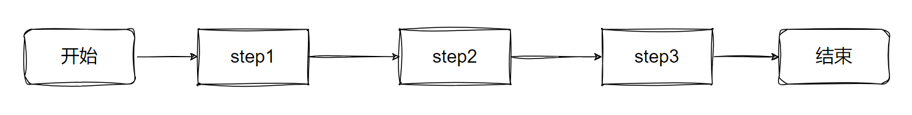

### 分支

分支流程又叫条件控制语句或者分支语句或者选择语句，是通过条件判断来决定执行的代码。

#### 单分支

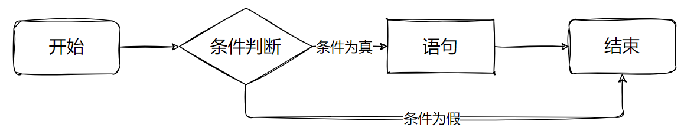

###### 语法

```python
if 表达式:
    语句
```
###### 说明

Python程序语言指定任何非0和非空（null）值为true，0 或者 null为false。

if语句的判断条件可以用条件表达式来表示其关系，后面的:必须加。其中"判断条件"成立时（非零），则执行后面的语句，而执行内容可以多行，以缩进来区分表示同一范围，缩进取消后，就不在分支范围了。如果条件不成立，不执行语句块内容。

###### 案例

商品价格50，若余额小于50则提示“余额不足，请充值”，最后打印“欢迎下次光临”。

```python
from random import randint

# 余额
balance = randint(0, 100)
# 价格
price = 50
# 打印余额
print(f"余额：{balance}")
# 比较余额和价格
if balance < price:
    print("余额不足，请充值")
print("欢迎下次光临")
```

简单的语句组:你也可以在同一行的位置上使用if条件判断语句，例如

```python
var = 100 
if ( var  == 100 ) : print("变量 var 的值为100")
print("Good bye!")
```
#### 双分支

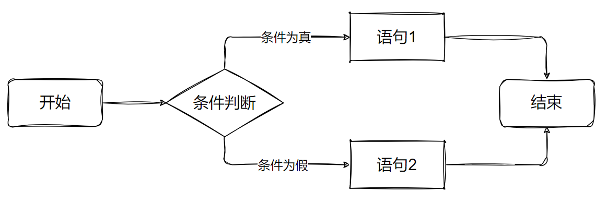

###### 语法

```python
if 表达式:
    语句1
else:
    语句2
```
###### 说明

先进行条件判断，如果条件判断成立就执行语句块1， 条件不成立就执行语句块2

###### 案例

余额随机，商品价格50。

**若余额小于50则提示“余额不足，请充值”。**

**否则提示消费成功。**

最后打印“欢迎下次光临”。

```python
from random import randint

# 余额
balance = randint(0, 100)
# 价格
price = 50
# 打印余额
print(f"余额：{balance}")
# 比较余额和价格
if balance < price:
    # 如果余额小于价格
    print("余额不足，请充值")
else:
    # 如果余额大于价格
    balance = balance - price
    print(f"消费成功，余额：{balance}")
print("欢迎下次光临")
```
#### 多分支

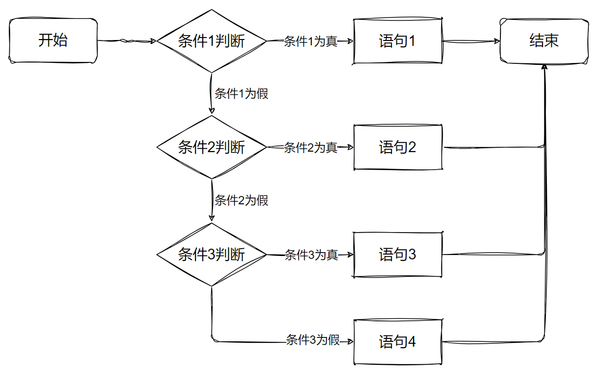

###### 语法

```python
if 表达式1:
    语句1
elif 表达式2:
    语句2
elif 表达式3:
    语句3
else:  # else如不需要可以省略
    语句4
```
###### 说明

if 语句后面可以跟 elif…else 语句，这种语句可以检测到多种可能的情况，所以也称之为多分支结构。

如果条件判断1成立，那么执行语句块1的内容；如果条件判断2成立，那么执行语句块2的内容；如果条件判断3成立，那么执行语句块3的内容；如果条件判断1，2，3都不成立，那么执行语句块4的内容；

使用多分支语句的时候，需要注意下面几点：

```python
if 语句至多有1个else语句，else语句在所有的else if语句之后。
if语句可以有若干个 elif 语句，它们必须在else语句之前。
一旦其中一个分支语句检测为 true，其他的elif以及else语句都将不再执行。
```
###### 案例

判断处于人生哪个阶段。

**如果年龄小于2岁，就打印一条消息，指出这个人是婴儿。**

**如果年龄为2（含）～4岁，就打印一条消息，指出这个人是幼儿。**

**如果年龄为4（含）～13岁，就打印一条消息，指出这个人是儿童。**

**如果年龄为13（含）～20岁，就打印一条消息，指出这个人是青少年。**

**如果年龄为20（含）～65岁，就打印一条消息，指出这个人是成年人。**

**如果年龄超过65岁（含），就打印一条消息，指出这个人是老年人。**

```python
from random import randint

# 定义年龄并打印
print("此人年龄为", age := randint(0, 100))
if age < 2:
    # 如果年龄<2
    print("这是个婴儿")
elif age < 4:
    # 如果2<=年龄<4
    print("这是个幼儿")
elif age < 13:
    # 如果4<=年龄<13
    print("这是个儿童")
elif age < 20:
    # 如果13<=年龄<20
    print("这是个青少年")
elif age < 65:
    # 如果20<=年龄<65
    print("这是个成年人")
else:
    # 如果65<=年龄
    print("这是个老人")
```
#### 嵌套分支

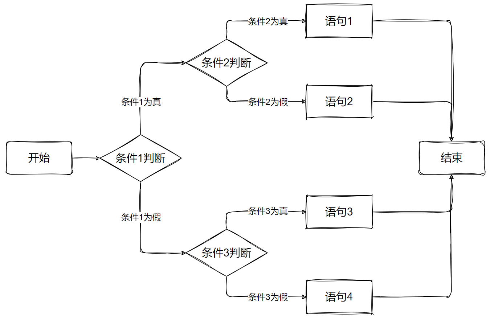

###### 语法

```python
if 表达式1:
    if 表达式2:
        语句1
    else:
        语句2
else:
    if 表达式3:
        语句3
    else:
        语句4
```
###### 说明

在一个if语句中，又包含另外一个if语句，这就是if语句的嵌套

###### 案例

给定一个三位的状态码，左边第一位标识大小写状态（1-大写，0-小写），第二位标识输入法语言（1-简体中文，0-英语），第三位标识输入法模式（1-中文，0-英文）。判断输入法的状态：

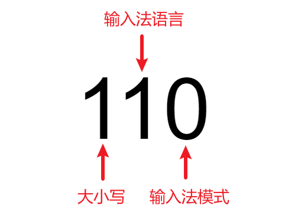

**如果是大写状态，打印“大写状态”。**

**如果不是大写状态，判断输入法语言是“简体中文-微软拼音”还是“英语-美式键盘”。**

**如果是“简体中文-微软拼音”，判断是中文模式还是英文模式，并打印。**

**如果是“英语-美式键盘”，打印“英语-美式键盘”。**

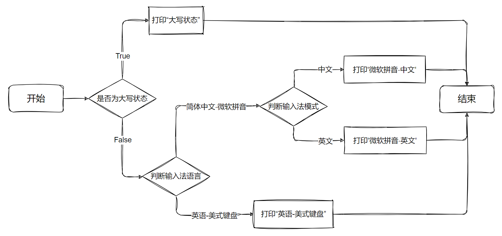

```python
state = 0b011
# 判断是否为大写状态
if state & 0b100 == 0b100:
    # 是大写状态
    print("大写状态")
else:
    # 不是大写状态
    # 判断是否为“简体中文-微软拼音”
    if state & 0b010 == 0b010:
        # 是“简体中文-微软拼音”
        # 判断是否为“微软拼音-中文”
        if state & 0b001 == 0b001:
            # 是“微软拼音-中文”
            print("微软拼音-中文")
        else:
            # 不是“微软拼音-中文”
            print("微软拼音-英文")
    else:
        # 不是“简体中文-微软拼音”
        print("英语-美式键盘")
```
#### match case语句

###### 语法

```python
match x:
    case a:
        语句1
    case b:
        语句2
    case _:
        语句3
```
###### 说明

Python3.10新增了match case的条件判断方式，match后的对象会依次与case后的内容匹配，匹配成功则执行相应语句，否则跳过。其中_可以匹配一切。

###### 案例

给定月份，求该月有多少天。

| 是专门用于模式匹配的操作符，它能把多个常量或者模式组合起来，实现 “或” 逻辑。

```python
match month := 3:
    case 1 | 3 | 5 | 7 | 8 | 10 | 12:
        print(f"{month}月有31天")
    case 4 | 6 | 9 | 11:
        print(f"{month}月有30天")
    case 2:
        print(f"{month}月可能有28天")
    case _:
        print(f"{month}月有?天")
```
#### 三目运算符

###### 语法

```python
表达式1 if 判断条件 else 表达式2
```
###### 案例

使用 if 来获取两个数中较大的一个。

```python
num1 = 2
num2 = 3
if num1 > num2:
    max_num = num1
else:
    max_num = num2
print(max_num)
```

以上代码可以通过三目运算符改写。

```python
num1 = 2
num2 = 3
max_num = num1 if num1 > num2 else num2
print(max_num)
```
### 循环

在满足某个条件下，重复的执行某段代码。

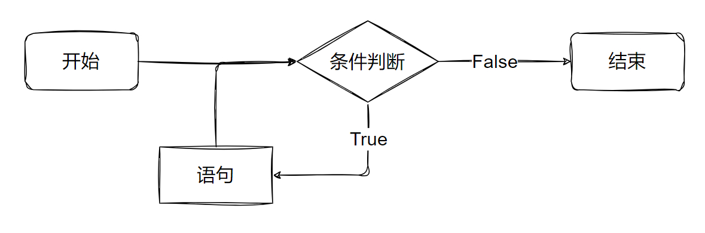

#### while循环

###### 语法

```python
while 表达式:
    语句-循环体
```
###### 说明

先判断条件是否成立，如果条件成立就执行循环体一次；然后再判断条件是否成立，如果成立，继续执行循环体，直到循环条件不成立的时候，才会结束循环，执行循环下面的其他语句。判断条件可以是任何表达式，任何非零、或非空（null）的值均为true。执行语句可以是单个语句或语句块。

如果条件表达式一直成立，那称之为无限循环，也叫死循环。

###### 案例

**第1周有2只兔子，此后每周兔子的数量都增加上周数量的2倍，且期间没有兔子死亡，求第10周共有多少只兔子：**

```python
rabbit = 2
week = 1
while week < 10:
    rabbit = rabbit + rabbit * 2
    week += 1
    print(f"第{week}周有{rabbit}只兔子")
```
**打印进度条：**

```python
import time

num = 1
while num < 100:
    print("\r" + "=" * num, end="")
    num += 1
    time.sleep(0.05)
```
###### while else语句

while 后可以加上 else，当 while 表达式结果为 False 时会执行 else 中的语句。

```python
rabbit = 2
week = 1
while week < 10:
    rabbit = rabbit + rabbit * 2
    week += 1
else:
print(f"第{week}周有{rabbit}只兔子")
```

此时else中代码，写在else中和写在循环外效果一样。else一般和 break一起使用，循环通过break终止后，else中的代码不会执行。

#### for循环

###### 语法

for 循环可以用来遍历可迭代对象，如列表或字符串。

```python
for 临时变量 in 可迭代对象:
    语句
```

for 循环后也可以加上 else，循环结束后会执行 else 中语句。

```python
for 临时变量 in 可迭代对象:
    语句1
else:
    语句2
```
###### 说明

for是关键字

临时变量是自己定义的用来存储遍历出来元素的变量名字

in是关键字

可迭代对象是要遍历的序列

首先判断是否有下一个元素可以获取

如果有，则将元素取出，赋值给临时变量

继续判断是否有下一个元素可以进行取出

直到将所有元素都取出，循环结束

###### 案例

**遍历列表**

```python
for i in [2, 3, 5, 7, 11, 13, 17, 19]:
    print(i)
```
**遍历字符串**

```python
for i in "hello world":
    print(i)
```
**遍历range数列**

```python
for i in range(10):
    print(i)
```
###### range()

作用：函数可以生成数列，它返回一个可迭代对象。

语法：range([start,] stop[, step])

**start: 生成序列的起始值--包含  默认0**

**stop:生成序列的结束值--不包含**

**step:生成序列的步长 默认为1**

如果为正数：生成的序列是递增的，要求起始值 < 结束值

如果为负数：生成的序列是递减的，要求起始值 > 结束值

如果stop小于或等于 start且step为正数，或者stop大于或等于start且step为负数，range() 函数将生成一个空序列。

指定生成到stop（不包含stop）的数列，默认从0开始。

```python
for i in range(10):
    print(i)
```

指定生成数列的范围，从start到stop（不包含stop），可设定步长，默认步长为1，步长可正可负。

```python
for i in range(-10, 10):
    print(i)

for i in range(10, -10, -3):
    print(i)
```
###### 嵌套循环

使用嵌套循环打印九九乘法表。

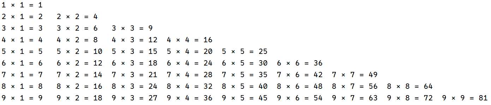

```python
for i in range(1, 10):
    for j in range(1, i + 1):
        print(f"{i} × {j} = {i * j}", end="\t")
    print()
```
#### continue

跳过当前循环块中的剩余语句，继续进行下一轮循环。一般写在if判断中。

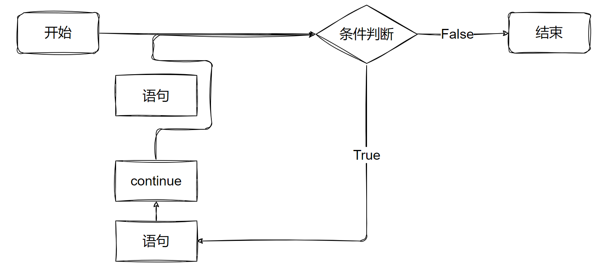

案例：打印0-9，跳过偶数。

```python
for i in range(10):
    if i % 2 == 0:
        continue
    print(i)
```
#### break

跳出当前for或while的循环体，一般写在if判断中。

如果for 或while循环通过break终止，循环对应的else 将不执行。

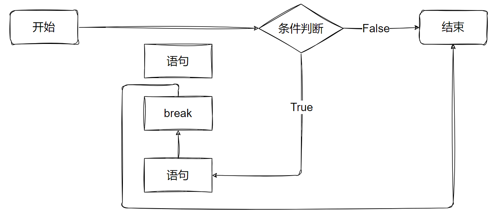

案例：求0-9每个数自己幂自己的加和，如果大于10000000则循环终止。

```python
sum = 0
for i in range(10):
    sum = sum + i**i
    if sum > 10000000:
        break
    print(i, sum)
else:
    print("循环完成,sum = ", sum)
```
#### pass

pass是空语句，是为了保持程序结构的完整性。

pass不做任何事情，一般用做占位语句。

例如：在一个循环中，如果循环体为空，语法会提示报错，

这个时候我们就可以使用pass占位

```python
for i in range(10):
    pass
```
