# 尚硅谷大模型技术之Python

*（作者：尚硅谷研究院）*

**版本：V1.0**

## 概述

### 计算机的组成

#### 什么是计算机

计算机（computer）俗称电脑，是现代一种用于高速计算的电子计算机器，可以进行数值计算，又可以进行逻辑计算，还具有存储记忆功能。是能够按照程序运行，自动、高速处理海量数据的现代化智能电子设备。由硬件系统和软件系统所组成，没有安装任何软件的计算机称为裸机。--百度百科【计算机】

#### 硬件

硬件（英文名Hardware），计算机硬件是指计算机系统中由电子，机械和光电元件等组成的各种物理装置的总称。这些物理装置按系统结构的要求构成一个有机整体为计算机软件运行提供物质基础。--百度百科【硬件】

计算机由运算器、控制器、存储器、输入设备和输出设备等五个逻辑部件组成

**运算器**

运算器由算术逻辑单元（ALU）、累加器、状态寄存器、通用寄存器组等组成。

算术逻辑运算单元（ALU）的基本功能为加、减、乘、除四则运算，与、或、非、异或等逻辑操作，以及移位、求补等操作。

**控制器**

控制器（Control Unit），是整个计算机系统的控制中心，它指挥计算机各部分协调地工作，保证计算机按照预先规定的目标和步骤有条不紊地进行操作及处理。

**中央处理器**

中央处理器（CentralProcessingUnit，CPU），由运算器和控制器组成，是任何计算机系统中必备的核心部件。CPU由运算器和控制器组成，分别由运算电路和控制电路实现。

**存储器**

存储器（Memory）是计算机系统中的记忆设备，用来存放程序和数据。

计算机中全部信息，包括输入的原始数据、计算机程序、中间运行结果和最终运行结果都保存在存储器中。它根据控制器指定的位置存入和取出信息。有了存储器，计算机才有记忆功能，才能保证正常工作。

**输入设备**

向计算机输入数据和信息的设备。是计算机与用户或其他设备通信的桥梁。输入设备是用户和计算机系统之间进行信息交换的主要装置之一。

**输出设备**

输出设备（Output Device）是计算机的终端设备，用于接收计算机数据的输出显示、打印、声音、控制外围设备操作等。也是把各种计算结果数据或信息以数字、字符、图像、声音等形式表示出来。

#### 软件

软件（英文：Software）是一系列按照特定顺序组织的计算机数据和指令的集合。一般来讲软件被划分为系统软件、应用软件和介于这两者之间的中间件。

--百度百科【软件】

**系统软件**

系统软件是各类操作系统，如Dos、windows、Linux、UNIX、Mac、Android、IOS等，还包括操作系统的补丁程序及硬件驱动程序，都是系统软件类。

**应用软件**

应用软件可以细分的种类就更多了，如QQ、酷我、暴风、微信软件等都属于应用软件类。

### 程序和编程语言

当我们要让计算机帮我们解决问题时，就需要编写程序。

程序是一组计算机能识别和执行的指令，这些指令由数字、字符和语法规则组成，它通常是用某种计算机编程语言编写的。

计算机编程语言，便是我们与计算机沟通的工具，就像我们交流使用的语言一样，只不过是人与计算机之间通讯的语言。

计算机只能执行二进制代码，程序设计语言一般类似英文，想要让计算机理解你写的程序，必须把程序代码“翻译”成计算机能理解的二进制代码，根据翻译形式的不同，可以分为：

**编译：将程序代码翻译成计算机能理解的二进制目标代码，会生成特定的可执行代码（在window上是exe文件），可执行代码是二进制的，无法看到源码。然后执行可执行代码就可以得到结果，如C语言、C++等。**

**解释：将程序代码一句一句翻译为计算机可以执行的指令，立即执行，不会生成可执行文件，如Python、Php、JavaScript等。**

### 计算机语言简史

#### 第一代：机器语言

1946年2月14日，世界上第一台计算机ENIAC诞生，使用的是最原始的穿孔卡片。这种卡片上使用的是二进制代码表示的语言，与人类语言差别极大，这种语言就称为机器语言。比如一段典型的机器码：

**0000,0000,000000010000 代表 LOAD A, 16**

**0000,0001,000000000001 代表 LOAD B, 1**

**0001,0001,000000010000 代表 STORE B, 16**

#### 第二代：汇编语言

使用英文缩写的助记符来表示基本的操作，比如：LOAD、MOVE等，使人更容易使用，这些助记符构成了汇编语言的基础。因此，汇编语言也称为符号语言。

优点：能编写高效率的程序。

缺点：汇编语言是面向机器的，不同计算机会有不同的汇编语言，程序不易移植。

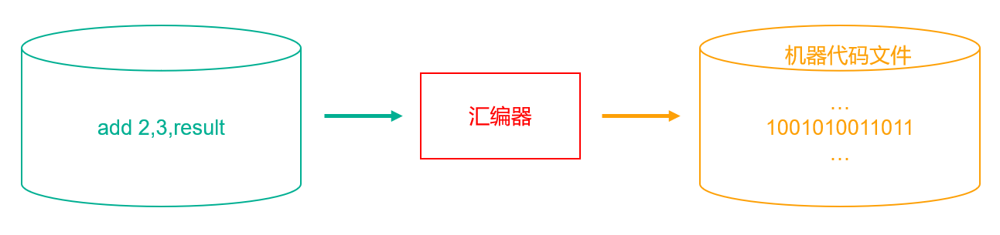

#### 第三代：高级语言

高级语言，是一种接近于人类使用习惯的程序设计语言，它允许程序员使用接近日常英语的指令来编写程序，程序中的符号和算式也与日常用的数学算式差不多，接近于自然语言和数学语言，容易被人们掌握。

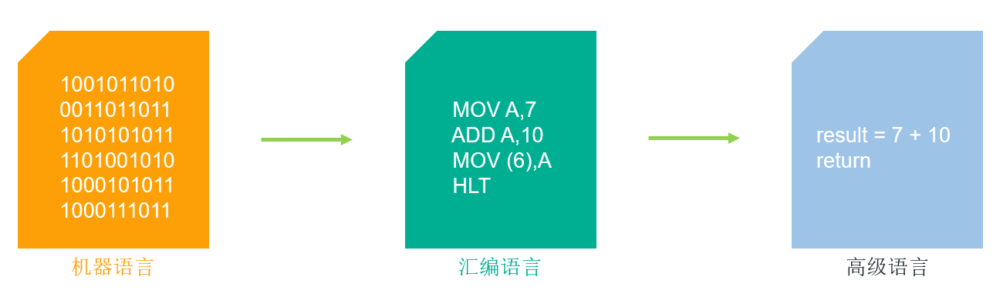

高级语言独立于计算机硬件，有一定的通用性；计算机不能直接识别和执行用高级语言编写的程序，需要使用编译器或者解释器，将高级语言转换为机器语言才能被识别和执行。


常见的高级语言有Fortran、ALGOL、Basic、COBOL、LISP、Pascal、PROLOG、C、C++、VB、Delphi、Java、PHP、JavaScript、Python等，我们主要学习的是Python。

下图是TIOBE在2025年01月份统计的热门语言排行

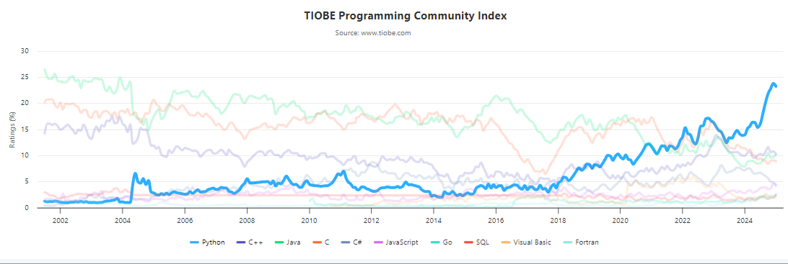


### 为什么学习Python

#### Python起源


作者是荷兰人Guido van Rossum（吉多·范罗苏姆），1982年从阿姆斯特丹大学获得了数学和计算机硕士学位。然而，尽管他算得上是一位数学家，但他更加享受计算机带来的乐趣。

在那时，Guido接触并使用过诸如Pascal、C、Fortran等语言。这些语言的基本设计原则是让机器能更快运行。但为了增进效率，语言也迫使程序员像计算机一样思考。这种编程方式让Guido感到苦恼。即使Guido知道如何用C语言写出一个功能，但整个编写过程却也需要耗费大量的时间。他的另一个选择是shell。Bourne Shell(是一个交换式的命令和命令编程语言)作为UNIX系统的解释器已经长期存在。shell可以像胶水一样，将UNIX下的许多功能连接在一起。许多C语言下上百行的程序，在shell下只用几行就可以完成。

Guido希望有一种语言既能像C语言那样全面调用计算机的功能接口，又可以像shell那样轻松的编程。1989年，为了打发聊的圣诞节假期，Guido开始编写Python语言的编译器。Python这个名字，来自Guido所挚爱的电视剧Monty Python's Flying Circus(飞行马戏团)。他希望这个新的叫做Python的语言，能符合他的理想：创造一种C和shell之间，功能全面，易学易用，可拓展的语言。

Python的设计哲学是“优雅”、“明确”、“简单”。

用一种方法，最好是只有一种方法来做一件事，如果面临多种选择，Python 开发者一般会拒绝花俏的语法，而选择明确没有或者很少有歧义的语法。

Python第一个公开发行版发行于1991年。

#### Python能做什么

作为一个实用主义的学习者，最关心的问题一定是 “我为什么要选择学 Python，学会之后我可以用来做什么？”

首先，对于初学者来说，比起其他编程语言，Python 更容易上手。

Python 的设计哲学是优雅、明确、简单。在官方的 The Zen of Python（《Python 之禅》）中，有这样一句话，There should be one-- and preferably only one --obvious way to do it. Python 追求的是找到最好的解决方案。相比之下，其他语言追求的是多种解决方案。

如果你试着读一段写的不错的 Python 代码，会发现像是在读英语一样。这也是 Python 的最大优点，它使你能够专注于解决问题而不是去搞明白语言本身。

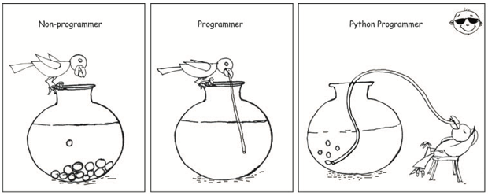

以上漫画形容了Python开发者是多么轻松

其次，Python功能强大，很多你本来应该操心的事情，Python都替你考虑到了。当你用 Python语言编写程序的时候，你不需要考虑如何管理你的程序使用的内存之类的底层细节。并且Python有很丰富的库，其中有官方的，也有第三方开发的，你想做的功能模块很有可能已经有人写好了，你只需要调用，不需要重新发明轮子。这就像是拥有了智能手机，可以任意安装需要的 app。

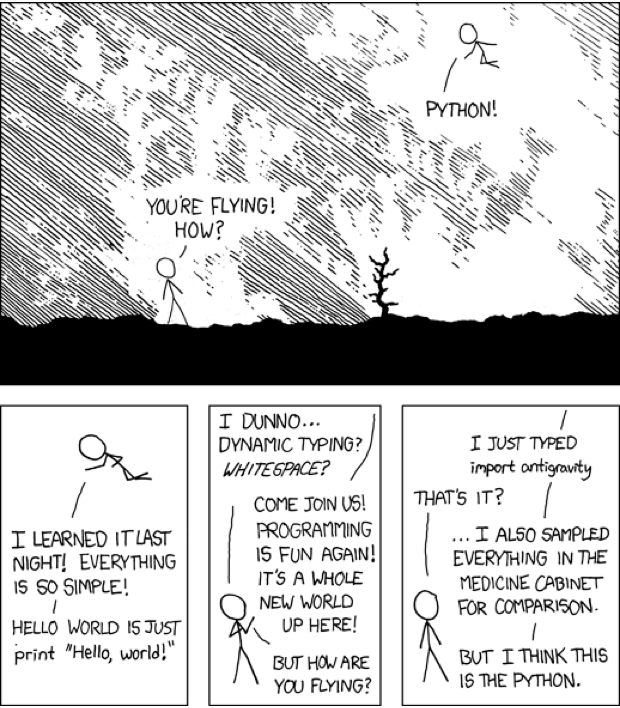

这幅漫画形容了 Python 的库有多强大，导入一个反重力库就可以飞起来了。

第三，Python 能做的事情有许多（应用面广），主要应用场景如下：

Web应用开发

拥有Django、Flask等丰富的Web开发框架，能够快速完成网站的开发和Web服务，像Google、豆瓣等都有使用。

网络爬虫

可按照一定规则自动抓取互联网信息，用于爬取图片、数据等，在新闻采集、数据挖掘、网站监测、舆情分析等方面应用广泛。

系统网络运维

适合将运维工作中的大量重复性工作自动化，如管理、监控、发布系统等，可提高工作效率。

数据分析与科学计算

广泛应用于科学与数字分析，常用Numpy、Scipy等库。可进行数据处理、清洗、转换和计算，还能实现统计分析和数据可视化，帮助理解数据规律和趋势。

人工智能与机器学习

是人工智能的主要开发语言，拥有TensorFlow、Keras等众多相关库，可用于机器学习、自然语言处理和计算机视觉等领域。

办公自动化

可用于处理ppt文件、图片处理、文件备份、系统监控等，还能与Excel、Word文档结合，实现数据清洗、分析、批量操作等。

金融分析与量化交易

可高效处理大量金融数据，开发量化交易模型，进行回测和性能评估、风险管理、算法交易和自动化交易以及金融可视化和报告生成等。

3D游戏开发

有Pygame、Pykyra等很好的3D渲染库和游戏开发框架，可用于网络游戏开发等。

桌面GUI应用

Tkinter库可用于设计用户界面，PyQt、Kivy等工具包则有助于跨平台设计UI应用。

教育领域

作为一种对初学者友好的编程语言，拥有简单的学习曲线和丰富的学习资源，常被用于开发教育程序和在线课程。

#### Python特点

###### Python优点

**易于学习：Python有相对较少的关键字，结构简单，和一个明确定义的语法，学习起来更加简单。**

**广泛的标准库：Python最大的优势之一就是有着丰富的库。Python拥有一个强大的标准库，Python语言的核心只包含一些常见类型和函数，而Python标准库提供了系统管理、网络通信、文本处理、数据库接口、图形系统、XML处理等额外的功能。**

**大量的第三方模块：Python社区提供了大量的第三方模块，使用方式与标准库类似。它们的功能覆盖科学计算、人工智能、机器学习、Web开发、数据库接口、图形系统等多个领域。**

**互动模式：可以从终端输入执行代码并立即获得结果。**

**可移植：基于其开放源代码的特性，Python已经被移植（也就是使其工作）到许多平台。**

**可扩展：如果需要一段运行很快的关键代码，或者是想要编写一些不愿开放的算法，你可以使用C或C++完成那部分程序，然后从你的Python程序中调用。**

**免费、开源。**

###### Python缺点

**运行速度慢：和C程序相比非常慢，因为Python是解释型语言，代码在执行时会一行一行地翻译成CPU能理解的机器码，这个翻译过程非常耗时。而C程序是运行前直接编译成CPU能执行的机器码。**

**代码不能加密：如果要发布Python程序，实际上就是发布源代码，这一点跟C语言不同，C语言不用发布源代码，只需要把编译后的机器码（也就是在Windows上常见的exe文件）发布出去。所以，凡是编译型的语言都没有这个问题，而解释型的语言则必须把源码发布出去。**

### Python版本

Python有2个版本，Python2 和 Python3。

2020年1月1日，官方宣布，停止 Python 2 的更新，Python 2.7被确定为最后一个 Python 2.x 版本

Python 3.x 是现在和未来主流的版本。相对于Python的早期版本是一个比较大的升级，且为了不带入过多的累赘， Python 3.0在设计的时候没有考虑向下兼容，因而许多早期Python版本设计的程序都无法在 Python 3.0上正常执行。但随着Python3使用越来越广泛，大部分新项目开始使用Python3，且大部分三方库已经支持Python3.x,Python3.x已经成为趋势。

Python 3.0发布于2008年

Python 3.13.1发布于2024年12月

当前课程使用的版本是Python3.12.8

### Python解释器

当我们编写Python代码时，我们得到的是一个包含Python代码的以.py为扩展名的文本文件。要运行代码，就需要Python解释器去执行.py文件。

由于整个Python语言从规范到解释器都是开源的，所以理论上，只要水平够高，任何人都可以编写Python解释器来执行Python代码（当然难度很大）。事实上，确实存在多种Python解释器。

CPython

当我们从Python官方网站下载并安装好Python 3.x后，我们就直接获得了一个官方版本的解释器：CPython。这个解释器是用C语言开发的，所以叫CPython。在命令行下运行python就是启动CPython解释器。

CPython是使用最广的Python解释器。教程的所有代码也都在CPython下执行。

IPython

IPython是基于CPython之上的一个交互式解释器，也就是说，IPython只是在交互方式上有所增强，但是执行Python代码的功能和CPython是完全一样的。好比很多国产浏览器虽然外观不同，但内核其实都是调用了IE。

CPython用>>>作为提示符，而IPython用In [序号]:作为提示符。

PyPy

PyPy是另一个Python解释器，它的目标是执行速度。PyPy采用JIT技术，对Python代码进行动态编译（注意不是解释），所以可以显著提高Python代码的执行速度。绝大部分Python代码都可以在PyPy下运行，但是PyPy和CPython有一些是不同的，这就导致相同的Python代码在两种解释器下执行可能会有不同的结果。如果你的代码要放到PyPy下执行，就需要了解PyPy和CPython的不同点。

Jython

Jython是运行在Java平台上的Python解释器，可以直接把Python代码编译成Java字节码执行。

IronPython

IronPython和Jython类似，只不过IronPython是运行在微软.Net平台上的Python解释器，可以直接把Python代码编译成.Net的字节码。

小结

Python的解释器很多，但使用最广泛的还是CPython。如果要和Java或.Net平台交互，最好的办法不是用Jython或IronPython，而是通过网络调用来交互，确保各程序之间的独立性。

## 快速入门

### 安装Python

为了让计算机能够执行Python代码，我们需要Python解释器，从官网上下载的Python中内置解释器。

Python官网地址：

**进入官网，点击Downloads，选择对应的操作系统。**


**选择版本，点击链接下载，我们这里的版本是3.12.8。**

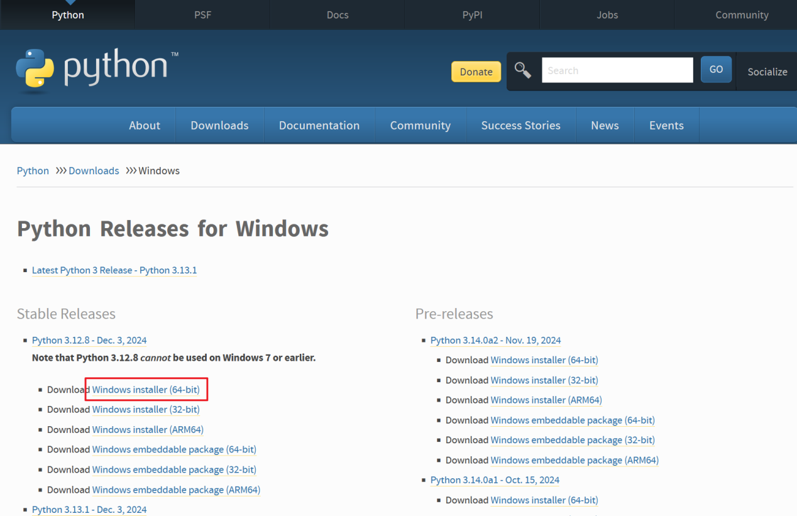

这里主要有两类安装包

“install” 安装包

最常见的用于在桌面系统、服务器等常规环境中完整安装 Python 的方式。无论是开发者想要搭建一个本地的开发环境用于 Web 开发、数据分析，还是普通用户希望在电脑上运行一些基于 Python 的脚本程序，都会选择这种安装包。比如，你要在个人电脑上使用 Python 结合 Django 框架开发一个网站，那就需要下载常规的 “install” 安装包，安装完成后系统会自动配置好各种环境变量、关联文件类型等，方便后续开发使用。

通常包含完整的 Python 标准库、解释器以及一些辅助工具（如 pip 用于安装第三方库）等。以 Python 3.10 的 “install” 安装包为例，安装完成后占用的磁盘空间相对较大，一般可能达到几十兆甚至上百兆，这是因为它要确保用户在各种常规开发场景下所需的功能都一应俱全，能够 “开箱即用”。

安装过程相对复杂一些，对于 Windows 系统，会自动设置系统环境变量 PATH，安装目录下会有完整的 bin、include、lib 等文件夹结构，用户安装完成后可以直接在命令提示符（CMD）或者终端中输入 “python” 命令启动解释器，使用 “pip install” 命令安装第三方库也非常便捷。

“embeddable” 可嵌入安装包

主要设计用于将 Python 嵌入到其他应用程序中。例如，有一款用 C++ 编写的图形处理软件，开发者想要为其添加一些脚本扩展功能，允许用户通过编写 Python 脚本来实现个性化的图像处理操作，这时就可以使用 “embeddable” 安装包。将 Python 以一种精简、可控的方式嵌入到已有软件中，避免引入过多不必要的组件，同时又能利用 Python 的强大功能。

它只包含最核心的 Python 解释器以及一些必要的基础组件，不包含完整的标准库。其目的是在嵌入其他应用时尽量减少冗余内容，所以文件大小通常只有几兆，方便集成到其他应用程序中，而不会大幅增加宿主应用的体积。

它不会像常规安装包那样自动配置系统环境变量。在嵌入应用程序时，开发者需要手动进行一些设置，比如指定 Python 解释器的路径，根据需求选择性地引入部分标准库等。使用方式更多是从宿主应用程序内部调用 Python 的功能，而不是像常规安装包那样供用户直接在系统层面独立使用。

综上所述，选择使用哪种 Python 安装包取决于具体的需求，是要搭建一个通用的开发环境，还是将 Python 功能巧妙地嵌入到已有应用之中。很明显我们属于第一种情况，所以选择Install安装包。

**双击下载好的文件，开始安装。**

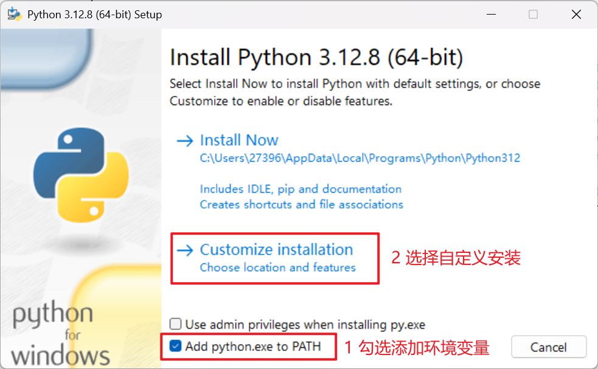

**保持默认，点击Next。**

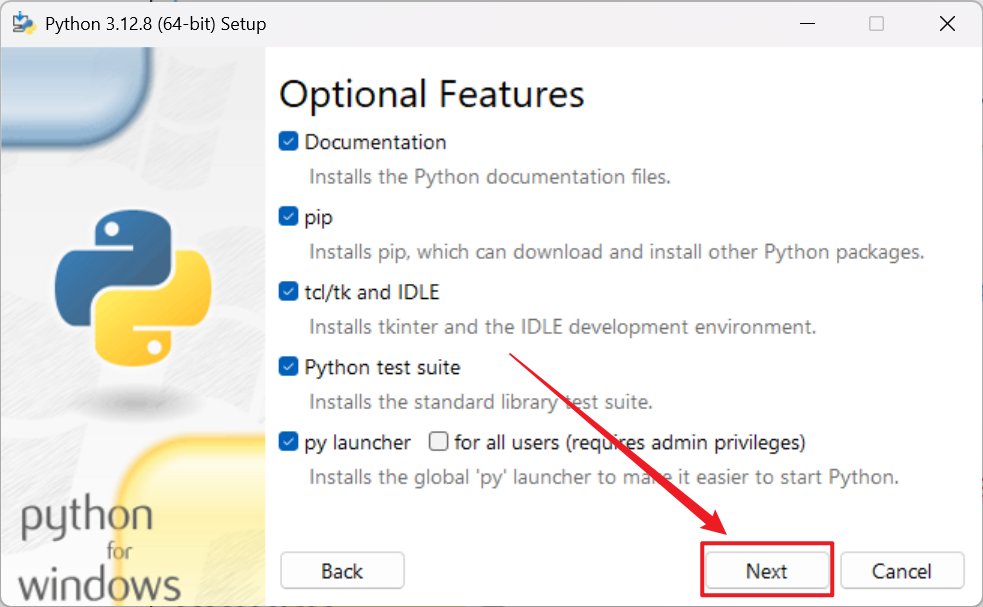

**修改安装路径，其他保持默认，点击Install开始安装。**


**点击Disable python length limit，点击close，完成安装。**

禁用系统的路径长度自动限制，以避免因路径过长而导致的错误

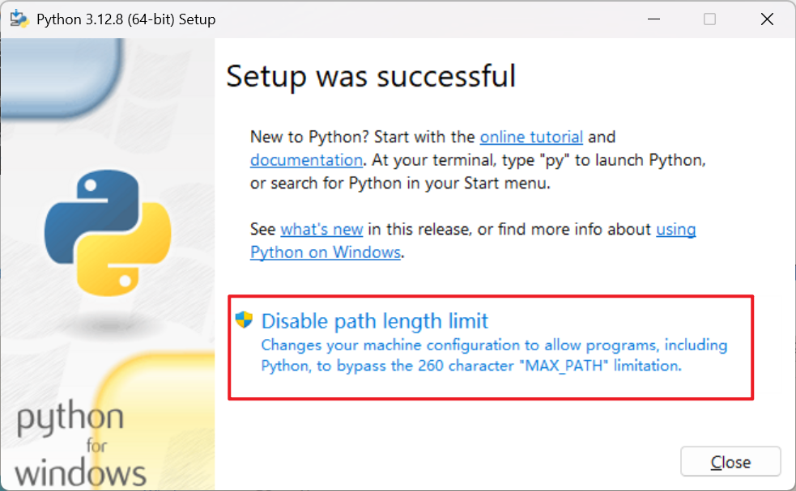

**安装完成后检查是否安装成功。同时按下 Win键 和 R ，输入 cmd ，点击确定，进入命令提示符。**

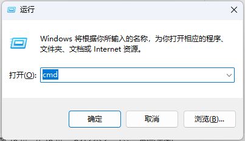

**输入python --version，打印出Python版本，安装成功。**


### 安装PyCharm

#### 什么是IDE

集成开发环境（简称：IDE；英文名：Integrated Development Environment ）是用于提供程序开发环境的应用程序，一般包括代码编辑器、编译器、调试器和图形用户界面等工具。集成了代码编写功能、分析功能、编译功能、调试功能等多种功能。

虽然我们也可以使用记事本编写代码，并通过命令行调用Python解释器来执行Python程序。但这样比较繁琐，会降低开发效率。而使用IDE后，很多工作可以交给IDE帮我们去做，让我们可以专注于代码的编写。

Python的IDE我们选择使用PyCharm。

#### PyCharm下载

PyCharm官方地址：

进入官网，点击左下角下载PyCharm安装包，专业版可试用30天，社区版完全免费。

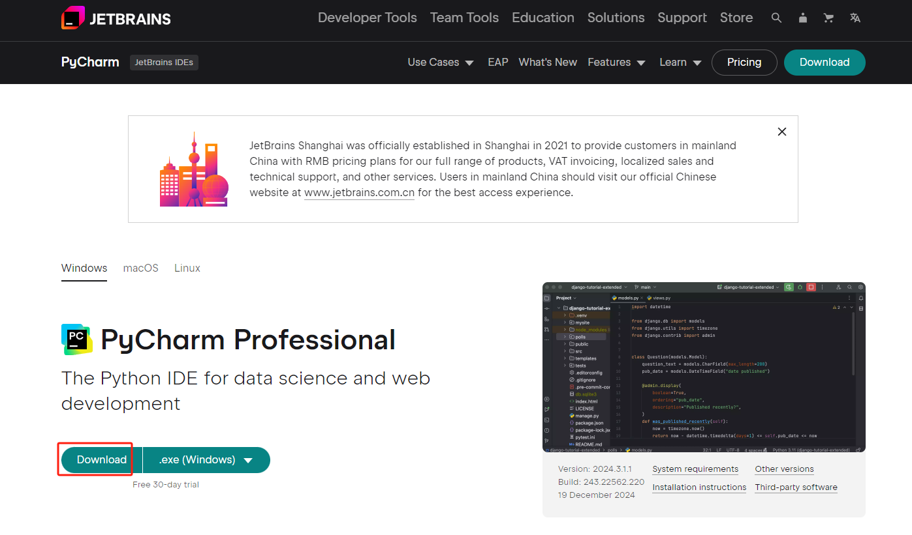

#### PyCharm安装

**双击安装包进入安装。**

**点击下一步。**

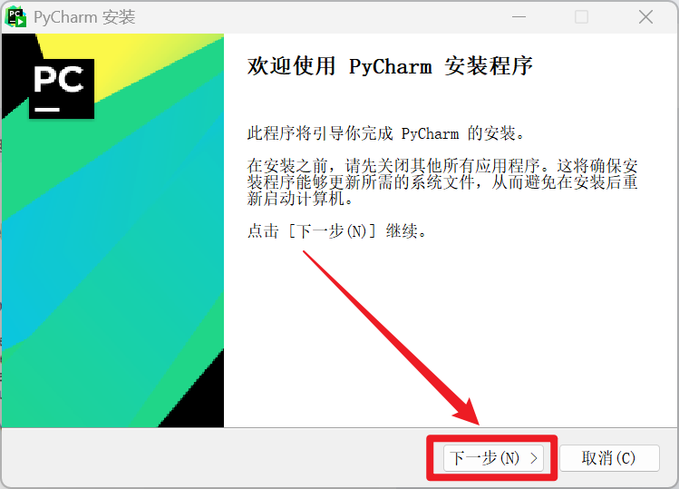

**修改安装目录，点击下一步。**


**酌情勾选安装选项，之后点击下一步。**


**点击安装。**

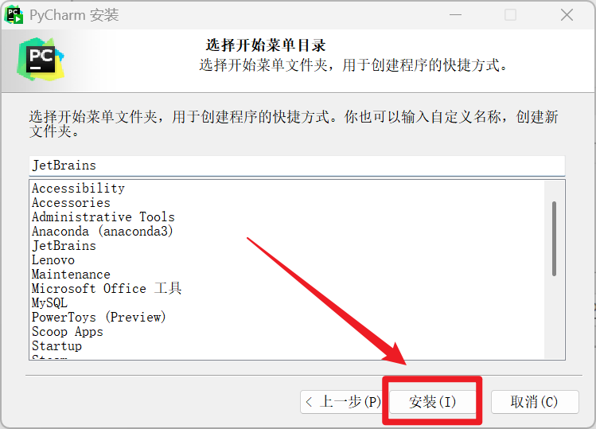

**安装完成。**


#### PyCharm设置

###### 创建新项目

**点击 New Project 创建新项目。**


**设置项目名称，项目路径，解释器类型，Python版本。**

注意：不同的pycharm版本，看到的界面会略有不同

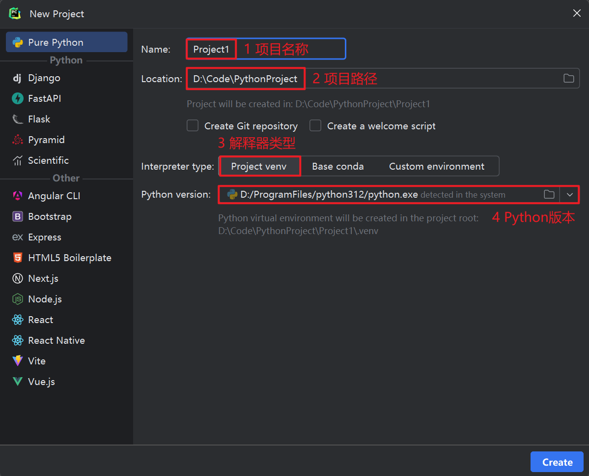

解释器类型说明：

Project venv:

当前项目的虚拟环境，python版本可以在右侧小箭头下拉选择，在当前项目内安装的包只会在项目内有效，在项目目录下会有一个.venv目录。

Base Conda:

Anaconda环境，Anaconda是一个集成了大量python包的python环境，如果选择这个需要先在电脑内安装Anaconda。

Custom environment：

自定义环境，可以：

generate new新建虚拟环境（选择本机已安装的python或下载新的python作为BasePython）

generate new表示为新项目基于你所选择虚拟环境中的python作为Base python生成一个虚拟环境，生成后放在其项目文件夹下的venv中，使用venv作为解释器。这里所选择的虚拟环境中已安装的第三方库并不会出现在新生成的项目下的venv中，可以说只是将已安装的虚拟环境下的python复制了一份到项目下的venv中，所有需要使用的第三方库都需要重新安装。它可以脱离系统安装的python独立运行，它对于自身venv的修改也只影响它自身。当然它的基础虚拟环境是基于Base python进行建立的,所以使用conda在其Basepython中安装第三官方库对这里新建的项目环境没有影响

Select existing选择已配置好的虚拟环境

Select existing表示选择已安装的虚拟环境作为自己的编译器，并不会在项目文件夹下产生项目本身的venv，所选择的虚拟环境中的所有已安装的第三方包都可以使用，而不用重新安装。

**一个Python项目创建成功。**


###### 主题设置

**打开设置面板**


**进入Appearance&Behavior->Appearance，修改主题**

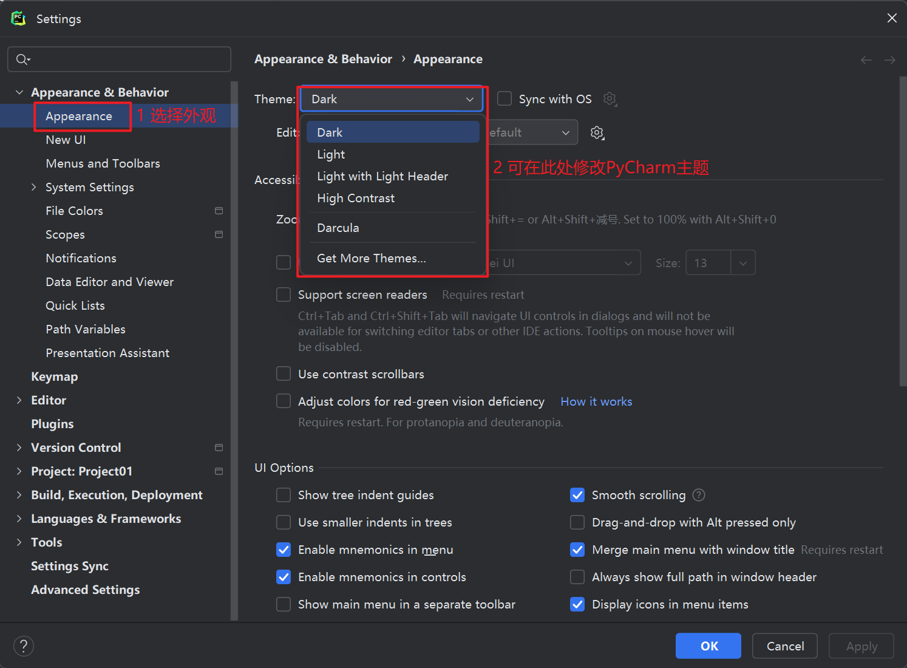

###### 字体设置

**进入Editor->Font设置字体**


###### 中文设置，建议使用默认的english

**首先确认已经安装了中文语言包**


**切换简体中文**

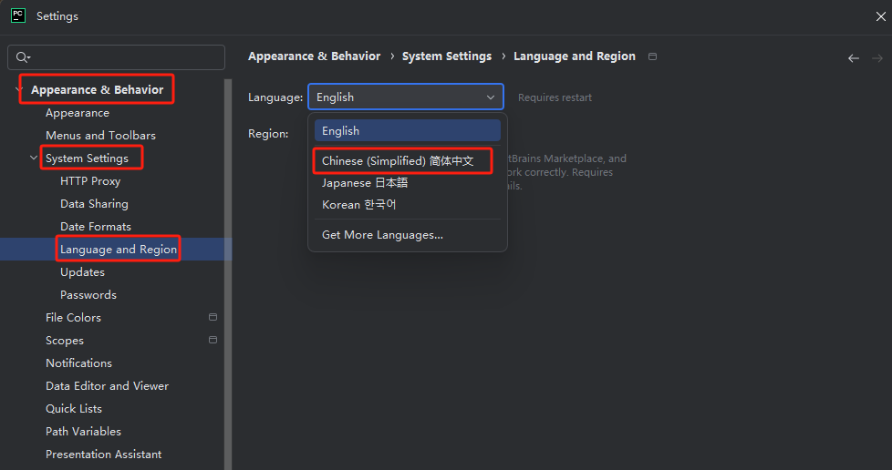

###### 快捷键设置

**在Keymap下可对快捷键进行设置。**


**常用快捷键：**

### 第一个Python程序

#### Python程序运行方式

有多种方式执行Python程序，以下是常见的三种方式：

**交互式命令行模式**

**脚本模式**

**集成开发环境（IDE）模式**

#### 交互式命令行模式

**同时按下 Win键 和 R ，并输入 cmd ，进入命令提示符。**

**在命令提示符中输入python，进入Python交互模式。**

**输入print(“hello”)，按下回车，控制台会打印hello。**


#### 脚本模式

**在 E:\Hello 路径下新建一个文件，将其重命名为 hello.py 。**

**双击此文件，选择使用记事本打开，在其中写入print(“hello”)，并保存。**

**在资源管理器上方输入 cmd 并回车，就会打开命令提示符并进入当前路径。或先打开命令提示符，再输入E: && cd Hello进入 E:\Hello 路径。**

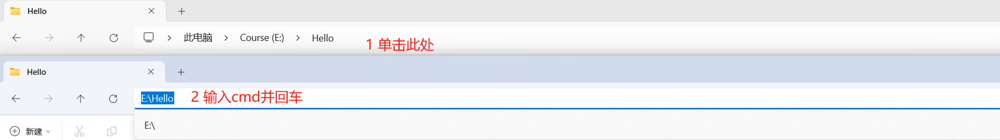

**在命令提示符中输入python hello.py执行程序。**


#### IDE模式

使用IDE运行Python程序，也是日后我们最常用的方式。

**在python-2025项目下创建一个新的目录chapter02**


**在chapter02目录下创建一个Python程序文件，输入**

```python
print("hello world")
```
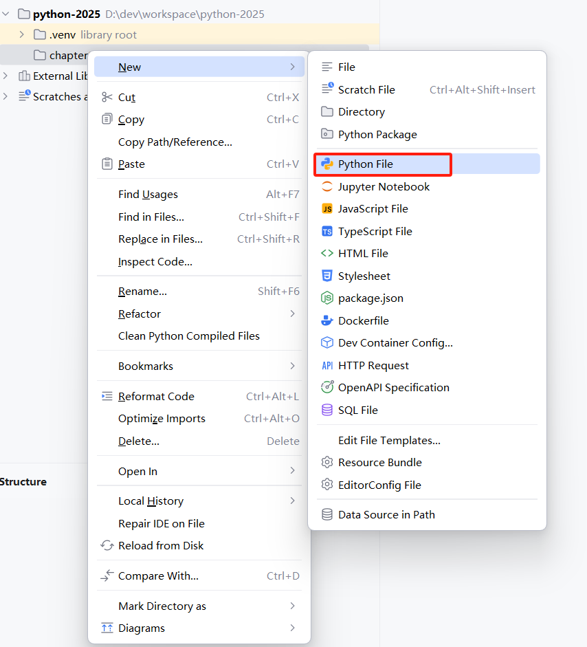


**Pycharm工作区空白处右键，单击 Run‘01_Hello_World’。**


**可以在下方控制台看到程序执行结果，打印出了 hello world 。**


## 基础知识

### 注释

#### 什么是注释

注释是对代码的解释说明。

注释是给程序员看的，在代码执行的时候不起任何作用，不影响程序的结构。

#### 注释的作用

提高代码的可读性。

屏蔽掉暂时不需要的代码

可以定位程序中出错的位置

#### 单行注释（行注释）

Python中 # 后的一行内的内容会被视为注释

```python
# print("hello world")
print("hello world")  # 打印hello world
```

为了保持注释的整洁，Python官方建议在#和注释的内容之间加一个空格，在语句和#之间加两个空格。

#### 多行注释（块注释）

Python中使用三个引号开始，三个引号结束（单引号或者双引号都可以），为多行注释

多行注释在说明文字需要换行时使用，不能嵌套

```python
"""
Hello World
hello world
"""
```

但实际上它是一个多行字符串

```python
print(
    """
    Hello World
    hello world
    """
)
```
### 变量

#### 什么是变量

变量是指在程序执行过程中，其值可以改变的量。在内存的数据区中，会为变量分配存储空间来存放变量的值，这个内存空间的地址对应着变量名称，所以在程序中可以通过变量名称来区分和使用这些内存空间。它的唯一目的是在内存中标记和存储数据,这些数据可以在整个程序中使用。

可以将变量理解为一个可以赋给值的标签，也可以说变量指向特定的值。

#### 变量的创建

变量创建方式：变量名 = 变量值

Python中的变量不需要声明。每个变量在使用前都必须赋值，变量赋值以后该变量才会被创建。

等号（=）用来给变量赋值。

等号（=）运算符左边是一个变量名,等号（=）运算符右边是存储在变量中的值。

```python
var1 = 2  # 定义一个变量，变量名为var1，变量值为2
var2 = 3  # 定义一个变量，变量名为var2，变量值为3
result = var1 + var2  # 定义一个变量，变量名为result，变量值为var1和var2相加的结果
print(result)  # 打印result变量的值
name = "张三"
age = 18
weight = 1000.3
```

多个变量的创建：

```python
var1 = var2 = var3 = 10  # 多个变量的值相同
var4, var5, var6 = 10, 20, 30  # 多个变量的值不同
```
#### 标识符命名规则

###### 标识符

程序中可以自己命名的地方

###### 命名规则

**只能包含字母、数字和下划线，且不能以数字开头。**

**区分大小写，即Name和name是两个不同的标识符。**

**不要和关键字重复。**

**应既简短又具有描述性。**

**注意：Python源文件不遵循命名规范不影响程序的执行，但不建议**

###### 关键字

Python 有一组关键字，这些关键字不能用作变量名、函数名或任何其他标识符。

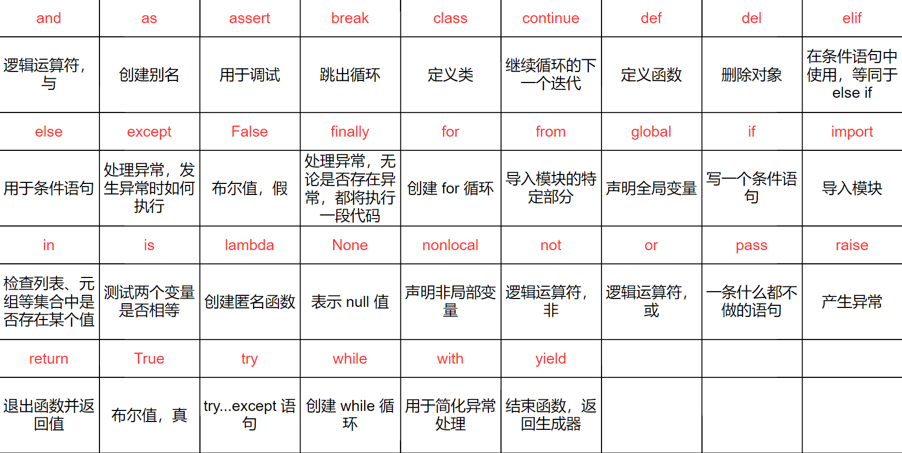

Python 的标准库提供了一个 keyword 模块，可以输出当前版本的所有关键字：

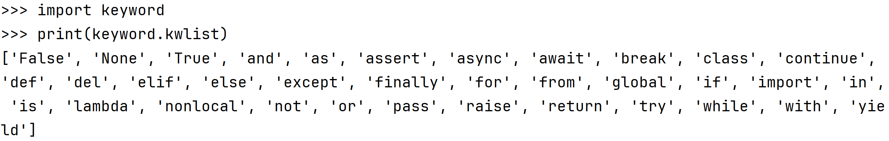

###### 标识符命名方法

常见的命名方法有三种：

**大驼峰命名法（upper camel case）：每个单词首字母大写，例如UpperCamelCase。**

**小驼峰命名法（lower camel case）：第一个单词首字母小写, 之后每个单词首字母大写，例如lowerCamelCase。**

**蛇形命名法（snake case）：单词间用下划线连接，例如snake_case。**

#### 变量的修改

在程序中可随时修改变量的值，而Python将始终记录变量的最新值。

```python
message = "hello world"
print(message)

message = "hello world hello world"
print(message)
```

Python还支持方便的对变量相互替换

```python
var1 = 2
var2 = 20
print(var1, var2)  # 2 20

var1, var2 = var2, var1
print(var1, var2)  # 20 2
```
#### 常量

在程序中定义后就不再修改的值为常量，Python中没有内置的常量类型。一般约定使用全大写变量名来表示常量。

```python
PI = 3.1415926
E = 2.718282
```
### 进制以及转换

#### 进制

计算机世界中只有二进制，所以计算机中存储和运算的所有数据都要转为二进制。包括数字、字符、图片、声音、视频等。常见的进制

**二进制：0、1，满2进1。**

**八进制：0-7，满8进1。**

**十进制：0-9，满10进1。**

**十六进制：0 - 9及A-F，满16进1。十六进制中，除了 0 到 9 十个数字外，还引入了字母，以便表示超过9的值。字母A对应十进制的10，字母B对应十进制的11，字母 C、D、E、F 分别对应十进制的 12、13、14、15。**

#### 不同进制表示整数

**二进制：以0b或0B开头表示。**

**八进制：以0o开头表示**

**十进制：正常数字表示。**

**十六进制：以0x或0X开头表示，此处的A-F不区分大小写。**

```python
# 十进制
dec = 10
# 二进制 以0b开头
binary_number = 0b1010
# 八进制 以0o开头
octal_number = 0o12
# 十六进制 以0x开头
hex_number = 0xA
print(dec)
print(binary_number)
print(octal_number)
print(hex_number)
print("~~~~~~~~~~~~~~~~")
print("十进制数为：", dec)
print("转换为二进制为：", bin(dec))
print("转换为八进制为：", oct(dec))
print("转换为十六进制为：", hex(dec))
输出：
10
10
10
10
~~~~~~~~~~~~~~~~
十进制数为： 10
转换为二进制为： 0b1010
转换为八进制为： 0o12
转换为十六进制为： 0xa
```
#### 二进制转换成十进制

**规则：从最低位开始，将每个位上的数提取出来，乘以2的（位数-1）次方，然后求和。**

**案例：请将二进制 1011 转成十进制的数。**

#### 十进制转换成二进制

**规则：将该数不断除以2，直到商为0为止，然后将每步得到的余数倒过来，就是对应的二进制。**

**案例：请将 56 转成二进制。**

#### 十六进制转换成十进制

**规则：从最低位开始，将每个位上的数提取出来，乘以16的（位数-1）次方，然后求和。  **

**案例：请将0x34A转成十进制的数。**

如果是8进制转换为10进制，就乘以8的（位数-1）次方，然后求和

#### 十进制转换成十六进制

**规则：将该数不断除以16，直到商为0为止，然后将每步得到的余数倒过来，就是对应的十六进制。**

**案例：请将356转成十六进制。**

如果将十进制转换为八进制，将该数不断除以8，直到商为0为止，然后将每步得到的余数倒过来。

#### 二进制转换成十六进制

**规则：低位开始，将二进制数每四位一组，转成对应的十六进制数即可。 **

因为2的4次方等于16 ，所以将二进制数从右向左每 4 位分成一组。如果二进制数的位数不是 4 的倍数，则在最左边补零，使其成为 4 的倍数

**案例：请将1001011转成十六进制。**

如果二进制转换为八进制，3位分一组

#### 十六进制转换成二进制

**规则：将十六进制数每1位，转成对应的4位的一个二进制数即可。**

**案例：请将0x23B转成二进制。**

**如果八进制转换为二进制，1位八进制转成3位二进制数**

### 数据类型

在 Python 中，变量就是变量，它没有类型，我们所说的"类型"是变量所指的内存中对象的类型。Python 3中常见的数据类型分类如下，主要类型有六种：

**基本数据类型**

数值

整数（int）、浮点数（float）、复数（complex）、布尔（bool）

**字符串（str）**

**容器数据类型**

列表（list）

元组（tuple）

集合（set）

字典（dist）

**特殊数据类型**

None

表示空值或缺失值，只有一个值 None。常用于函数没有返回值时，或者表示变量没有被赋值。

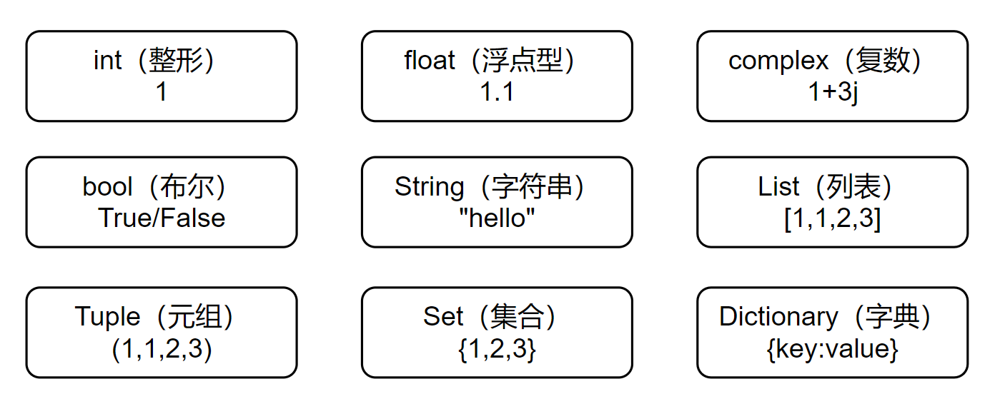

上图的int、float、complex、bool都属于Number（数字）数据类型。

**不可变数据（3 个）：Number（数字）、String（字符串）、Tuple（元组）。**

**可变数据（3 个）：List（列表）、Dictionary（字典）、Set（集合）。**

#### int整型

Python可以处理任意大小的整数，包括负整数。

###### 整数分隔符

书写很大的数时，可使用下划线将其中的数字分组，使其更清晰易读。

```python
num1 = 1_000_000_000_000_000
print(num1)  # 1000000000000000
```

存储这种数时，Python会忽略其中的下划线。在Python看来，1_000_000_000_000_000 与1000000000000000 没什么不同。这种表示法适用于整数和浮点数，但只有Python 3.6及以上版本支持。

###### type 与 isinstance 类型判断

可以使用 type() 来查看变量类型，使用 isinstance() 来判断变量类型。

type() 和 isinstance() 的区别在于 type() 不会认为子类是一种父类类型，isinstance() 会认为子类是一种父类类型。

```python
num1 = True
num2 = 10
print(type(num1))  # <class 'bool'>
print(type(num2))  # <class 'int'>
print(type(num1) == type(num2))  # False
print(isinstance(num1, bool))  # True
print(isinstance(num1, int))  # True，Python3中，bool是int的子类
print(isinstance(num2, int))  # True
```
###### 小整数池

Python将 [-5, 256] 的整数维护在小整数对象池中。这些整数提前创建好且不会被垃圾回收，避免了为整数频繁申请和销毁内存空间。不管在程序的什么位置，使用的位于这个范围内的整数都是同一个对象。

###### 大整数池

一开始大整数池为空，每创建一个大整数就会向池中存储一个。

注意事项

**不同的 Python 实现：小整数池的范围和实现细节可能因 Python 的不同实现（如 CPython、Jython、IronPython 等）而有所不同。上述提到的[-5, 256]范围是 CPython 的默认实现。**

**有时连续赋值的相同大整数也可能指向同一对象，这是因为Python环境的优化机制,但是这个优化不是绝对的，也取决于解释器以及交互式以及脚本环境。**

#### float浮点型

Python将所有带小数点的数称为浮点数。要注意在使用浮点数进行计算时可能会存在微小误差，可以通过导入decimal解决

```python
num1 = 0.1
num2 = 0.2
print(num1 + num2)  # 0.30000000000000004

from decimal import Decimal
num3 = Decimal('1.0')
num4 = Decimal('0.9')
print(num3-num4)
```

也可以使用科学计数法表示浮点数。

```python
num1 = 1.3e7
print(num1)  # 13000000.0
```
#### bool布尔型

布尔型变量只有 True 和 False，用于真假的判断。

```python
bool1 = True
bool2 = False
print(bool1, bool2)  # True False
```

Python3中，bool 是 int 的子类，True 和 False 可以和数字相加。

True==1、False==0 会返回 True

is 运算符用于比较两个对象的身份（即它们是否是同一个对象，是否在内存中占据相同的位置），而不是比较它们的值。

```python
print(True == 1)  # True
print(False == 0)  # True
print(True is 1)  # False
print(False is 0)  # False
```

在Python中，能够解释为假的值不只有False，还有：

```python
None
0
0.0
False
所有的空容器（空列表、空元组、空字典、空集合、空字符串）
```
#### String字符串初识

字符串就是一系列字符。在Python中，用引号括起的都是字符串，其中的引号可以是单引号，也可以是双引号。可使用反斜杠 \ 转义特殊字符。

```python
str1 = 'This is a "string"'
str2 = "This is a 'string' too"
print(str1)  # This is a "string"
print(str2)  # This is a 'string' too
```

也可以方便的在字符串中包含单引号或双引号。

```python
str1 = "This is a 'string'"
str2 = 'This is a "string" too'
print(str1)  # This is a 'string'
print(str2)  # This is a "string" too
```

也可以使用三个引号表示多行字符串。三引号允许一个字符串跨多行，字符串中可以包含换行符、制表符以及其他特殊字符。让程序员从引号和特殊字符串的泥潭里面解脱出来，自始至终保持一小块字符串的格式是所谓的WYSIWYG（所见即所得）格式的。

一个典型的用例是，当你需要一块HTML或者SQL时，使用三个引号就很简单

```python
str1 = """hello world
HELLO WORLD"""
print(str1)
```

在字符中使用特殊字符时，Python用反斜杠 \ 转义字符：

###### intern机制

每个（字符串），不夹杂空格或者特殊符号，默认开启intern机制，共享内存，靠引用计数决定是否销毁。相同的字符串默认只保留一份，当创建一个字符串，它会先检查内存里有没有这个字符串，如果有就不再创建新的了。

###### 字符串缓冲池

单个字母，长度为1的 ASCII 字符会被 interned，包括空字符。

#### 数据类型转换

###### 自动类型转换（隐式转换）

对两种不同类型的数据进行运算，较小的数据类型（整数）就会转换为较大的数据类型（浮点数）以避免数据丢失，计算结果为浮点型：

```python
num1 = 2
num2 = 3.0
print(num1 + num2)  # 5.0
```

特别的，两个整型进行除法运算结果也是浮点型：

```python
num1 = 9
num2 = 1
print(num1 / num2)  # 9.0
```

而整型和字符串相加会报错，此时Python无法进行隐式转换完成计算：

```python
num1 = 123
str1 = "456"
print(num1 + str1)  # 报错
```
###### 强制类型转换（显式转换）

可以通过函数对数据类型进行转换。

```python
num_int = 123
num_str = "456"
print("num_int 数据类型为:",type(num_int))
print("类型转换前，num_str 数据类型为:",type(num_str))
num_str = int(num_str)    # 强制转换为整型
print("类型转换后，num_str 数据类型为:",type(num_str))
num_sum = num_int + num_str
print("num_int 与 num_str 相加结果为:",num_sum)
print("sum 数据类型为:",type(num_sum))
输出：
num_int 数据类型为: <class 'int'>
类型转换前，num_str 数据类型为: <class 'str'>
类型转换后，num_str 数据类型为: <class 'int'>
num_int 与 num_str 相加结果为: 579
sum 数据类型为: <class 'int'>
```
#### 字符的编码和解码

```python
# 创建一个 字符串类型数据
str1 = '你好中国'
print(str1)
print(type(str1))

# 将字符串数据类型转换为字节型数据的过程成为编码 encode，需要指定编码类型  
byte1 = str1.encode(encoding='utf8')
# 4个字符转换为了12个字节, 所以一个汉字占用3个字节
print(byte1)  # b'\xe4\xbd\xa0\xe5\xa5\xbd\xe4\xb8\xad\xe5\x9b\xbd'
print(type(byte1))  # <class 'bytes'>

# 在进行编码集使用时,一定要注意,使用什么编码集编码,就要使用它解码,否则报错.
# 'utf-8' codec can't decode byte 0xc4 in position 0: invalid continuation byt
# byte2 = str1.encode(encoding='gbk')
# print(byte2) 
# print(type(byte2))  

# 将字节型数据转换为字符型数据的过程称为解码 decode
str2 = byte1.decode(encoding='utf8')
print(str2)  # 你好中国
print(type(str2))  # <class 'str'>
```
### 输入与输出

#### 输入

如果接收用户在键盘上输入一些字符，Python提供了一个input()函数，可以让用户输入字符串，并存放到一个字符串变量里。

语法：字符串变量 = input(“提示信息”)

```python
# Python开始等待你的输入。这时，你可以输入任意字符，然后按回车后完成输入。
input_str = input("请输入：")
# 输入完成后，不会有任何提示，刚才输入的内容存放到input_str变量里了
print("input_str数据类型为:",type(input_str))
# 输出input_str查看变量内容
print(input_str)
```
#### 输出

###### 普通输出

使用 print() 可将内容打印。

```python
print("Hello Python")
```

多个内容之间可以使用逗号隔开。

```python
print("Hello", " Python")
```

可以使用 end= 来控制 print() 以什么结尾。

```python
print("使用\\n结尾", end="\n")  # 用\n结尾，等同于print("使用\\n结尾")
print('使用""结尾', end="")  # 用空字符串结尾
print("Hello")
```
###### 格式化输出

**字符串中使用 % 占位**

```python
int1 = 10
float1 = 3.14159
str1 = "int1 = %d, float1 = %f" % (int1, float1)
print(str1)  # int1 = 10, float1 = 3.141590
```

格式符号列表：

**字符串.format()**

方式1：不设置指定位置，按默认顺序

```python
int1 = 10
float1 = 3.14159
bool1 = True
str2 = "int1 = {}, float1 = {}, bool1 = {}".format(int1, float1, bool1)
print(str2)  # int1 = 10, float1 = 3.14159, bool1 = True
```

方式2：设置指定位置，不能和方式1混合使用

```python
int1 = 10
float1 = 3.14159
bool1 = True
str2 = "int1 = {0}, float1 = {1}, bool1 = {2}".format(int1, float1, bool1)
print(str2)  # int1 = 10, float1 = 3.14159, bool1 = True
```

方式3：设置参数

```python
int1 = 10
float1 = 3.14159
bool1 = True
str2 = "int1 = {i1}, float1 = {f1}, bool1 = {b1}".format(i1=int1, f1=float1, b1=bool1)
print(str2)  # int1 = 10, float1 = 3.14159, bool1 = True
```
**数字格式化：**

```python
float1 = 31415.9
str2 = "{:*^20,.2f}".format(float1)
print(str2)  # *****31,415.90******
```

: 后可以添加多个参数对数字格式化：

***：以 * 填充空白，不写则默认以空格填充。**

**^：可选 < 、 ^ 、 > ，分别是左对齐、居中、右对齐。**

**20：数字宽度为20，数字长度不足20则进行填充。**

**,：可选 , 和 _ ，每3位进行分隔。**

**.2f：小数点后保留2位。**

案例：

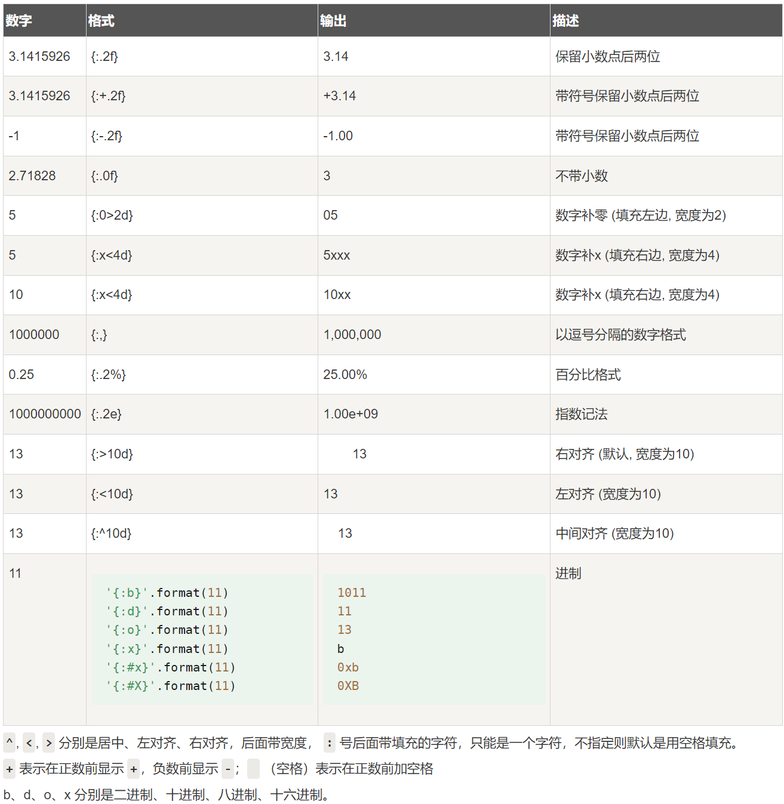

**使用大括号 {} 来转义大括号**

```python
print ("{0} 对应的位置是 {0}".format("hello"))   #hello 对应的位置是 hello
print ("{} 对应的位置是 {{0}}".format("hello"))  #hello 对应的位置是 {0}
```
**f-字符串**

字符串前加上一个 f ，字符串中的{}内写入变量名。

```python
int1 = 10
float1 = 3.14159
str3 = f"int1 = {int1}, float1 = {float1}"
print(str3)  # int1 = 10, float1 = 3.14159
```

{}内变量名后可以加上 = ，打印时会在变量值前加上 变量名=。

```python
int1 = 10
float1 = 3.14159
str3 = f"{int1 = }, {float1 = }"
print(str3)  # int1 = 10, float1 = 3.14159
```

{}外再套一层{}，即{{}}，会转义。

```python
int1 = 10
float1 = 3.14159
str3 = f"{{int1 = }}, {{float1 = }}"
print(str3)  # {int1 = }, {float1 = }
```
### 运算符

#### 算数运算符

```python
# -------------算术运算符---------------
a = 20
b = 10
c = a + b
print(a , "+" , b , "的结果为" , c)
c = a - b
print(a , "-" , b , "的结果为" , c)
c = a * b 
print(a , "*" , b , "的结果为" , c)
c = a / b  #注意：结果为浮点类型
print(a , "/" , b , "的结果为" , c)
c = a % b 
print(a , "%" , b , "的结果为" , c)
a = 2
b = 3
c = a ** b
print(a , "的" , b , "次方结果为" , c)
a = 10
b = 3
c = a // b 
print(a , "//" , b , "的结果为" , c)
print("-" * 30) # 输出30次-
输出结果：
20 + 10 的结果为 30
20 - 10 的结果为 10
20 * 10 的结果为 200
20 / 10 的结果为 2.0
20 % 10 的结果为 0
2 的 3 次方结果为 8
10 // 3 的结果为 3
------------------------------
```
#### 赋值运算符

```python
# -------------赋值运算符---------------
num3 = 30
num4 = 40
num5 = num3 + num4
print(num5)

num3 += 50  # num3 = num3 + 50
print(num3)
输出结果：
70
80
```
#### 比较运算符

```python
注意：除了不同数据类型的数据不能比较大小
# -------------比较运算符---------------
num1 = 10
num2 = 20
print(num1 == num2)  # False
print(num1 != num2)  # True
print(num1 > num2)   # Flase
print(num1 < num2)   # True
print(num1 >= num2)  # False
print(num1 <= num2)  # True
num3 = 'abc'
# 注意：不同的数据类型之间不能进行大小的比较
print(num1 > num3)
# 如果是字符串比较大小，是从最左边开始逐个比较字符串中相应位置的字符的ASCII码
print('5' > '6') # False
print('15' > '6') # False
```
#### 逻辑运算符

```python
# -------------逻辑运算符---------------
b1 = False
b2 = True
print(b1 and b2)  # False
print(b1 or b2)  # True
print(not(b1))  # True
print(5 and 8) # 8 非0表示True，0表示False
print(0 and 8) # 0
print(5 or 8)  # 5
print(0 or 8)  # 8
print(not(5))  # False
```
#### 位运算符

###### 原码反码补码

一个数在计算机中的二进制表示形式，叫做这个数的机器数。机器数是带符号的，在计算机用一个数的最高位存放符号，正数为0，负数为1。

位运算时，以补码形式进行计算。

###### 正数的与、或、异或、非运算

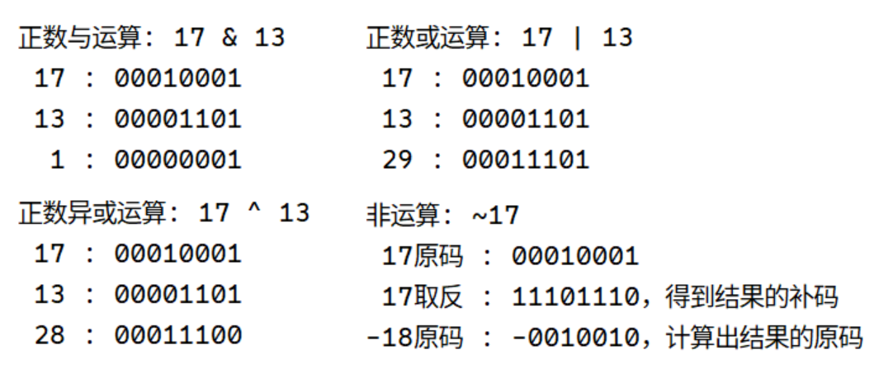

测试代码：

```python
num1 = 17
num2 = 13

print(f"正数与运算: {num1} & {num2}: {num1 & num2:08b}")
print()

print(f"正数或运算: {num1} | {num2}: {num1 | num2:08b}")
print()

print(f"正数异或运算: {num1} ^ {num2}: {num1 ^ num2:08b}")
print()

print(f"非运算: ~{num1}:{~num1:08b}")
```
###### 有负数的与、或运算

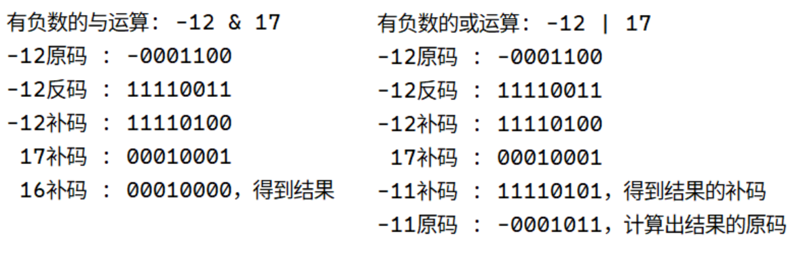

测试代码：

```python
num1 = 17
num2 = 13
num3 = -12

print(f"有负数的与运算: {num3} & {num1}: {num1 & num3:08b}")
print()
print(f"有负数的或运算: {num3} | {num1}: {num1 | num3:08b}")
```
###### 按位左移、右移运算

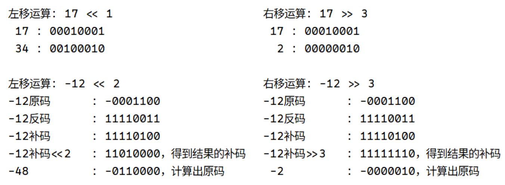

测试代码：

```python
num1 = 17
num2 = -12

offset = 1
print(f"左移运算: {num1} << {offset}: {num1 << offset:08b}"")
print()

offset = 2
print(f"左移运算: {num2} << {offset}: {num2 << offset:08b}")
print()

offset = 3
print(f"右移运算: {num1} >> {offset}: {num1 >> offset:08b}")
print()
#负数右移结果需要向负无穷取整（即 “向下取整”），而非简单截断
offset = 3
print(f"右移运算: {num2} >> {offset}: {num2 >> offset:08b}")
```
#### 成员运算符

```python
# -------------成员运算符---------------
num6 = 1
num7 = 20
test_list = [1,2,3,4,5]
print(test_list)
print(num6 in test_list) # True 判断1是不是列表中的的成员
print(num7 not in test_list) # True
```
#### 身份运算符

```python
# -------------身份运算符---------------
m = 20
n = 20
q = 30
print(m is n)  # True 判断m和n在内存中是否指向同一个地址
print(n is q)  # False
print(n is not q)  # True
# id() 用于获取对象在内存中的地址
print(id(m) == id(n)) # True

print("-" * 30)
# -------------is和==的区别---------------
a = [1,2,3]
b = a 

print(b is a)  # True
print(b == a)  # True

b = a[:]
print(b)
print(b is a)  # False
print(b == a)  # True
```
#### 运算符优先级

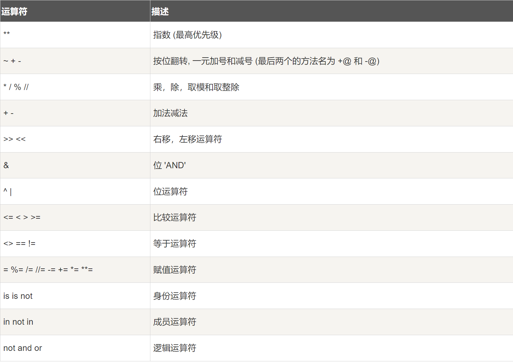

### Python编码规范

随着你编写的程序越来越长，有必要了解一些代码格式设置约定。为确保所有人编写的代码的结构都大致一致， Python 程序员都遵循一些格式设置约定。

PEP8（Python Enhancement Proposal ，PEP）是最古老的PEP之一，它向 Python 程序员提供了代码格式设置指南。  

下面的列出一些基本的规范：

#### 缩进

在 Python 中，代码块的结束不像其他一些编程语言（如 C、Java 等）使用大括号 {} 来明确界定，而是通过缩进来表示。PEP 8建议每级缩进都使用四个空格，这既可提高可读性，又留下了足够的多级缩进空间。在文本处理文档中，大家常常使用制表符而不是空格来缩进。对于文本处理文档来说，这样做的效果很好，但混合使用制表符和空格会让 Python 解释器感到迷惑。每款文本编辑器都提供了一种设置，可将输入的制表符转换为指定数量的空格。你在编写代码时应该使用制表符键，但一定要对编辑器进行设置，使其在文档中插入空格而不是制表符。

在程序中混合使用制表符和空格可能导致极难解决的问题。如果你混合使用了制表符和空格，可将文件中所有的制表符转换为空格，大多数编辑器都提供了这样的功能。

#### 行长

很多 Python 程序员都建议每行不超过 80 字符。最初制定这样的指南时，在大多数计算机中，终端窗口每行只能容纳 79 字符；当前，计算机屏幕每行可容纳的字符数多得多，为何还要使用 79 字符的标准行长呢？这里有别的原因。专业程序员通常会在同一个屏幕上打开多个文件，使用标准行长可以让他们在屏幕上并排打开两三个文件时能同时看到各个文件的完整行。 PEP 8 还建议注释的行长都不超过 72 字符，因为有些工具为大型项目自动生成文档时，会在每行注释开头添加格式化字符。

PEP 8 中有关行长的指南并非不可逾越的红线，有些小组将最大行长设置为 99 字符。在学习期间，你不用过多地考虑代码的行长，但别忘了，协作编写程序时，大家几乎都遵守PEP 8 指南。在大多数编辑器中，都可设置一个视觉标志，通常是一条竖线，让你知道不能越过的界线在什么地方。

#### 空行

要将程序的不同部分分开，可使用空行。你应该使用空行来组织程序文件，但也不能滥用。例如，如果你有 5 行创建列表的代码，还有 3 行处理该列表的代码，那么用一个空行将这两部分隔开是合适的。然而，你不应使用三四个空行将它们隔开。

空行不会影响代码的运行，但会影响代码的可读性。 Python 解释器根据水平缩进情况来解读代码，但不关心垂直间距。

#### 同一行显示多条语句

Python可以在某些时候同一行中可以使用多条语句，语句之间使用分号(;)分割，

但并不是所有情况都可以，所以不推荐这种写法。以下是一个简单的实例：

```python
import sys;print(sys.path) #没有问题

'''
import sys
for i in sys.path:
    print(i) #没有问题
'''
import sys;for i in sys.path:;print(i) # 报错
```
#### 分号

建议不要在行尾加分号，也不要使用分号将多条命令放在同一行。

#### 源文件编码

Python源码请使用 UTF-8 编码（Python2 中可以使用 ASCII 编码）。

文件采用 ASCII(Python2) 或者 UTF-8（Python 3）

#### 不以空格结束一行代码

在任何地方都不要以空格结束本行代码， 因为行末的空格不可见， 这可能会闹出问题： 比如反斜杠（连字符） 如果后面接空白字符就不再能够当连字符使用。 很多编辑器不允许以空格作为行结束符。

## 流程控制语句

流程控制就是用来控制计算机指令的执行顺序

### 顺序

按照程序正常的执行顺序，依次执行每条语句。


### 分支

分支流程又叫条件控制语句或者分支语句或者选择语句，是通过条件判断来决定执行的代码。

#### 单分支


###### 语法

```python
if 表达式:
    语句
```
###### 说明

Python程序语言指定任何非0和非空（null）值为true，0 或者 null为false。

if语句的判断条件可以用条件表达式来表示其关系，后面的:必须加。其中"判断条件"成立时（非零），则执行后面的语句，而执行内容可以多行，以缩进来区分表示同一范围，缩进取消后，就不在分支范围了。如果条件不成立，不执行语句块内容。

###### 案例

商品价格50，若余额小于50则提示“余额不足，请充值”，最后打印“欢迎下次光临”。

```python
from random import randint

# 余额
balance = randint(0, 100)
# 价格
price = 50
# 打印余额
print(f"余额：{balance}")
# 比较余额和价格
if balance < price:
    print("余额不足，请充值")
print("欢迎下次光临")
```

简单的语句组:你也可以在同一行的位置上使用if条件判断语句，例如

```python
var = 100 
if ( var  == 100 ) : print("变量 var 的值为100")
print("Good bye!")
```
#### 双分支


###### 语法

```python
if 表达式:
    语句1
else:
    语句2
```
###### 说明

先进行条件判断，如果条件判断成立就执行语句块1， 条件不成立就执行语句块2

###### 案例

余额随机，商品价格50。

**若余额小于50则提示“余额不足，请充值”。**

**否则提示消费成功。**

最后打印“欢迎下次光临”。

```python
from random import randint

# 余额
balance = randint(0, 100)
# 价格
price = 50
# 打印余额
print(f"余额：{balance}")
# 比较余额和价格
if balance < price:
    # 如果余额小于价格
    print("余额不足，请充值")
else:
    # 如果余额大于价格
    balance = balance - price
    print(f"消费成功，余额：{balance}")
print("欢迎下次光临")
```
#### 多分支


###### 语法

```python
if 表达式1:
    语句1
elif 表达式2:
    语句2
elif 表达式3:
    语句3
else:  # else如不需要可以省略
    语句4
```
###### 说明

if 语句后面可以跟 elif…else 语句，这种语句可以检测到多种可能的情况，所以也称之为多分支结构。

如果条件判断1成立，那么执行语句块1的内容；如果条件判断2成立，那么执行语句块2的内容；如果条件判断3成立，那么执行语句块3的内容；如果条件判断1，2，3都不成立，那么执行语句块4的内容；

使用多分支语句的时候，需要注意下面几点：

```python
if 语句至多有1个else语句，else语句在所有的else if语句之后。
if语句可以有若干个 elif 语句，它们必须在else语句之前。
一旦其中一个分支语句检测为 true，其他的elif以及else语句都将不再执行。
```
###### 案例

判断处于人生哪个阶段。

**如果年龄小于2岁，就打印一条消息，指出这个人是婴儿。**

**如果年龄为2（含）～4岁，就打印一条消息，指出这个人是幼儿。**

**如果年龄为4（含）～13岁，就打印一条消息，指出这个人是儿童。**

**如果年龄为13（含）～20岁，就打印一条消息，指出这个人是青少年。**

**如果年龄为20（含）～65岁，就打印一条消息，指出这个人是成年人。**

**如果年龄超过65岁（含），就打印一条消息，指出这个人是老年人。**

```python
from random import randint

# 定义年龄并打印
print("此人年龄为", age := randint(0, 100))
if age < 2:
    # 如果年龄<2
    print("这是个婴儿")
elif age < 4:
    # 如果2<=年龄<4
    print("这是个幼儿")
elif age < 13:
    # 如果4<=年龄<13
    print("这是个儿童")
elif age < 20:
    # 如果13<=年龄<20
    print("这是个青少年")
elif age < 65:
    # 如果20<=年龄<65
    print("这是个成年人")
else:
    # 如果65<=年龄
    print("这是个老人")
```
#### 嵌套分支


###### 语法

```python
if 表达式1:
    if 表达式2:
        语句1
    else:
        语句2
else:
    if 表达式3:
        语句3
    else:
        语句4
```
###### 说明

在一个if语句中，又包含另外一个if语句，这就是if语句的嵌套

###### 案例

给定一个三位的状态码，左边第一位标识大小写状态（1-大写，0-小写），第二位标识输入法语言（1-简体中文，0-英语），第三位标识输入法模式（1-中文，0-英文）。判断输入法的状态：


**如果是大写状态，打印“大写状态”。**

**如果不是大写状态，判断输入法语言是“简体中文-微软拼音”还是“英语-美式键盘”。**

**如果是“简体中文-微软拼音”，判断是中文模式还是英文模式，并打印。**

**如果是“英语-美式键盘”，打印“英语-美式键盘”。**


```python
state = 0b011
# 判断是否为大写状态
if state & 0b100 == 0b100:
    # 是大写状态
    print("大写状态")
else:
    # 不是大写状态
    # 判断是否为“简体中文-微软拼音”
    if state & 0b010 == 0b010:
        # 是“简体中文-微软拼音”
        # 判断是否为“微软拼音-中文”
        if state & 0b001 == 0b001:
            # 是“微软拼音-中文”
            print("微软拼音-中文")
        else:
            # 不是“微软拼音-中文”
            print("微软拼音-英文")
    else:
        # 不是“简体中文-微软拼音”
        print("英语-美式键盘")
```
#### match case语句

###### 语法

```python
match x:
    case a:
        语句1
    case b:
        语句2
    case _:
        语句3
```
###### 说明

Python3.10新增了match case的条件判断方式，match后的对象会依次与case后的内容匹配，匹配成功则执行相应语句，否则跳过。其中_可以匹配一切。

###### 案例

给定月份，求该月有多少天。

| 是专门用于模式匹配的操作符，它能把多个常量或者模式组合起来，实现 “或” 逻辑。

```python
match month := 3:
    case 1 | 3 | 5 | 7 | 8 | 10 | 12:
        print(f"{month}月有31天")
    case 4 | 6 | 9 | 11:
        print(f"{month}月有30天")
    case 2:
        print(f"{month}月可能有28天")
    case _:
        print(f"{month}月有?天")
```
#### 三目运算符

###### 语法

```python
表达式1 if 判断条件 else 表达式2
```
###### 案例

使用 if 来获取两个数中较大的一个。

```python
num1 = 2
num2 = 3
if num1 > num2:
    max_num = num1
else:
    max_num = num2
print(max_num)
```

以上代码可以通过三目运算符改写。

```python
num1 = 2
num2 = 3
max_num = num1 if num1 > num2 else num2
print(max_num)
```
### 循环

在满足某个条件下，重复的执行某段代码。


#### while循环

###### 语法

```python
while 表达式:
    语句-循环体
```
###### 说明

先判断条件是否成立，如果条件成立就执行循环体一次；然后再判断条件是否成立，如果成立，继续执行循环体，直到循环条件不成立的时候，才会结束循环，执行循环下面的其他语句。判断条件可以是任何表达式，任何非零、或非空（null）的值均为true。执行语句可以是单个语句或语句块。

如果条件表达式一直成立，那称之为无限循环，也叫死循环。

###### 案例

**第1周有2只兔子，此后每周兔子的数量都增加上周数量的2倍，且期间没有兔子死亡，求第10周共有多少只兔子：**

```python
rabbit = 2
week = 1
while week < 10:
    rabbit = rabbit + rabbit * 2
    week += 1
    print(f"第{week}周有{rabbit}只兔子")
```
**打印进度条：**

```python
import time

num = 1
while num < 100:
    print("\r" + "=" * num, end="")
    num += 1
    time.sleep(0.05)
```
###### while else语句

while 后可以加上 else，当 while 表达式结果为 False 时会执行 else 中的语句。

```python
rabbit = 2
week = 1
while week < 10:
    rabbit = rabbit + rabbit * 2
    week += 1
else:
print(f"第{week}周有{rabbit}只兔子")
```

此时else中代码，写在else中和写在循环外效果一样。else一般和 break一起使用，循环通过break终止后，else中的代码不会执行。

#### for循环

###### 语法

for 循环可以用来遍历可迭代对象，如列表或字符串。

```python
for 临时变量 in 可迭代对象:
    语句
```

for 循环后也可以加上 else，循环结束后会执行 else 中语句。

```python
for 临时变量 in 可迭代对象:
    语句1
else:
    语句2
```
###### 说明

for是关键字

临时变量是自己定义的用来存储遍历出来元素的变量名字

in是关键字

可迭代对象是要遍历的序列

首先判断是否有下一个元素可以获取

如果有，则将元素取出，赋值给临时变量

继续判断是否有下一个元素可以进行取出

直到将所有元素都取出，循环结束

###### 案例

**遍历列表**

```python
for i in [2, 3, 5, 7, 11, 13, 17, 19]:
    print(i)
```
**遍历字符串**

```python
for i in "hello world":
    print(i)
```
**遍历range数列**

```python
for i in range(10):
    print(i)
```
###### range()

作用：函数可以生成数列，它返回一个可迭代对象。

语法：range([start,] stop[, step])

**start: 生成序列的起始值--包含  默认0**

**stop:生成序列的结束值--不包含**

**step:生成序列的步长 默认为1**

如果为正数：生成的序列是递增的，要求起始值 < 结束值

如果为负数：生成的序列是递减的，要求起始值 > 结束值

如果stop小于或等于 start且step为正数，或者stop大于或等于start且step为负数，range() 函数将生成一个空序列。

指定生成到stop（不包含stop）的数列，默认从0开始。

```python
for i in range(10):
    print(i)
```

指定生成数列的范围，从start到stop（不包含stop），可设定步长，默认步长为1，步长可正可负。

```python
for i in range(-10, 10):
    print(i)

for i in range(10, -10, -3):
    print(i)
```
###### 嵌套循环

使用嵌套循环打印九九乘法表。


```python
for i in range(1, 10):
    for j in range(1, i + 1):
        print(f"{i} × {j} = {i * j}", end="\t")
    print()
```
#### continue

跳过当前循环块中的剩余语句，继续进行下一轮循环。一般写在if判断中。


案例：打印0-9，跳过偶数。

```python
for i in range(10):
    if i % 2 == 0:
        continue
    print(i)
```
#### break

跳出当前for或while的循环体，一般写在if判断中。

如果for 或while循环通过break终止，循环对应的else 将不执行。


案例：求0-9每个数自己幂自己的加和，如果大于10000000则循环终止。

```python
sum = 0
for i in range(10):
    sum = sum + i**i
    if sum > 10000000:
        break
    print(i, sum)
else:
    print("循环完成,sum = ", sum)
```
#### pass

pass是空语句，是为了保持程序结构的完整性。

pass不做任何事情，一般用做占位语句。

例如：在一个循环中，如果循环体为空，语法会提示报错，

这个时候我们就可以使用pass占位

```python
for i in range(10):
    pass
```
## 容器数据类型

### 序列

###### 什么是序列

序列（Sequence）是一种基本且核心的数据结构，它允许我们以有序的方式存储和操作数据。序列可以包含不同类型的元素，并且支持通过索引来访问和修改这些元素。

常见的序列类型包括：列表（List）、元组（Tuple）、字符串（String）。

###### 序列的操作

**索引：sequence[0]**

**切片：sequence[1:3]**

**相加：sequence1 + sequence2**

**乘法：sequence * 3**

**检查成员：x in sequence**

**计算长度：len(sequence)**

**计算最大值、最小值：max(sequence)、min(sequence)**

### 列表List

**列表是一个可变的、有序的元素集合。**

**列表使用 [] 定义，数据之间使用 , 分隔。**

**列表中每个元素都有对应的位置值，称为索引或下标，索引从起始从0开始向后逐个递增，并且从末尾从-1开始逐个向前递减。**

**列表中元素可以是不同的类型。**

#### 创建列表

```python
list1 = [100, 200, 300, 400, 500]
```
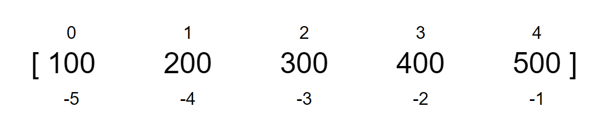

#### 访问列表

###### 通过索引获取列表中元素

```python
list1 = [100, 200, 300, 400, 500]
print(list1[1])  # 200
print(list1[-2])  # 400
```
###### 列表切片

```python
list1 = [100, 200, 300, 400, 500]
print(list1)  # 取全部元素
print(list1[:])  # 复制整个列表
print(list1[2:4])  # 取索引从2开始到4(不包含)的元素
print(list1[2:])  # 取索引从2开始到末尾的元素
print(list1[:2])  # 取索引从0开始到2(不包含)的元素
print(list1[2:-1])  # 取索引从2开始到-1(不包含)的元素
print(list1[::-1])  # 倒序取元素
```
#### 向列表中添加元素

```python
list1 = [100, 200, 300, 400, 500]
list1.append(600) # 在列表末尾追加元素
list1.insert(2,700) # 在列表指定的位置追加元素
print(list1)
```
#### 列表相加

```python
list1 = [100, 200, 300]
list2 = ["a", "b", "c"]
print(list1 + list2)  # [100, 200, 300, 'a', 'b', 'c']
```
#### 列表乘法

```python
list1 = [100, 200, 300]
print(list1 * 2)  # [100, 200, 300, 100, 200, 300]
```
#### 修改列表中元素

###### 通过下标修改。

```python
list1 = [100, 200, 300, 400, 500]
list1[0] = -1
print(list1)
```
###### 通过切片修改。

```python
list1 = [100, 200, 300, 400, 500]
list1[2:4] = ["a", "b", "c"]
print(list1)
```
#### 检查成员是否为列表中元素

```python
list1 = [100, 200, 300]
print(100 in list1)  # True
```
#### 获取列表长度

```python
list1 = [100, 200, 300]
print(len(list1))  # 3
```
#### 求列表中元素的最大值、最小值、加和

```python
list1 = [100, 200, 300, 400, 500]
print(max(list1))  # 500
print(min(list1))  # 100
print(sum(list1))  # 1500
```
#### 遍历列表

###### 直接遍历列表元素

```python
list1 = [100, 200, 300, 400, 500]
for i in list1:
    print(i)
```
###### 通过下标遍历列表

```python
list1 = [100, 200, 300, 400, 500]
for i in range(len(list1)):
    print(i, list1[i])
```
###### 使用enumerate()同时获取列表的下标和元素

```python
list1 = [100, 200, 300, 400, 500]
for i, val in enumerate(list1):
    print(i, val)
```
#### 删除列表指定位置元素或者切片

```python
list1 = [100, 200, 300, 400, 500]
del list1[2]
print(list1)
```
#### 嵌套列表

列表中元素可以为列表。

```python
list1 = [[1, 2, 3], [4, 5, 6], [7, 8, 9]]
for inner_list in list1:
    print(inner_list)
```
#### 列表推导式

列表推导式是 Python 中一种简洁创建列表的方式，它将一个可迭代对象（如列表、元组、集合、字符串等）的元素通过某种运算或条件筛选后生成一个新的列表。

**基础的列表推导式**

```python
squares = [x**2 for x in range(5)]
print(squares)  # [0, 1, 4, 9, 16]
```
**带条件的列表推导式**

```python
squares = [x**2 for x in range(10) if x % 2 == 0]
print(squares)  # [0, 4, 16, 36, 64]
```
**使用现有列表的列表推导式**

```python
list1 = [1, 2, 3, 4, 5]
squares = [x**2 for x in list1]
print(squares)  # [1, 4, 9, 16, 25]
```
**包含多个循环的列表推导式**

```python
list1 = [1, 2, 3, 4, 5]
list2 = ["a", "b", "c", "d", "e"]
tuple_list = [(i, j) for i in list1 for j in list2]
print(tuple_list)
```
#### zip()函数

zip() 函数可将多个可迭代对象中对应元素打包为一个个元组。

```python
list1 = [1, 2, 3, 4, 5]
list2 = ["a", "b", "c", "d", "e"]
zipped = zip(list1, list2)
print(list(zipped))
```
#### 常用函数

### 字符串String

**字符串是不可变的、有序的。**

**字符串中元素不可修改。**

**字符串使用单引号、双引号或三重引号定义。**

**字符串中每个值都有对应的位置值，称为索引或下标，索引从起始从0开始向后逐个递增，并且从末尾从-1开始逐个向前递减。**

#### 创建字符串

```python
str1 = "hello world"
```
#### 访问字符串

```python
str1 = "hello world"
print(str1[0])
print(str1[-1])
print(str1[4:-3])
```
#### 字符串相加

```python
str1 = "hello world"
str2 = "dlrow olleh"
print(str1 + str2)  # hello worlddlrow olleh
```
#### 字符串乘法

```python
str1 = "hello world"
print(str1 * 2)  # hello worldhello world
```
#### 检查成员是否为字符串中元素

```python
str1 = "hello world"
print("lo" in str1)  # True
```
#### 原始字符串

所有的字符串按照字面意思处理，没有转义字符。需在字符串前加上r / R。

```python
print("hello\nworld")
print(r"hello\nworld")
```
#### 常用函数

#### 其他函数

### 元组Tuple

**元组是一个不可变的、有序的元素集合。**

**不能对元组中的元素进行修改操作。**

**元组使用 () 定义，数据之间使用,分隔。**

**元组中每个元素都有对应的位置值，称为索引或下标，索引从起始从0开始向后逐个递增，并且从末尾从-1开始逐个向前递减。**

**元组中元素可以是不同的类型。**

元组的使用方式与列表类似。

#### 创建元组

```python
tuple1 = (100, 200, 300, 400, 500)
```

元组中只包含一个元素时，需要在元素后面添加逗号，否则括号会被当作运算符使用。

```python
tuple1 = (100,)
```

也可以通过元组推导式创建元组。

```python
tuple_generator = (x for x in range(10))  # 获取生成器对象
print(tuple_generator)
tuple1 = tuple(tuple_generator)  # 转换为元组
print(tuple1)
```
#### 访问元组

```python
tuple1 = (100, 200, 300, 400, 500)
print(tuple1[2])
print(tuple1[-1])
print(tuple1[2:4])
```
#### 元组相加

```python
tuple1 = (100, 200, 300)
tuple2 = ("a", "b", "c")
print(tuple1 + tuple2)  # (100, 200, 300, 'a', 'b', 'c')
```
#### 元组乘法

```python
tuple1 = (100, 200, 300)
print(tuple1 * 2)  # (100, 200, 300, 100, 200, 300)
```
#### 检查成员是否为元组中元素

```python
tuple1 = (100, 200, 300, 400, 500)
print(300 in tuple1)  # True
```
#### 获取元组长度

```python
tuple1 = (100, 200, 300, 400, 500)
print(len(tuple1))  # 5
```
#### 求元组中元素的最大值、最小值、加和

```python
tuple1 = (100, 200, 300, 400, 500)
print(max(tuple1))  # 500
print(min(tuple1))  # 100
print(sum(tuple1))  # 1500
```
#### 遍历元组

```python
tuple1 = (100, 200, 300, 400, 500)

for i in tuple1:
    print(i)

for i in range(len(tuple1)):
    print(i, tuple1[i])

for i, val in enumerate(tuple1):
    print(i, val)
```
#### 元组的不可变

元组的不可变指的是元组所指向的内存中的内容不可变，但可以重新赋值。

```python
tuple1 = (100, 200, 300)
print(id(tuple1), tuple1)
tuple1 = tuple1 + (1, 2, 3)
print(id(tuple1), tuple1)
```

如果元组中元素是可变数据类型，其嵌套项可以被修改。

```python
tuple1 = (100, 200, 300, [1, 2, 3])
tuple1[3].append(4)
print(tuple1)  # (100, 200, 300, [1, 2, 3, 4])
```
### 集合Set

**集合是无序的，且不包含重复元素。**

**集合使用 {} 定义，数据之间使用 , 分隔，也可以使用set()定义。**

**集合没有索引，所以不能通过切片方式访问集合元素。**

**集合中元素可以是不同的类型。**

**集合可以进行数学上的集合操作，如并集、交集和差集。**

**集合适用于需要快速成员检查、消除重复项和集合运算的场景。**

#### 创建集合

可以通过{}或set()创建集合，但创建空集合需要使用set()而非{}，因为{}会创建空字典。

```python
set1 = {1, 2, 3}
set2 = set([1, 2, 3])  # 使用set()函数从列表创建集合
set3 = set()
print(set1, set2, set3)
```

也可以通过集合推导式创建集合。

```python
set1 = {x for x in range(10) if x % 2 == 0}
print(set1)  # {0, 2, 4, 6, 8}
```
#### 向集合中添加元素

```python
set1 = {1, 2, 3}
set1.add(4)
set1.add(5)
print(set1)
```
#### 从集合中删除元素

```python
set1 = {1, 2, 3}
set1.remove(2)
print(set1)
```
#### 检查成员是否为集合中元素

```python
set1 = {1, 2, 3, 4, 5}
print(2 in set1)  # True
```
#### 获取集合长度

```python
set1 = {1, 2, 3, 4, 5}
print(len(set1))  # 5
```
#### 求集合中元素的最大值、最小值、加和

```python
set1 = {1, 2, 3, 4, 5}
print(max(set1))  # 5
print(min(set1))  # 1
print(sum(set1))  # 15
```
#### 遍历集合

```python
my_set = {1, 2, 3, 4, 5}
for item in my_set:
    print(item)
```
#### 常用函数

### 字典Dictionary

**一个无序的键值对集合，键是唯一的，而值可以重复。**

**字典使用 {} 定义，键（key）和值（value）使用 : 连接，每个键值对之间使用 , 分隔。如{key1 : value1, key2 : value2}**

**字典没有索引。**

**字典可以通过键来获取对应的值。**

**值可以取任何数据类型，但键必须是不可变的，如字符串、数字、元组。**

#### 创建字典

可以通过{}或dict()创建字典。

```python
dict1 = {}
dict2 = dict()
dict3 = {"name": "Alice", "age": 18, "gender": "male"}
dict4 = dict(name="Bob", age=20, gender="female")
dict5 = dict([("name", "Tom"), ("age", 22), ("gender", "male")])
print(dict1)
print(dict2)
print(dict3)
print(dict4)
print(dict5)
```

也可以通过字典推导式创建字典。

```python
squares = {x: x**2 for x in range(4)}
print(squares)  # {0: 0, 1: 1, 2: 4, 3: 9}
```
#### 访问字典

可通过 [] 访问字典中的元素。key不存在时会报错。

```python
dict1 = {"name": "Alice", "age": 18, "gender": "male"}
print(dict1["name"])  # Alice
print(dict1["age"])  # 18
print(dict1["gender"])  # male
print(dict1["address"])  # 报错
```

也可以通过get()获取字典中的元素。key不存在时会返回None，也可以指定默认值。

```python
dict1 = {"name": "Alice", "age": 18, "gender": "male"}
print(dict1.get("name"))  # Alice
print(dict1.get("age"))  # 18
print(dict1.get("gender"))  # male
print(dict1.get("address"))  # None
print(dict1.get("address", "earth"))  # earth
```
#### 向字典中添加元素

为字典指定的key赋值value，若key原本不存在则会被添加。

```python
dict1 = {"name": "Alice", "age": 18, "gender": "male"}
dict1["address"] = "earth"
print(dict1)
```
#### 修改字典中元素

通过key修改对应的value。

```python
dict1 = {"name": "Alice", "age": 18, "gender": "male"}
dict1["name"] = "Bob"
print(dict1)
```
#### 检查成员是否为字典中的key

```python
dict1 = {"name": "Alice", "age": 81, "gender": "male"}
print("name" in dict1)  # 检查key是否存在
print("Alice" in dict1)  # 无法直接检查value是否存在
```
#### 获取字典长度

```python
dict1 = {"name": "Alice", "age": 81, "gender": "male"}
print(len(dict1))  # 3
```
#### 遍历字典

```python
my_dict = {'Name': 'Tom', 'Age': 17}

# 遍历出所有k
keys = my_dict.keys()
for k in keys:
    print (k) 
print("-" *20)
# 遍历出所有v
vals = my_dict.values()
print(vals)
for v in vals:
    print (v) 
print("-" *20)
# k-v遍历
keys = my_dict.keys()
for k in keys:
    print (k + "---" + str(my_dict[k])) 
print("-" *20)
kv = my_dict.items()
for i in kv:
    print(i)
```
#### 删除字典元素

```python
my_dict = {'Name': 'Tom', 'Age': 17}
del my_dict['Name'] # 删除键 'Name'
# my_dict.clear()     # 清空字典
# del my_dict         # 删除字典

print (my_dict)
```
#### 常用函数

### 列表、元组、字典和集合的区别

## 函数

在前面几个章节中我们经常使用到print()，那么它是什么呢？

print() 是一个函数，可以向控制台打印输出内容。

### 函数的概念

函数是带名字的代码块，用于完成具体的任务，可重复使用。当需要在程序中多次执行同一项任务时，无须反复编写完成该任务的代码，只需要调用执行该任务的函数，让Python运行其中的代码即可。

通过使用函数，程序编写、阅读、测试和修复起来都更加容易。Python中的函数必须先定义后使用，Python提供了许多内建函数，比如print()。也可以自己创建函数，这被叫做用户自定义函数。

案例：在控制台打印输出一个2x3的*，那么可以编写如下代码

```python
'''
    该案例演示了向控制台打印2*3的 "*"
'''
row = 2
while row > 0 :
    print("*" * 3)
    row -= 1
```

如果：我现在想要再次输出这样的图形，那么以我们现在的知识，我们的代码就会很冗余。那么这个时候就可以通过定义函数来解决我们的问题。

```python
row = 2
while row > 0 :
    print("*" * 3)
    row -= 1
print("-" * 50)
# 如果需要再次输出
row = 2
while row > 0 :
    print("*" * 3)
    row -= 1
```
### 函数的定义

#### 语法

```python
Python 定义函数使用 def 关键字，一般格式如下：
def 函数名 (参数列表) :
        函数体
        [return]
```
#### 定义一个函数的规则

**函数代码块以def关键词开头，后接函数标识符名称和圆括号 ()。**

**任何传入参数和自变量必须放在圆括号中间，圆括号之间可以用于定义参数。**

**函数的第一行语句可以选择性地使用文档字符串—用于存放函数说明。用三个引号括起来,单引号和双引号都可以。**

**函数参数后面以冒号结束。**

**函数体开始缩进。**

**return [表达式] 结束函数，选择性地返回一个值给调用方。不带表达式的return相当于返回 None。**

#### 函数名

函数名是程序员给这个函数起的名称，需要遵循标识符的命名规则。

函数名一般是一个动词，第一个单词小写，其他每个单词的首字母大写。

#### 参数

函数在完成某个功能时，可能需要一些数据，在定义函数时指定函数参数来接收这些数据。如在屏幕上打印信息，需要把要打印的信息传递给print()函数。如果有多个参数，参数之间使用逗号分隔。函数也可以没有参数，但是小括弧不能省略。

#### 函数体

调用函数时执行的代码，可包含函数说明文档与返回值。

#### 返回值 

有些函数在执行的时候，需要有返回值给调用者，通过return关键字进行返回，返回到函数调用的位置。

### 函数的抽取以及调用

在上面打印两次2x3的*的案例中，我们的代码出现了冗余。我们分析，可以将打印2x3的*这个功能封装为一个单独的函数。

函数定义好之后，通过函数名()对函数进行调用。

**案例：打印两次2x3的*。**

```python
'''
    该案例演示了函数的抽取以及调用
    打印如下图形
        ***
        ***
        -------
        ***
        ***
'''
# 定义一个函数,该函数完成打印输出2*3 "*"的功能
def printStar() :
    '''
        这是对函数功能的说明
    '''
    row = 2
    while row > 0 :
        print("*" * 3)
        row -= 1

# 调用函数
printStar()
print("-" * 20)
printStar()
```
**注意：**

函数必须先定义再调用

函数在定义的时候只是告诉解释器我定义了一个这样的函数，可以完成某些功能，但是这个时候函数还没有执行，需要调用函数后，才会执行。

### 使用函数的好处

使程序变得更简短而清晰

可以提高程序开发的效率

提高了代码的重用性

便于程序分工协作开发

便于代码的集中管理

有利于程序维护

### 函数的参数

#### 参数的抽取

在上面的案例中，虽然我们抽取了函数去完成打印2x3的*功能。如果现在希望打印出如下图形，该如何实现?

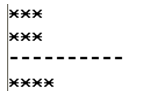

###### 第一种方式：不封装函数

```python
'''
    该案例演示了不封装函数
    向命令窗口打印输出
    ***
    ***
    --------
    ****
'''
row = 2
while row > 0 :
    print("*" * 3)
    row -= 1

print("-" * 20)
row = 1
while row > 0 :
    print("*" * 4)
    row -= 1
```
###### 第二种方式：封装函数

```python
'''
    该案例演示了封装函数
    向命令窗口打印输出
    ***
    ***
    --------
    ****
'''
def printStar1() :
    '''
        该函数可以打印2行3列的*
    '''
    row = 2
    while row > 0 :
        print("*" * 3)
        row -= 1

def printStar2() :
    '''
        该函数可以打印1行4列
    '''
    row = 1
    while row > 0 :
        print("*" * 4)
        row -= 1

# 调用函数
printStar1()
print("-" * 20)
printStar2()
```

注意：这里我们虽然封装了函数，但是printStar1和printStar2这两个函数中的大部分代码还是一样的，存在冗余。

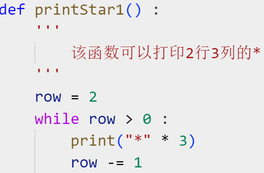

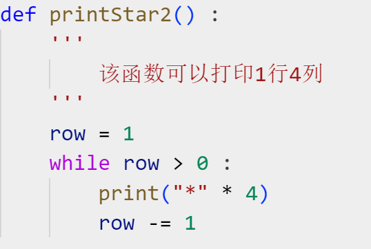

我们从上图可以看出来，printStar1和printStar2中不一样的地方就是在函数体中row变量值和打印*的个数不一样。这两个值分别可以理解代表打印*的行数以及打印的列数，既然我们现在的需求，打印的行和列是不固定的，所以我们只提供打印*的函数，具体要打印几行几列的*，让函数的调用者自己决定。这就要求我们在提供函数的时候，需要通过函数的参数接收行和列数据（函数的形式参数-形参）；在调用函数的时候需要把行和列数据作为参数传递过来（函数的实际参数-实参）。

###### 第三种方式：封装带参数的函数

```python
'''
    该案例演示了封装带参数的函数
    向命令窗口打印输出
    ***
    ***
    --------
    ****
'''
def printStar(row,col) :
    while row > 0 :
        print("*" * col)
        row -= 1

printStar(2,3)
print("-" * 20)
printStar(1,4)
```
#### 形参和实参

**在定义函数时，指定的参数称为形式参数，简称为形参（函数的提供者）**

在调用函数时，给函数传递的参数称为实际参数，简称为实参（函数的调用者）

**在定义函数时，形参没有分配存储空间，也没有值，相当于一个占位符;**

在调用函数时， 会在栈区中给函数分配存储空间， 然后给形参/局部变量分配存储空间，传递的是实际的数据

**当函数执行结束，函数所占的栈空间会被释放，函数的形参/局部变量也会被释放**

#### 函数的参数传递

###### 在 python 中，类型属于对象，变量是没有类型的：

a=10

a="helloworld"

以上代码中，10是数字类型，" helloworld " 是 String 类型，而变量 a 是没有类型，她仅仅是一个对象的引用（一个指针），可以是指向数字类型对象，也可以是指向 String 类型对象。

###### 引用的概念

在 Python 中，变量和数据是分开存储的，数据保存在内存中的一个位置，变量中保存着数据在内存中的地址，变量中记录数据的地址，就叫做引用。

使用id()函数可以查看变量中保存数据所在的内存地址

注意：如果变量已经被定义，当给一个变量赋值的时候，本质上是修改了数据的引用，变量不再对之前的数据引用，变量改为对新赋值的数据引用，变量的名字类似于便签纸贴在数据上。

###### 可变(mutable)与不可变(immutable)类型对象

在Python常见的类型中，数字类型、string、tuple是不可更改的对象，而list、set、dict等则是可以修改的对象。

**不可变类型**

变量赋值 a=500 后再赋值 a=1000，这里实际是新生成一个 int 值对象 1000，再让 a 指向它，而500被丢弃，不是改变a的值，相当于新生成了a。

**可变类型**

变量赋值 la=[1,2,3,4] 后再赋值 la[2]=5 则是将 list la 的第三个元素值更改，本身la没有动，只是其内部的一部分值被修改了。

###### Python函数的参数传递

**不可变类型**

类似c++的值传递，如整数、字符串、元组。如fun（a），传递的只是a的值，没有影响a对象本身。比如在fun（a）内部修改a的值，只是修改另一个复制的对象，不会影响 a 本身。

**可变类型**

类似c++的引用传递，如列表，字典。如 fun（la），则是将 la 真正的传过去，修改后fun外部的la也会受影响

Python 中一切都是对象，严格意义我们不能说值传递还是引用传递，我们应该说传不可变对象和传可变对象。

案例： Python函数传不可变对象实例

```python
'''
    该案例演示了Python函数传递不可变对象
'''
def changeInt(a) :
    print("函数体中未改变前a的内存地址",id(a))
    a = 10
    print("函数体中改变后a的内存地址",id(a))

b = 2
changeInt(b)
print(b)
print("函数外b的内存地址",id(b))
输出结果：
函数体中未改变前a的内存地址 140711474555352
函数体中改变后a的内存地址 140711474555608
2
函数外b的内存地址 140711474555352
```

id()查看对象的内存地址

说明：实例中有 int 对象 2，指向它的变量是b，在传递给 changeInt 函数时，按传值的方式复制了变量 b，a 和 b 都指向了同一个 int 对象，函数外b的内存地址和未改变前a的地址是相同的。在 a=10 时，则新生成一个 int 值对象 10，并让 a 指向它。这个时候内存地址也发生了改变。

案例：Python函数传可变对象实例

```python
'''
    该案例演示了Python函数传递可变对象
'''
def changeList(myList) :
    myList[1] = 50
    print("函数内的值",myList)
    print("函数内列表的内存",id(myList))

mlist = [1,2,3]
changeList(mlist)
print("函数外的值",mlist)
print("函数外列表的内存",id(mlist))
输出结果：
函数内的值 [1, 50, 3]
函数内列表的内存 1546427570560
函数外的值 [1, 50, 3]
函数外列表的内存 1546427570560
```

说明：

可变对象在函数里修改了参数，那么在函数外面，这个原始的参数也被改变了。

通过内存地址的输出，我们可以看出来，是在原有的列表对象上进行的修改。

###### var1 *= 2与var1 = var1 * 2的区别：

var1 *= 2使用原地址。

var1 = var1 * 2开辟了新的空间。

```python
def multiply2(var1):
    print("函数内var1 id:", id(var1))
    var1 *= 2
    print("var1 *= 2后，函数内var1 id:", id(var1))
    var1 = var1 * 2
    print("var1 = var1 * 2后，函数内var1 id:", id(var1))

list1 = [1, 2, 3]
print("list1 id:", id(list1))
multiply2(list1)
# 输出结果：
list1 id: 2302584035712
函数内var1 id: 2302584035712
var1 *= 2后，函数内var1 id: 2302584035712
var1 = var1 * 2后，函数内var1 id: 2302584033664
```
#### 函数可使用的参数形式

###### 必须参数

调用函数时，Python必须将函数调用中的每个实参都关联到函数定义中的一个形参。为此，最简单的关联方式是基于位置把每个相应位置的实参和形参相关联，调用时的数量必须和声明时的一样。

```python
'''
    该案例演示了函数位置实参
'''
def func(a, b, c):
    print(a, b, c)
func(1, 2, 3)  # 1 2 3
```

可以看到，1传给了a，2传给了b，3传给了c。

###### 关键字参数

函数调用使用关键字参数来确定每个变量传入的参数值，使用关键字参数允许函数调用时参数的顺序与声明时不一致。

```python
'''
    该案例演示了函数调用时的关键字参数
'''
def printInfo(name,age) :
    print("姓名:",name)
    print("年龄:",age)

# Python解释器可以通过age和name这样的关键字去和形参进行匹配
printInfo(name = "zhangsan",age = 18)
printInfo(age = 18,name = "zhangsan")
```
###### 默认值参数

定义函数时，可给每个形参指定默认值。在调用函数时，给形参提供了实参则使用指定的实参值，否则使用形参的默认值。因此，给形参指定默认值后，可在函数调用中省略相应的实参。使用默认值可简化函数调用，还可清楚地指出函数的典型用法。注意：非默认参数必须放在默认参数之前。

```python
'''
    该案例演示了函数调用时的默认参数
'''

def printInfo(name,age = 20) :
    print("姓名:",name)
    print("年龄:",age)

printInfo("zhangsan")

printInfo("lisi",30)

printInfo(age = 40,name = "wangwu")
```
###### 不定长参数

参数的个数是不确定的。

**语法：**

```python
def 函数名([普通参数,] *var_args_tuple ):
   函数体
```
**案例：**

```python
'''
    该案例演示了函数调用时的不定长参数
'''

def printInfo(num,*vartuple):
    print(num)
    print(vartuple)

printInfo(70,60,50)

print("-" * 20)
# 如果不定长的参数后面还有参数,必须通过关键字参数传参
def printInfo1(num1,*vartuple,num) :
    print(num)
    print(num1)
    print(vartuple)

printInfo1(10,20,num = 40)

print("-" * 20)
# 如果没有给不定长的参数传参,那么得到的是空元组
printInfo1(70,num = 60)
```
**注意：**

加了星号 * 的参数会以元组(tuple)的形式导入，存放所有未命名的变量参数。

如果形参中出现了不定长参数，那么在调用函数的时候，先通过位置进行必须参数的匹配，然后不定长参数后面的参数必须通过关键字参数匹配

如果不定长的参数后面还有参数,必须通过关键字参数传参

还有一种就是参数带两个星号 **的可变长参数，基本语法如下：

```python
def 函数名([普通参数,] **var_args_dict ):
   函数体
```

加了两个星号 ** 的参数会以字典的形式导入，后面就不能再有其他参数了

```python
'''
    该案例演示了函数调用时的不定长参数
'''
def printInfo(num,**vardict):
    print(num)
    print(vardict)
    # return

printInfo(10,key1 = 20,key2 = 30)
printInfo(10,a = 20,b = 30)
```
#### 解包传参

若函数的形参是定长参数，可以通过 * 和 ** 对列表、元组、字典等解包传参。

```python
def func(a, b, c):
    return a + b + c

tuple11 = (1, 2, 3)
print(func(*tuple11))
# 字典中key的名称和参数名必须一致
dict1 = {"a": 1, "b": 2, "c": 3}
print(func(**dict1))
```
#### 强制使用位置参数或关键字参数

/ 前的参数必须使用位置传参，* 后的参数必须用关键字传参。

```python
def f(a, b, /, c, d, *, e, f):
    print(a, b, c, d, e, f)

f(1, 2, 3, d=4, e=5, f=6)
```
#### 防止函数修改列表

有时要函数对列表进行处理，又不希望函数修改原列表，可以使用 copy.deepcopy()。

```python
import copy

def multiply2(var1):
    var1[3].append(400)
    print("函数内处理后：", var1)

list1 = [1, 2, 3, [100, 200, 300]]
print("函数外处理前：", list1)
multiply2(copy.deepcopy(list1))
print("函数外处理后：", list1)
```
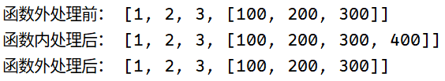

### 函数说明文档

编写了函数说明文档后，可以通过 help(函数名) 获取函数说明文档。

```python
def adult(age=18):
    """根据年龄判断是否成年"""
    result = "未成年"[age >= 18 :]
    return result

help(adult)
```
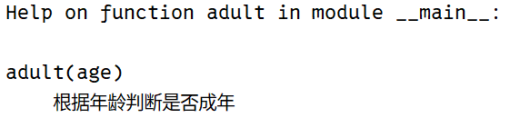

PyCharm中将鼠标悬停在函数名上方也可以看到函数说明文档。

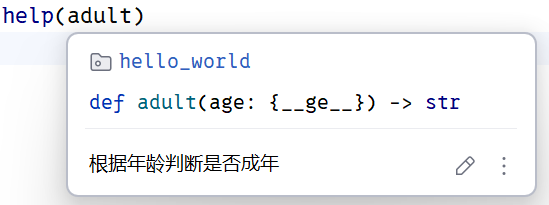

### 返回值

在程序开发中，有时候希望一个函数执行结束后，告诉调用者一个结果，以便调用者针对具体的结果做后续的处理。返回值就是函数完成工作后，给调用者的一个结果

在函数中使用 return 关键字可以返回结果 ，并结束正在执行的函数

如果return后面跟[表达式]，在结束函数的同时向调用方返回一个表达式。

如果仅仅是return关键字，后面没有加内容，函数执行返回调用方None。

调用函数一方，可以使用变量来接收函数的返回结果

**不带表达式的 return 语句，返回 None。**

```python
def f(a, b, c):
    pass
    return

print(f(1, 2, 3))  # None
```
**函数中如果没有 return 语句，在函数运行结束后也会返回 None。**

```python
def f(a, b, c):
    pass

print(f(1, 2, 3))  # None
```
**用变量接收返回结果**

```python
def add(num1,num2) :
    '''求两个数的和'''
    sum1 = num1 + num2
    return sum1

res = add(10,20)
print("两个数的和为:" ,res)
```
**return 语句可以返回多个值，多个值会放在一个元组中。**

```python
def f(a, b, c):
    return a, b, c, [a, b, c]
print(f(1, 2, 3))  # (1, 2, 3, [1, 2, 3])
```
### 函数嵌套调用

在一个函数中调用另一个函数，当内层函数执行完之后才会继续执行外层函数。

```python
def function_A():
    print("\t函数 A 开始执行")
    print("\t函数 A 执行中...")
    print("\t函数 A 结束执行")

def function_B():
    print("函数 B 开始执行")
    print("函数 B 执行中...")
    function_A()
    print("函数 B 执行中...")
    print("函数 B 结束执行")

function_B()
输出结果：
函数 B 开始执行
函数 B 执行中...
        函数 A 开始执行
        函数 A 执行中...
        函数 A 结束执行
函数 B 执行中...
函数 B 结束执行
```
### 变量的作用域

Python中，程序的变量并不是在哪个位置都可以访问的，访问权限决定于这个变量是在哪里赋值的。变量的作用域决定了哪一部分程序可以访问哪个变量，Python的作用域一共有4种，分别是：

L （Local） 局部作用域

E （Enclosing）嵌套作用域 闭包函数外的函数中

G （Global） 全局作用域

B （Built-in） 内建作用域

以 L –> E –> G –>B 的规则查找，即：在局部找不到，便会去局部外的局部找（例如闭包），再找不到就会去全局找，再者去内建中找。以下案例演示各种作用域类型。

```python
'''
    该案例演示了变量的作用域
'''
a = int(2.9)  # 内建作用域 (Python本身提供的,在所有位置都可以访问)
b = 0  # 全局作用域
def outer():
    c = 1  # 嵌套作用域
    def inner():
        d = 2  #局部作用域
        print(d,c,b,a)
    return inner
in_func=outer()
in_func()
```

Python 中只有模块（module），类（class）以及函数（def、lambda）才会引入新的作用域，其它的代码块（如 if/elif/else/、try/except、for/while等）是不会引入新的作用域的，也就是说这些语句内定义的变量，外部也可以访问，如下代码：

```python
# 分支,循环不会引入新的作用域
num = 2
if num > 1:
    msg = "helloWorld"
print(msg)

def test():
    msg_test = "welcome"
print(msg_test)
```

实例中 msg 变量定义在 if 语句块中，但外部还是可以访问的。

如果将 msg 定义在函数中，则它就是局部变量，外部不能访问：

从报错的信息上看，说明了 msg_inner 未定义，无法使用，因为它是局部变量，只有在函数内可以使用。

#### 全局变量和局部变量

定义在函数内部的变量拥有一个局部作用域，定义在函数外的拥有全局作用域。局部变量只能在其被声明的函数内部访问，而全局变量可以在整个程序范围内访问。

```python
'''
    该案例演示了全局变量和局部变量
'''
sum = 0  # 这是一个全局变量

def add(num1,num2) :
    sum = num1 + num2  # 这是一个局部变量
    print("函数内局部变量的值:",sum,id(sum))
    return sum

add(10,20)
print(num1) # num1访问不到
print("函数外全局变量:",sum,id(sum))
```
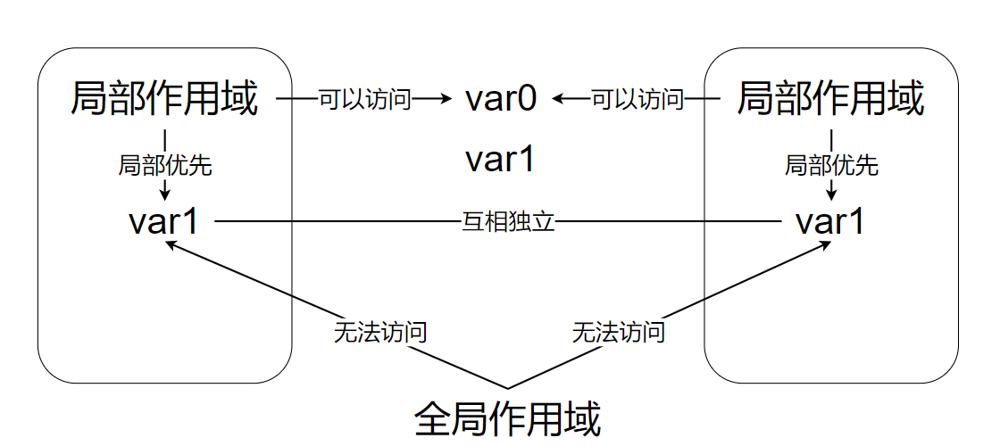

#### global关键字

###### 使用global修改全局变量

定义了一个全局变量，如何在函数内对其进行修改？

**直接在函数内修改**

**通过var1 += 200修改。会报错**

当你在函数内部对一个变量进行赋值操作时，Python 默认会把这个变量当作局部变量，即便全局作用域中已经存在同名变量。

```python
var1 = 100
def function_a():
    var1 += 200 # 将var1当做局部变量处理，+=得先定义变量
function_a()  # 报错
```

② 通过var1 = 200修改。全局变量var1的值并没被修改，仍是100。我们只是在function_a函数中新定义了一个局部变量var1并将其赋值为200。

```python
var1 = 100

def function_a():
    var1 = 200
    print("var1:", var1)
print(var1)  # 100
function_a()  # var1: 200
print(var1)  # 100
```
**在函数内使用 global 声明全局变量**

函数内使用 global 声明全局变量后，可以修改全局变量。

```python
def function_a():
    global var1
    var1 = 200
    print("var1:", var1)
var1 = 100
print(var1)  # 100
function_a()  # var1: 200
print(var1)  # 200
```
###### 修改可变类型的全局变量

当全局变量为可变类型时，函数内不使用 global 声明，也可以对其进行修改。

```python
def function_a():
    list1[0] = -1000
    print("list1:", list1)

list1 = [1, 2, 3]
print(list1)  # [1, 2, 3]
function_a()  # list1: [-1000, 2, 3]
print(list1)  # [-1000, 2, 3]
```

在函数中不使用 global 声明全局变量时不能修改全局变量的本质是不能修改全局变量的指向，即不能将全局变量指向新的数据。

不可变类型的全局变量其指向的数据不能修改，所以不使用 global 无法修改全局变量。

可变类型的全局变量其指向的数据可以修改，所以不使用 global 也可修改全局变量。

#### nonlocal关键字

nonlocal 也用作内部作用域修改外部作用域的变量的场景，不过此时外部作用域不是全局作用域而是嵌套作用域。

```python
def function_outer():
    var1 = 1
    print(var1)
    def function_inner():
        nonlocal var1
        var1 = 200
    function_inner()
    print(var1)
function_outer()  # var1: 1 -> 200
```
### 递归

#### 概念

递归一种是逻辑思想，将一个大工作分为逐渐减小的小工作，比如说一个和尚要搬50块石头，他想，只要先搬走49块，那剩下的一块就能搬完了，然后考虑那49块，只要先搬走48块，那剩下的一块就能搬完了……，递归是一种思想，只不过在程序中，就是依靠函数嵌套这个特性来实现了

#### 本质

递归调用就是在函数体中又调用了函数本身.

#### 在定义递归函数的时候，主要确定两点

确定它们之间的规律

确定递归结束的条件

#### 递归案例求一个整数n的阶乘！

```python
'''
    该案例演示了求整数的阶乘
    5! = 5 * 4 * 3 * 2 *1
'''
# 不使用递归的方式
def get_factorial(num):
    res = 1 #  用于存放积
    for n in range(1,num+1):
        res *= n    
    return res
print(get_factorial(5))
print("-"*20)
def get_factorial2(n):
    return n * get_factorial2(n - 1) if n > 1 else 1

print(get_factorial2(5))  # 120
```
#### 递归执行流程分析

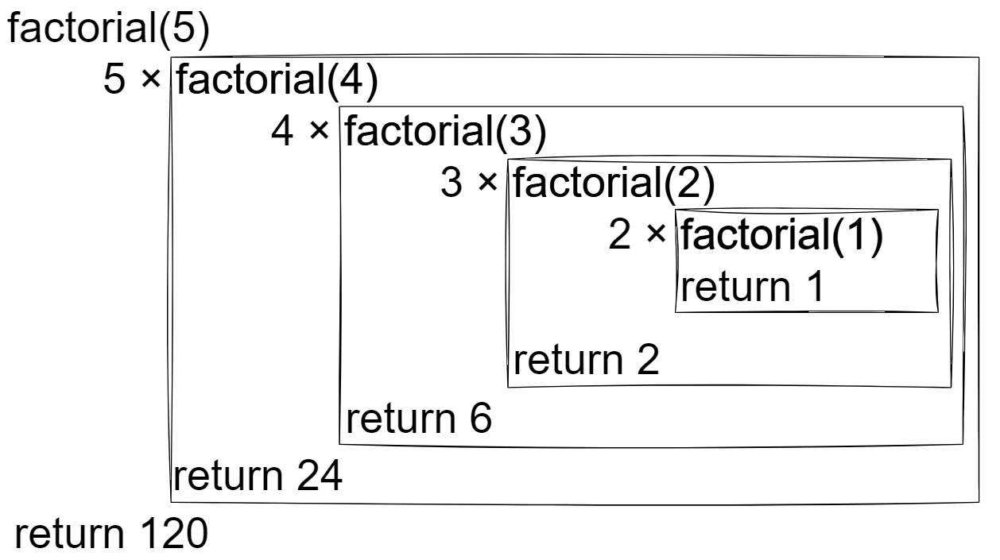

### 匿名函数

#### 语法

Python使用 lambda 来定义匿名函数，所谓匿名，指其不用 def 的标准形式定义函数。

```python
lambda 参数列表: 表达式
```

lambda 只是一个表达式，函数体比def简单很多。

lambda的主体是一个表达式，而不是一个代码块，所以仅仅能在lambda表达式中封装有限的逻辑进去。

lambda函数拥有自己的命名空间，且不能访问自己参数列表之外或全局命名空间里的参数。

#### 使用普通函数传参

```python
def operator(a, b):
    return a + b
def function(a, b, operator):
    return operator(a, b)
print(function(1, 2, operator))
```
#### 使用匿名函数传参

```python
def function(a, b, operator):
    return operator(a, b)
print(function(1, 2, lambda x, y: x + y))
```
#### 匿名函数作为内置函数的参数

可以将匿名函数与常用的内置参数搭配使用。

###### sorted()

有三名学生的姓名和年龄，按年龄排序。

```python
student_list = [{"name": "zhang3", "age": 36}, {"name": "li4", "age": 14}, {"name": "wang5", "age": 27}]
print(sorted(student_list, key=lambda x: x["age"]))
```
###### map()

map() 函数对序列中元素逐一处理。

```python
map_result = map(lambda x: x * x, [0, 1, 3, 7, 9])
print(list(map_result))  # [0, 1, 9, 49, 81]
```
###### filter()

filter() 函数对序列中元素过滤。

```python
filter_result = filter(lambda x: x >= 0, [-0, -1, -3, 7, 9])
print(list(filter_result))  # [0, 7, 9]
```
###### reduce()

reduce() 函数对序列中元素进行累积。

```python
from functools import reduce

reduce_result = reduce(lambda x, y: x * y, [1, 2, 3, 4, 5])
print(reduce_result)  # 120
```
### 函数的注释（了解）

Python 3.x 引入了函数注释，以增强函数的注释功能

```python
# 普通的自定义函数：
def dog(name, age, species):
   return (name, age, species)
# 添加了注释的自定义函数：
def dog(name:str, age:(1, 99), species:'狗狗的品种') -> tuple:
    return (name, age, species)
print(dog.__annotations__)
```

如上，可以使用:对参数逐个进行注释，注释内容可以是任何形式，比如参数的类型、作用、取值范围等等，返回值使用->标注，所有的注释都会保存至函数的属性。

查看这些注释可以通过自定义函数的特殊属性__annotations__获取,结果会以字典的形式返回，另外，使用函数注释并不影响默认参数的使用

```python
{'name': <class 'str'>, 'age': (1, 99), 'species': '狗狗的品种', 'return': <class 'tuple'>}
```
## 文件操作

### 文件的基本概念

在计算机中，文件是存储在磁盘上的数据集合。文件可以包含各种类型的数据，如文本、图像、音频、视频或程序代码。

文件系统通过文件名和文件路径来定位和管理文件。文件名通常包含文件的名称和扩展名，扩展名用于表示文件的类型（例如 .txt 表示文本文件，.jpg 表示图像文件）。文件路径可以是绝对路径（从文件系统的根目录开始）或相对路径（相对于当前工作目录）。

在编写程序的时候，数据是以二进制的形式存储在内存的，将数据写到磁盘文件的过程称之为持久化。

#### 文件的分类

###### 纯文本文件

有统一的编码，可以被看做存储在磁盘上的长字符串。

纯文本文件编码格式常见的有ASCII、ISO-8859-1、GB2312、GBK、UTF-8、UTF-16等。

###### 二进制文件

没有统一的字符编码，直接由0与1组成。

如图片文件（jpg、png），视频文件（avi）等。

#### 文件的路径

###### 相对路径

从当前位置到指定位置的路径。

如：./hello_world.py

./代表当前路径。../代表上一级路径。

###### 绝对路径

从根目录到指定位置的路径。

如：E:/Hello/hello.py

### 文件的打开与关闭

###### 打开文件

使用 open() 打开或创建文件，该方法执行完毕之后返回的是一个file对象。

**常用形式**

```python
open(文件名, 模式)
f = open("test.txt", "w")
```
**完整形式**

```python
open(
    file,  # 文件路径
    mode="r",  # 文件打开模式
    buffering=-1,  # 缓冲
    encoding=None,  # 文本编码方式，一般用utf8
    errors=None,  # 报错级别
    newline=None,  # 区分换行符
    closefd=True,  # 传入的file参数类型
    opener=None,  # 设置自定义开启器，开启器的返回值必须是一个打开的文件描述符
)
```
###### 关闭文件

```python
f.close()
```
### 文件读写

#### 写数据

```python
# 打开文件
f = open("test.txt", "w")
# 写入数据
f.write("hello world\n")
f.write("nihao python\n")
# 关闭文件
f.close()
```
#### 读数据

###### read

read([size]) 可以从文件中读取数据，size 表示要从文件中读取的数据的长度（单位是字节），如果没有传入 size 则读取文件中所有的数据。

```python
# 打开文件
f = open("test.txt", "rt")
# 读取文件所有数据 
print(f.read())
# 关闭文件
f.close()
print("-"*20)
f = open("test.txt", "rt")
# 读取文件5个字节数据
print(f.read(5))
print(f.read(8))
f.close()
```
###### readline

readline([size]) 可以从文件中读取整行数据，也可以通过 size 设置读取数据的长度。

```python
f = open("test.txt", "rt")
print(f.readline())
print(f.readline(1))
print(f.readline(1))
f.close()
```
###### readlines

readlines([size]) 读取所有行并返回列表，若给定 size>0，返回总和大约为 size 字节的行， 实际读取值可能比 size 大。

```python
f = open("test.txt", "r", encoding="utf-8")
print(f.readlines())
f.close()
```
### 常用函数

###### os.walk()递归遍历目录

**用法**

```python
# 返回一个3元组(dirpath文件夹路径, dirnames文件夹名字, filenames文件名)
os.walk(
    top,  # 根目录
    topdown=True,  # 可选，默认为True:自顶向下，False:自底向上
    onerror=None,  # 可选，是一个函数
    followlinks=False,  # 可选，设置为True则通过软链接访问目录
)
```
**案例：递归遍历当前路径下所有目录和文件**

```python
import os

for root, dirs, files in os.walk(os.getcwd()):
    print("当前路径：", root)
    print("目录：", dirs)
    print("文件：", files)
    print()
```
### 案例：文件拷贝

```python
# source_file : 源文件路径
# dest_file: 目的地文件路径
def copyFile(source_file_path,dest_file__path):
    # 打开源文件
    source_file = open(source_file_path, 'rb')
    # 读取源文件中的内容
    content = source_file.read()

    # 打开目的地文件
    dest_file = open(dest_file__path, 'wb')
    # 将读取到的数据写入到目的地
    dest_file.write(content)

    # 关闭源文件
    source_file.close()
    # 关闭目的地文件
    dest_file.close()

copyFile("D:/mv.png","E:/mv.png")
```

优化：这种方式可以不用读取整个文件，减小内存压力

```python
# source_file : 源文件路径
# dest_file: 目的地文件路径
def copyFile(source_file_path,dest_file__path):
    # 打开源文件
    source_file = open(source_file_path, 'rb')
    # 打开目的地文件
    dest_file = open(dest_file__path, 'wb')
    # 读取源文件中的内容
    content = source_file.read(1024)
    while content:
        # 将读取到的数据写入到目的地
        dest_file.write(content)
        # 继续从源文件读取数据
        content = source_file.read(1024)
    # 关闭源文件
    # 关闭目的地文件
    dest_file.close()

copyFile("D:/mv.png","E:/mv.png")
```
## 面向对象之类和对象

### 面向过程和面向对象

面向过程编程（Procedural Programming）和面向对象编程（OOP）是两种不同的编程范式，它们在软件开发中都有广泛的应用。

Python是一种混合型的语言，既支持面向过程的编程，也支持面向对象的编程。

面向过程的编程是一种以过程为中心的编程方式，主要关注解决问题的步骤，并将这些步骤写成函数或方法。

面向对象的编程是一种以对象为中心的编程方式，主要关注在解决问题的过程中涉及哪些对象以及这些对象如何交互

###### 面向过程举例

想象一下，你要做一顿美味的晚餐。在面向过程编程的思维下，你会把整个做饭的过程拆分成一系列的步骤。

```python
def buy():
    print("去超市购买食材。")
def wash():
    print("清洗蔬菜。")
def cut():
    print("切菜。")
def cook():
    print("开始烹饪。")
def serve():
    print("上菜啦！")

buy()
wash()
cut()
cook()
serve()
```

上面就是一个典型的面向过程的程序，我们把整个做饭的过程分解成了一个个函数，每个函数完成一个特定的任务，然后按照顺序依次调用这些函数，就可以完成做晚餐的任务啦。这种方式非常直接，适合一些简单的任务，它注重的是程序的流程和步骤。

但是呢，当我们的程序变得越来越复杂，会出现什么问题呢？比如说，我们现在想做不同类型的菜，有些菜可能不需要洗菜，有些菜可能不需要切菜，或者你要同时做几道菜，那我们的代码就会变得越来越长，越来越乱，而且上面的代码步骤是没有通用性的。

###### 面相对象举例（先感受）

用面向对象的思想实现上面的做菜功能

```python
class Dish:
    def __init__(self, name):
        self.name = name
    def prepare(self):
        pass
class Salad(Dish):
    def prepare(self):
        print(f"为 {self.name} 购买食材。")
        print(f"清洗 {self.name} 的蔬菜。")
        print(f"切 {self.name} 的蔬菜。")
class Stew(Dish):
    def prepare(self):
        print(f"为 {self.name} 购买食材。")
        print(f"切 {self.name} 的肉。")
        print(f"烹饪 {self.name}。")
class Soup(Dish):
    def prepare(self):
        print(f"为 {self.name} 购买食材。")
        print(f"煮 {self.name}。")
salad = Salad("蔬菜沙拉")
stew = Stew("炖肉")
soup = Soup("西红柿鸡蛋汤")

salad.prepare()
stew.prepare()
soup.prepare()
```

在这里，我们创建了一个 Dish 类，它就像是一个菜的模板。然后我们创建了 Salad、Stew 和 Soup 这些子类，它们都继承自 Dish 类。每个子类都有自己的 prepare 方法，这个方法描述了如何准备这道菜。

这样，我们可以看到面向对象编程的优势啦 首先，我们把相关的数据（比如菜的名字）和操作（比如准备菜的过程）都封装在了一个类里面，这叫做 “封装”。而且，不同类型的菜可以有自己独特的准备方法，我们可以根据需要去修改或扩展这些方法，而不会影响其他类。这就像是每个菜都有自己的制作过程。

还有，当我们想要添加新的菜品时，我们只需要创建一个新的子类，定义它自己的 prepare 方法就好，不需要修改原来的代码。

###### 面向对象历史

对象作为编程实体最早是于1960年代由Simula 67语言引入思维。Simula这一语言是奥利-约翰·达尔和克利斯登·奈加特在奥斯陆的挪威计算中心为模拟环境而设计的。（据说，他们是为了模拟船只而设计的这种语言，并且对不同船只间属性的相互影响感兴趣。他们将不同的类型船只归纳为不同的类，而每一个对象，基于它的类，可以定义它自己的属性和行为。）这种办法是分析式程序的最早概念体现。在分析式程序中，我们将真实世界的对象映射到抽象的对象，这叫做“模拟”。Simula不仅引入了“类”的概念，还应用了实例这一思想，这可能是这些概念的最早应用。

### 类和对象

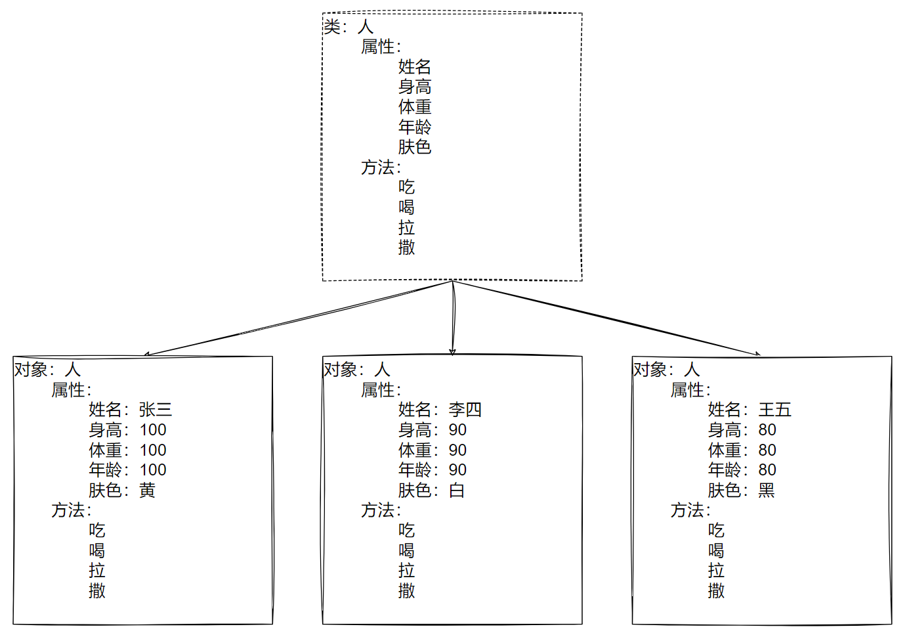

#### 类（Class）

类描述了所创建的对象共同的属性（是什么）和方法（能做什么），属性和方法统称为类的成员。

类是对大量对象共性的抽象

类是创建对象的模板

类是客观事物在人脑中的主观反映

#### 对象（Object）

**在自然界中，只要是客观存在的事物都是对象**

**类是抽象的，对象是类的实例（Instance），是具体的。**

**一个对象有自己的状态（属性）、行为（方法）和唯一的标识（本质上指内存中所创建的对象的地址）。**

### 定义类

###### 语法

```python
class 类名:
    """类说明文档"""
    类体
```

类名一般使用大驼峰命名法。

类体中可以包含类属性（也叫类变量）、方法、实例属性（也叫实例变量）等。

###### 案例

定义一个人的类，包含 __init__() 方法、eat() 方法和 drink() 方法。

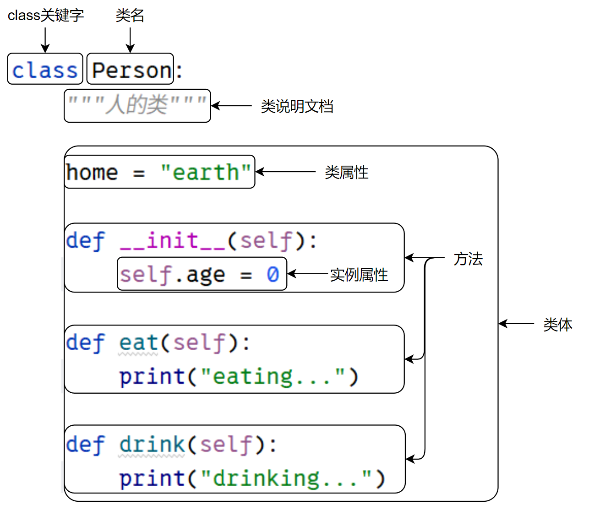

```python
class Person:
    """人的类"""

    home = "earth"

    def __init__(self):
        self.age = 0

    def eat(self):
        print("eating...")

    def drink(self):
        print("drinking...")
```
### 类的操作

类支持两种操作，成员引用和实例化。

###### 成员引用

**语法**

```python
类名.成员名
```
**案例**

```python
class Person:
    """人的类"""

    home = "earth"

    def __init__(self):
        self.age = 0

    def eat(self):
        print("eating...")

    def drink(self):
        print("drinking...")

home = Person.home  # 获取一个字符串
eat_function = Person.eat  # 获取一个函数对象
doc = Person.__doc__  # 获取类的说明文档

print(home)  # earth
print(eat_function)  # <function Person.eat at 0x00000232C8230F40>
print(doc)  # 人的类
```
###### 实例化

**语法**

```python
变量名 = 类名()
```
**案例**

```python
class Person:
    """人的类"""

    home = "earth"

    def __init__(self):
        self.age = 0

    def eat(self):
        print("eating...")

    def drink(self):
        print("drinking...")

p = Person()  # 创建一个对象
print(p.home)  # earth
print(p.age)  # 0
p.eat()  # eating...
p.drink()  # drinking...
```
### __init()__方法

__init__() 是一个特殊的方法，也被称作构造函数。__init__() 方法的主要作用是在创建类的对象时，对对象的属性进行初始化。当你使用类名创建一个新的对象时，Python 会自动调用 __init__() 方法，并将新创建的对象作为第一个参数（通常命名为 self）传递给它。

注意：

**self：这是一个约定俗成的参数名，它代表类的实例对象本身。在方法内部，通过 self 可以访问和修改对象的属性。**

**__init__() 方法不是必需的。如果类中没有定义 __init__() 方法，Python 会使用默认的构造函数，该构造函数不执行任何操作。**

**__init__() 方法只能返回 None，不能返回其他值。如果尝试返回其他值，会引发 TypeError 异常**

```python
class Person:
    """人的类"""

    home = "earth"

    def __init__(self, name):
        self.name = name

p = Person("张三")  # 创建一个对象
print(p.name)  # 张三
```
### self

#### self作为实例传参

self代表类的实例自身。调用实例方法时，实例对象会作为第一个参数被传入。因此，我们调用p.eat()时就相当于调用了Person.eat(p)。

```python
class Person:
    """人的类"""

    home = "earth"

    def __init__(self, name):
        self.name = name

    def eat(self):
        print("eating...")

    def drink(self):
        print("drinking...")

p = Person("张三")  # 创建一个对象
p.eat()  # eating...
Person.eat(p)  # eating...
```
#### 通过self在类中调用类的实例属性和实例方法

```python
class Person:
    """人的类"""

    home = "earth"

    def __init__(self, name):
        self.name = name

    def eat(self):
        print("eating...")

    def drink(self):
        print("drinking...")

    def eat_and_drink(self):
        print(self.name)  # 在类中调用name
        self.eat()  # 在类中调用eat()方法
        self.drink()  # 在类中调用drink()方法

p = Person("张三")  # 创建一个对象
p.eat_and_drink()
```
### 属性

#### 类属性

也叫类变量。在类中方法外定义的属性。

###### 通过 类名.属性名 或 实例名.属性名 访问

```python
class Person:
    """人的类"""

    home = "earth"  # 定义类属性

print(Person.home)  # 通过类名访问类属性

p1 = Person()  # 创建一个实例对象
print(p1.home)  # 通过实例名访问类属性，(如果实例没有覆盖这个类属性的值)
```
###### 通过 类名.属性名 添加与修改类属性

```python
class Person:
    """人的类"""

Person.home = "earth"  # 添加类属性
print(Person.home)  # earth

Person.home = "mars"  # 修改类属性
print(Person.home)  # mars
```

若使用 实例名.属性名 则会创建或修改实例属性，因此不建议类属性和实例属性同名。

```python
class Person:
    """人的类"""

    home = "earth"

p1 = Person()
p2 = Person()
print(Person.home)  # earth
print(p1.home)  # earth
print(p2.home)  # earth

print("通过 类名.属性名 修改 类属性")
Person.home = "mars"
print(Person.home)  # mars
print(p1.home)  # mars
print(p2.home)  # mars

print("通过 实例名.属性名 会创建 实例属性")
p1.home = "venus"
print(Person.home)  # mars
print(p1.home)  # venus
print(p2.home)  # mars
```
###### 所有该类的实例共享同一个类属性

```python
class Person:
    """人的类"""

    home = "earth"  # 定义类属性，所有实例共享

p1 = Person()  # 创建一个实例对象
p2 = Person()  # 创建另一个实例对象

print(p1.home)  # earth
print(p2.home)  # earth
Person.home = "mars"  # 修改类属性
print(p1.home)  # mars
print(p2.home)  # mars
```
#### 实例属性

也叫实例变量。在类__init__方法中定义的属性。通过 self.属性名定义。

###### 通过 实例名.属性名 访问

```python
class Person:
    """人的类"""

    def __init__(self, name, age):
        self.name = name  # 定义实例属性
        self.age = age  # 定义实例属性

p1 = Person("张三", 18)  # 创建一个实例对象
print(p1.name, p1.age)  # 张三 18

p2 = Person("李四", 81)  # 创建一个实例对象
print(p2.name, p2.age)  # 李四 81

print(Person.name)  # 报错
```
###### 通过 实例名.属性名 添加与修改实例属性

```python
class Person:
    """人的类"""

    pass

p1 = Person()  # 创建一个实例对象
p1.name = "张三"  # 添加实例属性
p1.age = 18  # 添加实例属性
print(p1.name, p1.age)  # 张三 18

p1.age = 25  # 修改实例属性
print(p1.name, p1.age)  # 张三 25
```
###### 每个实例独有一份实例属性

```python
class Person:
    """人的类"""

    def __init__(self, name):
        self.name = name  # 定义实例属性
        self.age = 0  # 定义实例属性

p1 = Person("张三")  # 创建一个实例对象
print(p1.name, p1.age)  # 张三 0
p1.age = 18  # 修改p1的age属性
print(p1.name, p1.age)  # 张三 18

p2 = Person("李四")  # 创建另一个实例对象
print(p2.name, p2.age)  # 李四 0
```
### 方法

Python的类中有三种方法：实例方法、静态方法、类方法。

#### 实例方法

**实例方法在类中定义，第一个参数为self，代表实例本身。**

**实例方法只能被实例对象调用。**

**可以访问实例属性、类属性、类方法。**

```python
class Person:
    """人的类"""

    home = "earth"

    def __init__(self, name):
        self.name = name

    def instance_method(self):
        print(self.name, self.home, Person.home)

p = Person("张三")
p.instance_method()  # 张三 earth earth，此时p中没有home实例属性，会去查找home类属性
Person.home = "venus"  # 修改类属性
p.home = "mars"  # 定义实例属性
p.instance_method()  # 张三 mars venus
```
#### 类方法

**类方法在类中通过 @classmethod 定义，第一个参数为cls，代表类本身。**

**类方法可以被类和实例对象调用。**

**可以访问类属性。**

**在不创建实例的情况下调用，通过类名直接调用，非常方便，适合一些和类整体相关的操作。**

```python
class Person:
    """人的类"""

    home = "earth"  # 定义类属性

    @classmethod
    def class_method(cls):
        print(cls.home)

Person.class_method()  # 通过类调用类方法

p1 = Person()  # 创建一个实例对象
p1.class_method()  # 通过实例对象调用类方法
```
#### 静态方法

**静态方法在类中通过 @staticmethod 定义**

**不访问实例属性或类属性，只依赖于传入的参数**

**可以通过类名或实例调用，但它不会访问类或实例的内部信息，更像是一个工具函数，只是为了方便组织代码，把它放在了类里面。**

```python
class Person:
    """人的类"""

    home = "earth"  # 定义类属性

    @staticmethod
    def static_method():
        print("static method")

Person.static_method()  # 通过类调用静态方法

p1 = Person()  # 创建一个实例对象
p1.static_method()  # 通过实例对象调用静态方法
```
#### 在类外定义方法

并非必须在类定义中进行方法定义，也可以将一个函数对象赋值给一个类内局部变量。

```python
# 在类外定义的函数
def f1(self, x, y):
    print(x & y)

class C:
    f = f1

C().f(6, 13)  # 4
```
#### 特殊方法

方法名中有两个前缀下划线和两个后缀下划线的方法为特殊方法，也叫魔法方法。上文提到的 __init__() 就是一个特殊方法。这些方法会在进行特定的操作时自动被调用。

几个常见的特殊方法：

###### __new__()

对象实例化时第一个调用的方法。

###### __init__()

类的初始化方法。

###### __del__()

对象的销毁器，定义了当对象被垃圾回收时的行为。使用 del xxx 时不会主动调用 __del__() ，除非此时引用计数==0。

###### __str__()

定义了对类的实例调用 str() 时的行为。

###### __repr__()

定义对类的实例调用 repr() 时的行为。 str() 和 repr() 最主要的差别在于目标用户。 repr() 的作用是产生机器可读的输出（大部分情况下，其输出可以作为有效的Python代码），而 str() 则产生人类可读的输出。

###### __getattribute__()

属性访问拦截器，定义了属性被访问前的操作。

### 动态添加属性与方法

#### 动态给对象添加属性

```python
class Person:
    def __init__(self, name=None):
        self.name = name

p = Person("张三")
print(p.name)  # 张三

p.age = 18
print(p.age)  # 18
```
#### 动态给类添加属性

```python
class Person:
    def __init__(self, name=None):
        self.name = name

p = Person("张三")
print(p.name)  # 张三

Person.age = 0
print(p.age)  # 0
```
#### 动态给实例添加方法

###### 添加普通方法

```python
class Person:
    def __init__(self, name=None):
        self.name = name

def eat():
    print("吃饭")

p = Person("张三")
p.eat = eat
p.eat()  # 吃饭
```
###### 添加实例方法

给对象添加的实例方法只绑定在当前对象上，不对其他对象生效，而且需要传入 self 参数。需要使用 types.MethodType(方法名，实例对象) 来添加实例方法。

```python
import types

class Person:
    def __init__(self, name=None):
        self.name = name

def eat(self):
    print(f"{self.name}在吃饭")

p = Person("张三")
p.eat = types.MethodType(eat, p)
p.eat()  # 张三在吃饭
```
#### 动态给类添加方法

给类添加的方法对它的所有对象都生效，添加类方法需要传入 cls 参数，添加静态方法则不需要。

```python
class Person:
    home = "earth"

    def __init__(self, name=None):
        self.name = name

# 定义类方法
@classmethod
def come_from(cls):
    print(f"来自{cls.home}")

# 定义静态方法
@staticmethod
def static_function():
    print("static function")

Person.come_from = come_from
Person.come_from()  # 来自earth

Person.static_function = static_function
Person.static_function()  # static function
```
#### 动态删除属性与方法

**del 对象.属性名**

**delattr(对象，属性名)**

#### __slots__限制实例属性与实例方法

Python允许在定义类的时候，定义一个特殊的 __slots__ 变量，来限制该类的实例能添加的属性。使用 __slots__ 可以限制添加实例属性和实例方法，但类属性、类方法和静态方法还可以添加。__slots__仅对当前类生效，对其子类无效。

```python
import types

class Person:
    __slots__ = ("name", "age", "eat")

    def __init__(self, name=None):
        self.name = name

def eat(self):
    print(f"{self.name}在吃饭")

def drink(self):
    print(f"{self.name}在喝水")

p = Person("张三")

# 添加实例属性
p.age = 10
print(p.age)  # 10

# 添加实例方法
p.eat = types.MethodType(eat, p)
p.eat()  # 张三在吃饭

# 添加实例属性
p.weight = 100  # AttributeError: 'Person' object has no attribute 'weight'

# 添加实例方法
p.drink = type.MethodType(drink, p)  # AttributeError: type object 'type' has no attribute 'MethodType'
```
## 面向对象之三大特性

### 封装

将变量和函数写入类中的操作即为封装，即类中封装了属性和方法。

通过封装，我们可以将一些细节隐藏起来（私有），只暴露出必要的接口供调用者使用。

#### 私有化

有时为了限制属性和方法只能在类内访问，外部无法访问；或父类中某些属性和方法不希望被子类继承。可以将其私有化。

###### 单下划线：非公开API

大多数Python代码都遵循这样一个约定：有一个前缀下划线的变量或方法应被视为非公开的API，例如 _var1。这种约定不具有强制力。

###### 双下划线：名称改写

有两个前缀下划线，并至多一个后缀下划线的标识符，例如 __x，会被改写为 _类名__x。只有在类内部可以通过 __x 访问，其他地方无法访问或只能通过 _类名__x 访问。

#### 私有属性

通过双下划线定义私有属性。

```python
class Person:

    def __init__(self, name):
        self.__name = name

    def get_name(self):
        return self.__name

p = Person("张三")
print(p.get_name())  # 张三
print(p._Person__name)  # 张三
print(p.__name)  # 报错
```
#### 私有方法

通过双下划线定义私有方法。

```python
class Person:

    # 定义私有方法
    def __private_method(self):
        print("private method")

    # 定义实例方法，调用私有方法
    def do_something(self):
        self.__private_method()

p = Person()
p.do_something()  # private method
p._Person__private_method()  # private method
p.__private_method()  # 报错
```
#### property

###### 方法转换为属性

可通过@property装饰器将一个方法转换为属性来调用。转换后可直接使用 .方法名 来使用，而无需使用 .方法名() 。

```python
class Person:

    def __init__(self, name):
        self.name = name

    @property
    def eat(self):
        print(f"{self.name} is eating...")

p = Person("张三")
p.eat   # 张三 is eating...
```
###### 只读属性

将方法名设置为去掉双下划线的私有属性名，方法中返回私有属性。

```python
class Person:

    def __init__(self, name):
        self.__name = name

    @property
    def name(self):
        return self.__name

p = Person("张三")
print(p.name)  # 张三
p.name = "李四"  # 报错
```
###### 读写属性

将方法名设置为去掉双下划线的私有属性名，使用 属性名.setter 装饰。

```python
class Person:

    def __init__(self, name):
        self.__name = name

    @property
    def name(self):
        return self.__name

    @name.setter
    def name(self, name):
        self.__name = name

p = Person("张三")
print(p.name)  # 张三

p.name = "李四"
print(p.name)  # 李四
```

也可以在写方法中设置一些拦截条件来规范私有属性的写入。

```python
class Person:

    def __init__(self, name):
        self.__name = name

    @property
    def name(self):
        return self.__name

    @name.setter
    def name(self, name):
        if name == "李四":
            print("不许叫李四")
        else:
            self.__name = name

p = Person("张三")
print(p.name)  # 张三

p.name = "李四"  # 提示 “不许叫李四”
print(p.name)  # 张三

p.name = "王五"
print(p.name)  # 王五
```
###### 注意

@property装饰的方法不要和变量重名，否则可能导致无限递归。

```python
class Person:

    @property
    def name(self):
        return self.name

p = Person()
p.name  # 报错：RecursionError: maximum recursion depth exceeded
```
### 继承

子类（派生类）继承父类（基类）中的属性和方法，实现代码重用。子类可以新增自己特有的方法，也可以重写父类的方法。

子类不能继承父类的私有属性和私有方法，因为存在名称改写，但是可以通过改写后的名称直接访问父类的私有成员，不过，这种做法违背了封装原则，不建议使用。

#### 单继承

###### 语法

```python
class 类名(父类):
    类体
```

在类名后括号内指定要继承的父类。

###### 案例

```python
class Person:
    """人的类"""

    home = "earth"  # 定义类属性

    def __init__(self, name):
        self.name = name  # 定义实例属性

    def eat(self):
        print("eating...")

class YellowRace(Person):
    """黄种人"""

    color = "yellow"  # 定义类属性

class WhiteRace(Person):
    """白种人"""

    color = "white"  # 定义类属性

class BlackRace(Person):
    """黑种人"""

    color = "black"  # 定义类属性

y1 = YellowRace("张三")
print(y1.home)  # earth
print(y1.color)  # yellow
print(y1.name)  # 张三
y1.eat()  # eating...

w1 = WhiteRace("李四")
print(w1.home)  # earth
print(w1.color)  # white
print(w1.name)  # 李四
w1.eat()  # eating...

b1 = BlackRace("王五")
print(b1.home)  # earth
print(b1.color)  # black
print(b1.name)  # 王五
b1.eat()  # eating...
```
#### 多继承

调用方法时先在子类中查找，若不存在则从左到右依次查找父类中是否包含方法。

###### 语法

```python
class 类名(父类1, 父类2, ...):
    类体
```
###### 案例

```python
class Person:
    """人的类"""

    home = "earth"

    def __init__(self, name):
        self.name = name

    def eat(self):
        print("eating...")

class YellowRace(Person):
    """黄种人"""

    color = "yellow"

    def run(self):
        print("runing...")

class Student(Person):
    """学生"""

    def __init__(self, name, grade):
        self.name = name
        self.grade = grade

    def study(self):
        print("studying...")

class ChineseStudent(Student, YellowRace):  # 继承了Student和YellowRace
    """中国学生"""

    country = "中国"

y1 = ChineseStudent("张三", "三年级")
print(y1.home, y1.color, y1.country, y1.name, y1.grade)
y1.eat()
y1.run()
y1.study()
```
#### 复用父类方法

子类可以在类中使用 super().方法名() 或 父类名.方法名() 来调用父类的方法。

###### super().方法名()

```python
class Person:
    """人的类"""

    home = "earth"

    def __init__(self, name):
        self.name = name

    def eat(self):
        print("eating...")

class YellowRace(Person):
    """黄种人"""

    color = "yellow"

    def run(self):
        print("runing...")

class Student(Person):
    """学生"""

    def __init__(self, name, grade):
        self.name = name
        self.grade = grade

    def study(self):
        print("先吃再学")
        super().eat()  # 子类中调用父类的方法
        print("studying...")

class ChineseStudent(Student, YellowRace):  # 继承了Student和YellowRace
    """中国学生"""

    country = "中国"

y1 = ChineseStudent("张三", "三年级")
print(y1.home, y1.color, y1.country, y1.name, y1.grade)
y1.study()
```
###### 父类名.方法名()

```python
class Person:
    """人的类"""

    home = "earth"

    def __init__(self, name):
        self.name = name

    def eat(self):
        print("eating...")

class YellowRace(Person):
    """黄种人"""

    color = "yellow"

    def run(self):
        print("runing...")

class Student(Person):
    """学生"""

    def __init__(self, name, grade):
        self.name = name
        self.grade = grade

    def study(self):
        print("先吃再学")
        Person.eat(self)  # 子类中调用父类的方法
        print("studying...")

class ChineseStudent(Student, YellowRace):  # 继承了Student和YellowRace
    """中国学生"""

    country = "中国"

y1 = ChineseStudent("张三", "三年级")
print(y1.home, y1.color, y1.country, y1.name, y1.grade)
y1.study()
```
#### 方法解析顺序

方法解析顺序（mro—Method Resolution Order）。可使用 类名.__mro__ 访问类的继承链来查看方法解析顺序。

```python
class Person:
    """人的类"""

    home = "earth"

    def __init__(self, name):
        self.name = name

    def eat(self):
        print("eating...")

class YellowRace(Person):
    """黄种人"""

    color = "yellow"

    def run(self):
        print("runing...")

class Student(Person):
    """学生"""

    def __init__(self, name, grade):
        self.name = name
        self.grade = grade

    def study(self):
        print("先吃再学")
        Person.eat(self)
        print("studying...")

class ChineseStudent(Student, YellowRace):
    """中国学生"""

    country = "中国"

y1 = ChineseStudent("张三", "三年级")
print(
    ChineseStudent.__mro__
)  # (<class '__main__.ChineseStudent'>, <class '__main__.Student'>, <class '__main__.YellowRace'>, <class '__main__.Person'>, <class 'object'>)
```
#### 方法重写

在子类中定义与父类方法重名的方法，调用时会调用子类中重写的方法。

```python
class Person:

    home = "earth"

    def __init__(self, name):
        self.name = name

    def eat(self):
        print("eating...")

class Chinese(Person):

    color = "yellow"

    # 重写父类方法
    def eat(self):
        print("用筷子吃")

y1 = Chinese("张三")
y1.eat()
```

注意：子类重写 __init__() 并调用时，不会执行父类的 __init__() 方法。如有必要，需在子类 __init__() 中使用 super().__init__() 来调用父类的 __init__() 方法。

```python
class Person:

    def __init__(self, name):
        self.name = name

class Chinese(Person):

    def __init__(self, name, area):
        super().__init__(name)  # 调用父类的__init__()
        self.area = area

y1 = Chinese("张三", "北京")
print(y1.name, y1.area)
```
### 多态

同一事物在不同场景下呈现不同状态。

```python
class Animal:
    def go(self):
        pass

class Dog(Animal):
    def go(self):
        print("跑")

class Fish(Animal):
    def go(self):
        print("游")

class Bird(Animal):
    def go(self):
        print("飞")

def go(animal):
    animal.go()  # 将不同的实例传入，执行不同的方法

dog = Dog()
fish = Fish()
bird = Bird()
go(dog)
go(fish)
go(bird)
```
## 面向对象案例：愤怒的小鸟

### 游戏背景

在这个模拟的愤怒的小鸟游戏世界里，绿色的小猪偷走了小鸟们的蛋，这引发了小鸟们的愤怒，它们决定展开反击。每只小鸟都具有独特的颜色，并且各自拥有不同的技能，玩家需要操控这些小鸟，利用它们的技能去攻击小猪们建造的各种障碍物，从而达成击败小猪、夺回鸟蛋的目标。

### 类的设计思路

#### Birds 基类

###### 设计目的

作为所有小鸟类的基类，它定义了小鸟的通用属性和行为，为后续具体小鸟类的扩展提供基础框架，体现了面向对象编程中的抽象和封装思想。

###### 属性设计

name：用于标识每只小鸟的名称，方便区分不同个体。

color：代表小鸟的颜色，这是小鸟的一个显著特征，在游戏中可以对应不同类型的小鸟。

skill_description：描述小鸟所具备的独特技能，让玩家了解每只小鸟的特殊能力。

###### 方法设计

fly()：描述小鸟飞行的基本动作，是小鸟在游戏中的常见行为，所有子类都可以重写该方法来展示不同的飞行特点。

call()：模拟小鸟发出叫声的行为，同样可以被子类重写以体现不同小鸟的叫声差异。

use_skill()：用于触发小鸟的特殊技能，展示小鸟使用技能的情况，子类可以根据自身技能特点进行相应实现。

#### 具体小鸟子类（RedBirds、YellowBirds、BlueBirds）

###### 设计目的

继承自 Birds 基类，每个子类代表一种特定颜色的小鸟，它们在继承基类属性和方法的基础上，重写部分方法以展示不同小鸟的独特行为和技能，体现了面向对象编程中的继承和多态思想。

###### 属性设计

通过调用基类的 __init__ 方法，初始化各自的 name、color 和 skill_description 属性，确保每只小鸟都有自己的独特标识和技能。

###### 方法设计

fly()：重写基类的 fly() 方法，展示不同小鸟的飞行特点，如红鸟以稳定速度飞行，黄鸟快速飞行，蓝鸟优雅飞行。

call()：重写基类的 call() 方法，模拟不同小鸟的叫声，增加游戏的趣味性。

#### Obstacle 类

###### 设计目的

代表游戏中的障碍物，如木头堡垒、石头塔楼等，负责处理障碍物被小鸟攻击的逻辑，与小鸟类进行交互，体现了面向对象编程中的对象交互和封装思想。

###### 属性设计

name：标识障碍物的名称，方便区分不同类型的障碍物。

strength：表示障碍物的强度，即它能够承受的伤害值，当强度降为 0 时，障碍物被摧毁。

###### 方法设计

be_attacked(bird)：模拟障碍物被小鸟攻击的过程，根据小鸟的类型计算伤害，并更新障碍物的强度，同时输出攻击和受损信息，让玩家了解游戏进展。

### 方法设计思路

#### Birds 类的方法

###### fly()

作为通用的飞行方法，提供了小鸟飞行的基本描述，子类可以根据自身特点进行个性化实现，以体现不同小鸟的飞行风格。

###### call()

模拟小鸟发出叫声的行为，为游戏增加生动性，子类可以重写该方法来展示不同小鸟的叫声特点。

###### use_skill()

用于触发小鸟的特殊技能，通过输出技能描述，让玩家了解小鸟使用技能的情况，不同子类可以根据自身技能进行不同的实现。

#### 具体小鸟子类的方法

fly() 和 call()：重写基类的方法，根据不同小鸟的特点进行个性化实现，展示不同小鸟的飞行和叫声差异，体现了多态性。

#### Obstacle 类的方法

be_attacked(bird)：接收一个小鸟对象作为参数，根据小鸟的类型计算伤害，并更新障碍物的强度。通过判断障碍物的强度是否小于等于 0，输出障碍物是否被摧毁的信息，实现了障碍物与小鸟之间的交互逻辑。

通过这样的类和方法设计，整个游戏模拟程序具有良好的扩展性和可维护性，方便后续添加更多类型的小鸟和障碍物，以及实现更复杂的游戏逻辑。

### 代码实现

```python
# 定义鸟类基类
class Birds:
    def __init__(self, name, color, skill_description):
        self.name = name
        self.color = color
        self.skill_description = skill_description

    def fly(self):
        print(f"{self.name} 正在飞行...")

    def call(self):
        print(f"{self.name} 发出叫声...")

    def use_skill(self):
        print(f"{self.name} 使用了技能：{self.skill_description}")

# 定义红鸟子类
class RedBirds(Birds):
    def __init__(self):
        super().__init__("红火", "红色", "撞击前方障碍物，造成大量伤害")

    def fly(self):
        print("红火以稳定的速度向前飞行...")

    def call(self):
        print("红火发出 'wei呀....' 的叫声")

# 定义黄鸟子类
class YellowBirds(Birds):
    def __init__(self):
        super().__init__("小黄", "黄色", "瞬间加速，穿透薄障碍物")

    def fly(self):
        print("小黄快速向前飞行...")

    def call(self):
        print("小黄发出 '啾啾啾....' 的叫声")

# 定义蓝鸟子类
class BlueBirds(Birds):
    def __init__(self):
        super().__init__("小蓝", "蓝色", "分裂成三只小鸟，分散攻击")

    def fly(self):
        print("小蓝优雅地向前飞行...")

    def call(self):
        print("小蓝发出 '叽叽叽....' 的叫声")

# 定义障碍物类
class Obstacle:
    def __init__(self, name, strength):
        self.name = name
        self.strength = strength

    def be_attacked(self, bird):
        print(f"{bird.name} 冲向了 {self.name}")
        bird.use_skill()
        if isinstance(bird, RedBirds):
            damage = 80
        elif isinstance(bird, YellowBirds):
            damage = 50
        elif isinstance(bird, BlueBirds):
            damage = 30 * 3  # 分裂成三只，每只造成 30 点伤害
        self.strength -= damage
        if self.strength <= 0:
            print(f"{self.name} 被摧毁了！")
        else:
            print(f"{self.name} 还剩余 {self.strength} 点强度")

# 模拟游戏过程
if __name__ == "__main__":
    # 创建不同颜色的小鸟
    red_bird = RedBirds()
    yellow_bird = YellowBirds()
    blue_bird = BlueBirds()

    # 创建障碍物
    obstacle1 = Obstacle("木头堡垒", 100)
    obstacle2 = Obstacle("石头塔楼", 200)

    # 红鸟攻击木头堡垒
    obstacle1.be_attacked(red_bird)

    # 黄鸟攻击石头塔楼
    obstacle2.be_attacked(yellow_bird)

    # 蓝鸟攻击石头塔楼
    obstacle2.be_attacked(blue_bird)
```
## 错误和异常

### 异常介绍

Python是一门解释型语言，只有在程序运行后才会执行语法检查。所以，只有在运行或测试程序时，才会真正知道该程序能不能正常运行。

Python有两种错误很容易辨认：语法错误和异常。

#### 语法错误

程序解析时遇到的错误。

例如以下程序，因缺少 : 而出现语法错误。

```python
while True print(1)
#     while True print(1)
#                ^^^^^
# SyntaxError: invalid syntax
```
#### 异常

 Python 程序的语法是正确的，在运行它的时候，也有可能发生错误。运行期检测到的错误被称为异常。

例如以下程序，因变量名未找到而引发NameError。

```python
print(var1)
#     print(var1)
#           ^^^^
# NameError: name 'var1' is not defined. Did you mean: 'vars'?
```

大多数的异常都不会被程序处理，都以错误信息的形式打印出来，错误信息的前面部分显示了异常发生的上下文，并以调用栈的形式显示具体信息。

### 异常处理

对异常进行处理并不是将错误规避了，而是当程序运行的时候，出现错误的时候提供解决方案，不终止程序，可以让程序继续执行。

#### try except

可以使用 try except 语句来捕获异常并处理。

###### 语法

```python
try:
    可能发生异常的代码
except:
    异常处理的代码
```
**如果没有发生异常，程序会忽略except中的代码，继续向下执行。**

**如果发生了异常，会忽略try中剩余代码，执行except中的代码。**

###### 案例

```python
try:
    result = 3 / 1
    print("没有发生异常")
except:
    print("发生异常了")
print("End")
```
#### 捕获指定类型的异常以及获取异常描述信息

在打印出来的异常信息中，冒号之前是异常类型,冒号之后是异常描述信息

```python
# NameError: name 'a' is not defined
# NameError: 冒号之前是异常类型
# : name 'a' is not defined 冒号之后是异常描述信息
print(a)
```

如果出现的异常不是我们指定的类型中的其中一个，我们在程序中想对不同类型的异常进行不同的处理，并在处理异常的时候，要获取异常信息，我们可以通过如下方式。

###### 语法

```python
try:
    可能发生异常的代码
except 异常类型1 as 变量名1:
    异常处理的代码
except 异常类型2 as 变量名2:
异常处理的代码
except(异常类型3, 异常类型4, 异常类型5) as 变量名3:
异常处理的代码
except:
异常处理的代码
```
**如果没有发生异常，程序会忽略except中的代码，继续向下执行。**

**如果发生了异常，会忽略try中剩余代码，根据异常类型匹配到相应的 except 并执行其中的代码。**

**如果发生了异常，且异常类型无法和任何except匹配，异常将向外传递。**

**一个except可以同时处理多个异常，将这些异常放在一个元组中。**

**最后一个 except 可以忽略异常类型，它将被作为通配符使用。**

###### 案例

```python
try:
    result = 3 / 0
    print("发生异常了")
except ZeroDivisionError as e:
    print(e)
except (RuntimeError, TypeError, NameError) as e:
    print(e)
except:
    print("Unexpected error")
print("End")
```
#### else

可选地将else放在所有except之后。如果try中代码没有发生异常，将执行 else 中的代码。

###### 语法

```python
try:
    可能发生异常的代码
except 异常类型1 as 变量名1:
    异常处理的代码
except 异常类型2 as 变量名2:
    异常处理的代码
else:
    没有异常时执行的代码
```
###### 说明

**从执行效果上说，将代码放到else块和直接放到try块中是一样的。**

**将try正常执行完毕而没有引发任何异常后被执行的代码放到else中。提供了一种清晰的逻辑区分，将正常情况的代码与异常处理代码分开，使代码更易于理解和维护，有助于代码的可读性和可维护性。**

**例如，你希望在try块中有些操作执行成功后，再执行其它代码，那就可以把代码放到else语句块中。**

###### 案例

```python
try:
    result = x / y
except ZeroDivisionError:
    print("除数不能为零！")
else:
    print(f"结果是: {result}")
```
#### finally

可选地，放在最后。无论是否发生异常都会执行的代码，通常用于执行一些必须要进行的清理操作，例如关闭文件、释放资源（如网络连接、数据库连接、锁等），即使在执行 try 块中的代码时出现了异常，也能保证这些操作得以完成。

###### 语法

```python
try:
    可能发生异常的代码
except 异常类型1 as 变量名1:
    异常处理的代码
except 异常类型2 as 变量名2:
    异常处理的代码
else:
    没有异常时执行的代码
finally:
    无论是否发生异常都会执行的代码
```
###### 说明

**如果从执行效果上说，大部分场景，将代码放到finally语句和放到try-except块外效果是一样的。**

**finally 语句块是 try-except 结构的一部分，它确保了无论 try 块中是否发生异常，也无论 except 块是否被执行，其中的代码都会被执行**

**直接放在try-except结构外面的代码只会在try-except结构正常执行完毕后才会执行，如果在try块中出现异常且没有被except块捕获，或者在except块中出现了新的异常导致程序终止，那么这部分代码将不会被执行。**

###### 案例

```python
# try:
#     result = 3 / 0
# except ZeroDivisionError as e:
#     print(e)
# else:
#     print(result)
# finally:
#     print("finally")
# print("End")
#输出结果：
# division by zero
# finally
# End
try:
    result = 3 / 0
except NameError as e:
    print(e)
else:
    print(result)
finally:
    print("finally")
print("End")
#输出结果：
# finally
# Traceback (most recent call last):
#   File "e:\Hello\hello.py", line 15, in <module>
#     result = 3 / 0
#              ~~^~~
# ZeroDivisionError: division by zero
```
### 抛出异常

#### raise

当你想要在代码中明确表示发生了错误或异常情况时，可以使用 raise 来抛出异常。这可以帮助你在满足某些条件时停止程序的正常执行，并将控制权转移到异常处理部分。

###### 语法

```python
raise 异常类型("异常描述")
```
###### 案例

```python
def int_add(x, y):
    if isinstance(x, int) and isinstance(y, int):
        return x + y
    else:
        raise TypeError("参数类型错误")

print(int_add(1, 2))  # 3
print(int_add("1", "2"))  # TypeError: 参数类型错误
```
#### assert断言

assert用于判断一个表达式，在表达式条件为False的时候触发异常，常用于调试程序。

###### 语法

```python
assert 表达式 [,异常描述]
```

等价于：

```python
if not 表达式:
    raise AssertionError([异常描述])
```
###### 案例

```python
def int_add(x, y):
    assert isinstance(x, int) and isinstance(y, int), "参数类型错误"
    return x + y

print(int_add(1, 2))  # 3
print(int_add("1", "2"))  # AssertionError: 参数类型错误
```
### 自定义异常

通过直接或者间接继承Exception类来创建自己的异常。例如：

```python
class MyError(Exception):
    def __init__(self, value):
        self.value = value

    def __str__(self):
        return repr(self.value)

try:
    raise MyError(1)
except MyError as e:
    print("触发自定义异常:", e.value)
```
### 异常的传递

当存在 try 嵌套或函数嵌套时，若内层出现了异常且在内层无法处理，会将异常一层一层向外传递，直到异常被处理或程序报错。

```python
try:
    try:
        try:
            print(1 / 0)
        except NameError as e:
            print("第三层", e)
    except TypeError as e:
        print("第二层", e)
except Exception as e:
    print("第一层", type(e), e)
# 第一层 <class 'ZeroDivisionError'> division by zero
```
### with关键字

Python中的with语句用于异常处理，封装了try except finally编码范式，提供了一种简洁的方式来确保资源的正确获取和释放，同时处理可能发生的异常，提高了易用性。使代码更清晰、更具可读性，简化了文件流等公共资源的管理。

#### 语法

```python
with expression as variable:
    # 代码块
```
**expression：通常是一个对象或函数调用，该对象需要是一个上下文管理器，即实现了 __enter__和__exit__方法。**

**variable：是可选的，用于存储expression的__enter__方法的返回值。**

#### 工作原理

**使用 with 关键字系统会自动调用 f.close() 方法， with 的作用等效于 try finally 语句。**

**当执行with语句时，会调用expression对象的__enter__方法。**

**__enter__ 方法的返回值可以被存储在 variable 中（如果有），以供 with 代码块中使用。**

**然后执行 with 语句内部的代码块。**

**无论在代码块中是否发生异常，都会调用 expression 对象的__exit__ 方法，以确保资源的释放或清理工作，这类似于 try-except-finally 中的 finally 子句。**

#### 案例：打开一个文件并向其中写入内容，验证出现异常后文件是否正常关闭。

###### 常规方式

```python
try:
    file = open("test.txt", "w")
    file.write(a)
    file.close()
finally:
    print("文件是否关闭：", file.closed)  # 文件是否关闭： False
```
###### 使用 try finally

```python
try:
    file = open("test.txt", "w")
    try:
        file.write(a)
    finally:
        file.close()
finally:
    print("文件是否关闭：", file.closed)  # 文件是否关闭： True
```
###### 使用 with

```python
try:
    with open("test.txt", "w") as f:
        f.write(a)
finally:
print("文件是否关闭：", f.closed)  # 文件是否关闭： True
```
### Python常见异常

#### 异常基类

#### 具体异常

## 模块与包

### 模块概述

Python中一个以.py结尾的源文件即为一个模块（Module）。其中可以包含变量、函数和类等。通常情况下，我们把能够实现某一特定功能的代码放置在一个文件中作为一个模块。

使用模块提高了代码的可维护性，也提高了代码的复用性。即编写好一个模块后，只要是实现该功能的程序，都可以导入这个模块实现。另外，使用模块也可以避免名称冲突，相同名字的函数或变量可以分别存在与不同的模块中。

### 创建模块

模块名区分大小写，且不能与Python自带的标准模块重名。

创建一个模块my_add.py

```python
num =100
def add(a, b):
    """求两个数的和"""
    return a + b
```
### 导入模块

#### 全部导入import

导入模块的所有成员，通过模块名.成员名的方式访问。即使多次使用 import导入同一模块，模块也只会被导入一次。

###### 语法

```python
import 模块名 [as 别名]
```
###### 案例

在同一目录下创建一个main.py文件，在其中导入 my_add.py 模块并使用。

```python
# 导入模块
import my_add

# 使用模块
print(my_add.add(1, 2))
print(my_add.num)
```

也可以在导入模块时给模块起别名。

```python
# 导入模块
import my_add as a1

# 使用模块
print(a1.add(1, 2))
print(a1.num)
```
#### 局部导入 from import

指定导入模块的部分成员，直接通过成员名的方式访问。只能使用其导入的成员,未导入的成员不能使用。如果多个模块中存在重名成员，后一次导入会覆盖前一次导入。

###### 语法

```python
from 模块名 import 成员名1[as 别名], 成员名2[as 别名],…
```
###### 案例

**创建新的模块my_multi.py**

```python
num =200
_str1="abc"
def multi(a, b):
    """求两个数的积"""
    return a * b
```
**只能使用导入的成员**

```python
from my_add import add 
print(add(1, 2))
print(num) # NameError: name 'num' is not defined
```
**重名变量，后一次导入会覆盖前一次导入**

```python
# 导入模块
from my_add import add,num 
from my_multi import num
# 使用模块
print(add(1, 2))
print(num) 
```
**通过别名区分不同模块的变量**

```python
# 导入模块
from my_add import add,num as a1
from my_multi import num as m1
# 使用模块
print(add(1, 2))
print(a1) 
print(m1) 
```
#### 局部导入 from import *

导入模块中所有不以单下划线开头的成员，直接通过成员名的方式访问。

###### 语法

```python
from 模块名 import *
```
###### 案例

```python
# 导入模块
from my_add import *

# 使用模块
print(add(1, 2))
print(num)
print(_str1)
```
#### 模块搜索顺序

当导入一个模块时，会按照以下顺序进行查找：

**当前目录。**

**PYTHONPATH环境变量中的目录。**

**包含标准 Python 模块以及这些模块所依赖的任何 extension module 的目录。**

可以使用以下方式查看模块搜索顺序：

```python
import sys

print(sys.path)
```

也可以通过 sys.path.append(路径) 向 sys.path 中临时添加路径。

```python
import sys

print(sys.path)
sys.path.append("./..")
print(sys.path)
```
#### __all__

使用from import *导入模块时，可以在被导入的模块中使用 __all__设置哪些内容可以被导入。__all__ 的设置只针对使用 from import * 导入模块时有效。

在my_add.py 中向__all__添加部分元素：

```python
__all__ = ["num","add"] #  内容必须要用引号引起来

num = 100
num1 = 200
_str1="abc"
def add(a, b):
    """求两个数的和"""
    return a + b

```

在main.py中使用 from my_add import *导入模块中的内容。没在 __all__ 中的变量在使用时会报错：

```python
from my_add import *
print(add(1, 2))
print(num)
print(num1) # NameError: name 'num1' is not defined
```

而使用import my_add全局导入模块后可以正常使用所有元素：

```python
import my_add
print(my_add.add(1, 2))
print(my_add.num)
print(my_add.num1) # NameError: name 'num1' is not defined
```
#### __name__

在 Python 中，__name__ 是一个特殊的内置变量 

当一个Python文件被直接运行时，该文件的__name__属性值为"__main__"。

当一个Python文件作为模块被导入时，__name__属性会被设置为该模块的名称（即文件名，不包含 .py 后缀）。

###### 导入模块时测试代码被执行

有时我们会在模块中写一些测试代码，当模块被其他文件导入时这些测试代码会被执行。

在 my_add.py 中写一些测试代码：

```python
"""my_add.py"""
__all__ = ["num","add"]

num = 100
num1 = 200
_str1="abc"
def add(a, b):
    """求两个数的和"""
    return a + b

print(add(10,20))
```

在 main.py 中导入模块，发现 my_add.py 中的测试代码被执行了：

```python
"""main.py"""
import my_add
```
###### 使用 __name__  ==  “__main__” 避免测试代码被执行

为了避免模块被导入时测试代码被执行，我们可以在被导入模块中添加对 __name__ 属性的检查：

```python
"""my_add.py"""
__all__ = ["num","add"]

num = 100
num1 = 200
_str1="abc"
def add(a, b):
    """求两个数的和"""
    return a + b

print(__name__)
if __name__ == "__main__":
    print(add(10,20))
```

此时再在 main.py 中导入模块，测试代码不会被执行：

```python
"""main.py"""

import my_add
```
### dir()

dir() 是一个内置函数，主要用于列出对象的属性和方法，或者列出当前作用域中定义的名称，并以一个字符串列表的形式返回。

当你将一个模块作为 dir() 的参数时，它会返回该模块中定义的名称列表，包括函数、类、变量等

```python
import math

# 查看math模块下的  
print(dir(math))
```

当你将一个对象作为 dir() 的参数时，它会返回该对象的属性和方法列表。

```python
class MyClass:
    def __init__(self):
        self.x = 1
        self.y = 2

    def method1(self):
        pass
obj = MyClass()
print(dir(obj))
```

当你不传递任何参数调用 dir() 时，它会列出当前作用域中定义的名称，包括变量、函数、类等

```python
def my_function():
    pass
variable = 10
print(dir())
```
### 包概述

包是一种管理 Python 模块命名空间的形式.

通过使用.模块名来构造Python模块命名空间的一种方式。例如，模块名A.B表示名为A的包中名为B的子模块。通常我们将多个有联系的模块放入一个包中。包与文件夹相似，不过该文件夹下必须有一个__init__.py文件。

假设要为统一处理声音文件与声音数据设计一个模块集（包）。声音文件的格式很多（通常以扩展名来识别，例如：.wav，.aiff,.au），因此，为了不同文件格式之间的转换，需要创建和维护一个不断增长的模块集合。为了实现对声音数据的不同处理（例如：混声、添加回声、均衡器功能、创造人工立体声效果），还要编写无穷无尽的模块流。下面这个分级文件树展示了这个包的架构：

```python
sound/                          最高层级的包
      __init__.py               初始化 sound 包
      formats/                  用于文件格式转换的子包
              __init__.py
              wavread.py
              wavwrite.py
              aiffread.py
              aiffwrite.py
              auread.py
              auwrite.py
              ...
      effects/                  用于音效的子包
              __init__.py
              echo.py
              surround.py
              reverse.py
              ...
      filters/                  用于过滤器的子包
              __init__.py
              equalizer.py
              vocoder.py
              karaoke.py
              ...
```
### 创建包

__init__.py 可以只是一个空文件，也可以执行包的初始化代码或设置 __all__ 变量。

在PyCharm创建一个graphic文件夹，并在其中创建circle.py、rectangle.py 文件。其中 __init__.py 文件暂时为空。 circle.py 和 rectangle.py 文件写入代码。

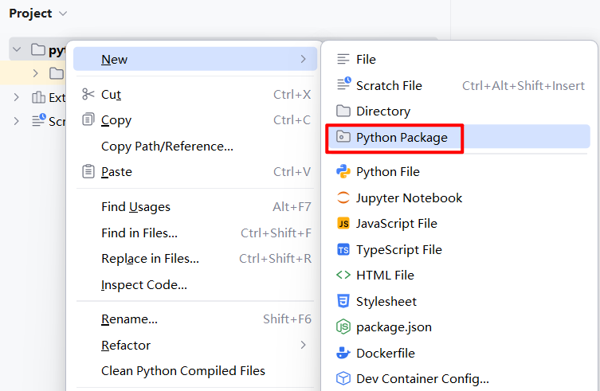

circle.py：

```python
"""circle.py"""

radius = 10
PI = 3.1415926

def area(radius):
    return PI * radius * radius

def perimeter(radius):
    return 2 * PI * radius
```

rectangle.py：

```python
"""rectangle.py"""

rectangle_width = 10
rectangle_height = 10

def area(width, height):
    return width * height

def perimeter(width, height):
    return 2 * (width + height)
```

在包外创建一个 main.py 文件。

整体结构如下，其中 graphic 为一个包：

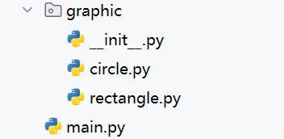

### 导入包

#### 全局导入import 

导入包中模块的所有成员

###### 语法

```python
import 包名.模块名 [as 别名]
```
###### 调用方式 :包名.模块名.成员名

```python
import graphic.circle

print(graphic.circle.area(10))  # 314.15926
```

注意：

使用 import 时，除最后一项外都必须是包。最后一项可以是模块或包，但不能是类、函数或变量。

如果最后一项是包，那么必须在被导入包的__init__.py文件中，指定导入包中的哪些模块。这是python导包的一个优化机制，避免导入过多模块。并且在__init__.py中指定导入模块的时候，建议使用相对路径

```python
from . import circle
```

如果是绝对路径，那么他会把导入的模块circle作为顶级模块，直接从sys.path中是找circle模块，而不是找graphic.circle, 

```python
import circle
```
#### 局部导入包下的模块 from import 

从包中导入模块

###### 语法

```python
from 包名import模块名 [as 别名]
```
###### 调用方式 :模块名.成员名

```python
from graphic import circle

print(circle.area(10))  # 314.15926
```
#### 局部导入包下模块的成员 from import 

从包中模块导入功能

###### 语法

```python
from 包名.模块名 import 成员名 [as 别名]
```
###### 调用方式 : 成员名

```python
from graphic.circle import area

print(area(10))  # 314.15926
```
#### 局部导入 from import * 从包中导入模块

当我们使用 from import * 时，Python并不会查找并导入包的所有子模块，因为这将花费很长的时间，并且可能会产生我们不想要的副作用。

唯一的解决办法是提供包的显式索引。如果包的 __init__.py 中定义了 __all__，运行 from import * 时，它就是被导入的模块名列表。

###### 语法

```python
from 包名.模块名 import *
```
###### 调用方式 :模块名.功能名

在 __init__.py 中添加如下内容： 

```python
__all__ = ["circle"] 
注意：如果不加会无法导包
```

在 main.py 中使用 from import * 导入模块：

```python
from graphic import *

print(circle.area(10))  # 314.15926
print(rectangle.area(10))  # 报错
```
### 常用标准库（包）

标准库指的是在安装Python时就一同被安装的库。这些库经过精心挑选和开发，旨在为Python开发者提供通用且强大的工具集，涵盖各种不同的应用领域。

更多标准库可参考。

### 引入第三方库

当需要使用Python中没有内置的库时，可以通过以下方式安装第三方库

#### pip命令方式

pip是Python包管理工具，该工具提供了对 Python 包的查找、下载、安装、卸载的功能。pip 默认的源是 Python Package Index（PyPI），其地址为 https://pypi.org/simple/，如果下载比较慢，还可以指定其它的源

阿里云：http://mirrors.aliyun.com/pypi/simple/

豆瓣：http://pypi.douban.com/simple/

清华大学：https://pypi.tuna.tsinghua.edu.cn/simple/

###### pip常用命令

**查看我们已经安装的软件包**

```python
pip list
```
**安装软件包-具体包名就什么可以到PyPI上查找**

```python
pip install 包名
```
**卸载软件包**

```python
pip uninstall 包名
```
**临时使用其他源**

```python
pip install -i http://mirrors.aliyun.com/pypi/simple/ 包名
```
**永久修改源**

```python
pip config set global.index-url http://mirrors.aliyun.com/pypi/simple/
```
###### 安装requests包步骤

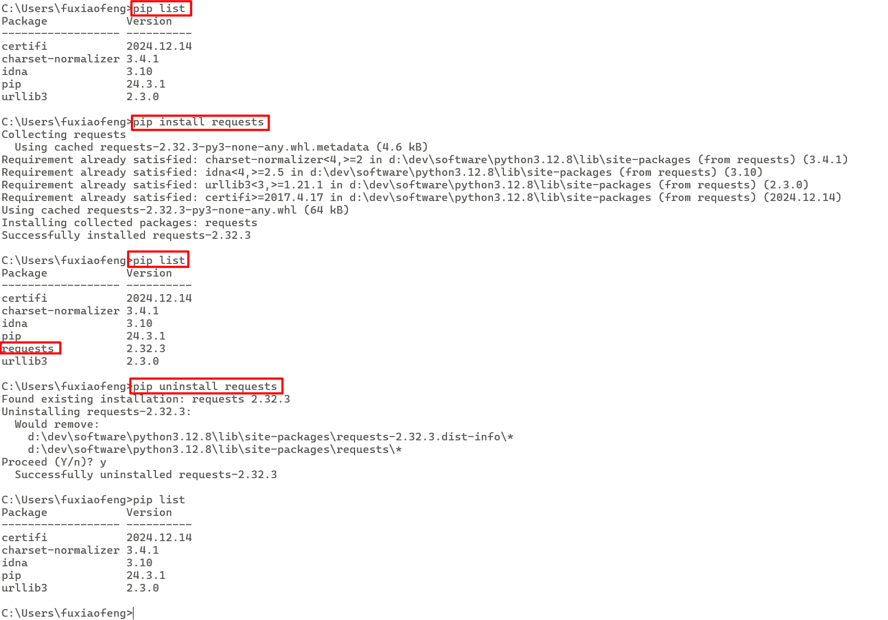

通过命令行的方式安装，是将第三方包安装在本地python下，例如：D:\dev\software\Python3.12.8\Lib\site-packages

#### Pycharm中引入

###### 点击右下角的解释器设置

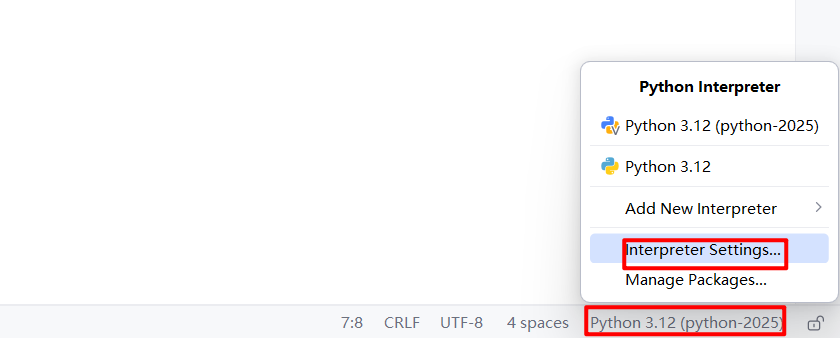

###### 点击+号

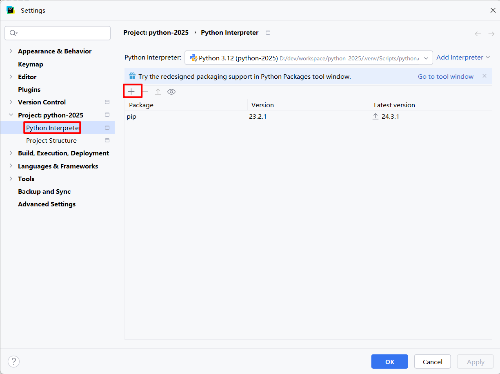

###### 搜索要添加的包

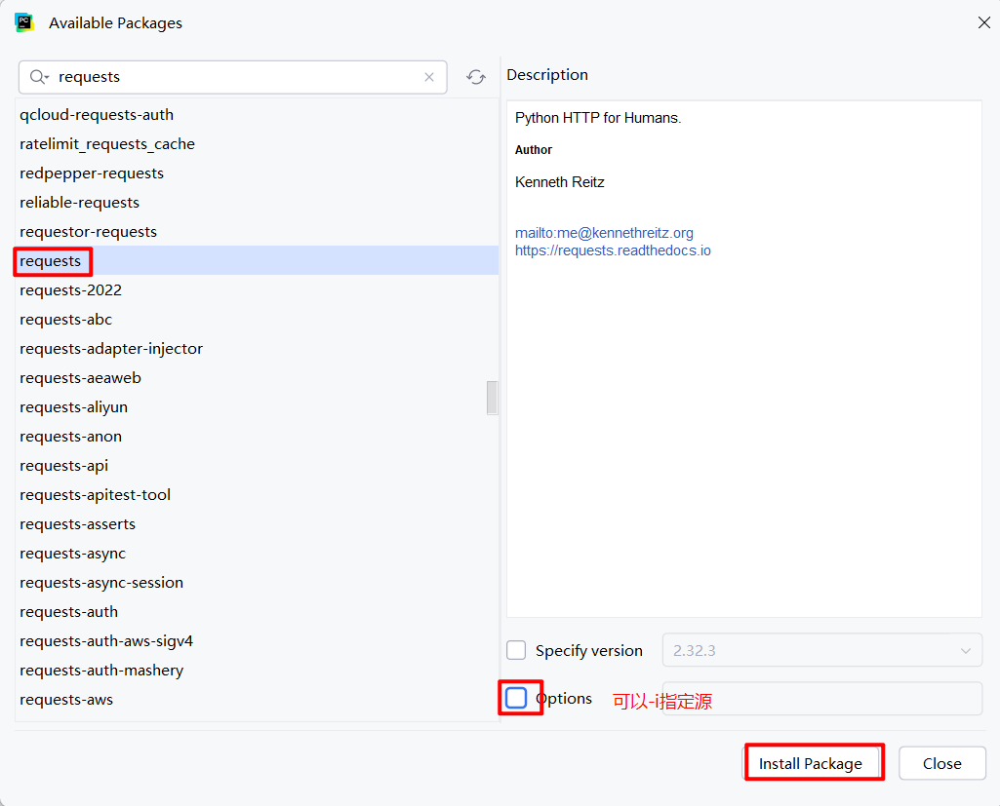

通过Pycharm安装，我们选择的解释器类型每个项目独立的，所以是将第三方包安装在当前项目环境下，例如：D:\dev\workspace\python-2025\.venv\Lib\site-packages

### 打包自己的库并安装

###### 先安装 setuptools 库

如果不安装setuptools库，后续打包时可能会遇到报错 ModuleNotFoundError: No module named 'distutils'，所以可以提前安装 setuptools 库。在命令提示符中执行如下命令：

```python
pip install setuptools
```
###### 在包外创建一个 setup.py 文件

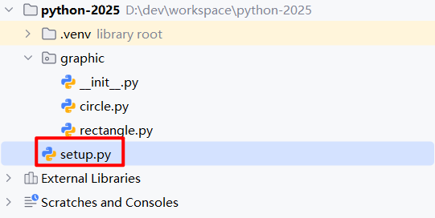

###### setup.py 中添加如下内容

```python
from distutils.core import setup

setup(
    name="graphic",  # 需要打包的名字
    version="1.0",  # 版本
    py_modules=["graphic.circle", "graphic.rectangle"],  # 需要打包的模块
)
```
###### 在 setup.py 同级目录下进行构建

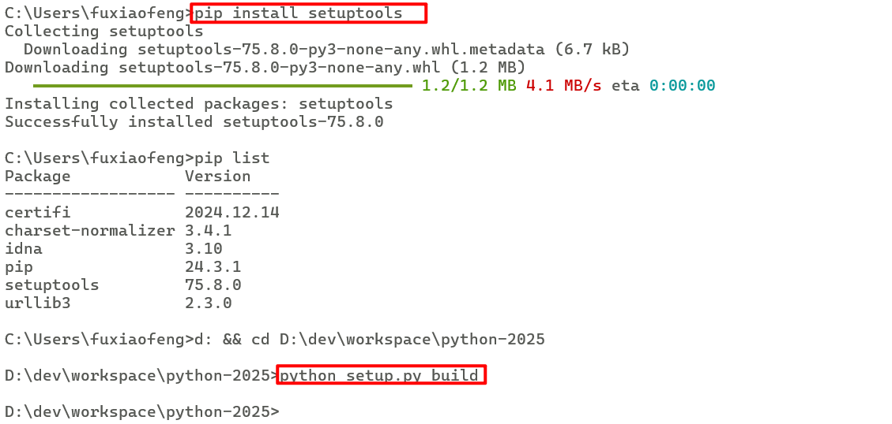

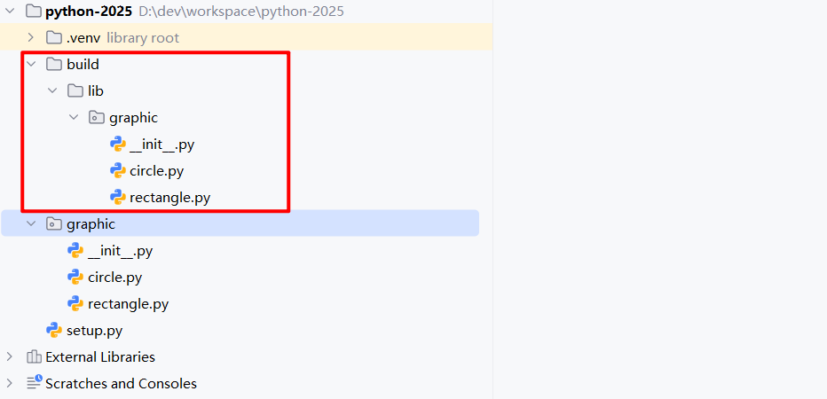

###### 也可以生成压缩包

```python
python setup.py sdist
```
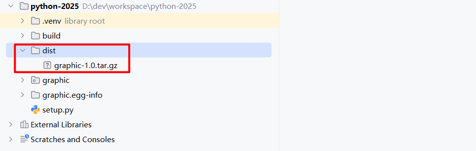

###### pip命令安装自己打的库

```python
pip install path_to_your_package/dist/your_package_name-0.1.tar.gz
```
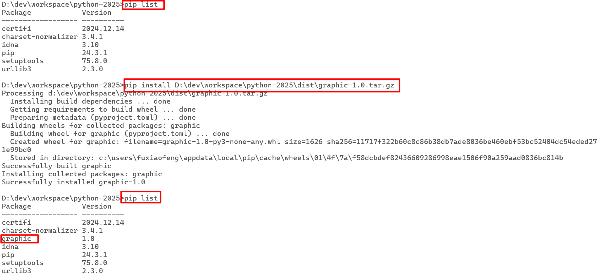

###### Pycharm安装自己打的包库

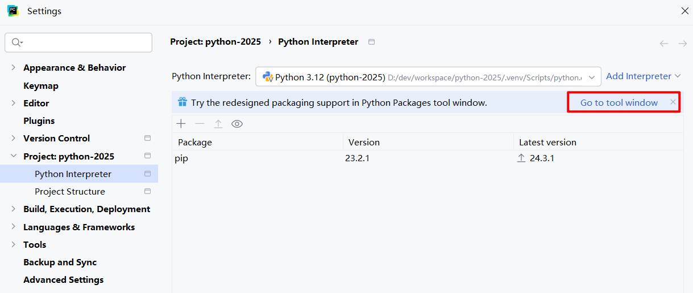

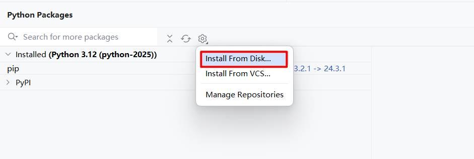

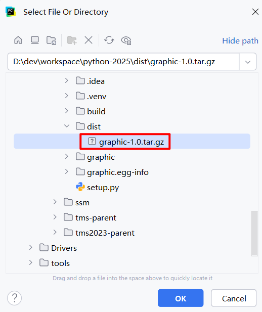

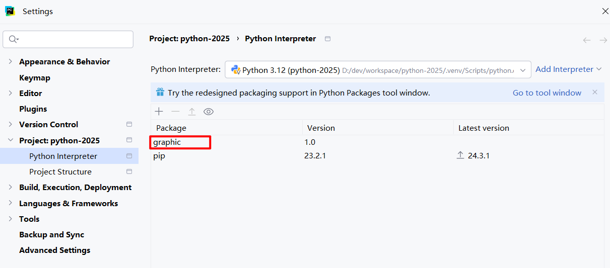

## Python高级语法

### 浅拷贝与深拷贝

**直接赋值：对象的引用（别名），不产生拷贝。**

**浅拷贝：拷贝父对象，不会拷贝对象的内部的子对象。拷贝后只有第一层是独立的。**

**深拷贝：完全拷贝了父对象及其子对象。拷贝后所有层都是独立的。**

#### 如何浅拷贝

**切片操作（如 [:]）。**

**使用工厂函数（如 list() / set()）。**

**使用 copy 模块的 copy() 函数。**

#### 案例

**创建一个列表，其中包含整型和列表元素，使用 copy() 对其浅拷贝。使用 id() 查看列表地址和列表中各个元素的地址。**

```python
import copy

list1 = [1, 2, 3, [100, 200, 300]]
print(id(list1), id(list1[0]), id(list1[1]), id(list1[2]), id(list1[3]), list1)
# 3060924684544 140732039489976 140732039490008 140732039490040 3060924682624 [1, 2, 3, [100, 200, 300]]

list2 = copy.copy(list1)
print(id(list2), id(list2[0]), id(list2[1]), id(list2[2]), id(list2[3]), list2)
# 3060926299456 140732039489976 140732039490008 140732039490040 3060924682624 [1, 2, 3, [100, 200, 300]]
```

可以看到拷贝后新的列表地址改变了，但列表中各个元素还是同一地址。

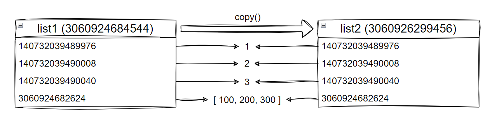

**修改 list1[0] 整型元素**

```python
list1[0] = 100  # 修改list1[0]整型元素

print(id(list1), id(list1[0]), id(list1[1]), id(list1[2]), id(list1[3]), list1)
# 3060924684544 140732039493144 140732039490008 140732039490040 3060924682624 [100, 2, 3, [100, 200, 300]]

print(id(list2), id(list2[0]), id(list2[1]), id(list2[2]), id(list2[3]), list2)
# 3060926299456 140732039489976 140732039490008 140732039490040 3060924682624 [1, 2, 3, [100, 200, 300]]
```

list[0] 为不可变类型元素，因此可以看到 list[0] 指向了新的引用。

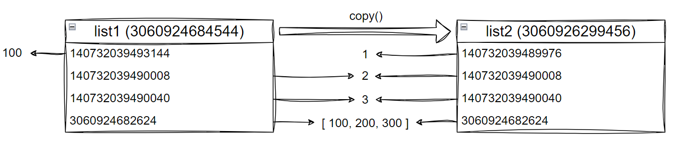

**修改 list[3] 列表元素**

```python
list1[3].append(400)  # 修改list1[3]列表元素，向列表中添加新值

print(id(list1), id(list1[0]), id(list1[1]), id(list1[2]), id(list1[3]), list1)
# 3060924684544 140732039493144 140732039490008 140732039490040 3060924682624 [100, 2, 3, [100, 200, 300, 400]]

print(id(list2), id(list2[0]), id(list2[1]), id(list2[2]), id(list2[3]), list2)
# 3060926299456 140732039489976 140732039490008 140732039490040 3060924682624 [1, 2, 3, [100, 200, 300, 400]]
```

list[3] 为可变类型元素，修改不会产生新对象。

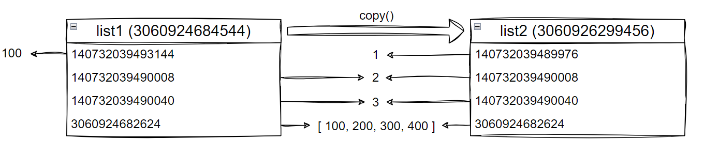

#### 如何深拷贝

使用 copy 模块的 deepcopy() 函数。

#### 案例

**创建一个列表，其中包含整型和列表元素，使用 deepcopy() 对其深拷贝。使用 id() 查看列表地址和列表中各个元素的地址。**

```python
import copy

list1 = [1, 2, 3, [100, 200, 300]]
print(id(list1), id(list1[0]), id(list1[1]), id(list1[2]), id(list1[3]), list1)
# 3060924684544 140732039489976 140732039490008 140732039490040 3060924682624 [1, 2, 3, [100, 200, 300]]

list3 = copy.deepcopy(list1)
print(id(list3), id(list3[0]), id(list3[1]), id(list3[2]), id(list3[3]), list3)
# 3060926299520 140732039489976 140732039490008 140732039490040 3060926299584 [1, 2, 3, [100, 200, 300]]
```

可以看到拷贝后，新的列表地址与列表中各个可变类型元素的地址都发生了改变，不可变类型元素拷贝后地址不变。

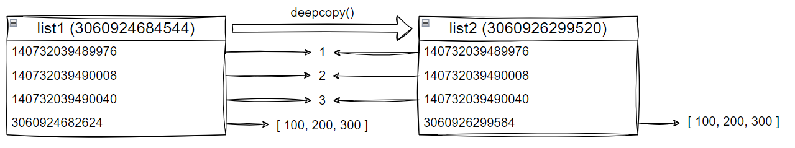

**修改 list1[0] 整型元素**

```python
list1[0] = 100  # 修改list1[0]整型元素

print(id(list1), id(list1[0]), id(list1[1]), id(list1[2]), id(list1[3]), list1)
# 3060924684544 140732039493144 140732039490008 140732039490040 3060924682624 [100, 2, 3, [100, 200, 300]]

print(id(list3), id(list3[0]), id(list3[1]), id(list3[2]), id(list3[3]), list3)
# 3060926299520 140732039489976 140732039490008 140732039490040 3060926299584 [1, 2, 3, [100, 200, 300]]
```
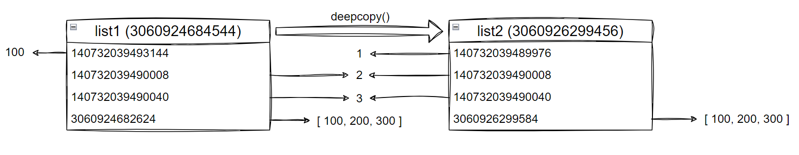

**修改 list[3] 列表元素**

```python
list1[3].append(400)  # 修改list1[3]列表元素，向列表中添加新值

print(id(list1), id(list1[0]), id(list1[1]), id(list1[2]), id(list1[3]), list1)
# 3060924684544 140732039493144 140732039490008 140732039490040 3060924682624 [100, 2, 3, [100, 200, 300, 400]]

print(id(list3), id(list3[0]), id(list3[1]), id(list3[2]), id(list3[3]), list3)
# 3060926299520 140732039489976 140732039490008 140732039490040 3060926299584 [1, 2, 3, [100, 200, 300]]
```
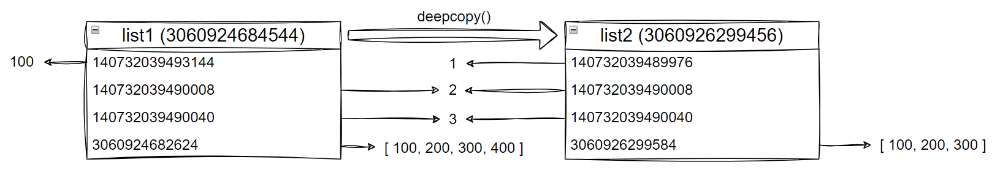

#### 拷贝的特殊情况

**非容器类型（如数字、字符串、和其他“原子”类型的对象）无法拷贝**

```python
import copy

var1 = 1
print(id(var1), var1)  # 140732039489976 1

var2 = copy.copy(var1)
print(id(var2), var2)  # 140732039489976 1

var3 = copy.deepcopy(var1)
print(id(var3), var3)  # 140732039489976 1
```
**元组变量如果只包含原子类型对象，则不能对其深拷贝**

```python
import copy

tuple1 = (1, 2, 3)  # 元组只包含原子类型对象
print(id(tuple1), tuple1)  # 1653947230848 (1, 2, 3)

tuple2 = copy.deepcopy(tuple1)
print(id(tuple2), tuple2)  # 1653947230848 (1, 2, 3)

tuple1 = (1, 2, 3, [])  # 元组不只包含原子类型对象
print(id(tuple1), tuple1)  # 1653947152432 (1, 2, 3, [])

tuple2 = copy.deepcopy(tuple1)
print(id(tuple2), tuple2)  # 1653947148912 (1, 2, 3, [])
```
### 迭代器

迭代是是遍历容器中元素的一种方式，而迭代器是一个可以记住遍历的位置的对象。迭代器对象从容器的第一个元素开始访问，直到所有的元素被访问完结束。迭代器只能往前不会后退。字符串，列表或元组对象都可用于创建迭代器。

#### 可迭代对象

###### 什么是可迭代对象

我们发现大多数容器对象都可以使用 for 语句：

```python
import os

for element in [1, 2, 3]:
    print(element)
for element in (1, 2, 3):
    print(element)
for key in {"one": 1, "two": 2}:
    print(key)
for char in "123":
    print(char)

with open("myfile.txt", "w") as f:
    f.write("H\ne\nl\nl\no\n \nW\no\nr\nl\nd\n")
for line in open("myfile.txt"):
    print(line, end="")
os.remove("myfile.txt")
```

可以直接作用于 for 循环的数据类型有以下几种：

**容器，如 list 、 tuple 、 dict 、 set 、 str 等。**

**generator ，包括生成器和带 yield 的generator function。**

这些可以直接作用于 for 循环的对象统称为可迭代对象：Iterable。

###### 判断是否是可迭代对象（Iterable）

```python
from collections.abc import Iterable

print(isinstance([], Iterable))  # True
print(isinstance((), Iterable))  # True
print(isinstance(set(), Iterable))  # True
print(isinstance({}, Iterable))  # True
print(isinstance("100", Iterable))  # True
print(isinstance(100, Iterable))  # False
```
###### 判断是否是迭代器（Iterator）

```python
from collections.abc import Iterator

print(isinstance([], Iterator))  # False
print(isinstance((), Iterator))  # False
print(isinstance(set(), Iterator))  # False
print(isinstance({}, Iterator))  # False
print(isinstance("100", Iterator))  # False
print(isinstance((x for x in range(10)), Iterator))  # True
```
#### 使用迭代器

迭代器有两个基本的方法：iter() 和 next()。

在容器对象上使用 for 语句时，在幕后，for 语句会在容器对象上调用 iter()。该函数返回一个定义了 __next__() 方法的迭代器对象，此方法将逐一访问容器中的元素。当元素用尽时，__next__() 将引发 StopIteration 异常来通知终止 for 循环。 你可以使用 next() 内置函数来调用 __next__() 方法。

我们可以使用 iter() 获取一个可迭代对象的迭代器，并使用 next() 遍历迭代器：

```python
list = [1, 2, 3]
it = iter(list)  # 创建迭代器对象
print(next(it))  # 输出迭代器的下一个元素,1
print(next(it))  # 2
print(next(it))  # 3
print(next(it))  # StopIteration
```

也可以使用 for 来遍历迭代器：

```python
list = [1, 2, 3]
it = iter(list)  # 创建迭代器对象
for i in it:
    print(i)
```
#### 创建迭代器

了解了迭代器协议背后的机制后，就可以为类添加迭代器行为了。定义 __iter__() 方法用于返回一个带有 __next__() 方法的对象。如果类已定义了 __next__()，那么 __iter__() 可以简单地返回 self。

```python
class Reverse:
    """对一个序列执行反向循环的迭代器。"""

    def __init__(self, data):
        self.data = data
        self.index = len(data)

    def __iter__(self):
        return self

    def __next__(self):
        if self.index == 0:
            raise StopIteration
        self.index = self.index - 1
        return self.data[self.index]

rev = Reverse([2, 3, 5, 7, 11, 13, 17, 19])
iter(rev)
for char in rev:
    print(char)
```
### 生成器

#### 什么是生成器

生成器（generator）是一个用于创建迭代器的简单而强大的工具。它的写法类似于标准的函数，但当它要返回数据时会使用 yield 语句。当在生成器函数中使用 yield 语句时，函数的执行将会暂停，并将 yield 后的表达式作为当前迭代的值返回。

每次调用生成器的 next() 方法或使用 for 循环进行迭代时，函数会从上次暂停的地方继续执行（它会记住上次执行语句时的所有数据值），直到再次遇到 yield 语句。这样，生成器函数可以逐步产生值，而不需要一次性计算并返回所有结果。

生成器函数的优势是它们可以按需生成值，避免一次性生成大量数据并占用大量内存。此外，生成器还可以与其他迭代工具（如for循环）无缝配合使用，提供简洁和高效的迭代方式。

#### 创建生成器

###### 使用推导式创建生成器

```python
generator = (x for x in range(5))  # 创建生成器
print(generator)  # <generator object <genexpr> at 0x0000026C2066CB80>
for x in generator:
    print(x)
```
###### 使用函数创建生成器

```python
def fibo():  # 斐波那契数列
    a, b = 0, 1
    while True:
        yield b
        a, b = b, a + b

f = fibo()
print(next(f))  # 1
print(next(f))  # 1
print(next(f))  # 2
print(next(f))  # 3
print(next(f))  # 5
```

如果我们要获取生成器中 return 的值，我们需要捕获 StopIteration异常：

```python
def fibo(n):  # 斐波那契数列
    a, b, counter = 0, 1, 0
    while counter < n:
        yield b
        a, b, counter = b, a + b, counter + 1
    return "done"

f = fibo(10)
try:
    while True:
        print(next(f))
except StopIteration as result:
    print("StopIteration", result)  # StopIteration done
```
#### send()

###### 向生成器发送值

恢复执行并向生成器函数“发送”一个值。 这个值作为当前 yield 表达式的结果。 send() 方法会返回生成器所产生的下一个值，或者如果生成器没有产生下一个值就退出则会引发 StopIteration。

使用 send() 发送任务id，使生成器交替执行两个任务：

```python
def gen():
    task_id = 0
    int_value = 0
    char_value = "A"
    while True:
        # task_id 为 0 则 int_value +1，task_id 为 1 则 char_value +1
        match task_id:
            case 0:
                task_id = yield int_value  # 返回 int_value，并接收 send() 发送来的值给 task_id
                int_value += 1
            case 1:
                task_id = yield char_value  # 返回 char_value，并接收 send() 发送来的值给 task_id
                char_value = chr(ord(char_value) + 1)
            case _:
                task_id = yield  # 返回 None

g = gen()
print(next(g))  # 0
print(g.send(1))  # A
print(g.send(0))  # 1
print(g.send(1))  # B
print(g.send(0))  # 2
```
###### 使用 send(None) 启动生成器

当调用 send() 来启动生成器时，它必须以 None 作为调用参数，因为这时没有可以接收值的 yield 表达式。

```python
def gen():
    task_id = 0
    int_value = 0
    char_value = "A"
    while True:
        # task_id 为 0 则 int_value +1，task_id 为 1 则 char_value +1
        match task_id:
            case 0:
                task_id = yield int_value  # 返回 int_value，并接收 send() 发送来的值给 task_id
                int_value += 1
            case 1:
                task_id = yield char_value  # 返回 char_value，并接收 send() 发送来的值给 task_id
                char_value = chr(ord(char_value) + 1)
            case _:
                task_id = yield  # 返回 None

g = gen()
print(g.send(None))  # 0
print(g.send(1))  # A
print(g.send(0))  # 1
```
### 命名空间

#### 什么是命名空间

命名空间（Namespace）是从名称到对象的映射，现在，大多数命名空间都使用Python字典实现。各个命名空间是独立的，没有任何关系的，所以一个命名空间中不能有重名，但不同的命名空间是可以重名而没有任何影响。

#### 三种命名空间

一般有三种命名空间，在不同时刻创建，且拥有不同的生命周期：

###### 内置名称

内置名称的命名空间是在 Python 解释器启动时创建的，永远不会被删除。

###### 一个模块的全局名称

模块的全局命名空间在读取模块定义时创建。通常，模块的命名空间也会持续到解释器退出。

从脚本文件读取或交互式读取的，由解释器顶层调用执行的语句，是 __main__ 模块调用的一部分，也拥有自己的全局命名空间。

内置名称实际上也在模块里，即 builtins。

###### 一个函数调用中的局部名称

函数的局部命名空间在函数被调用时被创建，并在函数返回或抛出未在函数内被处理的异常时被删除（实际上，用“遗忘”来描述实际发生的情况会更好一些）。当然，每次递归调用都有自己的局部命名空间。

### 作用域

#### 什么是作用域

一个命名空间的作用域是Python代码中的一段文本区域，从这个区域可直接访问该命名空间。

#### 四种作用域

**最内层作用域（Local），包含局部名称，并首先在其中进行搜索**

**那些外层闭包函数的作用域（Enclosing）：包含“非局部、非全局”的名称，从最靠内层的那个作用域开始，逐层向外搜索。**

**倒数第二层作用域（Global）：包含当前模块的全局名称**

**最外层（最后搜索）的作用域（Built-in）：是内置名称的命名空间**

global 语句用于表明特定变量在全局作用域里，并应在全局作用域中重新绑定。

nonlocal 语句表明特定变量在外层作用域中，并应在外层作用域中重新绑定。

在最内层作用域访问全局作用域或外层作用域的变量时，若不使用 global 或 nonlocal 语句，这些变量将为只读，尝试写入这样的变量将在最内层作用域中创建一个新的局部变量，而使得同名的外部变量保持不变。

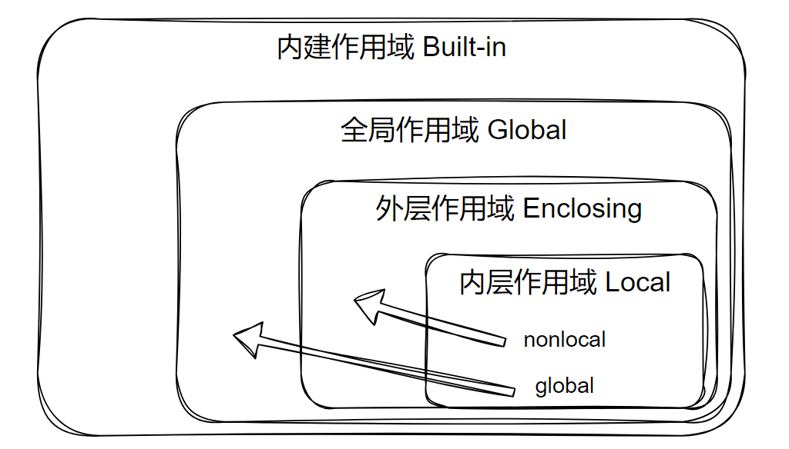

### 闭包

#### 什么是闭包

当调用的函数执行完毕后，函数内的变量就会被销毁。但有时希望在调用函数后函数内的数据能够保存下来重复使用，这时候可以用到闭包。闭包可以避免使用全局值，并提供某种形式的数据隐藏。

构建闭包的条件：

**外部函数内定义一个内部函数。**

**内部函数用到外部函数中的变量。**

**外部函数将内部函数作为返回值。**

#### 使用闭包

```python
# 构建闭包
def linear(a, b):
    def inner(x):
        return a * x + b

    return inner

y1 = linear(1, 1)
print(y1)  # <function linear.<locals>.inner at 0x00000291279D19E0>
print(y1(5))  # 6
```

将调用 linear() 后返回的函数对象赋值给 y1，虽然 linear() 函数已经执行完毕，但是我们调用 y1() 时，y1() 仍然记得 linear() 中 a 和 b 的值。

#### 查看闭包中的值

所有函数对象都有一个 __closure__ 属性，如果它是一个闭包函数，则该属性返回单元格对象的元组，每个单元格对象都对应着闭包所引用的外部函数作用域中的一个变量。对于普通函数，__closure__ 属性的值通常为 None。

```python
def linear(a, b):
    def inner(x):
        return a * x + b

    return inner

y1 = linear(1, 2)
objects = y1.__closure__
print(objects)
print(objects[0].cell_contents)  # 1
print(objects[1].cell_contents)  # 2
```
### 装饰器

#### 什么是装饰器

装饰器允许在不修改原有函数代码的基础上，动态地增加或修改函数的功能。装饰器本质上是一个接收函数作为输入并返回一个新的包装过后的函数的对象。

#### 使用装饰器

###### 语法

```python
def decorator(func):
    def inner(参数):
        # 添加功能
        func(参数)
        # 添加功能

    return inner
```

decorator 是一个装饰器函数，它接受一个函数 func 作为参数，并返回一个内部函数 inner。在 inner 函数内部，我们可以执行一些额外的操作，然后调用原始函数 func，并返回其结果。

###### 闭包实现装饰器

```python
from math import sqrt

def func(x):
    """开根号"""
    return sqrt(x)

def decorator(f):
    def inner(x):
        x = abs(x)  # 求x的绝对值
        return f(x)

    return inner

func = decorator(func)
print(func(-4))  # 2.0
```
###### @decorator使用装饰器

当我们使用 @decorator 前缀在 func 定义前，Python会自动将 func 作为参数传递给 decorator，然后将返回的 inner 函数替换掉原来的 func。

```python
from math import sqrt

def decorator(f):
    def inner(x):
        x = abs(x)  # 求x的绝对值
        return f(x)

    return inner

@decorator
def func(x):
    """开根号"""
    return sqrt(x)

print(func(-4))  # 2.0
```
#### 多层装饰器

多个装饰器的装饰过程：离函数最近的装饰器先装饰，然后外面的装饰器再进行装饰。

```python
from math import sqrt

# 将参数转化为整型
def get_integer(f):
    def inner(x):
        x = int(x)
        return f(x)

    return inner

# 将参数转换为非负数
def get_absolute(f):
    def inner(x):
        x = abs(x)
        return f(x)

    return inner

@get_integer
@get_absolute
def func(x):
    """开根号"""
    return sqrt(x)

print(func("-4"))  # 2.0
```
#### 带参数的装饰器

```python
from math import sqrt

# 求根号n次
def times(n):
    # 将参数转换为非负数
    def get_absolute(f):
        def inner(x):
            x = abs(x)
            for i in range(n):
                x = f(x)
            return x

        return inner

    return get_absolute

@times(2)
def func(x):
    """开根号"""
    return sqrt(x)

print(func(-16))  # 2.0
```
#### 类装饰器

类装饰器是包含 __call__() 方法的类，它接受函数作为参数，并返回新的函数。

```python
from math import sqrt

class DecoratorClass:
    def __init__(self, f):
        self.f = f

    def __call__(self, x):
        x = abs(x)
        return self.f(x)

@DecoratorClass
def func(x):
    """开根号"""
    return sqrt(x)

print(func(-4))  # 2.0
```
## 进程与线程

### 并发与并行

#### 并发

单个 CPU 处理多个任务。各个任务交替执行一段时间。

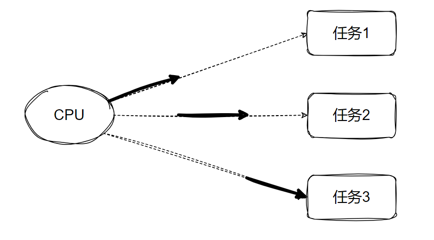

#### 并行

多个 CPU 同时执行多个任务。

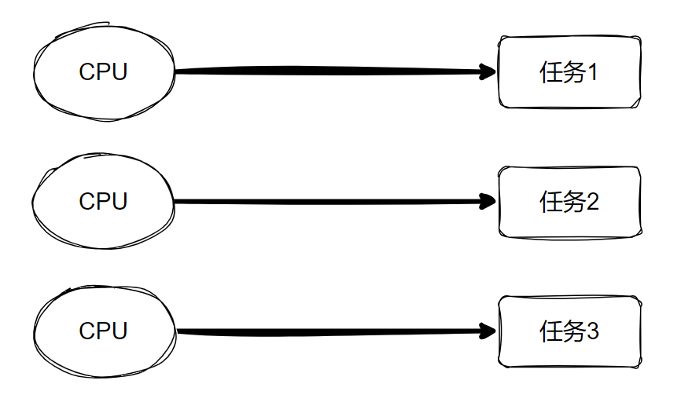

### 多进程

#### 什么是进程

进程是操作系统进行资源分配的基本单位。

操作系统中一个正在运行的程序或软件就是一个进程。

每个进程都有自己独立的一块内存空间。

一个进程崩溃后，在保护模式下不会对其他进程产生影响。

多进程是指在操作系统中同时运行多个程序。

#### 使用multiprocessing.Process创建进程

Unix/Linux操作系统提供了一个 os.fork() 系统调用，它非常特殊。普通的函数调用，调用一次，返回一次，但是 fork() 调用一次，返回两次，因为操作系统自动把当前进程（父进程）复制了一份（子进程），然后，分别在父进程和子进程内返回。

Windows 中没有 fork() 调用，不过Python提供了一个跨平台的多进程模块 multiprocessing。multiprocessing 模块提供了一个 Process 类来代表一个进程对象。

###### Process 的创建

```python
multiprocessing.Process(group=None, target=None, name=None, args=(), kwargs={}, *, daemon=None)
```
**group：应当始终为 None，它的存在仅是为了与 threading.Thread 兼容。**

**target：由 run() 方法来发起调用的可调用对象，默认为 None。**

**name：进程名称，默认为 None 则自动分配。**

**args：针对目标调用的参数元组。**

**kwargs：针对目标调用的关键字参数字典。**

**daemon：是否为守护进程，True 或 False。默认为None则继承父进程。**

###### Process 的属性和方法与其他常用方法

**name：获取进程名称。**

**pid：获取进程号。**

**daemon：判断或设置进程是否为守护进程。**

**exitcode：获取子进程的退出状态码。**

**start()：启动进程，调用传入 target 的对象。start() 只能被调用一次。**

**run()：默认调用传入 target 的对象，如果子类化了 Process，可以重写此方法来自定义行为。**

**join([timeout])：阻塞主进程，直到子进程结束或超时。timeout参数可选，意为阻塞多少秒。**

**terminate()：强制终止子进程。**

**kill()：杀死进程，与 terminate() 类似，但更彻底。**

**is_alive()：检查进程是否仍在运行。**

**os.getpid()：获取当前进程编号。**

**os.getppid()：获取当前进程的父进程编号。**

###### 案例：同时读写文件

注意：在Windows上执行要加上if __name__ == "__main__"。

```python
import time
import multiprocessing

# 向文件中写入数据
def write_file():
    with open("test.txt", "a") as f:
        while True:
            f.write("hello world\n")
            f.flush()
            time.sleep(0.5)

# 从文件中读取数据
def read_file():
    with open("test.txt", "r") as f:
        while True:
            time.sleep(0.1)
            print(f.read(1))

if __name__ == "__main__":
    # 创建一个子进程用于写文件
    p1 = multiprocessing.Process(target=write_file)
    # 创建一个子进程用于读文件
    p2 = multiprocessing.Process(target=read_file)
    # 启动子进程
    p1.start()
    # 启动子进程
    p2.start()
```
#### 自定义Process子类创建进程

```python
import os
import multiprocessing

class Worker(multiprocessing.Process):
    def run(self):
        print("进程id：", os.getpid(), "\t父进程id：", os.getppid())

if __name__ == "__main__":
    for i in range(5):
        p = Worker()
        p.start()
```
#### 进程池

当需要启动大量子进程时，可以使用进程池。

###### 进程池的创建

```python
multiprocessing.Pool([processes[,initializer[,initargs[,maxtasksperchild[,context]]]]])
```
**processes：要使用的工作进程数量。如果 processes 为 None 则使用 os.cpu_count() 所返回的数值。**

**initializer：如果不为 None，则每个工作进程将会在启动时调用 initializer(*initargs)。**

**maxtasksperchild：一个工作进程在它退出或被一个新的工作进程代替之前能完成的任务数量，为了释放未使用的资源。默认的 maxtasksperchild 是 None，意味着工作进程寿与池齐。**

**context：可被用于指定启动的工作进程的上下文。通常一个进程池是使用函数 multiprocessing.Pool() 或者一个上下文对象的 Pool() 方法创建的。**

注意：进程池对象的方法只有创建它的进程能够调用。

使用时一般只指定 processes 参数。

###### 进程池的常用方法

**apply(func[, args[, kwds]])：使用 args 参数以及 kwds 命名参数同步调用 func , 在返回结果前阻塞。另外 func 只会在一个进程池中的一个工作进程中执行。**

**apply_async(func[, args[, kwds[, callback[, error_callback]]]])：使用 args 参数以及 kwds 命名参数异步调用 func，并立即返回一个 AsyncResult 对象，不会阻塞。可以通过 callback 获取结果和通过 error_callback 处理异常。**

**close()：阻止后续任务提交到进程池，当所有任务执行完成后，工作进程会退出。**

**terminate()：不必等待未完成的任务，立即停止工作进程。当进程池对象被垃圾回收时，会立即调用 terminate()。**

**join()：阻塞主进程，等待工作进程结束。调用 join() 前必须先调用 close() 或者 terminate()。**

###### 案例

```python
import os
import time
import multiprocessing

# 打印10个数字,每次间隔0.5秒
def func():
    for i in range(10):
        print(os.getpid(), i)
        time.sleep(0.5)

if __name__ == "__main__":
    # 指定进程池大小
    process_num = 5
    pool = multiprocessing.Pool(process_num)
    for p in range(process_num):
        # 阻塞式
        # pool.apply(func)
        # 非阻塞式
        pool.apply_async(func)
    pool.close()
    pool.join()
    print("end")
```
#### 进程间通信

###### 进程间不共享全局变量

子进程向传入的列表中添加元素，最终发现主进程与子进程之间的列表结果不同：

```python
import os
import multiprocessing

# 向list1中添加10个元素
def func(list1):
    for i in range(10):
        list1.append(i)
        print(os.getpid(), list1)

if __name__ == "__main__":
    list1 = []
    p1 = multiprocessing.Process(target=func, args=(list1,))
    p2 = multiprocessing.Process(target=func, args=(list1,))
    p1.start()
    p2.start()
    p1.join()
    p2.join()
    print(os.getpid(), list1)
```
###### 使用 Queue 通信

Python的multiprocessing模块包装了底层的机制，提供了Queue、Pipes等多种方式来交换数据。

multiprocessing.Queue([maxsize]) 返回一个使用一个管道和少量锁和信号量实现的共享队列（先进先出）实例。当一个进程将一个对象放进队列中时，一个写入线程会启动并将对象从缓冲区写入管道中。默认队列是无限大小的，可以通过 maxsize 参数限制。

**Queue的常用方法**

**qsize()：返回队列的大致长度。由于多线程或者多进程的上下文，这个数字是不可靠的。**

**empty()：如果队列是空的返回 True。由于多线程或多进程的环境，该状态是不可靠的。**

**full()：如果队列是满的返回 True。由于多线程或多进程的环境，该状态是不可靠的。**

**put(obj[, block[, timeout]])：将 obj 放入队列。如果可选参数 block 是 True（默认值）而且 timeout 是 None（默认值），将会阻塞当前进程，直到有空的缓冲槽。如果 timeout 是正数，将会在阻塞了最多 timeout 秒之后还是没有可用的缓冲槽时抛出 queue.Full 异常。反之（block 是 False 时），仅当有可用缓冲槽时才放入对象，否则抛出 queue.Full 异常（在这种情形下 timeout 参数会被忽略）。**

**put_nowait(obj)：相当于 put(obj, False)。**

**get([block[, timeout]])：从队列中取出并返回对象。如果可选参数 block 是 True （默认值）而且 timeout 是 None（默认值），将会阻塞当前进程，直到队列中出现可用的对象。如果 timeout 是正数，将会在阻塞了最多 timeout 秒之后还是没有可用的对象时抛出 queue.Empty 异常。反之（block 是 False 时），仅当有可用对象能够取出时返回，否则抛出 queue.Empty 异常（在这种情形下 timeout 参数会被忽略）。**

**get_nowait()：相当于 get(False)。**

**案例：两个进程分别读写Queue**

```python
import time
import random
import multiprocessing

# 间隔随机时间向queue中放入随机数
def func1(queue):
    while True:
        queue.put(random.randint(1, 50))
        time.sleep(random.random())

# 从queue中取出数据
def func2(queue):
    while True:
        print("=" * queue.get())

if __name__ == "__main__":
    queue = multiprocessing.Queue()
    p1 = multiprocessing.Process(target=func1, args=(queue,))
    p2 = multiprocessing.Process(target=func2, args=(queue,))
    p1.start()
    p2.start()
    p1.join()
p2.join()
```

注意：multiprocessing.Queue存在兼容性问题，如果要使用进程池，可以使用Mananger().Queue

###### 进程池之间使用 Manager().Queue 通信

```python
import time
import random
import multiprocessing

# 间隔随机时间向queue中放入随机数
def func1(queue):
    while True:
        queue.put(random.randint(1, 50))
        time.sleep(random.random())

# 从queue中取出数据
def func2(queue):
    while True:
        print("=" * queue.get())

if __name__ == "__main__":
    queue = multiprocessing.Manager().Queue()
    pool = multiprocessing.Pool(2)
    pool.apply_async(func1, (queue,))
    pool.apply_async(func2, (queue,))
    pool.close()
    pool.join()
```
### 多线程

#### 什么是线程

线程是处理器任务调度和执行的基本单位。

一个进程至少有一个线程，也可以运行多个线程。

多个线程之间可共享数据。

线程运行出错异常后，如果没有捕获，会导致整个进程崩溃。

多线程是指在同一进程中同时执行多个任务。

#### 使用threading.Thread创建线程

Python的标准库提供了两个模块：_thread 和 threading，_thread 是低级模块，threading是高级模块，对 _thread 进行了封装。绝大多数情况下，我们只需要使用 threading 这个高级模块。

###### Thread 的创建

```python
threading.Thread(group=None, target=None, name=None, args=(), kwargs={}, *, daemon=None)
```
**group：应为 None，保留给将来实现 ThreadGroup 类的扩展使用。**

**target：用于 run() 方法调用的可调用对象。默认是 None，表示不需要调用任何方法。**

**name：线程名称。 在默认情况下，会以 “Thread-N” 的形式构造唯一名称，其中 N 为一个较小的十进制数值，或是 "Thread-N (target)" 的形式，其中 “target” 为 target.__name__，如果指定了 target 参数的话。**

**args：用于发起调用目标函数的参数列表或元组。 默认为 ()。**

**kwargs：用于调用目标函数的关键字参数字典。默认是 {}。**

**daemon：True 或 False 来设置该线程是否为守护模式。如果是 None （默认值），线程将继承当前线程的守护模式属性。**

###### Thread 的属性和方法与其他常用方法

**name：线程的名称。**

**daemon：线程是否为守护线程。**

**ident：线程标识符。**

**native_id：此线程的线程id（tid），由 OS（内核）分配。**

**start()：启动线程，调用线程的 run() 方法。**

**run()：定义线程的行为，默认调用传入的 target 对象。**

**join([timeout=None])：阻塞主线程，直到当前线程运行完成或达到超时时间。**

**is_alive()：线程是否在运行。**

**threading.enumerate()：查看都有哪些线程。**

**threading.current_thread()：返回当前线程实例。**

###### 案例：两线程分别交替打印

```python
import time
import threading

# 交替打印 00000 和 11111
def func():
    flag = 0
    while True:
        print(threading.current_thread().name, f"{flag}" * 5)
        flag = flag ^ 1  # 替换0和1
        time.sleep(0.5)

if __name__ == "__main__":
    t1 = threading.Thread(target=func, name="线程1")
    t2 = threading.Thread(target=func, name="线程2")
    t1.start()
    t2.start()
```
#### 自定义Thread子类创建线程

```python
import time
import threading

class Worker(threading.Thread):
    def __init__(self, name):
        super().__init__()
        self.name = name

    def run(self):
        flag = 0
        while True:
            print(f"\r{self.name}:{str(flag)*5}", end="")
            flag = flag ^ 1  # 替换0和1
            time.sleep(0.2)

if __name__ == "__main__":
    t1 = Worker("线程1")
    t2 = Worker("线程2")
    t1.start()
    t2.start()
```
#### 线程池

ThreadPoolExecutor 是 concurrent.futures 模块中的线程池实现，它允许我们轻松地提交任务到线程池，并管理任务的执行和结果。

###### 线程池的创建

```python
concurrent.futures.ThreadPoolExecutor(max_workers=None, thread_name_prefix="", initializer=None, initargs=())
```
**max_workers：线程池的最大线程数（默认取决于系统资源）。**

**thread_name_prefix：线程名称前缀。**

**initializer：可选的初始化函数。**

**initargs：传递给初始化函数的参数。**

###### 线程池的常用方法

**submit(fn, *args, **kwargs)：提交一个任务到线程池，返回一个 Future 对象。可使用 Future.result() 获取任务结果。**

**map(func, *iterables, timeout=None, chunksize=1)：类似于内置的 map() 函数，但在线程池中并行执行。Iterables为可迭代对象，传递给目标函数。chunksize 对 ThreadPoolExecutor 没有效果。**

**shutdown(wait=True, cancel_futures=False)：关闭线程池，等待所有任务完成。wait 表示是否等待线程池中的所有线程完成任务。cancel_futures 表示是否取消尚未开始的任务。**

###### 案例

3个线程，每个线程都将字符列表中的每个字符与 1 异或。

```python
import concurrent.futures

def func(tname):
    global word
    for i, char in enumerate(word):
        word[i] = chr(ord(char) ^ 1)
        print(f"{tname}: {word}\n", end="")
    return word

if __name__ == "__main__":
    word = list("idmmn!vnsme")
    # 使用 with 语句来确保线程被迅速清理
    with concurrent.futures.ThreadPoolExecutor(max_workers=3) as executor:
        future1 = executor.submit(func, "线程1")
        future2 = executor.submit(func, "线程2")
        future3 = executor.submit(func, "线程3")
        word = future1.result()
        word = future2.result()
        word = future3.result()
print("".join(word))  # hello world
```
#### 互斥锁

###### 线程安全问题

线程之间共享数据会存在线程安全的问题。

比如下面这段代码，3个线程，每个线程都将g_num +1 十次：

```python
import time
import threading

def func():
    global g_num
    for _ in range(10):
        tmp = g_num + 1
        # time.sleep(0.01)
        g_num = tmp
        print(f"{threading.current_thread().name}: {g_num}\n", end="")

if __name__ == "__main__":
    g_num = 0
    threads = [threading.Thread(target=func, name=f"线程{i}") for i in range(3)]
    [t.start() for t in threads]
    [t.join() for t in threads]
    print(g_num)  # 30
```

结果为30，看似没有问题，这是因为这个修改操作花费的时间太短了，短到我们无法想象。所以，线程间轮询执行时，都能获取到最新的 g_num 值。因此暴露问题的概率就变得微乎其微。

我们添加0.01秒的延迟时间：

```python
import time
import threading

def func():
    global g_num
    for _ in range(10):
        tmp = g_num + 1
        time.sleep(0.01)
        g_num = tmp
        print(f"{threading.current_thread().name}: {g_num}\n", end="")

if __name__ == "__main__":
    g_num = 0
    threads = [threading.Thread(target=func, name=f"线程{i}") for i in range(3)]
    [t.start() for t in threads]
    [t.join() for t in threads]
    print(g_num)  # 10
```

可以看到最终结果并不是30。这是因为在修改 g_num 前，有0.01秒的休眠时间，某个线程延时后，CPU立即分配计算资源给其他线程。此时0.01秒的休眠还未结束，这个线程还未将修改后的数据赋值给 g_num，因此其他线程获取到的并不是最新值，所以才出现上面的结果。

###### 互斥锁的概念

某个线程要更改共享数据时，先将其锁定，此时其他线程不能更改。直到该线程释放资源，将资源的状态变成“非锁定”，其他的线程才能再次锁定该资源。互斥锁保证了每次只有一个线程进行写入操作，从而保证了多线程情况下数据的正确性。

###### 互斥锁的使用

可以通过 threading.Lock() 创建互斥锁。

使用 lock.acquire([blocking=True][, timeout=-1]) 来获取锁（blocking 如果为 True，线程会阻塞直到获取到锁。如果为 False，线程立即返回。获取锁成功返回 True，否则返回 False。timeout 为等待的超时时间，单位为秒。如果超时仍未获取到锁，则返回 False。）。

使用 lock.release() 释放锁。

案例：

```python
import time
import threading

def func():
    global g_num
    for _ in range(10):
        lock.acquire()  # 获取锁
        tmp = g_num + 1
        time.sleep(0.01)
        g_num = tmp
        lock.release()  # 释放锁
        print(f"{threading.current_thread().name}: {g_num}\n", end="")

if __name__ == "__main__":
    g_num = 0
    lock = threading.Lock()  # 创建锁
    threads = [threading.Thread(target=func, name=f"线程{i}") for i in range(3)]
    [t.start() for t in threads]
    [t.join() for t in threads]
    print(g_num)  # 30
```
#### GIL

Python 全局解释器锁（Global Interpreter Lock, 简称 GIL）是一个锁，同一时间只允许一个线程保持 Python 解释器的控制权，这意味着在任何时间点都只能有一个线程处于执行状态。执行单线程程序时看不到 GIL 的影响，但它可能是 CPU 密集型和多线程代码中的性能瓶颈。GIL并不是Python的特性，它是在实现Python解析器（CPython）时所引入的一个概念。

Python于1991年诞生，从操作系统没有线程概念的时代就已经存在了。由于物理上的限制，各CPU厂商在核心频率上的比赛已经被多核所取代。为了利用多核，Python开始支持多线程。而为了解决多线程之间数据完整性和状态同步，于是有了GIL，GIL 提供了线程安全的内存管理。

GIL 的存在会对多线程的效率有不小影响。甚至就几乎等于Python是个单线程的程序。我们可能会想 GIL只要释放的勤快效率也不会差，至少也不会比单线程的效率差。理论上是这样。

但实际上，Python为了让各个线程能够平均利用CPU时间，会计算当前已执行的微代码数量，达到一定阈值后就强制释放GIL。而这时也会触发一次操作系统的线程调度（当然是否真正进行上下文切换由操作系统自主决定）。从释放 GIL 到获取 GIL 之间几乎是没有间隙的。所以当其他在其他核心上的线程被唤醒时，大部分情况下主线程已经又再一次获取到 GIL 了。这个时候被唤醒执行的线程只能白白的浪费CPU时间，看着另一个线程拿着 GIL 执行。然后达到切换时间后进入待调度状态，再被唤醒，再等待，以此往复恶性循环。

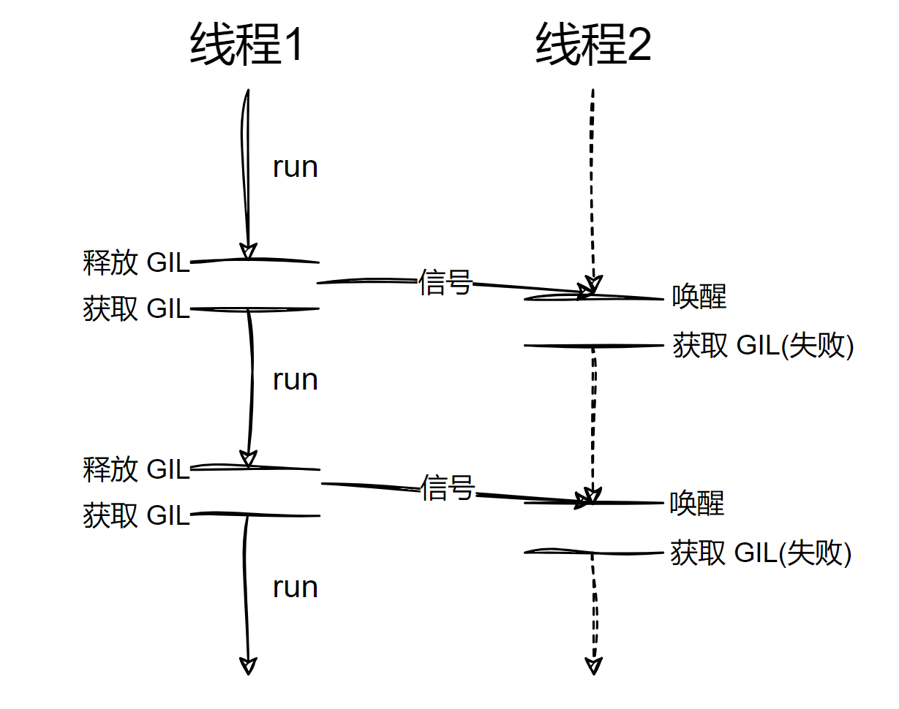

上述实现方式是较为原始的，Python的每个版本中也在逐渐改进GIL和线程调度之间的互动关系。例如先尝试持有GIL在做线程上下文切换，在IO等待时释放GIL等尝试。但是无法改变的是GIL的存在使得操作系统线程调度的这个本来就昂贵的操作变得更奢侈了。

总之，当你的程序需要进行大量的CPU计算时，GIL会成为性能的瓶颈。即使你有多个线程，GIL也会阻止它们在多个CPU核心上并行执行。实际上，多个线程会轮流获取GIL，这样就不能真正并行地使用多个处理器核心。而对于涉及I/O操作（如文件读写、网络请求等）的程序，GIL的影响较小。因为在I/O操作时，线程会释放GIL，其他线程可以在此时执行，这使得多线程在I/O密集型任务中能更有效地并发。

### 进程和线程对比

#### 区别

**资源分配**

进程拥有独立的内存空间和系统资源，每个进程都有自己的代码段、数据段和堆栈等。而线程共享所属进程的内存空间和资源，同一进程内的线程之间可以直接访问共享内存。

**开销**

创建进程需要分配独立的内存、打开文件等系统资源，开销较大。

创建线程只需在所属进程的内存空间内进行少量资源分配，开销较小。

**并发性**

在多核心 CPU 环境下，进程和线程都可以异步执行但进程之间的异步是真正的异步（每个进程在不同核心上同时执行），而线程之间的异步在单核心 CPU 上是通过时间片轮转实现的 “伪异步”（在同一时刻只有一个线程执行），在多核心 CPU 上可以实现异步。但是在Cpython中，因为GIL的存在，也不是真正的异步

**独立性**

进程之间相互独立，一个进程的崩溃通常不会影响其他进程。而同一进程内的线程之间相互影响，一个线程出现问题可能导致整个进程崩溃。

**通信**

进程间通信相对复杂，需要使用特殊的机制，如管道、消息队列、共享内存等。

线程间通信相对简单，因为它们共享内存，可以直接访问共享变量。

#### 使用场景

**适合使用多线程的情况：**

I/O 密集型任务：如网络请求、文件读写等。线程共享内存，切换开销小，在等待 I/O 操作完成的时间内可以切换到其他线程执行，提高整体效率。例如一个程序需要同时从多个网站下载数据，使用多线程可以在等待网络响应时执行其他下载任务。

对资源共享要求高：线程间共享内存，方便数据共享和通信。例如在一个图形界面程序中，多个线程需要共享界面数据并进行实时更新。

**适合使用多进程的情况：**

CPU 密集型任务：多进程可以利用多核心 CPU 实现真正的并行计算，充分发挥硬件性能。例如进行复杂的科学计算、数据处理等任务，每个进程在不同核心上独立计算，提高计算速度。

需要隔离的任务：进程相互独立，一个进程崩溃不会影响其他进程。对于一些可能出现异常或不稳定的任务，使用多进程可以保证系统的稳定性。例如运行多个独立的服务，每个服务作为一个进程，避免一个服务出错影响其他服务。

## 网络编程

### 网络

使用网络能够把多方电脑等设备链接在一起进行数据传递。网络编程就是让在不同的电脑上的软件能够进行数据传递，即进程之间的通信。

#### 网络编程三要素

**IP：网络中每台计算机的唯一标识，通过IP地址可以找到计算机。**

**端口：标识进程的逻辑地址，通过端口找到计算机中指定的进程（应用软件）。**

**协议：定义通信规则。**

#### TCP/IP协议族

###### 通信协议

通信协议是一组用于规定不同设备或计算机之间如何进行数据交换和通信的规则和约定。它定义了通信的各个方面，包括数据的格式、传输的顺序、错误检查机制、如何处理不同情况（如重传丢失的数据包）等。协议的目的是确保在网络中传输的数据能够被正确、可靠地理解和处理。

通信协议可以应用于计算机网络、电话网络、无线通信等领域。在不同的应用场景下，会使用不同的协议来实现数据交换、控制信息传递等任务。

###### TCP/IP

TCP/IP 协议族，简称TCP/IP，是一组通信协议，用于互联网的数据传输和网络通信，定义了数据如何在不同的计算机之间传输和路由。是现代计算机网络中最常用的网络协议之一。TCP/IP得名于该协议家族的两个核心协议：TCP（传输控制协议）和IP（网际协议）。

###### 分层网络模型

OSI 七层网络模型由国际标准化组织制定，但其实现过于复杂，且制定周期过长，在其整套标准推出之前，TCP/IP 模型已经在全球范围内被广泛使用。TCP/IP 模型定义了应用层、传输层、网络层、网络接口层这四层网络结构，但并没有给出网络接口层的具体内容，因此在学习和开发中，通常将网络接口层替换为 OSI 七层模型中的数据链路层和物理层来进行理解，这就是五层网络模型。

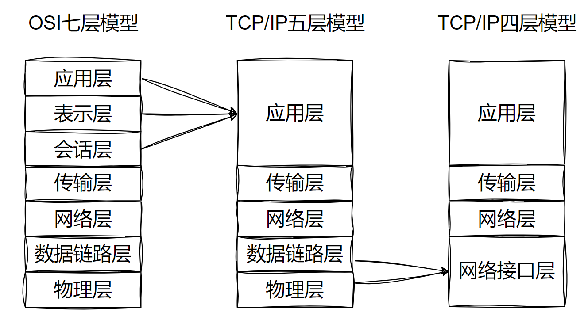

###### 常见网络协议

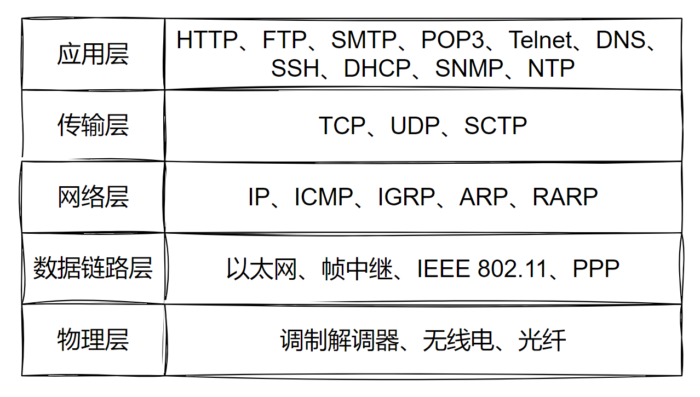

### IP

#### 什么是IP

IP地址由一串数字组成，用来标识一台电脑在网络中的位置。当设备连接网络，设备将被分配一个IP地址，用作标识。通过IP地址设备间可以互相通讯。IP地址有两个主要功能：标识设备或网络，以及寻址。

Windows下可以在命令提示符中使用ipconfig查看网络适配器的IP。

Linux下可以在终端中使用ifconfig或ip addr查看IP。

#### 子网掩码

IP网络可以在IPv4和IPv6中划分子网。为此将IP地址识别成由两部分组成：网络前缀和主机编号。子网掩码（subnet mask）或无类别域间路由（CIDR）表示法确定了IP地址如何分为网络部分和主机部分。

子网掩码一词仅用于IPv4地址中。但是 IPv4和IPv6都使用CIDR概念和符号。在此，在IP地址后面加斜杠和用于标识网络部分的位数（十进制）。例如：IPv4地址及其子网掩码分别可以是 192.168.10.2 和 255.255.255.0 。因为IP地址的前24位表示网络和子网，所以相同的IP地址和子网的CIDR表示法为192.168.10.2/24。

主机编号全为0，表示网络号，主机编号全为1，表示网络广播。

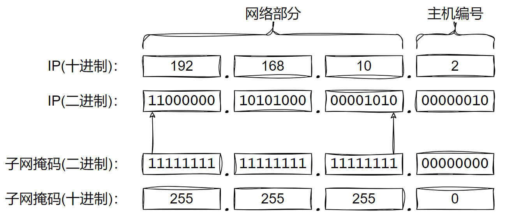

#### IPv4地址的分类

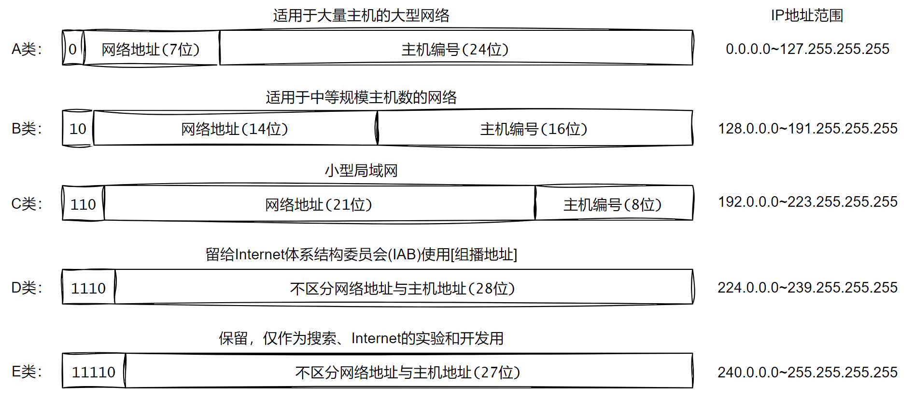

#### 公网与私网

公网IP在任何地方都可以访问。而私网IP只能在局域网内访问。

国际规定有一部分IP地址是用于局域网使用，也就是属于私网IP，不在公网中使用的，它们的范围是：

**10.0.0.0～10.255.255.255**

**172.16.0.0～172.31.255.255**

**192.168.0.0～192.168.255.255**

其中127.0.0.1~127.255.255.255用于回路测试，如127.0.0.1可以代表本机IP地址。

网络地址转换（NAT）是一种在IP数据包通过路由器或防火墙时重写来源或目的IP地址或端口的技术。这种技术普遍应用于有多台主机，但只通过一个公有IP地址访问互联网的私有网络中。1990年代中期，NAT是作为一种解决IPv4地址短缺以避免保留IP地址困难的方案而流行起来的，并成了家庭和小型办公室网络连接上的路由器的一个标准特征，因为对他们来说，申请独立的IP地址的代价要高于所带来的效益。

#### IPv4与IPv6

常见的IP地址分为IPv4与IPv6两大类。IPv4为32位长，通常书写时以四组十进制数字组成，并以点分隔，如：172.16.254.1。IPv6为128位长，通常书写时以八组十六进制数字组成，以冒号分割，如：2001:db8:0:1234:0:567:8:1。

随着互联网的快速成长，IPv4的42亿个地址最终于2011年2月3日用尽。相应的科研组织已研究出128位的IPv6，其IP地址数量最高可达3.402823669×1038个，届时每个人家居中的每件电器，每件对象，甚至地球上每一粒沙子都可以拥有自己的IP地址。

### 端口

#### 什么是端口

这里的端口指的是逻辑端口，即TCP/IP协议中的端口。端口用于进程（应用软件）在同一设备或不同设备之间通信。每个端口有一个对应的端口号。端口号有65536个。

可以使用netstat -ano查看端口信息。

#### 端口号的分配

###### 公认端口

0~1023，它们紧密绑定于一些服务。通常这些端口的通讯明确表明了某种服务的协议。端口号0是被保留的，不可使用。1~1023系统保留，只能由root用户使用。

###### 动态端口

1024~65536，之所以称为动态端口，是因为它一般不固定分配某种服务，而是动态分配。当一个系统进程或应用程序进程需要网络通信时，它向主机申请一个端口，主机从可用的端口号中分配一个供它使用。当这个进程关闭时，同时也就释放了所占用的端口号。

###### 常见端口

### socket套接字

#### 什么是socket

socket（套接字）是同一或不同电脑的进程（任务、应用软件）间通信的一个工具，进程之间想要进行网络通信需要基于socket。只要与网络相关的应用程序或者软件都使用到了socket。

#### socket的使用

Python中提供了socket模块用于创建套接字。

```python
import socket

# AF_INET 用于 Internet 进程间通信；SOCK_STREAM 流式套接字，TCP
tcp_socket = socket.socket(family=socket.AF_INET, type=socket.SOCK_STREAM)

# AF_INET 用于 Internet 进程间通信；SOCK_DGRAM 数据报套接字，UDP
udp_socket = socket.socket(family=socket.AF_INET, type=socket.SOCK_DGRAM)
```
### UDP

#### 什么是UDP

用户数据报协议（UDP：User Datagram Protocol）是一个简单的面向数据报的通信协议。UDP只提供数据的不可靠传递，它一旦把应用程序发给网络层的数据发送出去，就不保留数据备份。

UDP避免了协议栈中执行错误检查和纠正处理的开销，适用于对时间有较高要求的应用程序，因为某些场景下丢弃数据包比等待或重传导致延迟更可取。流媒体、在线游戏流量通常使用UDP传输。

#### UDP编程

###### UDP编程流程

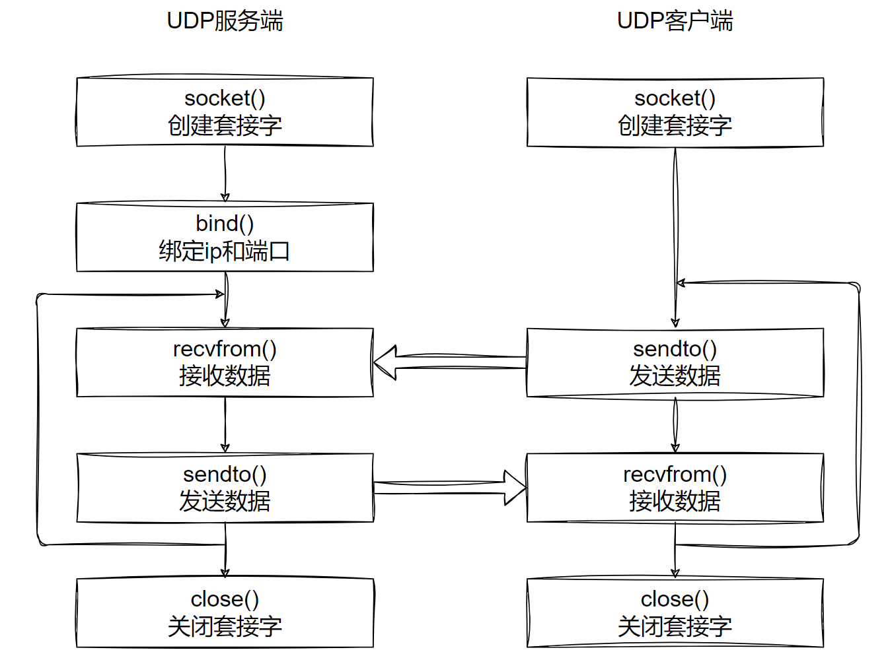

###### 案例

UDP服务端：

```python
"""udp服务端"""

import socket

# 创建udp套接字
udp_socket = socket.socket(family=socket.AF_INET, type=socket.SOCK_DGRAM)
# 绑定ip和端口
udp_socket.bind(("127.0.0.1", 8080))
while True:
    # 接收数据
    recv_data, client_addr = udp_socket.recvfrom(1024)
    client_ip = client_addr[0]
    client_port = client_addr[1]
    print(f"{client_ip}:{client_port}>> {recv_data.decode("utf-8")}")
    # 发送数据
    udp_socket.sendto("你好".encode("utf-8"), client_addr)
# 关闭套接字
udp_socket.close()
```

UDP客户端：

```python
"""udp客户端"""

import socket

# 创建udp套接字
udp_socket = socket.socket(family=socket.AF_INET, type=socket.SOCK_DGRAM)
while True:
    try:
        # 发送数据
        server_ip = "127.0.0.1"
        server_port = 8080
        udp_socket.sendto(input(f"{server_ip}:{server_port}<< ").encode("utf-8"), (server_ip, server_port))
        # 接收数据
        recv_data, client_addr = udp_socket.recvfrom(1024)
        client_ip = client_addr[0]
        client_port = client_addr[1]
        print(f"{client_ip}:{client_port}>> {recv_data.decode("utf-8")}")
    except KeyboardInterrupt:
        break
# 关闭套接字
udp_socket.close()
```
### TCP

#### 什么是TCP

传输控制协议（TCP：Transmission Control Protocol）是一种面向连接的、可靠的、基于字节流的传输层通信协议。TCP协议的运行可划分为三个阶段：连接建立、数据传送和连接终止。

很多重要的机制保证了TCP的可靠性和强壮性，包括：

**使用序号，对收到的TCP报文段进行排序以及检测重复的数据。**

**使用校验和检测报文段的错误，即无错传输。**

**使用确认和计时器来检测和纠正丢包或延时。**

**流控制。**

**拥塞控制。**

**丢失包的重传。**

#### TCP编程

###### TCP编程流程

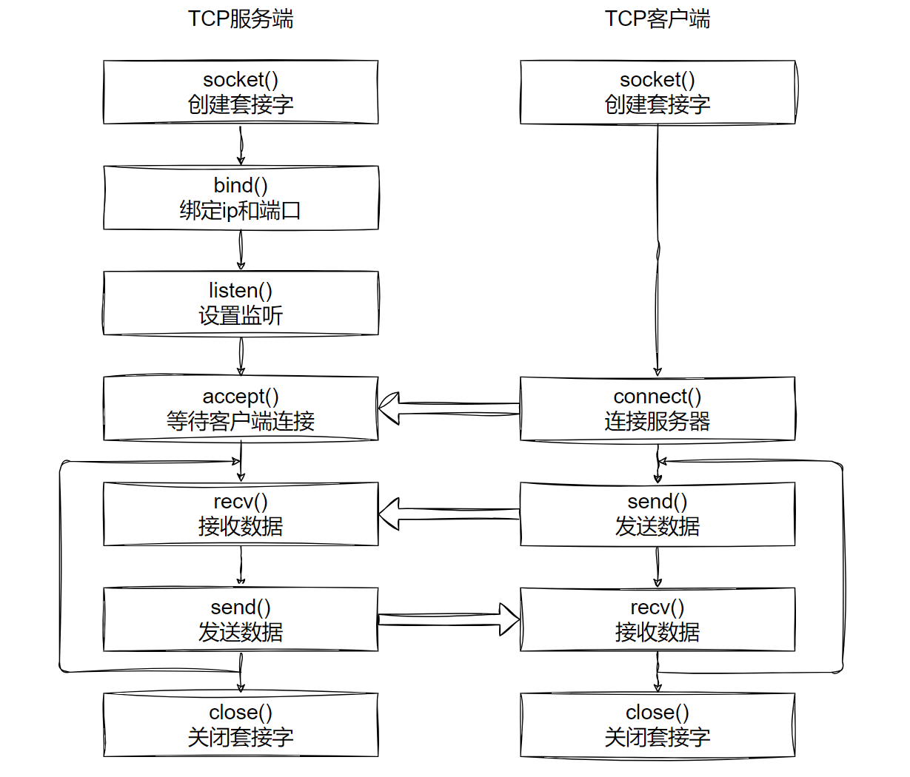

###### 案例

TCP服务端：

```python
"""tcp服务端"""

import socket

# 创建tcp套接字
tcp_socket = socket.socket(family=socket.AF_INET, type=socket.SOCK_STREAM)
# 绑定ip和端口
tcp_socket.bind(("127.0.0.1", 8080))
# 设置监听
tcp_socket.listen(2)
# 等待客户端连接
client_socket, client_addr = tcp_socket.accept()
while True:
    # 接收数据
    recv_data = client_socket.recv(1024)
    print(f"{client_addr[0]}:{client_addr[1]}>> {recv_data.decode('utf-8')}")
    # 发送数据
    client_socket.send("你好".encode("utf-8"))
# 关闭套接字
tcp_socket.close()
```

TCP客户端：

```python
"""tcp客户端"""

import socket

# 创建tcp套接字
tcp_socket = socket.socket(family=socket.AF_INET, type=socket.SOCK_STREAM)
# 连接服务器
server_ip = "127.0.0.1"
server_port = 8080
tcp_socket.connect((server_ip, server_port))
while True:
    try:
        # 发送数据
        tcp_socket.send(input(f"{server_ip}:{server_port}<< ").encode("utf-8"))
        # 接收数据
        recv_data = tcp_socket.recv(1024)
        print(f"{server_ip}:{server_port}>> {recv_data.decode("utf-8")}")
    except KeyboardInterrupt:
        break
# 关闭套接字
tcp_socket.close()
```
### HTTP

#### 什么是HTTP

HTTP（超文本传输协议）是一种用于分布式、协作式和超媒体信息系统的应用层协议。是万维网的数据通信的基础。设计HTTP最初的目的是为了提供一种发布和接收HTML页面的方法。通过HTTP或者HTTPS协议请求的资源由统一资源标识符（Uniform Resource Identifiers，URI）来标识。

HTTP 上的一个典型工作流程是客户端计算机向服务器发出请求，然后服务器发送响应消息。通常，由HTTP客户端发起一个请求，建立一个到服务器指定端口（默认是80端口）的TCP连接。HTTP服务器则在那个端口监听客户端的请求。一旦收到请求，服务器会向客户端返回一个状态，比如“HTTP/1.1 200 OK”，以及返回的内容，如请求的文件、错误消息、或者其它信息。

#### HTTP消息结构

###### 客户端请求消息

客户端发送一个 HTTP 请求到服务器的请求消息包括以下格式：请求行、请求头、空行和请求体四个部分组成。

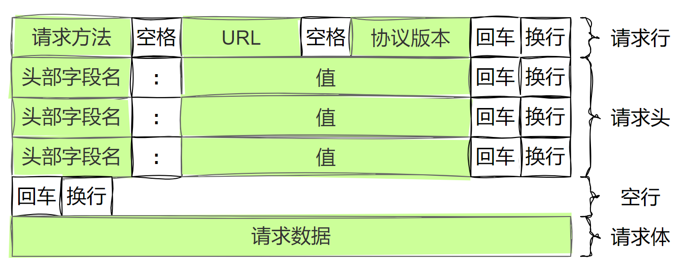

**请求行**

请求方法：如 GET、POST、PUT、DELETE等，指定要执行的操作。

请求 URI：请求的资源路径，通常包括主机名、端口号（如果非默认）、路径和查询字符串。

协议版本：如 HTTP/1.1 或 HTTP/2。

请求行的格式示例：GET /index.html HTTP/1.1

**请求头**

包含了客户端环境信息、请求体的大小（如果有）、客户端支持的压缩类型等。

常见的请求头包括Host、User-Agent、Accept、Accept-Encoding、Content-Length等。

**空行**

请求头和请求体之间的分隔符，表示请求头的结束。

**请求体**

在某些类型的HTTP请求（如 POST 和 PUT）中，请求体包含要发送给服务器的数据。

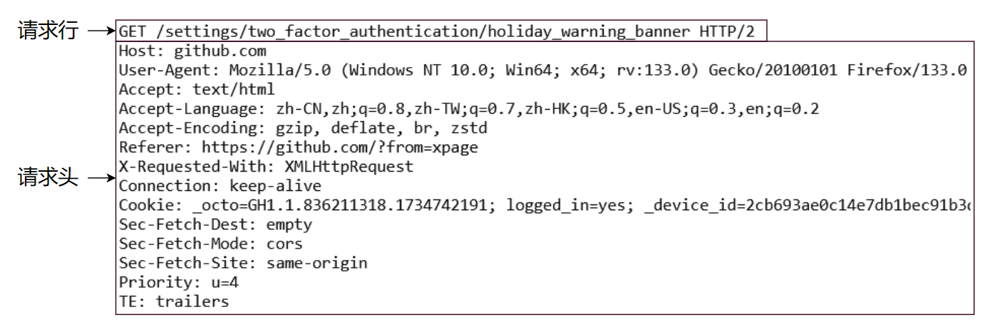

###### 服务端响应消息

HTTP 响应由四个部分组成，分别是：状态行、消息报头、空行和响应正文。

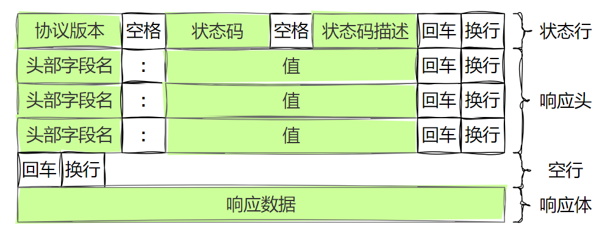

**状态行**

HTTP 版本：与请求消息中的版本相匹配。

状态码：三位数，表示请求的处理结果，如 200 表示成功，404 表示未找到资源。

状态信息：状态码的简短描述。

状态行的格式示例：HTTP/1.1 200 OK

**响应头**

包含了服务器环境信息、响应体的大小、服务器支持的压缩类型等。

常见的响应头包括Content-Type、Content-Length、Server、Set-Cookie等。

**空行**

响应头和响应体之间的分隔符，表示响应头的结束。

**响应体**

包含服务器返回的数据，如请求的网页内容、图片、JSON数据等。

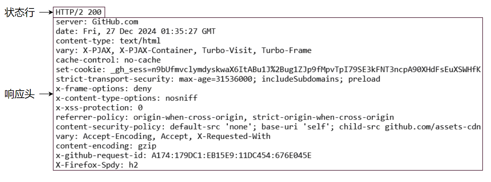

#### HTTP请求方法

HTTP/1.1 协议中共定义了八种方法来以不同方式操作指定的资源，HTTP 服务器至少应该实现 GET 和 HEAD 方法，其他方法都是可选的。

###### GET

向指定的资源发出“显示”请求。使用 GET 方法应该只用在读取资料，而不应当被用于产生“副作用”的操作中，例如在网络应用程序中。其中一个原因是 GET 可能会被网络爬虫等随意访问。

###### HEAD

与 GET 方法一样，都是向服务器发出指定资源的请求。只不过服务器将不传回资源的本文部分。它的好处在于，使用这个方法可以在不必传输全部内容的情况下，就可以获取其中“关于该资源的元信息（或称元数据）”。

###### POST

向指定资源提交数据，请求服务器进行处理（例如提交表单或者上传文件）。数据被包含在请求本文中。这个请求可能会建立新的资源或修改现有资源，或二者皆有。每次提交，表单的数据被浏览器用编码到 HTTP 请求的 body 里。

###### PUT

向指定资源位置上传其最新内容。

###### DELETE

请求服务器删除 Request-URI 所标识的资源。

###### TRACE

回显服务器收到的请求，主要用于测试或诊断。

###### OPTIONS

这个方法可使服务器传回该资源所支持的所有 HTTP 请求方法。用“*”来代替资源名称，向 Web 服务器发送 OPTIONS 请求，可以测试服务器功能是否正常运作。

###### CONNECT

HTTP/1.1协议中预留给能够将连接改为隧道方式的代理服务器。通常用于SSL加密服务器的链接（经由非加密的HTTP代理服务器）。

#### HTTP状态码

HTTP状态码是服务器对客户端请求的响应，状态码分为五类：

###### 1xx（信息状态码）

表示接收的请求正在处理。例如：

**100：继续。客户端应继续其请求。**

**101：切换协议。服务器根据客户端的请求切换协议。只能切换到更高级的协议。**

###### 2xx（成功状态码）

表示请求正常处理完毕。例如：

**200：请求成功。一般用于 GET 与 POST 请求。**

**202：已接受。已经接受请求，但未处理完成。**

###### 3xx（重定向状态码）

需要后续操作才能完成这一请求。例如：

**300：多种选择。请求的资源可包括多个位置，相应可返回一个资源特征与地址的列表用于用户终端（例如：浏览器）选择。**

**301：永久移动。请求的资源已被永久的移动到新 URI，返回信息会包括新的 URI，浏览器会自动定向到新 URI。今后任何新的请求都应使用新的 URI代替。**

**302：临时移动。与301类似。但资源只是临时被移动。客户端应继续使用原有 URI。**

**304：未修改。所请求的资源未修改，服务器返回此状态码时，不会返回任何资源。客户端通常会缓存访问过的资源，通过提供一个头信息指出客户端希望只返回在指定日期之后修改的资源。**

**305：使用代理。所请求的资源必须通过代理访问。**

###### 4xx（客户端错误状态码）

表示请求包含语法错误或无法完成。例如：

**400：客户端请求的语法错误，服务器无法理解。**

**403：服务器理解请求客户端的请求，但是拒绝执行此请求。**

**404：服务器无法根据客户端的请求找到资源（网页）。通过此代码，网站设计人员可设置“您所请求的资源无法找到”的个性页面。**

**405：客户端请求中的方法被禁止。**

###### 5xx（服务器错误状态码）

服务器在处理请求的过程中发生了错误。例如：

**500：服务器内部错误，无法完成请求。**

**501：服务器不支持请求的功能，无法完成请求。**

**502：作为网关或者代理工作的服务器尝试执行请求时，从远程服务器接收到了一个无效的响应。**

### 案例：发送HTTP请求以及获取响应数据

```python
import requests

# 一言网的 API 地址
url = 'https://v1.hitokoto.cn/'
# 海外:url = 'https://international.v1.hitokoto.cn'


# 请求参数，指定返回中文内容，这里使用默认的所有类型
params = {
    'c': 'a',  # 可以根据需要修改类型，a 代表动画，b 代表漫画等
    'encode': 'json'
}

try:
    print(f"正在发送 GET 请求到: {url}，参数: {params}")
    response = requests.get(url, params=params)
    status_code = response.status_code
    if status_code == 200:
        print(f"请求成功！状态码: {status_code}")
        data = response.json()
        hitokoto = data['hitokoto']
        from_who = data['from_who'] if data['from_who'] else '未知'
        print(f"随机名言: {hitokoto} - {from_who}")
    elif status_code == 404:
        print(f"请求的资源未找到！状态码: {status_code}")
    elif status_code == 500:
        print(f"服务器内部错误！状态码: {status_code}")
    else:
        print(f"发生未知错误，状态码: {status_code}")
except requests.RequestException as e:
print(f"请求过程中出现错误: {e}")
```
### 案例：通过Starlette 构建web接口

Starlette 是一个轻量级的 Python 异步 Web 框架，专为构建高性能的异步应用程序而设计，它具有简洁、灵活的特点，并且可以与其他库（如 FastAPI 就是基于 Starlette 构建的）很好地集成。我们可以结合 Starlette 构建一个Web 服务，将上面获取随机名言的功能封装成一个 API 接口，这样可以带来一些优势，例如实现更灵活的交互、支持多用户访问。

**Uvicorn：它是一个基于 Python 的 ASGI（Asynchronous Server Gateway Interface）服务器。ASGI 是 Python 中用于异步 Web 应用的标准接口，Uvicorn 能够高效地处理并发请求，基于 uvloop（一个快速的异步事件循环）和 httptools（一个快速的 HTTP 解析器）构建，为 Python 异步 Web 应用提供了高性能的运行环境。**

**Starlette：是一个轻量级的 Python 异步 Web 框架，它遵循 ASGI 标准，专注于提供简洁、灵活的 API 来构建 Web 应用和服务。Starlette 提供了路由、中间件、请求和响应处理等核心功能，允许开发者快速搭建 Web 应用的逻辑。**

**协作方式：Uvicorn 为 Starlette 应用提供了运行的基础环境。当你使用 Starlette 编写好一个 Web 应用后，无法直接运行，需要借助像 Uvicorn 这样的 ASGI 服务器来启动和部署**

###### 安装依赖包

```python
pip install starlette uvicorn requests
```
###### 代码实现

```python
from starlette.applications import Starlette
from starlette.responses import JSONResponse
from starlette.routing import Route
import requests
import uvicorn

# 一言网的 API 地址
HITOKOTO_URL = 'https://v1.hitokoto.cn/'

# 定义异步函数来获取随机名言
async def get_hitokoto():
    try:
        # 请求参数，指定返回中文内容，这里使用默认的所有类型
        params = {
            'c': 'a',  # 可以根据需要修改类型，a 代表动画，b 代表漫画等
            'encode': 'json'
        }
        response = requests.get(HITOKOTO_URL, params=params)
        status_code = response.status_code
        if status_code == 200:
            data = response.json()
            hitokoto = data['hitokoto']
            from_who = data['from_who'] if data['from_who'] else '未知'
            return {'hitokoto': hitokoto, 'from_who': from_who}
        else:
            return {'error': f'请求一言网 API 失败，状态码: {status_code}'}
    except requests.RequestException as e:
        return {'error': f'请求过程中出现错误: {str(e)}'}

# 定义处理根路径请求的异步函数
async def homepage(request):
    result = await get_hitokoto()
    return JSONResponse(result)

# 创建 Starlette 应用实例
app = Starlette(debug=True, routes=[
    Route('/', homepage),
])

if __name__ == "__main__":
    # 使用 uvicorn 运行应用
    uvicorn.run(app, host='0.0.0.0', port=8000)
```
###### 代码说明

**get_hitokoto 函数**

该函数负责发送 HTTP 请求到一言网的 API，获取随机名言。处理请求过程中可能出现的错误，包括请求失败和网络异常。返回一个包含名言和来源信息的字典，或者包含错误信息的字典。

**homepage 函数**

作为 Web 服务的根路径处理函数。调用 get_hitokoto 函数获取随机名言，并将结果封装成 JSON 响应返回给客户端。

**Starlette 应用**

创建 Starlette 应用实例，并定义路由规则，将根路径 / 映射到 homepage 处理函数。使用 uvicorn 作为ASGI服务器运行应用。

**通过 Starlette 构建 Web 服务，将获取随机名言的功能封装成 API 接口，方便其他应用程序调用。虽然 requests 库是同步的，但 Starlette 本身支持异步处理。**

## 正则表达式

### 什么是正则表达式

正则表达式（regular expression，常简写为regex、regexp或re），是一种用于匹配和操作文本的强大工具，它是由一系列字符和特殊字符组成的模式，用于描述要匹配的文本模式。正则表达式可以在文本中查找、替换、提取和验证特定的模式。

### re模块

Python的re模块提供了正则表达式匹配操作。

```python
import re
```

re模块中提供了一些方法用于查找或处理字符串。

#### search

```python
re.search(pattern, string)
```

扫描整个 string 查找正则表达式 pattern 产生匹配的第一个位置，并返回相应的 Match。如果字符串中没有与模式匹配的位置则返回 None。

#### match

```python
re.match(pattern, string)
```

如果 string 开头的零个或多个字符与正则表达式 pattern 匹配，则返回相应的 Match。如果字符串与模式不匹配则返回 None。

#### findall

```python
re.findall(pattern, string)
```

返回 pattern 在 string 中的所有非重叠匹配，以字符串列表或字符串元组列表的形式。对 string 的扫描从左至右，匹配结果按照找到的顺序返回。空匹配也包括在结果中。

#### sub

```python
re.sub(pattern, repl, string, count=0)
```

返回通过使用 repl 替换在 string 最左边非重叠出现的 pattern 而获得的字符串。如果样式没有找到，则不加改变地返回 string。

repl 可以是字符串或函数；如为字符串，则其中任何反斜杠转义序列都会被处理。 也就是说，\n 会被转换为一个换行符，\r 会被转换为一个回车符，依此类推。如果 repl 是一个函数，则它会针对每次 pattern 的非重叠出现的情况被调用。 该函数接受单个 Match 参数，并返回替换字符串。

可选参数 count 是要替换的最大次数；count 必须是非负整数。如果省略这个参数或设为 0，所有的匹配都会被替换。

#### split

```python
re.split(pattern, string, maxsplit=0)
```

用 pattern 分开 string 。 如果在 pattern 中捕获到括号，那么所有的组里的文字也会包含在列表里。如果 maxsplit 非零， 最多进行 maxsplit 次分隔， 剩下的字符全部返回到列表的最后一个元素。

### 表示字符

### 表示数量

### 表示边界

### 匹配分组

注意：. ^ $ * + ? { } [ ] \ | ( )属于元字符，[ 和 ] 。这两个元字符用于指定一个字符类，也就是你希望匹配的字符的一个集合。元字符 (除了 \) 在字符类中是不起作用的。 例如，[akm$] 将会匹配以下任一字符 'a', 'k', 'm' 或 '$'；'$' 通常是一个元字符，但在一个字符类中它的特殊性被消除了。

### 原始字符串

Python中字符串前面加上 r 表示原始字符串，忽略转义。原始字符串非常适合用于正则表达式，因为正则表达式中通常包含很多反斜杠（例如 \d 或 \w），使用原始字符串可以避免反斜杠带来的转义问题。

例如：

```python
import re

text = "abcdef123456"
print(re.search(r"\w+", text))
print(re.search("\w+", text))  # SyntaxWarning: invalid escape sequence '\w'
```

不使用原始字符串虽然也能运行，但是会有语法警告。

### 案例

#### 匹配电话号码

```python
import re

test = [
    "13812345678",  # 合法
    "11456817239",  # 非法
    "19912345678",  # 合法
    "17138412356",  # 合法
    "1234567890",  # 非法
    "14752345673",  # 合法
    "1800123456",  # 非法
]

# 以1开头，第二位为3，4，5，7，8，9，后面是9位数字
pattern = r"^1[345789]\d{9}$"
for i in test:
    print(f"{i:20}{"合法" if re.match(pattern, i) else "非法"}")
```
#### 匹配邮箱

```python
import re

test = [
    "example@example.com",
    "user.name@subdomain.example.co",
    "username@.com",
    "@missingusername.com",
    "-dasd@qq.com",
]
# 匹配邮箱
pattern = r"[\w!#$%&'*+-/=?^`{|}~.]+@[\w!#$%&'*+-/=?^`{|}~.]+\.[a-zA-Z]{2,}$"
for i in test:
    print(f"{i:40}{"合法" if re.match(pattern, i) else "非法"}")
```
#### 匹配0-255之间的数字

```python
import re

test = ["0", "9", "50", "100", "199", "200", "255", "256", "-1", "01", "001"]
# 十位为1-9，?表示可以没有十位，个位是0-9
# 或 百位是1，十位是0-9，个位是0-9
# 或 百位是2，十位是0-4，个位是0-9
# 或 百位是2，十位是5，个位是0-5
pattern = r"^([1-9]?\d|1\d{2}|2[0-4]\d|25[0-5])$"
for num in test:
print(f"{num:5} {"合法" if re.match(pattern, num) else "非法"}")
```
#### 从标签中获取网址

```python
import re

test = """<link rel="alternate" hreflang="zh" href="https://zh.wikipedia.org/wiki/%E6%AD%A3%E5%88%99%E8%A1%A8%E8%BE%BE%E5%BC%8F">
<link rel="alternate" hreflang="zh-Hans" href="https://zh.wikipedia.org/zh-hans/%E6%AD%A3%E5%88%99%E8%A1%A8%E8%BE%BE%E5%BC%8F">
<link rel="alternate" hreflang="zh-Hans-CN" href="https://zh.wikipedia.org/zh-cn/%E6%AD%A3%E5%88%99%E8%A1%A8%E8%BE%BE%E5%BC%8F">
<link rel="alternate" hreflang="zh-Hans-MY" href="https://zh.wikipedia.org/zh-my/%E6%AD%A3%E5%88%99%E8%A1%A8%E8%BE%BE%E5%BC%8F">
<link rel="alternate" hreflang="zh-Hans-SG" href="https://zh.wikipedia.org/zh-sg/%E6%AD%A3%E5%88%99%E8%A1%A8%E8%BE%BE%E5%BC%8F">
<link rel="alternate" hreflang="zh-Hant" href="https://zh.wikipedia.org/zh-hant/%E6%AD%A3%E5%88%99%E8%A1%A8%E8%BE%BE%E5%BC%8F">
<link rel="alternate" hreflang="zh-Hant-HK" href="https://zh.wikipedia.org/zh-hk/%E6%AD%A3%E5%88%99%E8%A1%A8%E8%BE%BE%E5%BC%8F">
<link rel="alternate" hreflang="zh-Hant-MO" href="https://zh.wikipedia.org/zh-mo/%E6%AD%A3%E5%88%99%E8%A1%A8%E8%BE%BE%E5%BC%8F">
<link rel="alternate" hreflang="zh-Hant-TW" href="https://zh.wikipedia.org/zh-tw/%E6%AD%A3%E5%88%99%E8%A1%A8%E8%BE%BE%E5%BC%8F">
<link rel="alternate" hreflang="x-default" href="https://zh.wikipedia.org/wiki/%E6%AD%A3%E5%88%99%E8%A1%A8%E8%BE%BE%E5%BC%8F">"""

# 获取所有href中网址
pattern = r"href=\"(.+?)\""
for i in re.findall(pattern, test):
print(i)
```
#### 替换文本中的所有数字为对应的词

```python
import re

test = "I have 2 apples and 3 oranges."
# 定义数字到词的映射
num_map = {"1": "one", "2": "two", "3": "three", "4": "four", "5": "five"}
print(re.sub(r"\d", lambda x: num_map[x.group(0)], test))  # I have two apples and three oranges.
```
## 综合案例：客户信息管理系统

### 需求说明

#### 主菜单

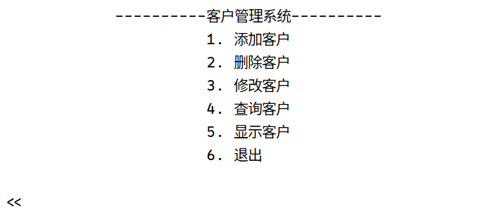

#### 添加客户

###### 添加id

输入纯数字则正常添加。

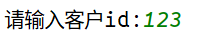

否则提示id必须为纯数字，并再次输入。

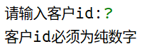

第三次输入时有额外提醒。

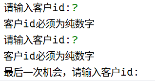

三次输入失败后终止添加客户。

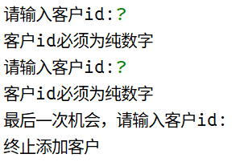

id若已存在则终止添加。

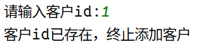

###### 添加姓名

输入字母或汉字则正常添加。


否则提示姓名必须为字符，并再次输入。

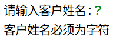

第三次输入时有额外提醒。

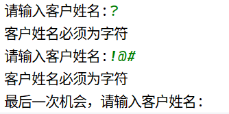

三次输入失败后终止添加客户。

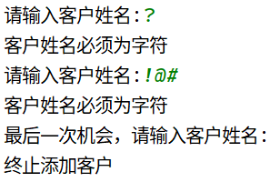

###### 添加年龄

输入纯数字则正常添加。

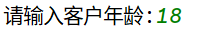

否则会有提示，并跳过添加年龄。

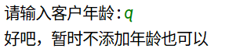

###### 添加电话

输入符合手机号码格式则正常添加。


不常见的电话号码也可以添加。

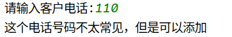

不是电话号码则提示，并跳过添加电话。

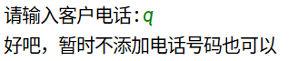

###### 添加邮箱

输入大致符合邮箱格式则正常添加。

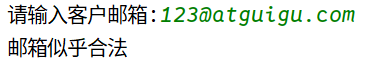

若不符合邮箱格式则提示，并跳过添加邮箱。

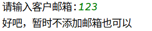

#### 删除客户

输入要删除的客户的id，不存在则终止，存在则删除。

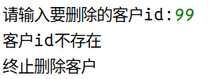

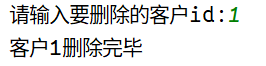

#### 修改客户

输入要修改的客户的id，只能修改年龄、电话、邮箱。

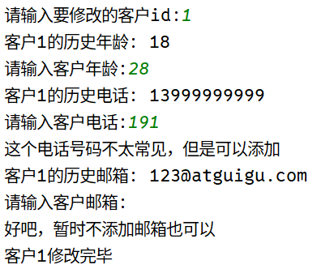

未设置的属性保持历史数据不变。

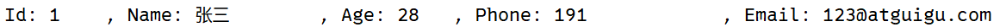

#### 查询客户

可以按id或姓名查询，之前未设置的年龄、电话、邮箱显示 None。

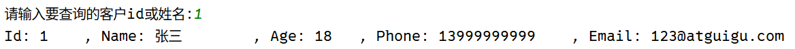

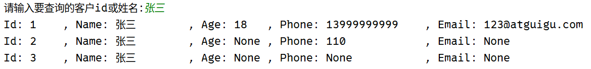

#### 显示客户

系统内若没有客户则提示暂无客户信息。


若有客户则显示所有客户信息，之前未设置的年龄、电话、邮箱显示 None。

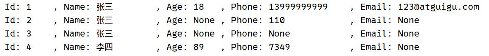

#### 退出

输入6，或按下 Ctrl + D / Ctrl + C 退出。

### 代码实现

#### 客户类

```python
import re

class Customer:
    """客户类"""

    def __init__(self, c_id, name, age="None", phone="None", email="None"):
        """初始化客户信息"""
        self.id = c_id  # 客户编号
        self.name = name  # 客户姓名
        self.age = age  # 客户年龄
        self.phone = phone  # 客户电话
        self.email = email  # 客户邮箱

    @staticmethod
    def check_id(c_id):
        """检查id格式"""
        # 检查客户id是否为纯数字
        return c_id.isdigit()

    @staticmethod
    def check_name(name):
        """检查name格式"""
        # 检查客户姓名是否为字符
        return name.isalpha()

    @staticmethod
    def check_age(age):
        """检查age格式"""
        # 检查客户年龄是否为整数
        return age.isdigit()

    @staticmethod
    def check_phone(phone):
        """检查phone格式"""
        # 检查客户电话是否合法
        return True if re.match(r"^1[345789]\d{9}$", phone) else False

    @staticmethod
    def check_email(email):
        """检查email格式"""
        # 检查客户邮箱是否合法
        pattern = r"[\w!#$%&'*+-/=?^`{|}~.]+@[\w!#$%&'*+-/=?^`{|}~.]+\.[a-zA-Z]{2,}$"
        return True if re.match(pattern, email) else False

    def __str__(self):
        """打印客户信息"""
        return (f"Id: {self.id:<5}, Name: {self.name:<10}, Age: {self.age:<5}, Phone: {self.phone:<15}"
                f", Email: {self.email:<25}")
```
#### 客户管理系统类

```python
import re
import time
from customer import Customer

class CMS:
    """客户管理系统类"""

    def __init__(self):
        """初始化客户管理系统"""
        self.customer_id_dict = {}  # 客户id字典
        self.customer_name_dict = {}  # 客户姓名字典

    def display_menu(self):
        """显示菜单"""
        print(
            """
            ----------客户管理系统----------
                      1. 添加客户
                      2. 删除客户
                      3. 修改客户
                      4. 查询客户
                      5. 显示客户
                      6. 退出
            """
        )

    def add_customer_id(self):
        """添加客户id"""
        # 输入客户id，没问题则返回客户id，有问题则返回False
        customer_id = "None"
        for i in range(3):
            if i < 2:
                # 前2次输入，输入错误则重新输入
                customer_id = input("请输入客户id:")
                # 检查客户id是否合法
                if Customer.check_id(customer_id):
                    break
                else:
                    print("客户id必须为纯数字")
            else:
                # 第3次输入，输入错误则终止添加
                customer_id = input("最后一次机会，请输入客户id:")
                # 检查客户id是否合法
                if Customer.check_id(customer_id):
                    break
                else:
                    print("终止添加客户")
                    return False
        # 检查客户id是否已存在
        if customer_id in self.customer_id_dict:
            # 之前存在则终止添加
            print("客户id已存在，终止添加客户")
            return False
        else:
            # 之前不存在则返回客户id
            return customer_id

    def add_customer_name(self):
        """添加客户姓名"""
        # 输入客户姓名，没问题则返回客户姓名，有问题则返回False
        customer_name = "None"
        for i in range(3):
            if i < 2:
                # 前2次输入，输入错误则重新输入
                customer_name = input("请输入客户姓名:")
                # 检查客户姓名是否合法
                if Customer.check_name(customer_name):
                    break
                else:
                    print("客户姓名必须为字符")
            else:
                # 第3次输入，输入错误则终止添加
                customer_name = input("最后一次机会，请输入客户姓名:")
                # 检查客户姓名是否合法
                if Customer.check_name(customer_name):
                    break
                else:
                    print("终止添加客户")
                    return False
        return customer_name

    def set_customer_age(self):
        """添加或修改客户年龄"""
        # 输入客户年龄，没问题则返回客户年龄，有问题则返回False
        customer_age = input("请输入客户年龄:")
        # 检查客户年龄是否合法
        if Customer.check_age(customer_age):
            return customer_age
        else:
            print("好吧，暂时不添加年龄也可以")
        return "None"

    def set_customer_phone(self):
        """添加或修改客户电话"""
        # 输入客户电话，没问题则返回客户电话，有问题则返回False
        customer_phone = input("请输入客户电话:")
        # 检查客户电话是否合法
        if Customer.check_phone(customer_phone):
            return customer_phone
        elif re.search(r"^[\d-]+$", customer_phone):
            print("这个电话号码不太常见，但是可以添加")
            return customer_phone
        else:
            print("好吧，暂时不添加电话号码也可以")
        return "None"

    def set_customer_email(self):
        """添加或修改客户邮箱"""
        # 输入客户邮箱，没问题则返回客户邮箱，有问题则返回False
        customer_email = input("请输入客户邮箱:")
        # 检查客户邮箱是否合法
        if Customer.check_email(customer_email):
            print("邮箱似乎合法")
            return customer_email
        else:
            print("好吧，暂时不添加邮箱也可以")
        return "None"

    def add_customer(self):
        """添加客户"""
        # 添加客户id
        if not (customer_id := self.add_customer_id()):
            return
        # 添加客户姓名
        if not (customer_name := self.add_customer_name()):
            return
        # 添加客户年龄
        customer_age = self.set_customer_age()
        # 添加客户电话
        customer_phone = self.set_customer_phone()
        # 添加客户邮箱
        customer_email = self.set_customer_email()
        # 创建客户对象
        customer = Customer(customer_id, customer_name, customer_age, customer_phone, customer_email)
        # 将客户对象添加到客户id字典中
        self.customer_id_dict[customer_id] = customer
        # 将客户对象添加到客户姓名字典中，每个姓名key对应一个字典value
        # 每个字典value包含此姓名的所有客户，字典value的key为客户id，value为客户对象
        customer_inner_dict = self.customer_name_dict.get(customer_name)
        if customer_inner_dict is None:
            self.customer_name_dict[customer_name] = {customer_id: customer}
        else:
            customer_inner_dict[customer_id] = customer
        print(f"添加客户{customer_id}成功")

    def delete_customer(self):
        """删除客户"""
        # 获取输入的客户id
        customer_id = input("请输入要删除的客户id:")
        # 检查客户id是否合法
        if not Customer.check_id(customer_id):
            print("客户id必须为纯数字")
            print("终止删除客户")
            return
        # 检查客户id是否存在
        if customer_id not in self.customer_id_dict:
            print("客户id不存在")
            print("终止删除客户")
            return
        else:
            customer_name = self.customer_id_dict[customer_id].name
        # 将客户id从客户id字典中删除
        del self.customer_id_dict[customer_id]
        # 将客户id从客户姓名字典中删除
        customer_inner_dict = self.customer_name_dict.get(customer_name)
        del customer_inner_dict[customer_id]
        if len(customer_inner_dict)==0:
            del self.customer_name_dict[customer_name]

        print(f"客户{customer_id}删除完毕")

    def update_customer(self):
        """修改客户"""
        # 获取输入的客户id
        customer_id = input("请输入要修改的客户id:")
        # 检查客户id是否合法
        if not Customer.check_id(customer_id):
            print("客户id必须为纯数字")
            print("终止修改客户")
            return
        # 检查客户id是否存在
        if customer_id not in self.customer_id_dict:
            print("客户id不存在")
            print("终止修改客户")
            return
        # 修改客户年龄
        print(f"客户{customer_id}的历史年龄:", self.customer_id_dict[customer_id].age)
        if (customer_age := self.set_customer_age()) != "None":
            self.customer_id_dict[customer_id].age = customer_age
        # 修改客户电话
        print(f"客户{customer_id}的历史电话:", self.customer_id_dict[customer_id].phone)
        if (customer_phone := self.set_customer_phone()) != "None":
            self.customer_id_dict[customer_id].phone = customer_phone
        # 修改客户邮箱
        print(f"客户{customer_id}的历史邮箱:", self.customer_id_dict[customer_id].email)
        if (customer_email := self.set_customer_email()) != "None":
            self.customer_id_dict[customer_id].email = customer_email
        print(f"客户{customer_id}修改完毕")

    def search_customer(self):
        """查询客户"""
        customer_info = input("请输入要查询的客户id或姓名:")
        if Customer.check_id(customer_info):
            # 如果输入的是id
            # 检查客户id是否存在
            if customer_info in self.customer_id_dict:
                print(self.customer_id_dict[customer_info])
            else:
                print("客户id不存在")
        elif Customer.check_name(customer_info):
            # 如果输入的是姓名
            # 检查客户姓名是否存在
            if customer_info in self.customer_name_dict:
                for customer_id in self.customer_name_dict[customer_info]:
                    print(self.customer_name_dict[customer_info][customer_id])
            else:
                print("客户姓名不存在")
        else:
            print("输入的好像不是客户id或姓名")

    def display_customer(self):
        """打印所有客户信息"""
        if len(self.customer_id_dict) == 0:
            print("暂无客户信息")
        for i in self.customer_id_dict:
            print(self.customer_id_dict[i])

    def start(self):
        """启动客户管理系统"""
        try:
            while True:
                self.display_menu()
                choice = input("<< ")
                match choice:
                    case "1":
                        self.add_customer()
                    case "2":
                        self.delete_customer()
                    case "3":
                        self.update_customer()
                    case "4":
                        self.search_customer()
                    case "5":
                        self.display_customer()
                    case "6":
                        print(f"{"\b \b"*100}退出客户管理系统")
                        break
                    case _:
                        print(">> ???")
                        time.sleep(1)
        except (EOFError, KeyboardInterrupt):
            print(f"{"\b \b"*100}退出客户管理系统")

if __name__ == "__main__":
    cms = CMS()
    cms.start()
```
