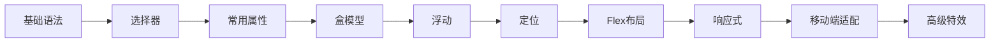

# CSS 知识地图

## 学习路径



## 笔记列表

| # | 笔记 | 内容 | 状态 |
|---|------|------|------|
| 1 | [[01 CSS-基础语法]] | CSS简介、三种引入方式、语法规范、三大特性（层叠/继承/优先级） | 稳定 |
| 2 | [[02 CSS-选择器]] | 基本/复合选择器、伪类、伪元素、权重计算 | 稳定 |
| 3 | [[03 CSS-常用属性]] | 像素、颜色、字体、文本、列表、表格、背景、鼠标、垂直对齐 | 稳定 |
| 4 | [[04 CSS-盒模型]] | 显示模式、content/padding/border/margin、圆角、阴影 | 稳定 |
| 5 | [[05 CSS-处理细节]] | 溢出、隐藏、继承、默认样式、空白问题 | 稳定 |
| 6 | [[06 CSS-浮动]] | 浮动特点、清除浮动、布局练习 | 稳定 |
| 7 | [[07 CSS-定位]] | 相对/绝对/固定/粘性定位、层级、居中方案 | 稳定 |
| 8 | [[08 CSS-布局与工具]] | 版心、重置样式表、Emmet、Pxcook、精灵图、字体图标 | 稳定 |
| 9 | [[09 CSS-CSS3新增特性]] | 私有前缀、新长度单位、盒模型/背景/边框/文本增强属性、渐变、Web字体、2D/3D变换、过渡/动画详表、媒体查询 | 稳定 |
| 10 | [[10 CSS-Flex弹性布局]] | 容器/项目属性、主轴/侧轴、flex复合值、居中 | 稳定 |
| 11 | [[11 CSS-多列布局与BFC]] | 多列布局、BFC概念与创建方式 | 稳定 |
| 12 | [[12 CSS高级特效]] | 平面/空间转换、渐变、动画、过渡、综合案例 | 稳定 |
| 13 | [[13 移动端适配]] | rem/vw适配方案、Less预处理器、综合案例 | 稳定 |
| 14 | [[14 响应式]] | 媒体查询、Bootstrap框架、栅格系统 | 稳定 |

## 核心原则

- **结构与样式分离**：CSS 控制表现，HTML 控制结构
- **层叠**：多个样式规则按权重和顺序层叠生效
- **继承**：部分样式自动从父元素继承

## 相关资源

- [MDN CSS 文档](https://developer.mozilla.org/zh-CN/docs/Web/CSS)
- [W3School CSS 教程](https://www.w3school.com.cn/css/)
- [CSS Tricks](https://css-tricks.com/)

## 预处理器与工具

| 工具 | 说明 | 状态 |
|------|------|------|
| [[CSS 预处理器]] | LESS vs SASS 对比概览 | 稳定 |
| [[SCSS_SASS_深度指南]] | SCSS 深度使用手册（变量/嵌套/函数/模块化） | 稳定 |
| [[UnoCSS基本使用详解]] | 原子化 CSS 工具，按需生成样式类 | 稳定 |

```dataview
TABLE summary, status, updated
FROM "KnowledgeBase/03-Knowledge/10-IT技术-IT_Technology/03-前端开发/01 前端基础/01 HTML与CSS"
WHERE contains(tags, "CSS") AND file.name != "CSS-MOC"
SORT file.name ASC
```
