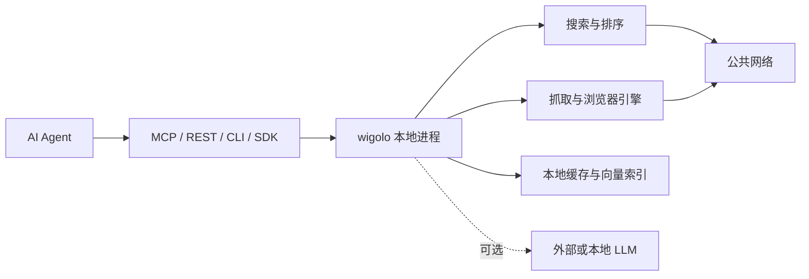

# wigolo 本地优先的 Agent 网络智能层

## 基本信息

**类型：** Agent Web Intelligence / MCP 服务  
**项目地址：** https://github.com/KnockOutEZ/wigolo  
**文档：** https://knockoutez.github.io/wigolo/docs  
**运行环境：** Node.js 20 或更高版本  
**许可证：** AGPL-3.0-only  
**项目状态：** Public Beta

> [!abstract] 一句话说明
> wigolo 把网络搜索、网页读取、站点爬取、结构化抽取和研究工作流封装成统一的本地服务，让 Codex、Claude Code、Cursor 等 Agent 通过 MCP 直接调用。

## 解决的问题

AI Agent 经常需要调用多个独立服务完成网络任务：先搜索，再抓取页面，随后清洗正文、提取数据、缓存结果，最后由模型综合答案。wigolo 将这些环节合并为一个本地优先的工具层：

- 核心检索和网页处理功能不要求第三方搜索 API Key。
- 排序、嵌入、缓存和配置主要保存在本地。
- MCP、REST、CLI 与 SDK 共用同一套能力。
- 搜索结果附带来源片段、引用标识、位置与评分信息，方便 Agent 判断证据质量。

## 核心工具

| 工具 | 用途 |
|---|---|
| `search` | 多搜索引擎并行检索、结果融合、重排和评分 |
| `fetch` | 读取单个 URL，必要时从普通 HTTP 升级到浏览器引擎 |
| `crawl` | 按 BFS、DFS 或 Sitemap 爬取多个页面 |
| `extract` | 提取表格、元数据、JSON-LD 或自定义 JSON Schema |
| `cache` | 检索本地已访问内容、查看统计和检测变化 |
| `find_similar` | 根据 URL 或概念寻找相似页面 |
| `research` | 拆分问题、并行检索、抓取来源并生成带引用的研究结果 |
| `agent` | 按计划、搜索、抓取、抽取、综合的循环自主收集信息 |
| `diff` / `watch` | 比较网页变化并按需向 Webhook 推送更新 |

## 快速安装

wigolo 需要 Node.js 20 及以上版本，并建议预留约 1.5 GB 磁盘空间，用于浏览器引擎和本地模型。

### 初始化本地引擎

```bash
npx wigolo init
```

初始化过程会下载所需组件、执行健康检查并报告各组件状态。

### 同时接入常用 Agent

```bash
npx wigolo init --agents=codex,claude-code,cursor
```

官方列出的可自动配置客户端包括：

- Claude Code
- Cursor
- Codex
- Gemini CLI
- VS Code
- Windsurf
- Zed
- Antigravity

其他 MCP 客户端可将以下命令注册为 stdio MCP 服务：

```bash
npx -y wigolo
```

### 检查运行状态

```bash
npx wigolo doctor
```

修复常见问题：

```bash
npx wigolo doctor --fix
```

## 使用方式

### CLI 搜索

```bash
wigolo search "local-first AI agent" --json
```

### 启动 REST 与远程 MCP 服务

```bash
wigolo serve
```

默认监听 `127.0.0.1:3333`。调用搜索接口：

```bash
curl -X POST http://127.0.0.1:3333/v1/search \
  -H "Content-Type: application/json" \
  -d '{"query":"local-first software","max_results":5}'
```

服务绑定到非回环地址时必须配置 Bearer Token，默认采用失败关闭策略。

### Docker

作为 stdio MCP 服务运行：

```bash
docker run -i --rm \
  -v wigolo-data:/data \
  ghcr.io/knockoutez/wigolo
```

作为 HTTP 服务运行：

```bash
docker run -p 3333:3333 \
  -v wigolo-data:/data \
  -e WIGOLO_API_TOKEN="替换为高强度随机令牌" \
  ghcr.io/knockoutez/wigolo serve --host 0.0.0.0
```

## LLM 配置

`search`、`fetch`、`crawl`、`extract`、`cache` 和 `find_similar` 的核心能力可以不配置 LLM API Key。

`research`、`agent` 和 `search format=answer` 需要 LLM 才能直接生成综合答案；未配置时会返回原始简报与证据，由宿主 Agent 自行综合。可选供应商包括 Gemini、Anthropic、OpenAI、Groq、Ollama 及 OpenAI 兼容接口。

使用本地 Ollama：

```bash
export WIGOLO_LLM_PROVIDER=ollama
```

使用云端模型时，应按对应供应商配置 API Key，并评估检索内容被发送到外部模型服务的风险。

## 工作原理



- 搜索层并行访问多个引擎，融合结果后使用本地模型重排。
- 抓取层根据页面信号，在普通 HTTP 与浏览器引擎之间逐级升级。
- 已访问内容、向量、模型和配置保存在 `~/.wigolo/`。
- LLM 主要用于研究结果的判断与综合，可选择不启用或改用本地模型。

## 落地案例

### 案例一：Codex 辅助技术选型

**目标：** 在项目引入新依赖前，让 Codex 比较候选方案的维护状态、兼容性、许可证和迁移成本，并保留可追溯来源。

**适用场景：** 数据库 ORM、消息队列、前端框架、Agent 框架等技术选型。

**实施步骤：**

1. 初始化 wigolo 并接入 Codex：

```bash
npx wigolo init --agents=codex
```

2. 在 Codex 中提出带约束的任务：

```text
使用 wigolo 调研 Prisma、Drizzle 和 Kysely。
项目技术栈是 Node.js 22、TypeScript、PostgreSQL，
重点比较类型安全、迁移能力、事务支持、维护活跃度和许可证。
只采用官方文档、官方仓库和最近一年的可靠来源，
输出决策矩阵、推荐结论、风险及引用链接。
```

3. 若需先在终端生成研究简报，可运行：

```bash
wigolo research \
  "Prisma、Drizzle 和 Kysely 在 Node.js 22 + PostgreSQL 项目中的选型比较" \
  --depth=standard \
  --max-sources=15 \
  --json
```

4. 让 Codex检查返回结果中的 `gaps`、失败来源和交叉验证信息，再形成 ADR 或项目决策笔记。

**预期产出：**

- 带来源的候选方案对比表。
- 明确的选择建议和不采用其他方案的理由。
- 尚未核实的证据缺口。
- 可写入项目文档的架构决策记录。

**验收标准：**

- 关键结论至少有一个一手来源支撑。
- 版本、许可证和兼容性结论来自官方文档或官方仓库。
- 报告明确区分已验证事实、推断和待确认事项。

### 案例二：构建本地技术文档检索库

**目标：** 将常用框架的官方文档抓取到本地缓存，让 Agent 在重复问答时优先使用已有内容，减少网络请求并提高回答一致性。

**适用场景：** 团队长期使用 Kubernetes、PostgreSQL、Next.js 等技术，需要频繁查询官方文档。

**实施步骤：**

1. 先查看站点 URL 结构，限定抓取范围和页数：

```bash
wigolo crawl https://docs.astro.build \
  --strategy=sitemap \
  --include-patterns="/en/guides/" \
  --max-pages=50 \
  --json
```

2. 从本地缓存中检索问题：

```bash
wigolo cache search "Astro content collections" --json
```

3. 根据一篇已知文档寻找相关内容：

```bash
wigolo find-similar \
  https://docs.astro.build/en/guides/content-collections/ \
  --max-results=8 \
  --json
```

4. 在 Codex 的项目指令中约定：回答内部技术问题时先查询 wigolo 缓存；缓存证据不足时再访问网络，并在结果中标记来源和抓取时间。

**预期产出：**

- 可全文与语义检索的本地文档缓存。
- Agent 回答中的原文片段、来源 URL 和引用标识。
- 重复问题更快的响应速度。
- 站点不可访问时仍可查询已缓存内容。

**验收标准：**

- 抽查的问题能命中正确的官方文档页面。
- 回答能回溯到具体 URL，而不是只给出模型结论。
- 抓取范围不包含账户、管理后台或其他敏感页面。

> [!warning] 抓取边界
> 应使用 `include_patterns`、`exclude_patterns` 和 `max_pages` 控制范围，并遵守目标站点的 robots.txt、使用条款与访问频率限制。

### 案例三：监控版本发布与关键页面变化

**目标：** 监控依赖项目的发布说明、价格页或兼容性矩阵，在内容变化后获得差异，而不是每天人工检查。

**适用场景：** 依赖版本升级、云服务价格变化、API 弃用公告、安全公告。

**实施步骤：**

1. 首次抓取页面，建立基线缓存：

```bash
wigolo fetch https://go.dev/doc/devel/release --json
```

2. 每小时检查一次页面：

```bash
wigolo watch add \
  https://go.dev/doc/devel/release \
  --interval=3600
```

3. 保持 MCP 会话运行，或启动守护进程：

```bash
wigolo serve
```

4. 查看监控任务：

```bash
wigolo watch list
```

5. 检测到变化后，让 Agent 完成后续判断：

```text
读取 wigolo 返回的页面差异：
1. 提取新增版本、发布日期和破坏性变更；
2. 判断是否影响当前项目；
3. 给出升级优先级和验证清单；
4. 不确定的信息标为待人工确认。
```

**预期产出：**

- 页面新增、删除和修改内容的差异。
- 对当前项目影响范围的摘要。
- 可执行的升级或验证清单。
- 无实质变化时不产生人工处理任务。

**验收标准：**

- 页面发生测试变更后能在设定周期内被发现。
- 动态导航、时间戳等噪声不会持续产生误报；必要时使用 `selector` 限定页面区域。
- 监控失败、反爬阻断和内容截断会被明确报告。

## 隐私与安全边界

> [!warning] “本地优先”不等于“完全离线”
> 缓存、嵌入、模型和配置主要存储在本机，但搜索和抓取仍会访问公共搜索引擎及目标网站；这些服务可能看到来源 IP、查询参数和常规网络元数据。启用云端 LLM 后，提交给模型综合的内容还会受对应供应商的数据策略约束。

- 只在回环地址使用时风险较低；开放到局域网或公网必须配置强随机 Token，并结合防火墙或反向代理。
- 网页内容属于不可信输入，宿主 Agent 仍需防范提示词注入和恶意页面内容。
- 本地缓存可能包含浏览过的敏感信息，应保护 `~/.wigolo/` 的文件权限和备份。
- 爬取时需遵守目标网站条款、robots.txt、版权和适用法律。
- 项目仍处于 Public Beta，不宜未经评估直接用于关键生产流程。

## 适用场景

- 为 Codex、Claude Code、Cursor 等编码 Agent 增加统一的网络检索能力。
- 自托管 Agent 需要避免按查询计费的搜索 API。
- RAG 或研究工作流需要保留可复用的本地网页缓存。
- 需要同时使用搜索、抓取、结构化抽取和站点爬取。
- 通过 REST 或 SDK 向 LangChain、CrewAI、LlamaIndex、n8n 等系统提供网络工具。

## 评价

**优点：**

- Web 工具面较完整，减少拼接多个搜索与抓取服务的工作量。
- 支持 MCP、REST、CLI、TypeScript/Python SDK 和多个 Agent 框架。
- 核心工具可在不申请搜索 API Key 的情况下运行。
- 显式报告失败引擎、陈旧缓存、截断和反爬挑战，便于 Agent 判断结果可信度。

**局限：**

- 初始化需要 Node.js 20+ 和约 1.5 GB 磁盘空间。
- 搜索质量和稳定性仍受公共搜索引擎、目标网站反爬策略及本机网络影响。
- 高质量综合报告仍需宿主模型、本地 LLM 或外部 LLM。
- AGPL-3.0 对修改后作为网络服务提供的场景有源码开放义务。
- Public Beta 阶段的接口、兼容性和运行稳定性仍可能变化。

**推荐程度：** ★★★★☆  
**是否值得长期保留：** 值得持续观察，适合希望自托管 Agent 网络能力并控制按次成本的用户。

## 相关导航

- [[Github优质项目-MOC]]
- [[AI工具链与Agent实践-MOC]]
