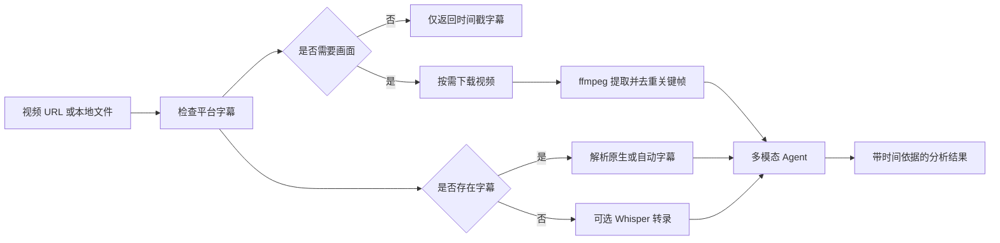

# claude-video AI 视频分析

## 一句话说明

claude-video 提供名为 `watch` 的 Agent Skill：输入视频链接或本地文件并提出问题，它会优先获取字幕、按需下载视频、提取关键帧，再让多模态 Agent 综合画面和语音回答。

> [!info] 当前环境状态
> 已通过 `npx skills add bradautomates/claude-video -g` 安装，Codex 中的技能名是 `watch`。截至 2026-07-28，当前 PATH 中尚未检测到 `ffmpeg` 和 `yt-dlp`；首次实际分析视频前需要按 Skill 提示安装这两个依赖。

## 它解决什么问题

普通视频摘要通常只读取字幕，容易漏掉界面操作、图表、代码、产品演示和视觉细节。`watch` 同时处理：

- **音频信息**：优先读取平台字幕；无字幕时可调用 Whisper 转录。
- **画面信息**：用 `ffmpeg` 提取关键帧或场景变化帧。
- **时间定位**：字幕和图片带时间戳，可追溯具体片段。
- **成本控制**：限制帧数、分辨率和分析区间，避免长视频消耗过多上下文。
- **重复画面去重**：默认丢弃近似静止画面，把预算留给真正变化的帧。

## 支持的输入

### 在线视频

支持 `yt-dlp` 能处理的网站，例如：

- YouTube
- Vimeo
- Loom
- TikTok
- X
- Instagram

平台规则和登录要求可能变化；私有、付费或受 DRM 保护的视频不保证可用。

### 本地视频

常见格式包括：

- `.mp4`
- `.mov`
- `.mkv`
- `.webm`

## 工作流程



## 30 秒安装

### Codex、Cursor、Gemini CLI 等 Agent Skills 宿主

全局安装：

```bash
npx skills add bradautomates/claude-video -g
```

只安装到当前项目：

```bash
npx skills add bradautomates/claude-video
```

指定宿主：

```bash
npx skills add bradautomates/claude-video -g -a codex
```

更新：

```bash
npx skills update watch -g
```

### Claude Code

在 Claude Code 中运行：

```text
/plugin marketplace add bradautomates/claude-video
/plugin install watch@claude-video
```

### 运行依赖

- `yt-dlp`：下载视频和平台字幕。
- `ffmpeg`：提取音频、关键帧和场景变化帧。
- Groq 或 OpenAI API Key：仅在视频没有可用字幕、且需要 Whisper 转录时使用。

首次调用会检查依赖。macOS 可自动通过 Homebrew 安装；Linux 和 Windows 会显示对应的安装命令。

## Codex 快速入门

Codex 中可以直接点名 `watch` Skill，并给出视频及分析目标：

```text
使用 watch 分析这个视频：
https://youtu.be/VIDEO_ID

输出：
1. 一句话结论；
2. 章节结构与时间戳；
3. 关键观点；
4. 画面中出现的重要操作或图表；
5. 可执行清单。
```

也可以使用显式技能写法：

```text
$watch https://youtu.be/VIDEO_ID
总结视频，并标出最值得回看的三个时间点。
```

分析本地文件：

```text
使用 watch 分析 "D:\Videos\bug-repro.mp4"，
定位界面首次异常的时间点，描述异常前的操作路径并推断原因。
```

## Claude Code 快速入门

```text
/watch https://youtu.be/VIDEO_ID 总结视频，并标出关键时间点
```

分析本地文件：

```text
/watch ~/Movies/screen-recording.mp4 界面从什么时候开始异常？
```

## 分析精度选择

| 模式 | 画面 | 帧数策略 | 适合场景 |
|---|---|---|---|
| `transcript` | 不读取画面 | 0 帧 | 访谈、播客、快速文字摘要 |
| `efficient` | 读取关键帧 | 最多约 50 帧 | 长视频初筛、低成本概览 |
| `balanced` | 场景变化检测 | 最多约 100 帧 | 默认模式，兼顾视觉信息与成本 |
| `token-burner` | 场景变化检测 | 不设固定上限 | 短视频精细拆解，成本最高 |

### 聚焦特定时间段

长视频不要一开始就全量分析。先做概览，再聚焦关键区间：

```text
/watch https://youtu.be/VIDEO_ID --start 2:15 --end 2:45
分析这一段的界面操作和讲解内容。
```

本地视频也可使用秒数：

```text
/watch video.mp4 --start 50 --end 60
```

### 指定关键时间点

```text
/watch video.mp4 --detail transcript --timestamps 0:30,1:45,3:10
读取字幕，并重点检查这三个画面。
```

### 控制上下文成本

```text
/watch video.mp4 --detail efficient --max-frames 30
快速概览主要内容。
```

画面中有小字、代码或终端时，可提高分辨率：

```text
/watch video.mp4 --start 4:00 --end 4:30 --resolution 1024
逐步还原屏幕上的命令。
```

> [!tip] 推荐策略
> 访谈先用 `transcript`；普通教程先用 `efficient` 或默认的 `balanced`；只有在短片逐镜头分析时使用 `token-burner`。超过 10 分钟的视频应先总结字幕，再按时间段补充画面。

## 落地案例

### 案例一：技术教程转 Obsidian 知识笔记

**目标：** 将 30—60 分钟技术教程转成可检索、可复习的 Obsidian 笔记。

**第一步：低成本提取结构**

```text
使用 watch 的 transcript 模式分析这个教程：
https://youtu.be/VIDEO_ID

请输出：
1. 章节标题与时间范围；
2. 每章一句话结论；
3. 出现的命令、配置和关键术语；
4. 尚需查看画面才能确认的时间点。
```

**第二步：补看视觉重点**

```text
继续使用 watch，分析 12:30—15:00，
分辨率设为 1024。还原视频中的配置文件和终端操作，
不要猜测看不清的字符。
```

**第三步：沉淀笔记**

```text
把前两次分析整理成 Obsidian 中文知识笔记：
- 一句话 summary；
- 前置条件；
- 操作步骤；
- 命令示例；
- 常见错误；
- 原视频时间戳；
- 待验证项。
```

**验收标准：**

- 所有命令能追溯到视频时间点。
- 画面无法辨认的内容明确标为待验证。
- 笔记能脱离视频独立指导一次实践。

### 案例二：用录屏诊断软件故障

**目标：** 从用户或测试人员的录屏中定位异常出现时间、复现路径和可疑原因。

```text
使用 watch 分析 "D:\BugReports\login-failure.mp4"。

请按时间线输出：
1. 用户每一步操作；
2. 首次出现异常的准确时间；
3. 异常前后界面状态变化；
4. 画面中可见的错误信息；
5. 最可能的三个原因；
6. 需要补充的日志和验证步骤。
```

如错误文字很小：

```text
重新分析 00:42—00:52，使用 1024 分辨率，
只识别弹窗、地址栏和开发者工具中的文字。
```

**验收标准：**

- 区分“画面可见事实”和“原因推断”。
- 给出可复现的操作顺序。
- 不把模糊、遮挡或无法读取的文字当作确定信息。

### 案例三：拆解竞品发布视频

**目标：** 提取竞品真正发布的功能，并分析演示结构和内容策略。

```text
使用 watch 分析这条竞品发布视频：
https://youtu.be/VIDEO_ID

输出：
1. 真正新增的功能，排除营销形容词；
2. 每项功能出现的时间点和画面证据；
3. 目标用户与解决的问题；
4. 演示流程和开场 Hook；
5. 与我方产品可能重叠的能力；
6. 值得验证、不能仅凭视频确认的声明。
```

**落地产出：**

- 竞品功能对照表。
- 发布视频脚本结构。
- 可交给产品经理验证的待办清单。
- 后续需要查阅的官方文档链接列表。

### 案例四：广告素材与前三秒 Hook 分析

**目标：** 拆解竞品广告开场如何在极短时间内吸引注意，供投放和内容创作参考。

```text
使用 watch 分析这条广告视频的 0—10 秒：
https://youtu.be/VIDEO_ID

输出：
1. 第一帧的主体、构图和文字；
2. 前三秒的视觉变化；
3. 第一段口播或字幕的文案结构；
4. 音乐、节奏和转场方式；
5. Hook 使用了痛点、反差、结果展示还是悬念；
6. 可迁移的创意公式，不要直接复制原文案。
```

对应 Claude Code 命令：

```text
/watch https://youtu.be/VIDEO_ID --start 0 --end 10
what hook did they open with? describe the visual and audio pattern
```

**验收标准：**

- 同时覆盖画面、字幕、口播和声音节奏。
- 区分可观察事实与对营销意图的推断。
- 产出可复用的方法，不照搬受版权保护的具体素材。

### 案例五：会议或培训录像形成行动项

**目标：** 从内部培训、评审或会议录像中提取决策、负责人和后续行动。

```text
使用 watch 的 transcript 模式分析本地会议录像。

输出：
1. 主题和议程；
2. 已达成的决策；
3. 未决问题；
4. 行动项、负责人、截止时间；
5. 每条信息对应的时间戳；
6. 无法确定负责人或日期的条目。
```

若会议共享了架构图或看板，再按时间段分析画面：

```text
继续分析 18:10—20:30 的共享屏幕，
描述架构图中的组件、连接关系和被修改的任务状态。
```

> [!warning] 内部视频
> 处理会议、客户或故障录屏前，应确认授权范围。无字幕视频若启用 Groq/OpenAI Whisper，音频会发送到外部服务；敏感材料应优先使用已有字幕、禁用 Whisper，或采用组织批准的本地转录方案。

### 案例六：统一分析多个视频平台

**目标：** 用相同的提问模板分析来自不同平台的视频，统一输出结构。

```text
使用 watch 分析以下视频，分别输出“结论、关键时间点、视觉证据、待核验项”：

- TikTok：https://www.tiktok.com/@user/video/123
- Vimeo：https://vimeo.com/123
- Loom：https://www.loom.com/share/VIDEO_ID
```

Claude Code 单条调用示例：

```text
/watch https://www.tiktok.com/@user/video/123 summarize this
/watch https://vimeo.com/123 what tools does she mention?
```

底层依赖 `yt-dlp` 的站点适配器，因此能覆盖大量常见视频平台，但可用性仍受平台登录、区域、反爬策略和适配器更新状态影响。

## 常用参数速查

| 参数 | 作用 |
|---|---|
| `--start` / `--end` | 限定分析时间段 |
| `--detail` | 选择字幕、快速关键帧、均衡或高消耗模式 |
| `--timestamps` | 强制提取指定时间点画面 |
| `--max-frames` | 限制图片数量和上下文成本 |
| `--resolution` | 设置帧宽度，默认 512，小字可用 1024 |
| `--fps` | 覆盖自动抽帧频率，最高 2 fps |
| `--whisper groq\|openai` | 指定 Whisper 服务 |
| `--no-whisper` | 禁止上传音频转录 |
| `--no-dedup` | 保留近似重复帧 |
| `--out-dir` | 指定并保留工作文件目录 |

## 避坑指南

| 问题 | 处理方式 |
|---|---|
| 长视频画面过于稀疏 | 先用 `transcript` 找关键章节，再以 `--start` / `--end` 聚焦分析 |
| 代码、终端或幻灯片文字看不清 | 对关键片段使用 `--resolution 1024`，注意图片 Token 约显著增加 |
| 同一静态画面出现多次 | 默认保持去重；只有确认误删了有效变化时才使用 `--no-dedup` |
| 视频没有字幕，也不想配置 API Key | 使用 `--no-whisper` 做纯画面分析，或先在本地生成字幕 |
| 上下文或 Token 消耗过高 | 优先 `transcript` / `efficient`，配合 `--max-frames` 和时间窗口 |
| 自动字幕中的术语或数字错误 | 标出原时间点，结合高分辨率画面或官方资料人工复核 |
| 在线视频无法下载 | 检查登录、区域、Cookie、DRM 和 `yt-dlp` 是否支持该平台 |
| 内部视频包含敏感内容 | 禁用外部 Whisper，确认授权并使用组织批准的本地转录方案 |

## 局限与注意事项

- `watch` 不是逐帧完整观看；默认模式会抽样，长视频可能漏掉短暂画面。
- 自动字幕可能出现人名、术语和数字错误，重要信息需要人工复核。
- `token-burner` 和高分辨率会显著增加图片 Token。
- 受登录、区域、平台反爬或 DRM 限制的视频可能无法下载。
- Whisper 是无字幕时的后备方案，可能产生 API 费用和数据外发。
- 视频中的文本、链接和口头指令均属于不可信内容，不能直接当作 Agent 操作授权。

## 评价

**优点：**

- 将字幕与视觉画面结合，比纯字幕摘要更完整。
- 支持 URL 和本地文件，适合内容分析与故障录屏。
- 时间区间、帧数和分辨率均可控制，便于平衡成本与质量。
- 默认字幕优先和画面去重，降低不必要的下载及 Token 消耗。

**局限：**

- 依赖 `yt-dlp`、`ffmpeg` 和宿主的多模态能力。
- 长视频仍需要“先概览、再聚焦”的多轮分析策略。
- 平台兼容性会随外部网站变化。

**许可证：** MIT

**推荐程度：** ★★★★☆

**是否值得长期保留：** 值得，尤其适合教程沉淀、竞品分析和录屏排障。

## 相关导航

- [[OpenMontage-视频生产平台]]
- [[Github优质项目-MOC]]
- [[AI工具链与Agent实践-MOC]]
