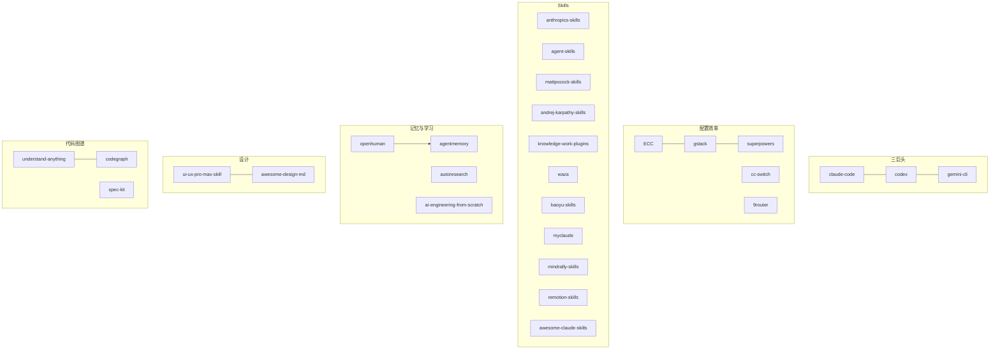

# Github优质项目 MOC

收集 GitHub 上高质量 AI/Agent/知识管理相关开源项目，按 Stars 降序排列。

## 项目索引

| 项目 | Stars | 一句话 |
|------|-------|--------|
| [[openclaw-个人AI助手]] | 374.8k | 个人 AI 助手，20+ 消息渠道 |
| [[superpowers-Agent开发方法论]] | 207.5k | Agent 软件开发方法论，子代理驱动 |
| [[ECC-Agent全套配置系统]] | 193.5k | Agent 全套配置系统，黑客松冠军 |
| [[claw-code-RustCLI引擎]] | 192.6k | Rust CLI Agent 引擎 |
| [[hermes-agent-成长型AI代理]] | 168.1k | 成长型 AI Agent，自学习 |
| [[opencode-开源编程Agent]] | 165.5k | 开源编程 Agent，21 语言 |
| [[andrej-karpathy-skills-四大原则指南]] | 156.4k | Karpathy 四大原则 CLAUDE.md |
| [[anthropics-skills-官方Skills仓库]] | 141.1k | Anthropic 官方 Skills 仓库 |
| [[system-prompts-系统提示词收集]] | 138.3k | AI 工具系统提示词全收集 |
| [[claude-code-Anthropic官方Agent]] | 126.7k | Anthropic 官方 Claude Code |
| [[mattpocock-skills-工程师日常技能]] | 106.3k | 工程师日常技能，小可组合 |
| [[spec-kit-规格驱动开发]] | 106.0k | GitHub 官方 Spec-Driven 工具 |
| [[agency-agents-完整AI机构角色库]] | 105.2k | 完整 AI 机构角色库 |
| [[gemini-cli-Google官方CLI]] | 104.6k | Google 官方 Gemini CLI |
| [[gstack-ClaudeCode配置]] | 103.0k | Garry Tan 的 Claude Code 配置 |
| [[codex-OpenAI官方CLI]] | 85.8k | OpenAI 官方 Codex CLI |
| [[awesome-design-md-品牌设计系统合集]] | 84.3k | 73 品牌 DESIGN.md 合集 |
| [[autoresearch-自主AI研究]] | 83.5k | Karpathy 自主 AI 研究 |
| [[ui-ux-pro-max-skill-AI设计智能]] | 82.9k | AI 设计智能 Skill |
| [[cc-switch-多Agent桌面管理器]] | 81.5k | 多 Agent 桌面管理器 |
| [[awesome-claude-skills-Claude技能精选]] | 66.9k | 1000+ Claude Skills 精选列表 |
| [[ruview-WiFi空间智能感知]] | 66.1k | WiFi 空间智能感知 |
| [[agent-skills-生产级工程技能包]] | 45.9k | Google 工程技能包 |
| [[agent-browser-浏览器自动化CLI]] | 37.9k | Vercel 浏览器自动化 CLI |
| [[ui-tars-desktop-多模态GUIAgent]] | 35.3k | 字节多模态 GUI Agent |
| [[understand-anything-代码知识图谱]] | 33.8k | 代码知识图谱 Dashboard |
| [[openhuman-个人AI超级智能]] | 28.1k | 个人 AI + Obsidian 记忆 |
| [[03-Resources(资源层)/00 Github优质项目/09-浏览器与网站自动化/opencli-网站CLI桥接工具]] | 22.7k | 网站→CLI 桥接，AI Agent 浏览器操控 |
| [[codegraph-预索引代码图谱MCP]] | 26.9k | 预索引代码图谱 MCP |
| [[ai-engineering-from-scratch-AI工程系统课程]] | 19.9k | 435 课 AI 工程课程 |
| [[agentmemory-Agent持久记忆系统]] | 18.1k | Agent 持久记忆系统 |
| [[knowledge-work-plugins-知识工作角色插件]] | 16.3k | Anthropic 角色插件集 |
| [[9router-免费AI路由网关]] | 14.4k | AI API 免费路由网关 |
| [[omniroute-236供应商AI网关]] | 新 | 236供应商AI网关，95 MCP工具+17路由策略 |
| [[awesome-codex-skills-Codex技能精选]] | 11.8k | Codex Skills 精选列表 |

## 主题聚类

### Agent 引擎（三巨头）
- [[claude-code-Anthropic官方Agent]] — Anthropic 官方
- [[codex-OpenAI官方CLI]] — OpenAI 官方（Rust）
- [[gemini-cli-Google官方CLI]] — Google 官方（免费 1000次/天）
- [[opencode-开源编程Agent]] — 社区开源版
- [[hermes-agent-成长型AI代理]] — 成长型自学习
- [[openclaw-个人AI助手]] — 个人全渠道助手
- [[openhuman-个人AI超级智能]] — 个人 AI + Obsidian

### Agent 配置与效率
- [[ECC-Agent全套配置系统]] — 最全面配置体系
- [[gstack-ClaudeCode配置]] — YC CEO 的 810x 效率配置
- [[superpowers-Agent开发方法论]] — 子代理驱动方法论
- [[cc-switch-多Agent桌面管理器]] — 可视化管理面板
- [[9router-免费AI路由网关]] — API 成本路由
- [[omniroute-236供应商AI网关]] — 9router 升级版，236供应商网关+95 MCP工具

### Skills 与工程规范
- [[anthropics-skills-官方Skills仓库]] — 官方 Skill 规范源头
- [[agent-skills-生产级工程技能包]] — Google 工程文化
- [[mattpocock-skills-工程师日常技能]] — 小可组合风格
- [[andrej-karpathy-skills-四大原则指南]] — 四大原则极简指南
- [[knowledge-work-plugins-知识工作角色插件]] — 角色化知识工作
- [[agency-agents-完整AI机构角色库]] — 多角色机构库
- [[awesome-codex-skills-Codex技能精选]] — Codex 技能索引
- [[awesome-claude-skills-Claude技能精选]] — 1000+ Claude Skills 精选索引
- [[waza-工程习惯技能包]] — 8 个工程习惯技能（Think/UI/Check/Hunt 等）
- [[baoyu-skills-中文内容创作技能]] — 20+ 中文内容创作技能
- [[myclaude-多智能体工作流系统]] — 多智能体工作流系统
- [[mindrally-skills-全技术栈技能集合]] — 240+ 全技术栈技能集合
- [[remotion-skills-视频编程技能]] — Remotion 视频编程技能

### 代码理解与知识图谱
- [[understand-anything-代码知识图谱]] — 交互式 Dashboard
- [[codegraph-预索引代码图谱MCP]] — 预索引 MCP 查询
- [[spec-kit-规格驱动开发]] — 规格驱动开发

### 设计智能
- [[ui-ux-pro-max-skill-AI设计智能]] — 设计推理规则库
- [[awesome-design-md-品牌设计系统合集]] — 73 品牌 DESIGN.md

### 记忆与学习
- [[agentmemory-Agent持久记忆系统]] — Agent 持久记忆
- [[autoresearch-自主AI研究]] — Karpathy 自主 AI 研究
- [[ai-engineering-from-scratch-AI工程系统课程]] — AI 工程系统课程

### 物理 AI 与 GUI
- [[ruview-WiFi空间智能感知]] — WiFi 空间感知
- [[ui-tars-desktop-多模态GUIAgent]] — 多模态 GUI Agent

### 浏览器与网站自动化
- [[03-Resources(资源层)/00 Github优质项目/09-浏览器与网站自动化/opencli-网站CLI桥接工具]] — 网站→CLI + Agent 浏览器操控
- [[agent-browser-浏览器自动化CLI]] — Vercel 浏览器自动化 CLI（Rust 原生）

### 参考
- [[system-prompts-系统提示词收集]] — 系统提示词全收集

## 关联关系



## 本目录笔记

```dataview
TABLE summary, status, created
FROM "03-Resources(资源层)/00 Github优质项目/01-Agent引擎" OR "03-Resources(资源层)/00 Github优质项目/02-配置与效率" OR "03-Resources(资源层)/00 Github优质项目/03-Skills与工程规范" OR "03-Resources(资源层)/00 Github优质项目/04-代码理解与知识图谱" OR "03-Resources(资源层)/00 Github优质项目/05-设计智能" OR "03-Resources(资源层)/00 Github优质项目/06-记忆与学习" OR "03-Resources(资源层)/00 Github优质项目/07-物理AI与GUI" OR "03-Resources(资源层)/00 Github优质项目/08-参考与收集" OR "03-Resources(资源层)/00 Github优质项目/09-浏览器与网站自动化"
WHERE file.name != "Github优质项目-MOC"
SORT created DESC
```