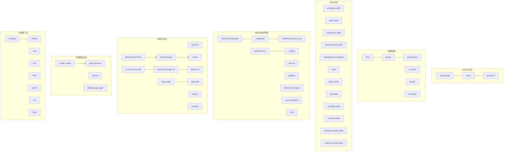

# Github优质项目 MOC

收集 GitHub 上高质量开源项目，按**适用场景**分类，兼顾热度与实用性。

> 📌 **更新日志（2026-07-15 V2）**：从日/周/月 GitHub Trending 新增 33 个项目，更新全部星数至最新数据。项目总数：**103 个**。

---

## 目录

- [01 Agent引擎](#01-agent引擎)
- [02 Agent配置与效率](#02-agent配置与效率)
- [03 Skills与工程规范](#03-skills与工程规范)
- [04 代码与知识管理](#04-代码与知识管理)
- [05 视频与创作设计](#05-视频与创作设计)
- [06 浏览器与自动化](#06-浏览器与自动化)
- [07 量化与交易](#07-量化与交易)
- [08 安全隐私与系统工具](#08-安全隐私与系统工具)
- [09 开发者工具与基础设施](#09-开发者工具与基础设施)
- [10 参考与收集](#10-参考与收集)

---

## 01 Agent引擎

AI 编码代理 / CLI Agent 的"发动机"——主流供应商官方实现及社区明星。

| 项目 | Stars | 一句话 | 入门友好 |
|------|-------|--------|----------|
| [[openclaw-个人AI助手]] | 374k | 个人 AI 助手，20+ 消息渠道 | ⭐⭐ |
| [[claw-code-RustCLI引擎]] | 192k | Rust CLI Agent 引擎 | ⭐ |
| [[hermes-agent-成长型AI代理]] | 168k | 成长型 AI Agent，自学习 | ⭐⭐ |
| [[opencode-开源编程Agent]] | 165k | 开源编程 Agent，21 语言 | ⭐⭐ |
| [[claude-code-Anthropic官方Agent]] | 126k | Anthropic 官方 Claude Code | ⭐⭐⭐ |
| [[gemini-cli-Google官方CLI]] | 104k | Google 官方 Gemini CLI（免费1000次/天） | ⭐⭐⭐ |
| [[codex-OpenAI官方CLI]] | 85k | OpenAI 官方 Codex CLI | ⭐⭐ |
| [[openhuman-个人AI超级智能]] | 28k | 个人 AI + Obsidian 记忆 | ⭐⭐ |
| [[codex-plugin-cc\|Codex Plugin for CC]] | 28k | 将 Codex 嵌入 Claude Code 工作流 | ⭐⭐ |
| [[oh-my-pi-编码代理]] | 15k | IDE 级本地编码代理，LSP/DAP 集成 | ⭐⭐ |

## 02 Agent配置与效率

让 Agent 运行更高效、更可控的配置管理、路由网关和多 Agent 管理工具。

| 项目 | Stars | 一句话 | 入门友好 |
|------|-------|--------|----------|
| [[superpowers-Agent开发方法论]] | 207k | 子代理驱动开发方法论 | ⭐⭐ |
| [[ECC-Agent全套配置系统]] | 193k | Agent 全套配置体系，黑客松冠军 | ⭐⭐ |
| [[gstack-ClaudeCode配置]] | 103k | YC CEO 的 810x 效率配置 | ⭐ |
| [[cc-switch-多Agent桌面管理器]] | 81k | 多 Agent 可视化管理面板 | ⭐⭐⭐ |
| [[omniroute-236供应商AI网关]] | 17k | 236供应商AI网关+95 MCP工具+17路由策略 | ⭐⭐ |
| [[9router-免费AI路由网关]] | 14k | AI API 免费路由网关，40+供应商 | ⭐⭐⭐ |

## 03 Skills与工程规范

一切与 Skills 生态、工程规范、角色库相关的项目——AI 能力的"可组合模块"。

| 项目 | Stars | 一句话 | 入门友好 |
|------|-------|--------|----------|
| [[mattpocock-skills-工程师日常技能]] | 170k | 工程师日常可组合技能集 | ⭐⭐⭐ |
| [[andrej-karpathy-skills-四大原则指南]] | 156k | Karpathy 四大原则 CLAUDE.md | ⭐⭐ |
| [[anthropics-skills-官方Skills仓库]] | 141k | Anthropic 官方 Skills 仓库 | ⭐⭐⭐ |
| [[agency-agents-完整AI机构角色库]] | 105k | 完整 AI 机构角色库 | ⭐⭐ |
| [[awesome-claude-skills-Claude技能精选]] | 66k | 1000+ Claude Skills 精选 | ⭐⭐ |
| [[agent-skills-生产级工程技能包]] | 45k | Google 工程文化技能包 | ⭐⭐ |
| [[knowledge-work-plugins-知识工作角色插件]] | 16k | Anthropic 官方角色插件集 | ⭐⭐⭐ |
| [[awesome-codex-skills-Codex技能精选]] | 11k | Codex Skills 精选列表 | ⭐⭐ |
| [[myclaude-多智能体工作流系统]] | — | 多智能体工作流系统 | ⭐⭐ |
| [[waza-工程习惯技能包]] | — | 8 个工程习惯技能包 | ⭐⭐⭐ |
| [[mindrally-skills-全技术栈技能集合]] | — | 240+ 全技术栈技能集合 | ⭐⭐ |
| [[baoyu-skills-中文内容创作技能]] | — | 20+ 中文内容创作技能 | ⭐⭐⭐ |
| [[remotion-skills-视频编程技能]] | — | Remotion 视频编程技能 | ⭐⭐ |

## 04 代码与知识管理

代码理解、知识图谱、持久记忆、LLM 应用示例——提高开发效率和知识管理能力的工具。

| 项目 | Stars | 一句话 | 入门友好 |
|------|-------|--------|----------|
| [[free-programming-books]] | 392k | 5000+ 免费编程书籍汇总（入口在10类） | ⭐⭐⭐ |
| [[markitdown-文档转换]] | 165k | 微软文档→Markdown 转换工具 | ⭐⭐⭐ |
| [[spec-kit-规格驱动开发]] | 120k | GitHub 官方规格驱动开发工具包 | ⭐ |
| [[awesome-llm-apps]] | 120k | 100+ AI Agent 和 RAG 应用示例集 | ⭐⭐⭐ |
| [[manim-数学动画引擎]] | 88k | 3B1B 同款数学视频动画引擎 | ⭐⭐ |
| [[graphify-代码文档知识图谱]] | 86k | 代码→可遍历知识图谱，Python | ⭐⭐ |
| [[open-notebook-隐私研究笔记本]] | 34k | 隐私优先 AI 研究笔记本 | ⭐⭐⭐ |
| [[understand-anything-代码知识图谱]] | 33k | 代码知识图谱交互 Dashboard | ⭐⭐ |
| [[codebase-memory-mcp]] | 31k | 本地超快代码知识图谱 MCP 服务器 | ⭐⭐ |
| [[cognee-AI代理持久记忆]] | 27k | 向量+知识图谱持久记忆 | ⭐⭐ |
| [[ai-engineering-from-scratch-AI工程系统课程]] | 19k | 435 课 AI 工程系统课程 | ⭐⭐⭐ |
| [[codegraph-预索引代码图谱MCP]] | 26k | 预索引代码知识图谱 MCP | ⭐⭐ |
| [[zvec-向量数据库]] | 14k | 阿里出品的轻量进程内向量数据库 | ⭐⭐ |
| [[agentmemory-Agent持久记忆系统]] | 18k | Agent 持久记忆，Obsidian 导出 | ⭐⭐ |
| [[autoresearch-自主AI研究]] | 83k | Karpathy 自主 AI 研究项目 | ⭐ |
| [[knowledge-catalog\|Google Knowledge Catalog]] | 7k | Google 语义数据目录 | ⭐⭐ |
| [[tencentdb-agent-memory\|TencentDB Agent Memory]] | 8k | 腾讯分层记忆系统 | ⭐⭐ |

## 05 视频与创作设计

视频制作、UI/UX 设计、创作工具——面向内容创作者和设计师的开源工具。

| 项目 | Stars | 一句话 | 入门友好 |
|------|-------|--------|----------|
| [[MoneyPrinterTurbo-短视频\|MoneyPrinterTurbo]] | 94k | 一键生成短视频，LLM+TTS 集成 | ⭐⭐⭐ |
| [[OpenCut-开源视频编辑器]] | 69k | 开源跨平台视频编辑器，Rust 核心 | ⭐⭐⭐ |
| [[penpot-开源设计平台]] | 56k | Figma 开源替代，基于开放标准 | ⭐⭐⭐ |
| [[taste-skill-前端技能\|taste-skill 前端技能集]] | 53k | 前端技能+图像转代码管道 | ⭐⭐ |
| [[impeccable-前端设计\|impeccable 前端设计集]] | 46k | LLM 前端设计审计+优化 | ⭐⭐⭐ |
| [[voicebox-语音克隆合成]] | 36k | 本地优先语音克隆与合成工作室 | ⭐⭐ |
| [[awesome-design-md-品牌设计系统合集]] | 84k | 73 品牌 DESIGN.md 合集 | ⭐⭐⭐ |
| [[designmd-设计令牌\|design.md 设计令牌规范]] | 23k | Google 出品，设计令牌+说明合并 | ⭐⭐⭐ |
| [[ui-ux-pro-max-skill-AI设计智能]] | 82k | AI 设计智能推理规则库 | ⭐⭐⭐ |
| [[ui-tars-desktop-多模态GUIAgent]] | 35k | 字节多模态 GUI Agent | ⭐ |
| [[ruview-WiFi空间智能感知]] | 66k | WiFi 空间智能感知 | ⭐ |
| [[OpenMontage-视频生产平台]] | 38k | AI 代理驱动的视频制作平台 | ⭐ |
| [[meetily-会议转录]] | 24k | 本地 AI 会议转录，隐私优先 | ⭐⭐ |
| [[claude-video-分析\|claude-video 视频分析]] | 8k | 让 Claude 分析和理解视频 | ⭐⭐⭐ |
| [[airi-虚拟角色\|moeru/airi 虚拟角色平台]] | 41k | 自托管虚拟角色，实时语音交互 | ⭐⭐ |
| [[lingbot-map-3D重建\|lingbot-map 3D重建]] | 8k | 长序列流式 3D 重建 | ⭐ |
| [[archify-架构图\|archify 架构图生成]] | 4k | 自然语言→架构图 | ⭐⭐⭐ |

## 06 浏览器与自动化

浏览器自动化、爬虫、页内代理——让 AI 和脚本"看懂并操作"网页。

| 项目 | Stars | 一句话 | 入门友好 |
|------|-------|--------|----------|
| [[media-crawler-多平台爬虫]] | 54k | 多平台爬虫，Playwright 登录态采集 | ⭐⭐⭐ |
| [[agent-browser-浏览器自动化CLI]] | 37k | Vercel 浏览器自动化 CLI，Rust 原生 | ⭐⭐ |
| [[opencli-网站CLI桥接工具]] | 22k | 网站→CLI 桥接，AI Agent 浏览器操控 | ⭐⭐ |
| [[alibaba-page-agent]] | 26k | 单脚本嵌入的页内自然语言代理 | ⭐⭐ |
| [[ai-job-search-求职框架\|ai-job-search 求职框架]] | 22k | 全栈自动求职申请框架 | ⭐⭐ |
| [[exercises-dataset\|exercises-dataset 练习题]] | 12k | 多语言练习题数据集（入口在10类） | ⭐⭐⭐ |

## 07 量化与交易

AI 驱动的量化交易策略、股票分析看板——学习金融 AI 的实践平台。

| 项目 | Stars | 一句话 | 入门友好 |
|------|-------|--------|----------|
| [[ai-hedge-fund]] | 61k | AI 对冲基金 POC，研究教学用途 | ⭐⭐⭐ |
| [[daily-stock-analysis]] | 52k | 每日股票看板自动生成 | ⭐⭐⭐ |
| [[vibe-trading-代理交易]] | 22k | 面向量化与 LLM 驱动策略的交易平台 | ⭐⭐ |

## 08 安全隐私与系统工具

网络安全、隐私保护、系统优化、OSINT、安全技能。

| 项目 | Stars | 一句话 | 入门友好 |
|------|-------|--------|----------|
| [[Win11Debloat-系统精简]] | 51k | 一键移除 Windows 预装应用和广告 | ⭐⭐⭐ |
| [[strix-协作沙盒代理]] | 41k | 沙盒容器中运行协作式 AI 代理 | ⭐⭐ |
| [[marketingskills-营销技能\|marketingskills 营销技能集]] | 38k | 模块化营销技能供 AI 代理复用 | ⭐⭐ |
| [[anthropic-cybersec-skills\|Anthropic 安全技能集]] | 23k | 754 个生产级安全技能 | ⭐⭐ |
| [[pentagi-渗透测试\|pentagi 多Agent渗透测试]] | 20k | 自托管多Agent 渗透测试平台 | ⭐⭐ |
| [[spiderfoot-OSINT威胁情报]] | 19k | 自动化 OSINT 威胁情报映射 | ⭐⭐⭐ |
| [[simplex-chat-隐私聊天]] | 18k | 无需标识符的端到端加密聊天 | ⭐ |
| [[iroh-P2P通信]] | 11k | QUIC 基础 P2P 通信框架 | ⭐ |
| [[CubeSandbox-沙箱\|腾讯CubeSandbox]] | 10k | 高密度硬件隔离 AI 沙箱 | ⭐⭐ |
| [[destructive-command-guard]] | 4k | AI 编码代理破坏性命令实时防护 | ⭐⭐ |

## 09 开发者工具与基础设施

工作流编排、运行时、测试框架、产品分析等基础设施类工具。

| 项目 | Stars | 一句话 | 入门友好 |
|------|-------|--------|----------|
| [[bun-运行时\|Bun JS/TS 工具包]] | 94k | 全栈高性能 JS/TS 工具包 | ⭐⭐⭐ |
| [[imgui-即时GUI库]] | 74k | 即时模式 GUI 库 | ⭐⭐⭐ |
| [[apple-container\|Apple container 容器]] | 45k | Apple Silicon OCI 容器 | ⭐⭐ |
| [[posthog-产品分析]] | 35k | 开源产品分析，替代 Mixpanel | ⭐⭐⭐ |
| [[spdlog-日志库]] | 29k | 高性能 C++ 日志库 | ⭐⭐⭐ |
| [[argo-cd-GitOps\|ArgoCD GitOps]] | 23k | 声明式 GitOps CD 工具 | ⭐⭐ |
| [[prefect-工作流编排]] | 23k | Python 工作流编排框架 | ⭐⭐⭐ |
| [[catch2-Cpp测试框架]] | 21k | 轻量级 C++ 测试框架 | ⭐⭐⭐ |
| [[orca-多代理编排]] | 19k | 本地多代理 AI 编排工具 | ⭐⭐ |
| [[abseil-cpp\|Abseil C++ 工具库]] | 18k | Google C++ 公共库 | ⭐⭐ |
| [[OfficeCLI-文档工具\|OfficeCLI]] | 16k | AI 代理读写 Office 文档 | ⭐⭐ |
| [[herdr-终端多路复用]] | 16k | 终端代理感知多路复用+持久会话 | ⭐⭐ |
| [[astryx-设计系统\|facebook/astryx 设计系统]] | 9k | Meta 150+ React 组件 | ⭐⭐⭐ |
| [[DesktopCommanderMCP]] | 8k | AI 聊天→终端/文件系统 | ⭐⭐ |
| [[no-mistakes-Git代理\|no-mistakes Git 代理]] | 6k | AI 代码校验+自动修复 | ⭐⭐ |

## 10 参考与收集

资源索引、提示词收集、Agent 工具包、营销技能。

| 项目 | Stars | 一句话 | 入门友好 |
|------|-------|--------|----------|
| [[free-programming-books]] | 392k | 5000+ 免费编程书籍汇总 | ⭐⭐⭐ |
| [[system-prompts-系统提示词收集]] | 138k | 多款 AI 工具系统提示词全收集 | ⭐⭐ |
| [[system-prompts-leaks]] | 57k | AI 产品系统提示词泄露集 | ⭐⭐ |
| [[agent-reach-信息获取\|Agent-Reach 信息获取]] | 56k | AI 代理互联网读取能力 CLI 工具包 | ⭐⭐⭐ |
| [[last30days-skill\|last30days 趋势简报]] | 47k | 多来源趋势简报工具 | ⭐⭐ |
| [[hallmark-LLM设计技能]] | 6k | Claude/Cursor/Codex 设计技能包 | ⭐⭐⭐ |
| [[awesome-ai-apps\|awesome-ai-apps 精选]] | 13k | RAG/Agent/Workflow AI 用例精选 | ⭐⭐⭐ |

---

## 入门友好项目 Top 15

以下项目按 **入门友好好度 × 学习价值** 排序，适合刚接触 GitHub 开源生态的开发者：

| # | 项目 | 分类 | 推荐理由 |
|---|------|------|----------|
| 1 | [[free-programming-books]] | 参考与收集 | 5000+ 免费编程书，学什么语言都找得到 |
| 2 | [[awesome-llm-apps]] | 代码与知识管理 | 100+ LLM 应用示例，复制代码就能学 |
| 3 | [[awesome-ai-apps]] | 参考与收集 | AI 用例分类清晰，快速定位需求 |
| 4 | [[daily-stock-analysis]] | 量化与交易 | Python 量化看板，零基础也能用 |
| 5 | [[Win11Debloat-系统精简]] | 安全与系统 | PowerShell 脚本，修电脑级入门 |
| 6 | [[media-crawler-多平台爬虫]] | 浏览器与自动化 | Python 爬虫入门，配置即用 |
| 7 | [[manim-数学动画引擎]] | 视频与创作 | Python 生成数学动画，立刻看效果 |
| 8 | [[prefect-工作流编排]] | 开发者工具 | Python 装饰器编排，5 分钟上手 |
| 9 | [[posthog-产品分析]] | 开发者工具 | Docker 一键部署，good first issue 活跃 |
| 10 | [[penpot-开源设计平台]] | 视频与创作 | Figma 替代，设计师和开发者都能用 |
| 11 | [[claude-video-分析\|claude-video]] | 视频与创作 | Python 让 Claude 理解视频 |
| 12 | [[hallmark-LLM设计技能]] | 参考与收集 | 一行指令提升 AI 设计质感 |
| 13 | [[archify-架构图\|archify]] | 视频与创作 | 自然语言生成架构图 |
| 14 | [[exercises-dataset\|exercises-dataset]] | 浏览器与自动化 | 多语言练习题，浏览器即用 |
| 15 | [[bun-运行时\|Bun]] | 开发者工具 | npm 替代品，零迁移成本 |

---

## 全库速览：Stars 排名

| Stars 段 | 数量 | 代表项目 |
|----------|------|----------|
| **>300k** | 1 | free-programming-books(392k) |
| **>100k** | 11 | OpenClaw(374k), Superpowers(207k), claw-code(192k), ECC(193k), MattPocock Skills(170k), Hermes(168k), OpenCode(165k), markitdown(165k), Karpathy指南(156k), Anthropic Skills(141k), system-prompts(138k) |
| **50k-100k** | 18 | Claude Code(126k), awesome-llm-apps(120k), spec-kit(120k), agency(105k), gemini-cli(104k), gstack(103k), MoneyPrinter(94k), bun(94k), manim(88k), graphify(86k), codex(85k), awesome-design-md(84k), autoresearch(83k), ui-ux-skill(82k), cc-switch(81k), imgui(74k), OpenCut(69k), awesome-claude-skills(66k) |
| **10k-50k** | 30+ | ruview(66k), ai-hedge-fund(61k), system-prompts-leaks(57k), penpot(56k), Agent-Reach(56k), MediaCrawler(54k), taste-skill(53k), daily-stock(52k), Win11Debloat(51k) 等 |
| **<10k** | 40+ | 安全工具、开发者基础设施等 |

---

## 关联关系图



## 本目录笔记

```dataview
TABLE summary, status, created
FROM "03-Resources(资源层)/00 Github优质项目/01-Agent引擎" OR "03-Resources(资源层)/00 Github优质项目/02-配置与效率" OR "03-Resources(资源层)/00 Github优质项目/03-Skills与工程规范" OR "03-Resources(资源层)/00 Github优质项目/04-代码与知识管理" OR "03-Resources(资源层)/00 Github优质项目/05-视频与创作设计" OR "03-Resources(资源层)/00 Github优质项目/06-浏览器与自动化" OR "03-Resources(资源层)/00 Github优质项目/07-量化与交易" OR "03-Resources(资源层)/00 Github优质项目/08-安全隐私与系统工具" OR "03-Resources(资源层)/00 Github优质项目/09-开发者工具与基础设施" OR "03-Resources(资源层)/00 Github优质项目/10-参考与收集"
WHERE file.name != "Github优质项目-MOC"
SORT created DESC
```
