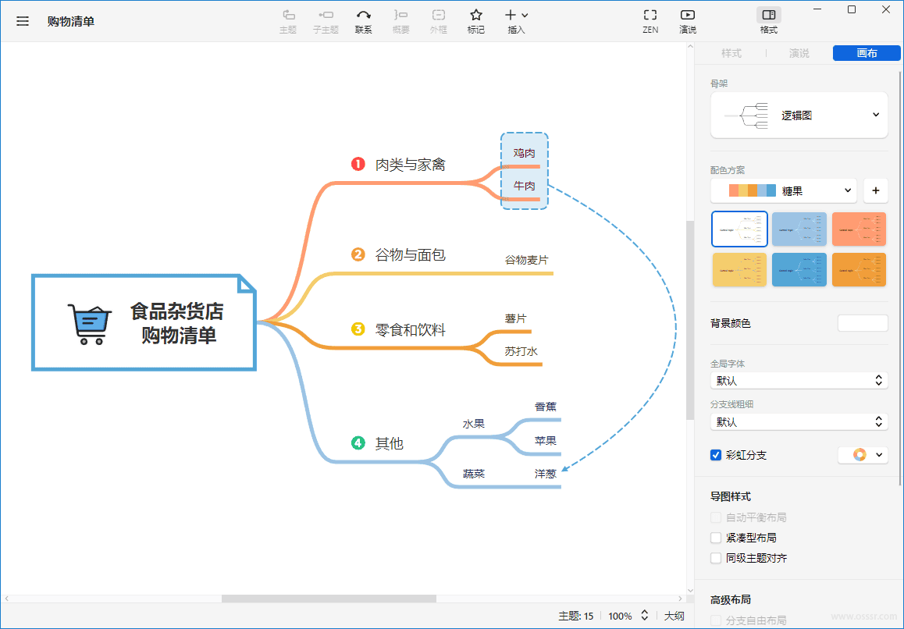

# XMind 26.01.03145 绿色版 - 思维导图

XMind 是一款功能强大的思维导图和头脑风暴软件，广泛应用于项目管理、知识梳理、战略规划和团队协作。XMind 以其直观的界面和多样的模板，帮助用户更高效地组织思维、呈现复杂信息，并简化任务管理。该软件支持多平台使用，用户可以在 Windows、macOS 和移动设备上轻松创建、编辑和分享思维导图，提升工作效率与创造力。

官方网站：https://www.xmind.cn/

## 截图

## 功能摘要

1. 多种导图模板
   - 提供多种思维导图、鱼骨图、矩阵图等模板，满足不同场景需求。
2. 头脑风暴模式
   - 支持头脑风暴模式，帮助用户在短时间内收集和组织大量创意。
3. 跨平台同步
   - 支持 Windows、macOS、Android 和 iOS 多平台同步，确保数据随时可访问。
4. 项目管理工具
   - 集成任务管理功能，帮助用户设定任务、优先级、进度跟踪等项目管理需求。
5. 演示模式
   - 内置演示模式，用户可以将导图转换为清晰的展示文档，适用于汇报与沟通。
6. 导出多种格式
   - 支持导出为 PDF、Word、PPT、PNG 等多种文件格式，便于分享与发布。
7. 多用户协作
   - 支持多人协作编辑，便于团队成员在同一项目上实时协作。
8. 主题与样式定制
   - 提供丰富的主题和样式，用户可以根据需求自定义思维导图外观。
9. 甘特图视图
   - 提供甘特图视图，适合项目管理和时间规划，帮助用户直观查看任务进度。
10. 云存储集成
    - 集成云存储功能，用户可以轻松备份和分享文件，确保数据安全。

## 更新日志

https://www.xmind.cn/desktop/release-notes/

**Version 26.01.03145

**Version 25.07.03033

**Version 25.04.03523

**Version 25.04.03033

**Version 25.01.01061

## 模组信息

- 注入补丁可能会被误杀！（Fahai）
- Xmind.exe （需禁止联网，绿化：Windows防火墙默认禁止联网，其他杀软请手动添加！）