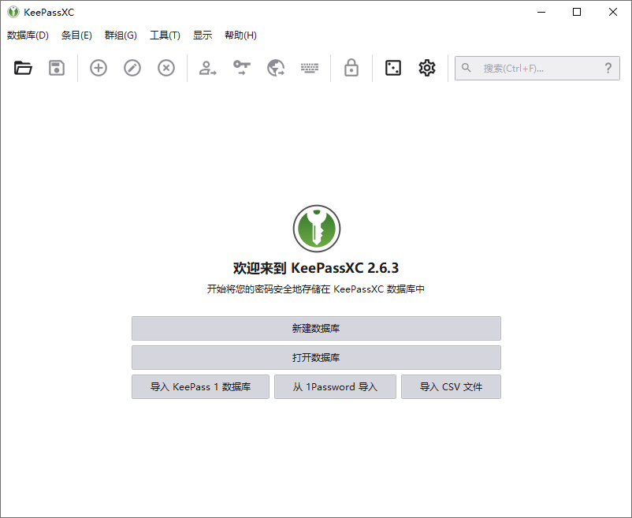

# KeePassXC 绿色版 - 密码管理器

[KeePassXC](https://www.osssr.com/keepassxc)是一种现代，安全和开放源代码的密码管理器，用于存储和管理您最敏感的信息。适用于对个人数据安全管理有极高要求的人。它将脱机加密文件保存许多不同类型的信息，例如用户名，密码，URL，附件和便笺，这些信息可以存储在任何位置，包括私有和公共云解决方案。为了便于识别和管理，可以为条目指定用户定义的标题和图标。此外，条目按可自定义的组排序。集成的搜索功能使您可以使用高级模式轻松找到数据库中的任何条目。一个可自定义，快速且易于使用的密码生成器实用程序，使您可以使用任意字符组合或易于记忆的密码创建密码。

官方网站：https://keepassxc.org/

## 截屏

## 功能摘要

1. 以KDBX格式创建，打开和保存数据库（与KDBX4和KDBX3兼容的KeePass）
2. 将敏感信息存储在群组的条目中
3. 搜索条目
4. 密码生成器
5. 自动将密码输入应用程序
6. 浏览器与Google Chrome，Mozilla Firefox，Microsoft Edge，Chromium，Vivaldi，Brave和Tor浏览器的集成
7. 条目图标下载
8. 从CSV，1Password和KeePass1格式导入数据库

## 高级功能

1. 数据库报告（密码运行状况，HIBP和统计信息）
2. 数据库导出为CSV和HTML格式
3. TOTP存储和生成
4. 条目之间的字段引用
5. 文件附件和自定义属性
6. 输入历史和数据恢复
7. YubiKey / OnlyKey响应支持
8. 命令行界面（keepassxc-cli）
9. 自动打开数据库
10. KeeShare共享数据库（导入，导出和同步）
11. SSH代理
12. 其他加密选项：Twofish和ChaCha20

## 更新日志

[https://github.com/keepassxreboot/keepassxc/releases/](https://www.osssr.com/download/aHR0cHM6Ly9naXRodWIuY29tL2tlZXBhc3N4cmVib290L2tlZXBhc3N4Yy9yZWxlYXNlcy8=)