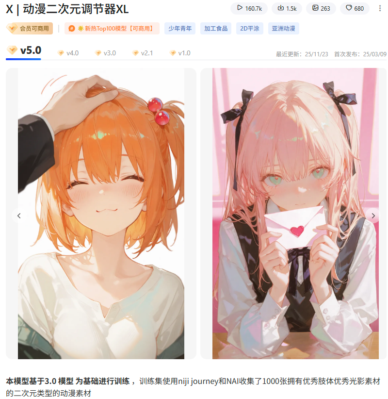
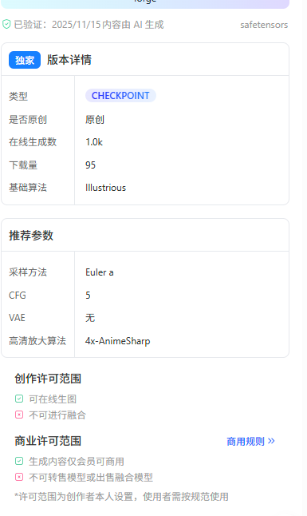

**本模型基于3.0** **模型** **为基础进行训练** ，训练集使用niji journey和NAI收集了1000张拥有优秀肢体优秀光影素材的二次元类型的动漫素材

**使用指南：**

1、使用tag的形式，类booru-tag的形式也可以。

2、提示词格式：触发词（上述的tag或者角色名称）+ 描绘了

xxxx（主体）+质量词（高度精细，超高分辨率，32K UHD，最佳品质，杰作，/highly detailed, ultra-high resolutions, 32K UHD, best quality, masterpiece,）可加可不加

3、请使用高清放大，建议生图分辨率：816*1456  736*1304  1024*1024  960*1280....（有一项大于1k分辨率）并开启高清修复！！能使你的出图细节拉满

4、一些比较好用的触发词：Flat coating（平涂）

growing（发光的） line art （线条艺术）

5、推荐起手式：

(artist:quasarcake:0.8),extreme aesthetic,(wlop:0.6),(honjou raita,lack,rella,wanke:0.5),masterpiece,best quality,good quality,newest,year 2024,year 2023,very aesthetic,absurdres,Visual impact,A shot with tension,ultra-high resolution,32K UHD,sharp focus,best-quality,masterpiece,Emotionalization,unconventional supreme masterpiece,masterful details,temperate atmosphere,with a high-end texture,in the style of fashion photography,(Visual impact:1.2),Dynamic and visual impact,offcial art,colorful,splash of color,movie perspective,masterpiece,best quality,amazing quality,very aesthetic,absurdres,best quality,newest,best quality,masterpiece,

**为了达到最好的生图品质，请遵照以下参数配置来进行设置。**

**采样推荐：**Euler a

**Step** 步数: 30~40

**分辨率：请使用超过1k的分辨率进行出图使用，以获得最佳出图体验感！！**

**建议使用高清放大：2倍**

**高清修复：8x-NMKD-Superscale**

**重绘幅度：0.32~0.42左右即可**

**CFG：6.0~6.5**

**负面提示词：** nsfw,Bad quality,worst quality,normal quality,low-res,sketch,poor design,deformed,disfigured,soft,bad composition,simple design,bad hands,worst quality,quality,lowres,signature,username,logo,watermark,ambiguous_form,low quality,artistname,blurry,missing fingers,extra digit,nsfw,lowres,bad anatomy,bad hands,text,error,fewer digits,cropped,worst quality,low quality,normal quality,jpeg artifacts,watermark,

**模型封面皆有本地comyui以及liblib在线weebui进行出图。建议可以看完我的封面图示例再进行使用！！**

