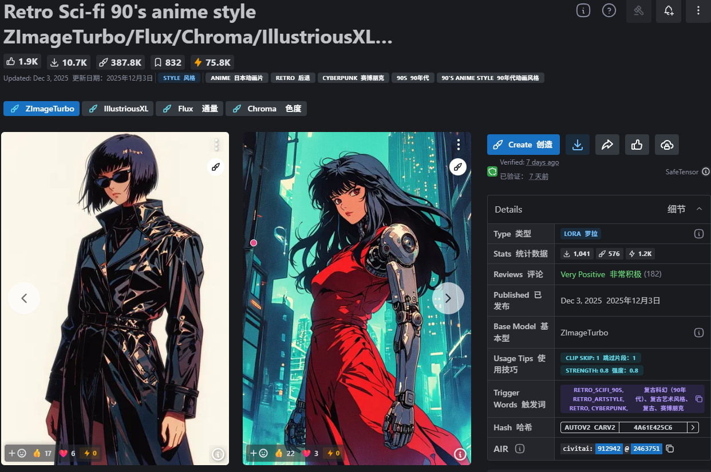

weight between [0.6,0.8], best at 0.8
权重介于 [0.6,0.8] 之间，最佳值为 0.8。

trigger words : retro_scifi_90s, retro_artstyle, retro, cyberpunk,
触发词：复古科幻（90年代）、复古艺术风格、复古、赛博朋克

Flux version: 版本源：

weight between [0.8,1.2], best at 1
权重介于 [0.8,1.2] 之间，最佳值为 1。

trigger words : retro_scifi_90s, retro_artstyle, retro, cyberpunk,
触发词：复古科幻（90年代）、复古艺术风格、复古、赛博朋克

Chroma version: 色度版本：

weight between [0.8,1.2], best at 1
权重介于 [0.8,1.2] 之间，最佳值为 1。

trigger words : retro_scifi_90s, retro_artstyle, retro, cyberpunk,
触发词：复古科幻（90年代）、复古艺术风格、复古、赛博朋克

Illustrious version: 杰出版本：

weight need to be adjust, between [0.7,1] looks good. weight at 0.8 can be use as a starting point.
权重需要调整，介于 [0.7,1] 之间比较合适。权重 0.8 可以作为初始值。

prompt : retro_artstyle, retro, cyberpunk
提示：复古艺术风格，复古，赛博朋克