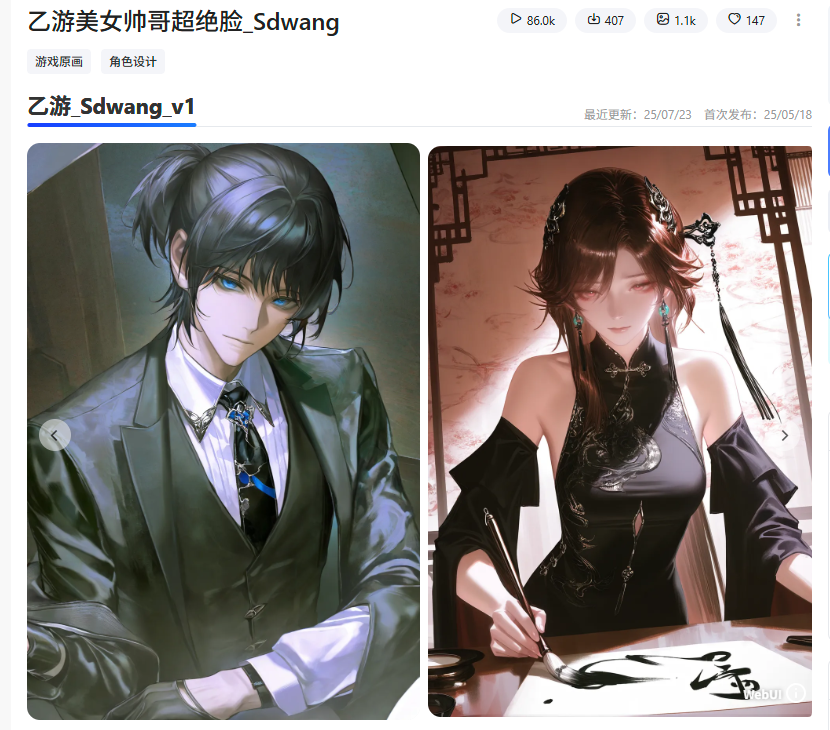
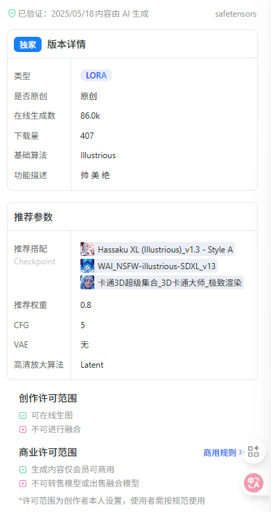

推荐权重 *0.8-1*

推荐底模   wai  和   hassaku

（底模请自行搜索）

特点    帅  美  绝

可以叠加，混合其他Lora有特效

推荐参数

采样方法Eulera, DPM++ 2M

迭代步数建议20-40

创作许可范围

可在线生图 不可进行融合

商业许可范围

生成图片不可商用

不可转售模型或出售融合模型

*许可范围为创作者本人设置，使用者需按规范使

企业将模型或工作流用于商业用途，可联系平台咨立即咨询 >>

1.你不得将此模型及其衍生版本(如融合模型版本)托管于计划赚取收入或捐赠的网站/应用程序。如果您需要将此模型及其衍生版本用于商业目的(如生成式服务、售卖图片、将图片用于公开发表到短视频平台的文章或出版物等等)请通过站内联系本人

2.您不得直接售卖由此模型生成的图片，除非您对该图片进行了足够程度的人工修改，使其在法律意义上可以被完全判定为您的个人作品。如果您违反本条，所造成的一切法律后果由您个人承担，请怒本人概不负责。

3.您不能使用该模型故意制作或共享非法或有害的内容传播和输出，请您遵守公序良德，将此模型用于积极正面的用途。

模型反馈技术交流qq:2748802929 V:wks999999wks

如有版本侵权问题意见请联系我!!!仅供学习参考，请勿商用!!!!这点很重要!!!!