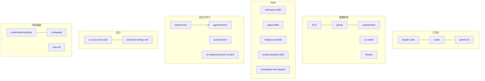

# Github优质项目 MOC

收集 GitHub 上高质量 AI/Agent/知识管理相关开源项目，按 Stars 降序排列。

## 项目索引

| 项目 | Stars | 一句话 |
|------|-------|--------|
| [[openclaw]] | 374.8k | 个人 AI 助手，20+ 消息渠道 |
| [[superpowers]] | 207.5k | Agent 软件开发方法论，子代理驱动 |
| [[ECC]] | 193.5k | Agent 全套配置系统，黑客松冠军 |
| [[claw-code]] | 192.6k | Rust CLI Agent 引擎 |
| [[hermes-agent]] | 168.1k | 成长型 AI Agent，自学习 |
| [[opencode]] | 165.5k | 开源编程 Agent，21 语言 |
| [[andrej-karpathy-skills]] | 156.4k | Karpathy 四大原则 CLAUDE.md |
| [[anthropics-skills]] | 141.1k | Anthropic 官方 Skills 仓库 |
| [[system-prompts]] | 138.3k | AI 工具系统提示词全收集 |
| [[claude-code]] | 126.7k | Anthropic 官方 Claude Code |
| [[mattpocock-skills]] | 106.3k | 工程师日常技能，小可组合 |
| [[spec-kit]] | 106.0k | GitHub 官方 Spec-Driven 工具 |
| [[agency-agents]] | 105.2k | 完整 AI 机构角色库 |
| [[gemini-cli]] | 104.6k | Google 官方 Gemini CLI |
| [[gstack]] | 103.0k | Garry Tan 的 Claude Code 配置 |
| [[codex]] | 85.8k | OpenAI 官方 Codex CLI |
| [[04-Resources(资源层)/00 Github优质项目/09-浏览器与网站自动化/opencli]] | 22.7k | 网站→CLI 桥接，AI Agent 浏览器操控 |
| [[awesome-design-md]] | 84.3k | 73 品牌 DESIGN.md 合集 |
| [[autoresearch]] | 83.5k | Karpathy 自主 AI 研究 |
| [[ui-ux-pro-max-skill]] | 82.9k | AI 设计智能 Skill |
| [[cc-switch]] | 81.5k | 多 Agent 桌面管理器 |
| [[ruview]] | 66.1k | WiFi 空间智能感知 |
| [[agent-skills]] | 45.9k | Google 工程技能包 |
| [[ui-tars-desktop]] | 35.3k | 字节多模态 GUI Agent |
| [[understand-anything]] | 33.8k | 代码知识图谱 Dashboard |
| [[openhuman]] | 28.1k | 个人 AI + Obsidian 记忆 |
| [[codegraph]] | 26.9k | 预索引代码图谱 MCP |
| [[ai-engineering-from-scratch]] | 19.9k | 435 课 AI 工程课程 |
| [[agentmemory]] | 18.1k | Agent 持久记忆系统 |
| [[knowledge-work-plugins]] | 16.3k | Anthropic 角色插件集 |
| [[9router]] | 14.4k | AI API 免费路由网关 |
| [[awesome-codex-skills]] | 11.8k | Codex Skills 精选列表 |

## 主题聚类

### Agent 引擎（三巨头）
- [[claude-code]] — Anthropic 官方
- [[codex]] — OpenAI 官方（Rust）
- [[gemini-cli]] — Google 官方（免费 1000次/天）
- [[opencode]] — 社区开源版
- [[hermes-agent]] — 成长型自学习
- [[openclaw]] — 个人全渠道助手
- [[openhuman]] — 个人 AI + Obsidian

### Agent 配置与效率
- [[ECC]] — 最全面配置体系
- [[gstack]] — YC CEO 的 810x 效率配置
- [[superpowers]] — 子代理驱动方法论
- [[cc-switch]] — 可视化管理面板
- [[9router]] — API 成本路由

### Skills 与工程规范
- [[anthropics-skills]] — 官方 Skill 规范源头
- [[agent-skills]] — Google 工程文化
- [[mattpocock-skills]] — 小可组合风格
- [[andrej-karpathy-skills]] — 四大原则极简指南
- [[knowledge-work-plugins]] — 角色化知识工作
- [[agency-agents]] — 多角色机构库
- [[awesome-codex-skills]] — Codex 技能索引

### 代码理解与知识图谱
- [[understand-anything]] — 交互式 Dashboard
- [[codegraph]] — 预索引 MCP 查询
- [[spec-kit]] — 规格驱动开发

### 设计智能
- [[ui-ux-pro-max-skill]] — 设计推理规则库
- [[awesome-design-md]] — 73 品牌 DESIGN.md

### 记忆与学习
- [[agentmemory]] — Agent 持久记忆
- [[autoresearch]] — Karpathy 自主 AI 研究
- [[ai-engineering-from-scratch]] — AI 工程系统课程

### 物理 AI 与 GUI
- [[ruview]] — WiFi 空间感知
- [[ui-tars-desktop]] — 多模态 GUI Agent

### 浏览器与网站自动化
- [[04-Resources(资源层)/00 Github优质项目/09-浏览器与网站自动化/opencli]] — 网站→CLI + Agent 浏览器操控

### 参考
- [[system-prompts]] — 系统提示词全收集

## 关联关系



## 本目录笔记

```dataview
TABLE summary, status, created
FROM "KnowledgeBase/04-Resources/00 Github优质项目/01-Agent引擎" OR "KnowledgeBase/04-Resources/00 Github优质项目/02-配置与效率" OR "KnowledgeBase/04-Resources/00 Github优质项目/03-Skills与工程规范" OR "KnowledgeBase/04-Resources/00 Github优质项目/04-代码理解与知识图谱" OR "KnowledgeBase/04-Resources/00 Github优质项目/05-设计智能" OR "KnowledgeBase/04-Resources/00 Github优质项目/06-记忆与学习" OR "KnowledgeBase/04-Resources/00 Github优质项目/07-物理AI与GUI" OR "KnowledgeBase/04-Resources/00 Github优质项目/08-参考与收集" OR "KnowledgeBase/04-Resources/00 Github优质项目/09-浏览器与网站自动化"
WHERE file.name != "Github优质项目-MOC"
SORT created DESC
```